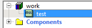
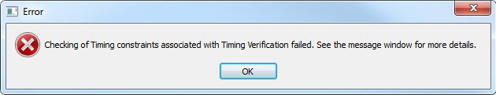
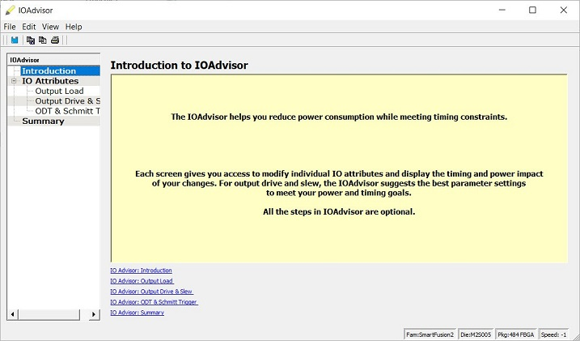
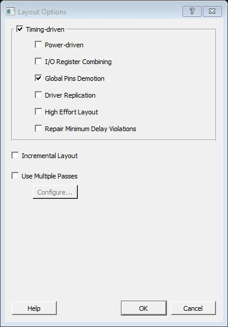
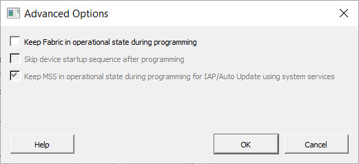
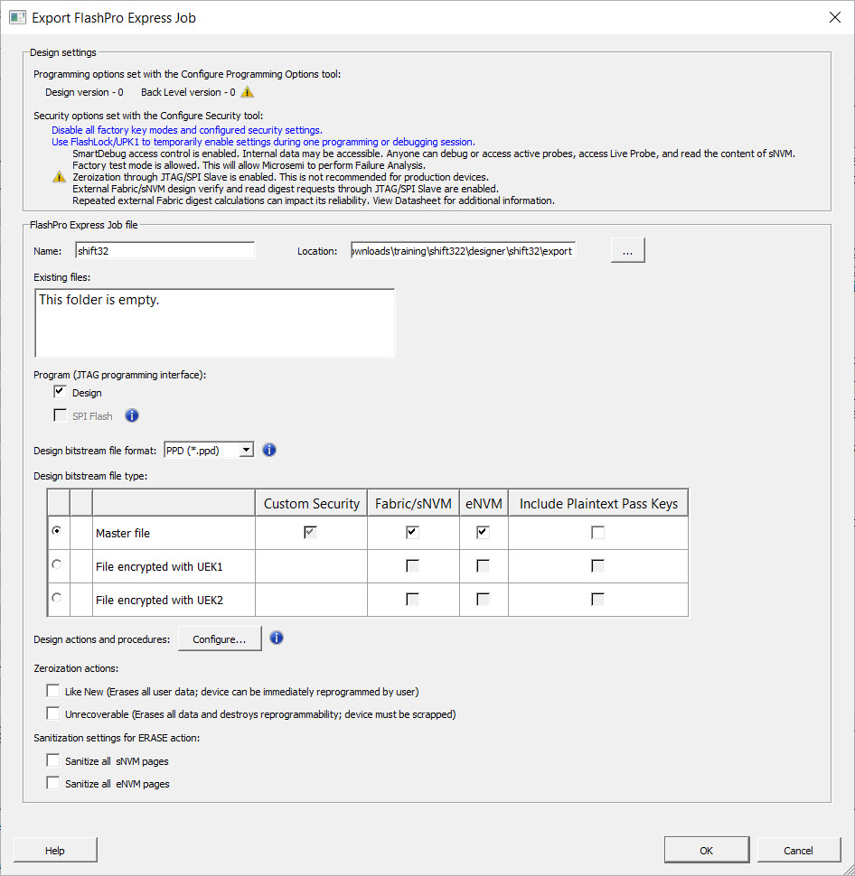
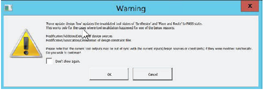

# Introduction

The Microchip Libero® System-on-Chip \(SoC\) design suite offers high productivity with its comprehensive, easy to learn, easy to adopt development tools for designing Resolved Microchip’s power efficient flash [field-programmable gate arrays \(FPGAs\)](https://www.microsemi.com/products/fpga-soc/fpgas), [SoC FPGAs](https://www.microsemi.com/products/fpga-soc/soc-fpgas), and [Rad-Tolerant FPGAs](https://www.microsemi.com/products/fpga-soc/rad-tolerant-fpgas). The suite integrates industry-standard Synopsys [SynplifyPro®](https://www.microsemi.com/products/fpga-soc/design-resources/design-software/synplify-pro-me) synthesis and Mentor Graphics [ModelSim®](https://www.microsemi.com/products/fpga-soc/design-resources/design-software/modelsim) simulation with best-in-class constraints management, debug capabilities, and secure production programming support.

## Supported Device Family {#SECTION_BRZ_KJS_B4B .section}

The following table lists the family of devices that Libero SoC supports. This guide covers all of these device families. However, some information in this guide may apply to certain device families only. In this case, such information is clearly identified.

|Device Family|Description|
|-------------|-----------|
|[PolarFire](https://www.microsemi.com/products/fpga-soc/fpga/polarfire-fpga)|PolarFire® FPGAs deliver the industry’s lowest power at mid-range densities with exceptional security and reliability.|
|[PolarFire SoC](https://www.microsemi.com/product-directory/soc-fpgas/5498-polarfire-soc-fpga)|PolarFire SoC is the first SoC FPGA with a deterministic, coherent RISC-V CPU cluster and a deterministic L2 memory subsystem enabling Linux and real-time applications.|
|[SmartFusion2](https://www.microsemi.com/product-directory/soc-fpgas/1692-smartfusion2#overview)|SmartFusion2 addresses fundamental requirements for advanced security, high reliability, and low power in critical industrial, military, aviation, communications, and medical applications.|
|[IGLOO2](http://www.microsemi.com/products/fpga-soc/fpga/igloo2-fpga#overview)|IGLOO2 is a low-power mixed-signal programmable solution.|
|[RTG4](http://www.microsemi.com/products/fpga-soc/radtolerant-fpgas/rtg4#overview)|RTG4 is Microchip's family of radiation-tolerant FPGAs.|

## Helpful Links {#SECTION_DRZ_KJS_B4B .section}

-   [Data sheets, tutorials, application notes, and silicon user guides](http://www.microsemi.com)
-   [Development boards and kits](https://www.microsemi.com/products/fpga-soc/design-resources/dev-kits-boards)
-   [Libero SoC v12.0 and later](https://www.microsemi.com/products/fpga-soc/design-resources/design-software/libero-soc)
-   [Programming Solutions](https://www.microsemi.com/product-directory/dev-tools/4970-programming)
-   [XLS-based power calculator estimators for device families](https://www.microsemi.com/products/fpga-soc/design-resources/power-calculator)
-   [Libero licensing](https://www.microsemi.com/products/fpga-soc/design-resources/licensing)
-   [Libero SoC PolarFire® product family](https://www.microsemi.com/product-directory/fpgas/3854-polarfire-fpgas#product-table)
-   [Libero SoC PolarFire technology](https://www.microsemi.com/product-directory/fpgas/3854-polarfire-fpgas#overview)
-   [Libero SoC PolarFire documentation](https://www.microsemi.com/product-directory/fpgas/3854-polarfire-fpgas#documentation)
-   [Libero SoC PolarFire software tools](https://www.microsemi.com/product-directory/dev-tools/5536-fpga-design-tools)

# Overview

The following topics provide an overview of Libero SoC.

## Libero SoC Design Flow

The following figure shows the Libero SoC design flow.


### Creating Your Design

Create your design with the following design capture tools:

-   System Builder
-   Create SmartDesign
-   Create HDL
-   Create SmartDesign Testbench \(optional, for simulation only\)
-   Create HDL Testbench \(optional, for simulation only\)

After you create the design, invoke simulation for pre-synthesis verification.

You can also click the  button to invoke the Libero SoC software through Place and Route with default settings. However, doing so bypasses constraint management.

### Working with Constraints

In the FPGA design world, constraint files are as important as design source files. Constraint files are used throughout the FPGA design process to guide FPGA tools to achieve the timing and power requirements of the design. For the synthesis step, SDC timing constraints set the performance goals whereas non-timing FDC constraints guide the synthesis tool for optimization. For the Place-and-Route step, SDC timing constraints guide the tool to achieve the timing requirements whereas Physical Design Constraints \(PDC\) guide the tool for optimized placement and routing \(Floorplanning\). For Static Timing Analysis, SDC timing constraints set the timing requirements and design-specific timing exceptions for static timing analysis.

Libero SoC provides the Constraint Manager to manage your design constraint needs. Constraint Manager is a single centralized graphical interface that allows you to create, import, link, check, delete, edit design constraints and associate the constraint files to design tools in the Libero SoC environment. Constraint Manager also allows you to manage constraints for SynplifyPro synthesis, Libero SoC Place-and-Route, and the SmartTime Timing Analysis throughout the design process.

After project creation, double-click **Manage Constraints** in the Design Flow window to open the **Constraint Manager**.


#### Constraint Flow and Design Sources

The Constraint Flow supports HDL and Netlist design sources. The Libero SoC Design Flow window and the Constraint Manager are context-sensitive to the type of design sources: HDL or Netlist.

#### Constraint Flow for VM Netlist designs

When the design source is a Netlist, the Design Flow window displays Compile Netlist as a design step. Timing constraints can be passed to Place and Route and Timing Verification only.

The options to promote or demote global resources of the chip are set in the Compile Netlist options. The HDL flow versus the Netlist Flow is compared and contrasted below.

|**HDL Flow**

|**Netlist Flow**

|
|

Design Flow Window

|

Design Flow Window

|
|

Constraint Manager

|

Constraint Manager

|
|

Constraint Manager - Check \*.fdc and \*.ndc

|

Constraint Manager - Check \*.ndc only

|
|

Global Promotion/Demotion Options set in Synthesis Options Dialog Box

|

Global Promotion/Demotion Options set in Compile Netlist Options Dialog Box

|

#### Constraint Flow for HDL designs

When the design source is HDL, the Design Flow window displays Synthesis as a design step. The Constraint Manager also makes available Synthesis as a target to receive timing constraints and netlist attribute constraints. The options to promote or demote global resources of the chip are set in the Synthesis options.

### Implementing Your Design

The following guides and topics provide information about implementing your design.

-   [Netlist Viewer User Guide](http://coredocs.s3.amazonaws.com/Libero/2021_2/Tool/stdalone_nlv_ug.pdf)
-   [Synthesize](#GUID-8945D90E-E71B-44F7-A614-914D39C421CF). This procedure runs synthesis on your design with the default settings, and passes to Synplify the constraints associated with Synthesis in the Constraint Manager.
-   [Verifying Post-Synthesized Designs](#GUID-F1E7931A-5CCA-4DE6-BE33-9C638A7743BE)
-   [Configure Flash\*Freeze \(SmartFusion2 and IGLOO2\)](#GUID-C50C2533-A4D4-4BEC-8C9B-C4D0276C7824)
-   [Configure Register Lock Bits](#GUID-A3378CFC-90A5-4503-9504-06038D1171E1)
-   [Place and Route](#GUID-F169FE38-FEAD-4352-A765-89B3CD46FF59). Place and Route takes the design constraints from the Constraint Manager and uses default settings. This is the last step in the push-button design flow execution.
-   [Verify Post Layout Implementation](#GUID-EED4550E-D263-4F7F-AB87-B397EBFC66EC)
    -   [Generate Back Annotated Files](#GUID-5AE44F8C-4E54-4892-BAAD-CAFEF91D18C1)
    -   [Simulate - Opens ModelSim ME](#GUID-1BB2F27A-EAE7-467D-BA23-7C88E0E88DCA)
    -   [Verify Timing](#GUID-19222D8D-3C05-43D7-96A5-F15A7C42BF7E)
    -   [SmartTime](#GUID-32017C28-8273-465F-997B-E1BC3C926D5A)
    -   [Verify Power](#GUID-A565047B-A154-42D8-BF8B-D4B665CFD2D4)
    -   [Simultaneous Switching Noise](#GUID-1C456A15-C45C-4242-8B3C-DDF4B4497CD5)

### Programming and Debugging Your Design

The following topics provide information about programming and debugging your design.

#### Generating and Updating Data {#SECTION_DSW_L4N_F4B .section}

-   [Generating FPGA Array Data](#GUID-694D595C-6611-447A-BB77-A10228DB8374)
-   [Initializing Design Blocks \(PolarFire and PolarFire SoC\)](#GUID-99C0A0F9-5E20-4115-93B2-395D36FFCC63)
-   [Generating Initialization Clients \(PolarFire\)](#GUID-4C894EE5-90A5-42D3-ACA6-D6FD4CAEAEEF)

#### Configuring Your Hardware {#SECTION_K2J_M4N_F4B .section}

-   [Configuring Actions and Procedures](#GUID-4181149E-51B7-4DB5-89CC-F2DA4B07B8AC)
-   [Configuring I/O States During JTAG Programming](#GUID-750BAE2A-25AC-447A-9E18-5BA2DC0963DC)
-   [Configuring Programming Options](#GUID-82C427FD-3C3F-441D-B2F7-064E98F9654D)

#### Programming Your Design {#SECTION_KZT_44N_F4B .section}

-   [Generating FPGA Array Data](#GUID-694D595C-6611-447A-BB77-A10228DB8374)
-   [Initializing Design Blocks \(PolarFire and PolarFire SoC\)](#GUID-99C0A0F9-5E20-4115-93B2-395D36FFCC63)
-   [Generating Initialization Clients \(PolarFire\)](#GUID-4C894EE5-90A5-42D3-ACA6-D6FD4CAEAEEF)
-   [Configuring Actions and Procedures](#GUID-4181149E-51B7-4DB5-89CC-F2DA4B07B8AC)
-   [Configuring I/O States During JTAG Programming](#GUID-750BAE2A-25AC-447A-9E18-5BA2DC0963DC)
-   [Configuring Programming Options](#GUID-82C427FD-3C3F-441D-B2F7-064E98F9654D)
-   [Configuring Security](#GUID-F020ED55-AD59-43F7-B820-E637930E76BE)
-   [Configure Permanent Locks for Production](#GUID-92267270-006F-4775-85F1-39FADC4029D4)
-   [Configuring Bitstreams](#GUID-729C77E6-2C36-43A3-B627-8AE54FBBE988)
-   [Generating the Bitstream](#GUID-C45941CB-78D4-4337-84B7-0C4B5FC5B099)
-   [Run Programming Device Actions](#GUID-EE791378-ED3C-48B1-AFDD-61A5ECCD6E0B)
-   [Program SPI Flash Image \(PolarFire\)](#GUID-14AB207F-1F5C-4BFE-8255-1745AD67E464)

#### Debugging Your Design {#SECTION_F5D_Z4N_F4B .section}

-   [Generating SmartDebug FPGA Array Data \(PolarFire\)](#GUID-254E74A9-BC92-4EDE-8DC8-695295FA5A8D)
-   [Using the SmartDebug Tool](#GUID-07131121-B944-4A4D-B69B-39BA6F12D79F)
-   [Identifying the Debug Design](#GUID-2DD00A35-94BC-4BB2-B8BC-70B79D55F0B4)

### Handing Off Your Design to Production

The following topics provide information about handing off your design to production.

-   [Export Bitstreams](#GUID-2C5EFC10-2630-4A2F-B16C-763A0C53372D)
-   [Exporting FlashPro Express Jobs](#GUID-0A8FAACF-AE0A-4449-89AF-964AE7D936DD)
-   [Exporting Job Manager Data](#GUID-19B43747-1404-4157-AFCA-A6AEC3784DAB)
-   [Exporting a SPI Flash Image](#GUID-4E60B6CF-A0ED-402C-AFA3-216C94F354FB)
-   [Exporting Pin Reports](#GUID-155C7AEB-D019-42E2-BF97-28A74DDC2246)
-   [Exporting BSDL Files](#GUID-E5AB5E73-D486-4F10-98DE-BE9CE70BAC69)
-   [Exporting IBIS Models](#GUID-0D53367E-8DF3-4339-8C46-76C039A35410)
-   [Exporting uPROM Reports \(RTG4\)](#GUID-18209877-D5C8-4187-B937-2DD28ED0EE3A)
-   [Exporting SmartDebug Data](#GUID-D4532304-86D7-4C4C-9914-AF1270E9334A)

### Handing Off Design for Firmware \(SmartFusion2, IGLOO2, and RTG4\)

The following topics provide information about handing off your design for firmware. These topics apply to SmartFusion2, IGLOO2, and RTG4.

-   [Software IDE Integration \(SmartFusion2 and IGLOO2\)](#GUID-BBA8573D-18B3-49E8-A38B-C36A3CD8F5D4)
-   [View/Configure Firmware Cores \(SmartFusion2 and IGLOO2\)](#GUID-619427B3-F324-492B-BC8B-BA677D46D1CC)
-   [Export Firmware \(SmartFusion2 and IGLOO2\)](#GUID-F2E63F6B-D68B-4B8E-B47B-7FF5914DDCBA)

## File Types in Libero SoC

Creating a new project in Libero SoC creates new directories and project files automatically. Your project directory contains all of your local project files. When you import files from outside your current project, the files are copied into your local project folder.

The Project Manager allows you to manage your files as you import them. For example, if you want to store and maintain your design source files and design constraint files in a central location outside the Project location, Libero allows you to link them to your Libero project folders when you create your project. These linked files are linked, not copied, to your project folder.

Depending on your project preferences and the installed version of Libero SoC, the software creates directories for your project. The following table describes the directories.

|`<project_name>`|This is the top-level directory. It contains the `*.prjx` file. Only one `*.prjx` file is enabled for each Libero SoC project. If you associate Libero SoC as the default program with the `*.prjx` file \(**Project \> Preferences \> Startup \> Check the default file association \(.prjx\) at startup**\), you can open the project with Libero SoC by double-clicking the `*.prjx` file.

|
|`component`|Contains SmartDesign components \(`.sdb` and `.cxf` files\) and the `*_manifest.txt` file for each design component in your Libero SoC project. To run synthesis, simulation, and firmware development with your own point tools outside the Libero SoC environment, see the `*_manifest.txt` file. For each design component, Libero SoC generates a `<component_name>_manifest.txt` file that stores the file name and location of:-   HDL source files to be used for synthesis and simulations
-   Stimulus files and configuration files for simulation
-   Firmware files for software IDE tools
-   Configuration files for programming
-   Configuration files for power analysis

To run synthesis, simulation, firmware development, programming, and power analysis outside the Libero SoC environment, see the *SmartFusion2/IGLOO2 Custom Flow User Guide*.

**Note:** When importing components, `.sdb` and `.cxf` files must reside in the same directory.

|
|`constraint`|Contains all the constraint files:-   SDC timing constraint files
-   Floorplanning PDC files
-   I/O PDC files
-   Netlist Attributes NDC files

|
|`designer`|Contains the following files:-   For Silicon Explorer: `*_ba.sdf`, `*_ba.v(hd)`, `STP`, and `PRB`
-   To run designer: `TCL`
-   Local project file relative to revision: `impl.prj_des`
-   Logfile: `designer.log`

|
|`hdl`|Contains all HDL sources:-   VHDL: `*.vhd` files
-   Verilog: `*.v` and `*.h` files

|
|`simulation`|Contains the following files for simulation: -   `meminit.dat`
-   `modelsim.ini`
-   `*.bfm`
-   `*.vec file`
-   `run.do`

|
|`smartgen`|Contains GEN files and LOG files from generated cores.|
|`stimulus`|Contains BTIM, Verilog, and VHDL stimulus files.|
|`synthesis`|Contains files generated by the tools \(not managed by Libero SoC\), including:-   `*.vm` file
-   Synplify log file: `*_syn.prj`
-   Precision project file: `*.psp`
-   Synplify logfile: `*.srr`
-   Precision logfile: `precision.log`
-   To run synthesis: `*.tcl`

|
|`viewdraw`|Contains `viewdraw.ini` files.|

### Internal Files

Libero SoC generates the following internal files, some of which are encrypted. These files are for Libero SoC housekeeping and are not intended for you to use.

|File|File Extension|Remarks|
|----|--------------|-------|
|Routing Segmentation File

|`*.seg`|None|
|Combiner Info

|`*.cob`|None|
|Hierarchical Netlist

|`*.adl`|None|
|Flattened Netlist

|`*.afl`|None|
|Location file

|`*.loc`|None|
|map file

|`*.map`|Fabric Programming File

|
|tieoffs.txt

|`*.txt`|RTG4 devices only

|

## Software Tools

Libero SoC integrates design tools, streamlines design flow, manages design and log files, and passes design data between tools. The following table identifies the tools you can use to perform Libero SoC functions. For more information about Libero SoC tools, visit [https://www.microsemi.com/products/fpga-soc/design-resources/design-software/libero-soc\#overview](https://www.microsemi.com/products/fpga-soc/design-resources/design-software/libero-soc#overview).

|Function|Tool|Comments|
|--------|----|--------|
|Project Manager, HDL Editor, Core Generation

|Libero SoC

|Project Manager, HDL Editor targets the creation of HDL code. HDL Editor supports VHDL and Verilog with color, highlighting keywords for both HDL languages.|
|Synthesis

|Synplify® Pro ME

|SynplifyPro ME is integrated as part of the design package, enabling designers to target HDL code to specific devices.|
|Simulation

|ModelSim® ME Pro

|Allows source-level verification so designers can verify HDL code line by line. Designers can perform simulation at all levels: behavioral \(or pre-synthesis\), structural \(or post-synthesis\), and dynamic simulation.|
|Timing/Constraints, Power Analysis, Netlist Viewer, Floorplanning, Package Editing, Place-and-Route, Debugging

|Libero SoC

|This software package includes:-   ChipPlanner: displays I/O and logic macros in your design for floorplanning
-   Netlist Viewer: design schematic viewer.
-   SmartPower: power analysis tool.
-   SmartTime: static timing analysis and constraints editor.

|

## Software IDE Integration

Libero SoC simplifies the task of transitioning between designing your FPGA and developing your embedded firmware by managing the firmware for your FPGA hardware design. This includes managing:

-   Firmware hardware abstraction layers required for your processor.
-   Firmware drivers for the processor peripherals in your FPGA design.
-   Sample application projects available for drivers that show how to use the APIs properly.

To see which firmware drivers Libero SoC found to be compatible with your design, open the Firmware View. From this view, you can change the configuration of your firmware, change to a different version, read driver documentation, and generate sample projects for each driver.

Libero SoC manages the integration of your firmware with your preferred Software Development Environment, including SoftConsole, Keil, and IAR Embedded Workbench. The projects and workspace for your selected development environment are generated automatically with the proper settings and flags so you can write your applications immediately.

# Managing Licenses

This chapter describes Libero SoC licensing.

## Microsemi License Utility

The Microsemi License Utility allows you to check and update your license settings for the Libero SoC software. It displays your current license settings, the license host-id for the current host, and allows you to add a new license file to your settings.

### Starting the Microsemi License Utility {#SECTION_CWB_VBJ_B4B .section}

Click **Start \> All Programs \> Microsemi Libero SoC vx.xx\> Microsemi License Utility**.

**Note:** If you have more than one license available and have not selected a default license, the [Select License dialog box](#GUID-7929571F-ED62-42CC-B89C-63F4D563BB3C) appears.

### Requesting a License {#GUID-553BD109-C0B8-4390-B1E5-D01A1A2E6B2A .section}

To request a license, click **Request License** to display the Microsemi license website. Then right-click and copy the disk volume value in the window, and paste the value into the Microsemi license web form.

The following table describes the available licenses.

|License|Description|
|-------|-----------|
|1-year Platinum|Purchased license that supports all devices.|
|1-year Gold|Purchased license that supports a smaller set of devices than Platinum.|
|1-year Silver|Free license that supports a smaller set of devices than Gold.|
|30-day Evaluation|Free license that supports all devices, but disables programming.|

When you receive your license file, follow the instructions that come with it and save the license to your local disk. In the Microsemi License Utility window, click **Add License File**. browse to the license file, and then select it. If you use a floating license, click **Add License Server** and enter the port number and name of the license server host.

Although the list of features for which you are licensed shows all versions, your license must have a version equal to or greater than your design tools release version for the `libero.exe` and `designer.exe` tools to run.

The list at the lower right shows the order in which the license files are read. The first file read appears at the top of the list.


### Printing the Microsemi Licenses Report {#GUID-6D0D88A2-A1AB-4DE9-A2FA-8C13C8F52D10 .section}

Click **Write Report File** to print the Microsemi Tools Licenses Report or to save it as a `.txt` file.

### Related Information {#SECTION_XDP_LMJ_B4B .section}

For more information about licensing, including links to troubleshooting and FAQ documents, see the [Microsemi Libero SoC License Information Web Page](https://www.microsemi.com/product-directory/design-resources/1711-licensing#documents).

## Selecting a Default License from a License List

If you have more than one license available and have not selected a default license, the Select License dialog box appears when you start the Microsemi License Utility. Select the feature license you want to use from the list of available licenses shown.

-   The **Quantity** and **Available** columns show the total number of licenses and number of available licenses, respectively.
-   The **License Type** column shows whether an available license is a Node Locked license or a Floating or Server-based license. Floating and Server-based Licenses can be used by multiple users, depending on the number of seats available.


### Selecting a License to Use {#SECTION_YK2_HTJ_B4B .section}

1.  In the Select License dialog box, click **Select** to activate Libero using the selected license. This button is disabled by default, and is enabled after you select a license.
2.  Check the **Set Selected License as Default** check box to save the selected license as the default license to be used for future sessions. Selecting this option skips the license selection step for future sessions. Use this option if you want to use the same license features for future sessions.
    -   If you select a license that was acquired by another user, the following message appears:

        

    -   If you select a license for which there are no valid licenses available, the following message appears:

        

3.  To close the license selection window and exit Libero, click **Cancel**. To view the online help topic for License Selection, click **Help**.

### License Expiration {#SECTION_YLG_JQJ_B4B .section}

If a license will expire within 15 days, a warning appears in the **Comments** column of the dialog box and in the Log window \(see the following examples\).


## Setting a Default License

After you start Libero, use the following procedure to select the default Libero license that will be used for future sessions.

1.  Click **Help \> Select Default License** to change the default license.

    

2.  When the Select License dialog box appears, click a row, and then click **Set Default License** to specify the Libero license you selected as the default.

    

3.  Close the dialog box.
4.  After you select a default Libero license, click **Project \> Preferences** to set license options in the Libero Preferences dialog box. The following table describes the options.

    


|Option|Description|
|------|-----------|
|Reset Default License Selection|This option is selected when a default license is available. When checked, the default license is cleared and the check box is disabled.|
|Warn we when my Libero license is about to expire|Enables or disables Notification of License expiry. When checked, a message appears when the selected license’s expiration date is within 15 days. Use this option only when the license’s expiration date is longer than 5 days and shorter than 15 days.|

## Viewing License Details

The License Details dialog box shows detailed information about Libero SoC licenses and cores. To display this dialog box, click **Help \> License Options**.


The License Details dialog box has two tabs:

-   **Tools** displays tool license details.
-   **IP Cores** displays IP Cores license details, as shown in the following example.


The following table describes the elements in the dialog box.

|Element|Description|
|-------|-----------|
|Close|Closes the dialog box.|
|Help|Displays the online help topic for License Selection.|
|Filter|Searches for the pattern entered in the text edit box. Filtered rows appear in the Cores table.|
|Lookup Path|Shows the list of License hosts included in the LM\_LICENSE\_FILE.|

## Libero SoC Online Help

The Libero SoC online help system is designed to open in the HTML Help Viewer – Microsoft's Help window for viewing compiled HTML Help. If you do not have the HTML Help Viewer components installed on your system, you can view the help using Microsoft Internet Explorer browser version 4.x or later.

The Libero SoC online help includes the following navigation tabs:

-   **Contents**. The **Contents** tab shows books and pages that represent the categories of information in the online help system. When you click a closed book, it opens to display its content of sub-books and pages. When you click an open book, it closes. When you click pages, you select topics to view in the right-hand pane of the HTML Help viewer.
-   **Search**. The **Search** tab allows you to find topics that contain key words. Full-text searching searches through every word in the online help to find matches. When the search is completed, a list of topics appears, so you can select a topic to view.

**Note:** Linux users might need to set the `LINUX_HTMLREADER` variable to enable an HTML viewer. For example: `setenv LINUX_HTMLREADER /usr/bin/firefox`. If you do not set this variable, HTML files, such as the online help, will not be available from within the software.

## Libero SoC User Guides

Libero SoC includes online manuals that are in PDF format and are available from the Libero SoC Start menu. To access these guides, click **All Programs \> Microsemi \> Libero SoC \> Libero SoC Reference Manuals**. You must have Adobe Acrobat Reader or similar PDF viewer to open and view the PDF user guides.

**Note:** Linux users might need to set their `LINUX_PDFREADER` variable to enable a PDF viewer. For example: `setenv LINUX_PDFREADER /usr/bin/kpdf`. If you do not set this variable, some PDF files will not be available from within software.

# Getting Started

The following sections describe how to start using Libero SoC.

## Starting Libero SoC

When you start Libero SoC, the Welcome screen appears. In the left pane, links under **Projects** allow you to create a new Libero SoC project or open an existing one.

-   Clicking **New** starts the [New Project Creation Wizard](#GUID-A74D35E5-B7E5-4F58-B7A2-304D1D65FEFC). Use this wizard to create new Libero SoC projects.
-   Clicking **Open** opens an [existing Libero SoC project](#GUID-10408FF8-50DE-44EE-8743-62F72A49E04F).

## Design Report

The **Design Report** tab lists the reports available for your design. Reports are added automatically as you move through design development. For example, Timing reports are added when you run timing analysis on your design. Reports are updated each time you run a timing analysis.

To display the **Design Report** tab, click **Design \> Reports**.

If a report is not listed in the tab, you might have to create it manually. For example, you must invoke **Verify Power** manually before its report is available.

The following table lists the reports you can view in the **Design Report** tab.

|Category|Report|
|--------|------|
|Project Summary|-   [Synthesize](#GUID-8945D90E-E71B-44F7-A614-914D39C421CF)
-   [Place and Route](#GUID-62533E96-F2EA-445D-96C2-DC146045845C)
-   [Verify Timing](#GUID-19222D8D-3C05-43D7-96A5-F15A7C42BF7E)
-   [Verify Power](#GUID-A565047B-A154-42D8-BF8B-D4B665CFD2D4)

|
|Programming|-   [Generate FPGA Array Data](#GUID-694D595C-6611-447A-BB77-A10228DB8374)
-   [Generate Bitstream](#GUID-C45941CB-78D4-4337-84B7-0C4B5FC5B099)

|
|Export|-   [Export Pin Report](#GUID-155C7AEB-D019-42E2-BF97-28A74DDC2246)
-   [Export BSDL File](#GUID-E5AB5E73-D486-4F10-98DE-BE9CE70BAC69)

|

## Creating a New Project

To simplify project creation, Libero SoC provides a wizard that takes you step by step through the process of creating a new Libero SoC project.

To start a new Libero SoC project, click **Project \> New**. The following table summarizes the screens in the wizard.

|Screen|Description|
|------|-----------|
|[Project Details](#GUID-4424C9FA-39C8-48E6-94C0-1E482F1D6D82)|Specify the name and location of your project, device family and parts, I/O standards, and HDL source files and design constraint files.|
|[Device Selection](#GUID-75C01078-4C93-4DA0-BCBE-9701D72DD7D0)|Select a device for your project. After you select a device, or in any wizard screen that follows, you can click the **Finish** button to create the project and exit the wizard.|
|SmartFusion2 and IGLOO2: [Device Settings](#GUID-B7A0FC23-E121-4DEB-8304-99BFCB7A8BD3)|Specify the device I/O technology and reserve pins for probes.|
|[Design Template](#GUID-F443F7EF-BC2F-4AF9-B84F-1D7925D4010E)|This dialog box may not be available if there are no design templates for the chosen technology.|
|[Add HDL Sources](#GUID-AB7418EB-6B2E-4530-AF5D-1D1B2812AECF)|Add HDL design source files to your Libero SoC project.|
|[Add Constraints](#GUID-83345E39-EFC9-4D65-ABB0-4C97320C072C)|Add timing and physical constraints files to your Libero SoC project.|

### New Project Creation Wizard – Project Details

Project Details is the first screen that appears in the New Project Creation wizard.


The following table describes the fields in the Project Details screen. After you complete the fields, click **Next** to go to [Device Selection](#GUID-75C01078-4C93-4DA0-BCBE-9701D72DD7D0).

|Field|Description|
|-----|-----------|
|Project Name|Identifies your project name. Do not use spaces or reserved Verilog or VHDL keywords.|
|Project Location|Identifies your project location on disk.|
|Description|General information about your design and project.|
|Preferred HDL Type|Sets your HDL type to one of the following:-   Verilog
-   VHDL

Libero-generated files \(SmartDesigns, SmartGen cores, and so on\) are created in the HDL type you specify. Libero SoC supports mixed HDL designs.

|
|Enable Block Creation|Allows you to build blocks for your design. These blocks can be assembled in other designs, with partial layout, and been optimized for timing and power performance for a specific Microchip device. Once optimized, you can use the same blocks in multiple designs.|

### New Project Creation Wizard – Device Selection

The Device Selection screen is where you specify the Microchip device for your project. Use the filters and drop-down lists to refine your search for the right part to use for your design.

This screen contains a table of all the parts, with associated FPGA resource details generated based on a value you enter in a filter. When you select a filter value:

-   The parts table is updated to reflect the result of the new filtered value.
-   All other filters are updated, and only relevant items are available in the filter drop-down lists. For example, if you select **PolarFire** in the **Family** filter, the parts table includes only PolarFire parts and the **Die** filter includes only PolarFire dies in the **Die** drop-down list.

    

    The following table describes the fields in the Device Selection screen. After you complete the fields, click **Next** to go to the [Device Settings](#_BOOKMARK140) screen or click **Finish** to complete new project creation with all remaining defaults.

    |Field|Description|
    |-----|-----------|
    |Family|Microchip device family. Only devices that belong to the family appear in the parts table.|
    |Die/Package/Speed|Device die, package, and speed grade. Use the Die/Package/Speed filters to view only the selections that interest you. The Die/Package/Speed grades available for selection depend on the level of [Libero SoC license](#GUID-82CE4398-95F8-43AE-A737-6A4DF863776C) you have \(Evaluation, Silver, Gold, or Platinum\). For more information, see the [Libero SoC Licensing web page](https://www.microsemi.com/products/fpga-soc/design-resources/licensing).|
    |Core Voltage|Core voltage for your device. Two numbers separated by a “~” are shown if a wide range voltage is supported. For example, 1.2~1.5 means that the device core voltage can vary between 1.2 and 1.5 volts.|
    |Range \(PolarFire\)|Voltage and temperature ranges a device might encounter in your application. Tools such as SmartTime, SmartPower, timing-driven layout, power-driven layout, the timing report, and back-annotated simulation are affected by operating conditions. Select the appropriate option for your device. Supported operating condition ranges vary according to your device and package. To find your recommended temperature range, see your device datasheet. Choices are:

    -   All: All ranges
    -   EXT: Extended
    -   IND: Industrial
    -   MIL: Military
|
    |Range \(SmartFusion2, IGLOO2, and RTG4\)|Temperature range a device can encounter in your application. Junction temperature is a function of ambient temperature, air flow, and power consumption. Tools such as SmartTime, SmartPower, timing-driven layout, power-driven layout, the timing report, and back-annotated simulation are affected by operating conditions. Choices are:    -   ALL: All ranges
    -   EXT: Extended
    -   COM: Commercial \(not available for RTG4 devices\)
    -   IND: Industrial
    -   TGrade1: Automotive \(not available for RTG4 devices\)
    -   TGrade2: Automotive \(not available for RTG4 devices\)
    -   MIL: Military
Supported operating condition ranges vary according to your device and package. Refer to the device datasheet to find your recommended temperature range. The temperature range corresponding to the value selected from the pick list can also be found by checking Project Settings \> Analysis operating conditions.

|
    |Reset Filters|Resets all filters to the default ALL option except Family.|
    |Search Parts|Character-by-character search for parts. Search results appear in the parts table.|


### New Project Creation Wizard – Device Settings

#### PolarFire Device Settings

For PolarFire, the Device Settings page is where you set the core voltage, default I/O technology, and enable reserve pins for probes.

")

The following table describes the fields in the Device Settings screen. After you complete the fields, click **Next** to go to the next screen or click **Finish** to complete new project creation with all remaining defaults.

|Field|Description|
|-----|-----------|
|Core Voltage|Set the core voltage for your device.|
|Default I/O technology|Set all your I/Os to a default value. You can change the values for individual I/Os in the I/O Attribute Editor. The I/O Technology available is family-dependent.|
|Reserve pins for probes|Reserve your pins for probing if you intend to debug using SmartDebug. If unchecked, the I/Os can be used as General Purpose I/Os.|

#### SmartFusion2 and IGLOO2 Device Settings

For SmartFusion2 and IGLOO2, the Device Settings page is where you set the device I/O technology, enable reserve pins for probes, set power supplies, and enable system controller suspended mode.

")

The following table describes the fields in the Device Settings screen for SmartFusion2 and IGLOO2. After you complete the fields, click **Next** to go to the next screen or click **Finish** to complete new project creation with all remaining defaults.

|Field|Description|
|-----|-----------|
|Default I/O technology|Set all your I/Os to a default value. You can change the values for individual I/Os in the I/O Attribute Editor. The I/O Technology available is family-dependent.|
|Reserve pins for probes|Reserve your pins for probing if you intend to debug using SmartDebug. If unchecked, the I/Os can be used as General Purpose I/Os.|
|PLL supply voltage \(V\)|Set the voltage for the power supply that you plan to connect to all the PLLs in your design, such as MDDR, FDDR, SERDES, and FCCC.|
|VDD Supply Ramp Time|Power-up management circuitry is designed into every SmartFusion2 and IGLOO2 SoC FPGA. These circuits ensure easy transition from the powered-off state to the powered-up state of the device. The SmartFusion2, IGLOO2, and RTG4 system controller is responsible for systematic power-on reset whenever the device is powered on or reset. All I/Os are held in a high-impedance state by the system controller until all power supplies are at their required levels and the system controller has completed the reset sequence.The power-on reset circuitry in SmartFusion2 and IGLOO2 devices requires the VDD and VPP supplies to ramp monotonically from 0 V to the minimum recommended operating voltage within a predefined time. There is no sequencing requirement on VDD and VPP. Four ramp rate options are available during design generation: 50 μs, 1 ms, 10 ms, and 100 ms. Each selection represents the maximum ramp rate to apply to VDD and VPP.

Device information \(such as Die, Package and Speed\) can be modified later in the Project Settings dialog box.

|
|System controller suspended mode|Suspends operation of the System Controller. Checking this box places the System Controller in a reset state when the device is powered up. This suspends all system services from being performed. For a list of system services for SmartFusion2 and IGLOO2, see the System Controller User's Guide for your device on the [Microchip website.](http://www.microchip.com/)|

#### RTG4 Device Settings

For RTG4, the Device Settings page is where you set the default I/O technology and activate reserve pins for probes and enable single event transient mitigation.

")

The following table describes the fields in the Device Settings screen for RTG4. After you complete the fields, click **Next** to go to the next screen or click **Finish** to complete new project creation with all remaining defaults.

|Field|Description|
|-----|-----------|
|Default I/O technology|Set all your I/Os to a default value. You can change the values for individual I/Os in the I/O Attribute Editor. The I/O Technology available is family-dependent.|
|Reserve pins for probes|Reserve your pins for probing if you intend to debug using SmartDebug. If unchecked, the I/Os can be used as General Purpose I/Os.|
|Enable Single Event Transient mitigation|Controls the mitigation of Single Event Transient \(SET\) in the FPGA fabric. When this box is checked, SET filters are turned on globally to help mitigate radiation-induced transients. By default, this box is not checked.|

### New Project Creation Wizard – Design Template \(SmartFusion2 and IGLOO2\)

The Design Template page is where you use Libero SoC’s built-in template to automate your SmartFusion2 or IGLOO2 design process. The template uses the System Builder tool for system-level design or the Microcontroller Subsystem \(MSS\) in your design. Both will speed up the design process.


The following table describes the fields in the Device Template screen. After you complete the fields, click **Next** to go to the Add HDL Sources page or click **Finish** to complete new project creation with all remaining defaults.

|Field|Description|
|-----|-----------|
|None|Select if you do not want to use a design template.|
|Create a System Builder based design|Use System Builder to generate your top-level design.|
|Create a Microcontroller \(MSS\) based design|Instantiate a Microcontroller \(MSS\) in your design. The version of the MSS cores available in your vault is displayed. Select the version you desire.|
|Use Standalone Initialization for MDDR/FDDR/SERDES Peripherals|Check if you want to create your own peripheral initialization logic in SmartDesign for each of your design peripherals \(MDDR/FDDR/SERDES\). When checked, System Builder does not build the peripherals initialization logic for you. Stand-alone initialization is useful if you want to make the initialization logic of each peripheral separate from and independent of each other.|
|Instantiate System Builder/MSS component in a SmartDesign on creation|Uncheck if you are using this project to create System Builder or MSS components and do not plan on using them in a SmartDesign based design. This is especially useful for design flows where the System Builder or MSS components are stitched in a design using HDL.|

### New Project Creation Wizard – Add HDL Source Files

The Add HDL Source Files screen is where you add HDL design source files to your Libero SoC project. The HDL source files can be imported or linked to the Libero SoC project.


The following table describes the elements in the Add HDL Source Files screen. After you complete the fields, click **Next** to go to the [Add Constraints](#GUID-83345E39-EFC9-4D65-ABB0-4C97320C072C) screen or click **Finish** to complete new project creation with all remaining defaults.

|Element|Description|
|-------|-----------|
|Import File button|Imports an HDL source file. When the dialog box appears, go to the location where the HDL source resides, select the HDL file, and click Open. The HDL file is copied to the `<prj_folder>/hdl` folder in your Libero project.|
|Link File button|Allows you to continue with an absolute or relative path for linked files. When the Link files dialog box appears \(see the figure below\), go to the location where the HDL source resides, select the HDL file, and click Open.|
|Create links relative to the path set in Environment variable|Available when you click the Link File button. The HDL file is linked to the Libero project. Check this check box if the HDL source file is located and maintained outside the Libero project. This option requires you to specify an environment variable that has a relative path set to it. Links are created relative to the path set in the environment variable.

 **Note:** If you select relative path and provide an environment variable for the relative path, you cannot switch to absolute path. After the environment variable is set, this option becomes read-only in all other link files dialog boxes.

|
|Delete button|Deletes the selected HDL source file from your project. If the HDL source file is linked to the Libero project, the link will be removed.|


### New Project Creation Wizard - Add Constraints

The Add Constraints screen is where you add timing constraints and physical constraints files to your Libero SoC project. The constraints file can be imported or linked to the Libero SoC project.


The following table describes the elements in the Add Constraints screen.

|Element|Description|
|-------|-----------|
|Import File button|Go to the location where the constraints file resides. Select the constraints file and click **Open**. The constraints file is copied to the `<prj_folder>/constraint` folder in your Libero project.|
|Link File button|Click this button if the constraint file is located and maintained outside the Libero project. When the Link files dialog box appears \(see the figure below\), specify an absolute path or choose a relative path for linked files. Go to the location where the constraints file resides. Select the constraints file and click **Open**. The constraints file is linked to the Libero project.|
|Create links relative to the path set in Environment variable|Available when you click the Link File button. The constraints file is linked to the Libero project. Check this check box if the constraints file is located and maintained outside the Libero project. This option requires you to specify an environment variable that has a relative path set to it. Links are created relative to the path set in the environment variable.

 **Note:** If you select relative path and provide an environment variable for the relative path, you cannot switch to absolute path. After the environment variable is set, this option becomes read-only in all other link files dialog boxes.

|
|Delete button|Deletes the selected constraints file from your project. If the constraints file is linked to the Libero project, the link will be removed.|


After you complete the fields, click **Finish** to complete new project creation. The **Reports** tab shows the result of your new project.


## Opening a Project

To open a project:

1.  From the **File** menu, choose **Open Project**.
2.  Select the project file you want to open. The file ends in the extension `.prjx`.
3.  Click **Open**.

**Note:** Opening a project created using a relative path for linked files displays the following error message if the environment variable does not exist or the path set in the environment variable is empty and cancels opening the project.


When you open an existing Libero SoC project:

-   A Design Flow window appears on the left side.
-   A log and message window appear at the bottom.
-   Project information windows appear on the right side.

The following figure is an example of a newly created project, with only the top-level Design Flow window steps shown.


The Design Flow window may be slightly different for each technology family. However, all flows include some version of the following design steps:

-   Create Design
-   Constraints
-   Implement Design
-   Configure Hardware
-   Program Design
-   Debug Design
-   Handoff Design for Production
-   Handoff Design for Debugging

# Creating and Verifying Designs

Create your design with the following design capture tools:

-   [Create SmartDesign](#GUID-71A2B662-DE5E-4D25-8430-051A7E40E6F2)
-   [System Builder](#GUID-1BE4DDB4-5F03-4CFD-B547-BDFA15232A7A) \(SmartFusion2 and IGLOO2 only\)
-   [Create HDL](#GUID-64733C55-0527-4943-A305-030B650B28B2)
-   [Create SmartDesign Testbench](#GUID-6902C233-8BFF-49A6-A477-150DC95B1D6F) \(optional, for simulation only\)
-   [Create HDL Testbench](#GUID-64733C55-0527-4943-A305-030B650B28B2) \(optional, for simulation only\)
-   [Verify Pre-synthesized Design](#GUID-8751419E-E40C-4534-969D-8A6E9DB4D5F2)

## SmartFusion2 and IGLOO2 Tools

### System Builder

System Builder is a graphical design wizard that allows you to enter high-level design specifications for SmartFusion2 or IGLOO2.

System Builder takes you through the following steps:

-   Asks basic questions about your system architecture and peripherals
-   Builds a correct-by-design complete system

To start System Builder:

1.  In the Design Flow window, click **System Builder \> Run**.
2.  In the Enter a name for your system dialog box, enter a name.
3.  Click **OK**. The System Builder Device Features page appears.

System Builder automatically configures the silicon features you select. To complete the design, add your custom logic or IP and connect them to your System Builder-generated design.

For a complete family-specific explanation of the tool, see the [SmartFusion2 System Builder documentation](https://coredocs.s3.amazonaws.com/Libero/Tool/SysBuilder/sf2_system_builder_ug_2.pdf) or the [IGLOO2 System Builder documentation](https://coredocs.s3.amazonaws.com/Libero/Tool/SysBuilder/igl2_system_builder_ug_2.pdf).

### Using the MSS in Your SmartFusion2 Designs

The following topics describe how to use the MSS in your SmartFusion2 designs.

**Note:** MSS is valid for SmartFusion2 devices only.

#### Instantiating a SmartFusion2 MSS in Your Design

You can configure peripherals within the SmartFusion2 MSS to suit your requirements. Examples of peripherals you can configure include:

-   ARM® Cortex™-M3
-   Embedded nonvolatile memory \(eNVM\)
-   Ethernet MAC
-   Timer
-   UART
-   SPI

The MSS operates stand-alone, without any dependencies on other logic within the device; however, designs that require functionality beyond a standalone MSS are handled by using SmartDesign to add user logic in the SmartFusion2 FPGA fabric.

You can instantiate a Microcontroller Subsystem into your design from the New Project Creation Wizard when you start a new SmartFusion2 project, or from the Design Flow window after you have created a new project.

##### Instantiating a SmartFusion2 MSS from the New Project Creation Wizard {#SECTION_OX5_DJK_F4B .section}

1.  Enable **Use Design Tool** \(under **Design Templates and Creators**\) and click to select **SmartFusion2 Microcontroller Subsystem \(MSS\)** from the list.

##### Not Using a Design Tool when You Create a Project {#SECTION_X1Y_FKK_F4B .section}

If you decide not to use a Design Tool when you created your project:

1.  Expand **Create Design** in the Design Flow window and double-click **Configure MSS**.
2.  When the Add Microcontroller Subsystem dialog box appears, enter your design name and click **OK**. A SmartDesign Canvas appears, with the MSS added to your project. Double-click the MSS to view and configure MSS components.

#### Configure the SmartFusion2 MSS

Documents for specific SmartFusion2 MSS peripherals are available on the [Peripheral Documents web page](https://www.microchip.com/doclisting/TechDoc.aspx).

The SmartFusion2 Microcontroller Subsystem \(MSS\) Configurator \(as shown in the figure below\) contains the elements listed below. Double-click any element in the MSS to configure it; click the check box \(if available\) to enable or disable it in your design.

MSS ARM® Cortex™-M3 Peripherals

-   MSS CAN
-   MSS Peripheral DMA \(PDMA\)
-   MSS GPIO
-   MSS I2C
-   MSS Ethernet MAC
-   MSS DDR Controller \(MDDR\)
-   MSS MMUART
-   MSS Real Time Counter \(RTC\)
-   MSS Embedded Nonvolatile Memory \(eNVM\)
-   MSS SPI
-   MSS USB
-   MSS Watchdog Timer

Fabric Interfaces

-   MSS Fabric Interface Controllers \(FICs\)

Additional Information

-   MSS Cache Controller
-   MSS DDR Bridge Controller
-   MSS AHB Bus Matrix
-   MSS Clocks Configurator \(MSS CCC\)
-   MSS Interrupts Controller
-   MSS Reset Controller

-   MSS SECDED Configurator
-   MSS Security Configurator

The MSS generates a component that is instantiated into your top-level design.


#### Generate SmartFusion2 MSS Files

See the MSS Configurator help for more information on generating SmartFusion2 MSS files.

Click the **Generate Component**button  to create your SmartFusion2 MSS files. The MSS Configurator generates the following files:

-   HDL files for the MSS components, including timing shells for synthesis - HDL files are automatically managed by the Libero SoC and passed to the Synthesis and Simulation tools.
-   EFC File: Contains your eNVM client data - The EFC content is included in your final programming file.
-   Firmware drivers and memory maps are exported into the <project\>\\firmware\\ directory - Libero SoC automatically generates a Software IDE project that includes your Firmware drivers. If you are not using a software project automatically created by Libero, you can import this directory into your Software IDE project.
-   Testbench HDL and BFM script for the MSS design: These files are managed by Libero SoC and automatically passed to the Simulation tool.
-   PDC files for the MSS and the top-level design: These files are managed by Libero SoC and automatically integrated during Compile and Layout.

## Create SmartDesign

SmartDesign is a visual block-based design creation and entry tool for instantiating, configuring, and connecting Microchip IPs, user-generated IPs, and custom/glue-logic HDL modules. This tool provides a canvas for instantiating and stitching together design objects. The final result from SmartDesign is a design-rule-checked and automatically abstracted synthesis-ready HDL file. A generated SmartDesign can be the entire FPGA design or a component subsystem to be re-used in a larger design.

The following design objects can be instantiated in the SmartDesign Canvas:

-   Microchip IP Cores
-   User-generated or third-party IP Cores
-   HDL design files
-   HDL + design files
-   Basic macros
-   Other SmartDesign components \(\*.cxf files. These files can be generated from SmartDesign in the current Libero SoC project, or they can be imported from other Libero SoC projects.
-   Re-usable design blocks \(\*.cxz files\) published from Libero SoC. For more information, see the [SmartDesign User Guide](http://coredocs.s3.amazonaws.com/Libero/2021_2/Tool/smartdesign_ug.pdf).

### Create New SmartDesign

This SmartDesign component may be the top level of the design, or it can be used as a lower level SmartDesign component after successful generation in another design.

1.  From the **File** menu, choose **New \> SmartDesign** in the Design Flow window or double-click **Create SmartDesign**. The Create New SmartDesign dialog box appears.

    

2.  Enter a name and click **OK**. The component appears in the **Design Hierarchy** tab of the Design Explorer.

**Note:** The component name you choose must be unique in your project. For more information, see the [SmartDesign User Guide](http://coredocs.s3.amazonaws.com/Libero/2021_2/Tool/smartdesign_ug.pdf).

### Export Component Description \(Tcl\)

Using the Export Component Description option, you can export components such as SmartDesign components, configured cores, and HDL+ cores separately as Tcl.

To export a SmartDesign component:

1.  Right-click the component and choose **Export Component Description \(Tcl\)**.


2. Click the **Browse** button to specify the location where you want to export the Tcl file, and then click **OK**.

### Examples

The following is an example of an exported Tcl script for a SmartDesign Component \(PCIe\_TL\_CLK\).

```
# Creating SmartDesign PCIe_TL_CLK set sd_name {PCIe_TL_CLK}
create_smartdesign -sd_name ${sd_name}
# Disable auto promotion of pins of type 'pad' auto_promote_pad_pins -promote_all 0
# Create top level Ports
sd_create_scalar_port -sd_name ${sd_name} -port_name {CLK_125MHz} -port_direction {IN}
sd_create_scalar_port -sd_name ${sd_name} -port_name {TL_CLK} -port_direction {OUT} sd_create_scalar_port -sd_name ${sd_name} -port_name {DEVICE_INIT_DONE} -port_direction
{OUT}
# Add CLK_DIV2_0 instance
sd_instantiate_component -sd_name ${sd_name} -component_name {CLK_DIV2} -instance_name
{CLK_DIV2_0}
# Add NGMUX_0 instance
sd_instantiate_component -sd_name ${sd_name} -component_name {NGMUX} -instance_name
{NGMUX_0}
# Add OSC_160MHz_0 instance
sd_instantiate_component -sd_name ${sd_name} -component_name {OSC_160MHz} -instance_name
{OSC_160MHz_0}
# Add PCIe_INIT_MONITOR_0 instance
sd_instantiate_component -sd_name ${sd_name} -component_name {PCIe_INIT_MONITOR} - instance_name {PCIe_INIT_MONITOR_0}
sd_mark_pins_unused -sd_name ${sd_name} -pin_names {PCIe_INIT_MONITOR_0:FABRIC_POR_N} sd_mark_pins_unused -sd_name ${sd_name} -pin_names {PCIe_INIT_MONITOR_0:USRAM_INIT_DONE} sd_mark_pins_unused -sd_name ${sd_name} -pin_names {PCIe_INIT_MONITOR_0:SRAM_INIT_DONE} sd_mark_pins_unused -sd_name ${sd_name} -pin_names {PCIe_INIT_MONITOR_0:XCVR_INIT_DONE}
sd_mark_pins_unused -sd_name ${sd_name} -pin_names
{PCIe_INIT_MONITOR_0:USRAM_INIT_FROM_SNVM_DONE}
sd_mark_pins_unused -sd_name ${sd_name} -pin_names
{PCIe_INIT_MONITOR_0:USRAM_INIT_FROM_UPROM_DONE}
sd_mark_pins_unused -sd_name ${sd_name} -pin_names
{PCIe_INIT_MONITOR_0:USRAM_INIT_FROM_SPI_DONE}
sd_mark_pins_unused -sd_name ${sd_name} -pin_names
{PCIe_INIT_MONITOR_0:SRAM_INIT_FROM_SNVM_DONE}
sd_mark_pins_unused -sd_name ${sd_name} -pin_names
{PCIe_INIT_MONITOR_0:SRAM_INIT_FROM_UPROM_DONE}
sd_mark_pins_unused -sd_name ${sd_name} -pin_names
{PCIe_INIT_MONITOR_0:SRAM_INIT_FROM_SPI_DONE}
sd_mark_pins_unused -sd_name ${sd_name} -pin_names {PCIe_INIT_MONITOR_0:AUTOCALIB_DONE} 
# Add scalar net connections
sd_connect_pins -sd_name ${sd_name} -pin_names {"NGMUX_0:CLK1" "CLK_125MHz" } sd_connect_pins -sd_name ${sd_name} -pin_names {"CLK_DIV2_0:CLK_OUT" "NGMUX_0:CLK0" }
sd_connect_pins -sd_name ${sd_name} -pin_names {"PCIe_INIT_MONITOR_0:DEVICE_INIT_DONE" "DEVICE_INIT_DONE" }
sd_connect_pins -sd_name ${sd_name} -pin_names {"CLK_DIV2_0:CLK_IN" "OSC_160MHz_0:RCOSC_160MHZ_CLK_DIV" }
sd_connect_pins -sd_name ${sd_name} -pin_names {"NGMUX_0:SEL" "PCIe_INIT_MONITOR_0:PCIE_INIT_DONE" }
sd_connect_pins -sd_name ${sd_name} -pin_names {"NGMUX_0:CLK_OUT" "TL_CLK" } 
# Re-enable auto promotion of pins of type 'pad'
auto_promote_pad_pins -promote_all 1 
# Save the smartDesign save_smartdesign -sd_name ${sd_name} 
# Generate SmartDesign PCIe_TL_CLK
generate_component -component_name ${sd_name}
```

The following is an example of an exported Tcl script for a System Builder Core \(PF\_DDR3\_SS\).

```
# Exporting core PF_DDR3_SS to TCL
# Create design TCL command for core PF_DDR3_SS
create_and_configure_core -core_vlnv {Actel:SystemBuilder:PF_DDR3:2.3.120} - component_name {PF_DDR3_SS} -params {\
"ADDRESS_MIRROR:false" \ 
"ADDRESS_ORDERING:CHIP_ROW_BANK_COL" \ 
"AUTO_SELF_REFRESH:1" \ 
"AXI_ID_WIDTH:6" \
"AXI_WIDTH:64" \ 
"BANKSTATMODULES:4" \ 
"BANK_ADDR_WIDTH:3" \ 
"BURST_LENGTH:0" \ 
"CAS_ADDITIVE_LATENCY:0" \ 
"CAS_LATENCY:9" \ 
"CAS_WRITE_LATENCY:7" \ 
"CCC_PLL_CLOCK_MULTIPLIER:6" \ 
"CLOCK_DDR:666.666" \ 
"CLOCK_PLL_REFERENCE:111.111" \ 
"CLOCK_RATE:4" \ 
"CLOCK_USER:166.6665" \ 
"COL_ADDR_WIDTH:11" \ 
"DLL_ENABLE:1" \
"DM_MODE:DM" \ 
"DQ_DQS_GROUP_SIZE:8" \ 
"ENABLE_ECC:0" \ 
"ENABLE_INIT_INTERFACE:false" \
"ENABLE_LOOKAHEAD_PRECHARGE_ACTIVATE:false" \
"ENABLE_PAR_ALERT:false" \ 
"ENABLE_REINIT:false" \ 
"ENABLE_TAG_IF:false" \ 
"ENABLE_USER_ZQCALIB:false" \ 
"EXPOSE_TRAINING_DEBUG_IF:false" \ 
"FABRIC_INTERFACE:AXI4" \ 
"FAMILY:26" \
"MEMCTRLR_INST_NO:1" \ 
"MEMORY_FORMAT:COMPONENT" \
"MINIMUM_READ_IDLE:1" \
"ODT_ENABLE_RD_RNK0_ODT0:false" \ 
"ODT_ENABLE_RD_RNK0_ODT1:false" \ 
"ODT_ENABLE_RD_RNK1_ODT0:false" \ 
"ODT_ENABLE_RD_RNK1_ODT1:false" \ 
"ODT_ENABLE_WR_RNK0_ODT0:true" \
"ODT_ENABLE_WR_RNK0_ODT1:false" \ 
"ODT_ENABLE_WR_RNK1_ODT0:false" \ 
"ODT_ENABLE_WR_RNK1_ODT1:true" \ 
"ODT_RD_OFF_SHIFT:0" \ 
"ODT_RD_ON_SHIFT:0" \ 
"ODT_WR_OFF_SHIFT:0" \ 
"ODT_WR_ON_SHIFT:0" \ 
"OUTPUT_DRIVE_STRENGTH:RZQ6" \
"PARAM_IS_FALSE:false" \ 
"PARTIAL_ARRAY_SELF_REFRESH:FULL" \
"PHYONLY:false" \ 
"PIPELINE:false" \ 
"QOFF:0" \ 
"QUEUE_DEPTH:3" \ 
"RDIMM_LAT:0" \
"READ_BURST_TYPE:SEQUENTIAL" \ 
"ROW_ADDR_WIDTH:16" \ 
"RTT_NOM:DISABLED" \ 
"RTT_WR:OFF" \ 
"SDRAM_NB_RANKS:1" \ 
"SDRAM_NUM_CLK_OUTS:1" \ 
"SDRAM_TYPE:DDR3" \
"SELF_REFRESH_TEMPERATURE:NORMAL" \ 
"SHIELD_ENABLED:true" \ 
"SIMULATION_MODE:FAST" \ 
"TDQS_ENABLE:DISABLE" \ 
"TGIGEN_ADD_PRESET_WIDGET:true" \ 
"TIMING_DH:150" \ 
"TIMING_DQSCK:400" \ 
"TIMING_DQSQ:200" \ 
"TIMING_DQSS:0.25" \
"TIMING_DS:75" \ 
"TIMING_DSH:0.2" \ 
"TIMING_DSS:0.2" \ 
"TIMING_FAW:30" \ 
"TIMING_IH:275" \ 
"TIMING_INIT:200" \ 
"TIMING_IS:200" \ 
"TIMING_MODE:0" \ 
"TIMING_MRD:4" \ 
"TIMING_QH:0.38" \ 
"TIMING_QSH:0.38" \ 
"TIMING_RAS:36" \ 
"TIMING_RC:49.5" \ 
"TIMING_RCD:13.5" \ 
"TIMING_REFI:7.8" \
"TIMING_RFC:350" \ 
"TIMING_RP:13.5" \ 
"TIMING_RRD:7.5" \ 
"TIMING_RTP:7.5" \ 
"TIMING_WR:15" \ 
"TIMING_WTR:5" \ 
"TURNAROUND_RTR_DIFFRANK:1" \ 
"TURNAROUND_RTW_DIFFRANK:1" \ 
"TURNAROUND_WTR_DIFFRANK:1" \ 
"TURNAROUND_WTW_DIFFRANK:0" \
"USER_POWER_DOWN:false" \ 
"USER_SELF_REFRESH:false" \ 
"WIDTH:16" \ 
"WRITE_LEVELING:ENABLE" \ 
"WRITE_RECOVERY:5" \ 
"ZQ_CALIB_PERIOD:200" \ 
"ZQ_CALIB_TYPE:0" \ 
"ZQ_CALIB_TYPE_TEMP:0" \ 
"ZQ_CAL_INIT_TIME:512" \ 
"ZQ_CAL_L_TIME:256" \
"ZQ_CAL_S_TIME:64" } -inhibit_configurator 0 
# Exporting core PF_DDR3_SS to TCL done
```

The following is an example of an exported Tcl script for a HDL+ core.

```
# Exporting core pattern_gen_checker to TCL
# Exporting Create HDL core command for module pattern_gen_checker create_hdl_core -file
{X:/10_docs_review/12.0_Release/pcie_demo_tcl_example/DG0756_PF_PCIe_EP/new/project/hdl/ PATTERN_GEN_CHECKER.v} -module {pattern_gen_checker} -library {work} -package {}
# Exporting BIF information of HDL core command for module pattern_gen_checker
```

The following is an example of an exported Tcl script for a SgCore \(PF\_TX\_PLL\).

```
# Exporting core PCIe_TX_PLL to TCL
# Exporting Create design command for core PCIe_TX_PLL
create_and_configure_core -core_vlnv {Actel:SgCore:PF_TX_PLL:1.0.115} -component_name
{PCIe_TX_PLL} -params {\ 
"CORE:PF_TX_PLL" \ 
"FAMILY:26" \
"INIT:0x0" \
"PARAM_IS_FALSE:false" \ 
"SD_EXPORT_HIDDEN_PORTS:false" \
"TxPLL_AUX_LOW_SEL:true" \ 
"TxPLL_AUX_OUT:125" \
"TxPLL_CLK_125_EN:true" \ 
"TxPLL_DYNAMIC_RECONFIG_INTERFACE_EN:false" \ 
"TxPLL_EXT_WAVE_SEL:0" \
"TxPLL_FAB_LOCK_EN:false" \ 
"TxPLL_FAB_REF:200" \ 
"TxPLL_JITTER_MODE_SEL:10G SyncE 32Bit" \ 
"TxPLL_MODE:NORMAL" \ 
"TxPLL_OUT:2500.000" \
"TxPLL_REF:100" \ 
"TxPLL_SOURCE:DEDICATED" \ 
"TxPLL_SSM_DEPTH:0" \
"TxPLL_SSM_DIVVAL:1" \
"TxPLL_SSM_DOWN_SPREAD:false" \ 
"TxPLL_SSM_FREQ:64" \ 
"TxPLL_SSM_RAND_PATTERN:0" \
"VCOFREQUENCY:1600" } -inhibit_configurator 1 
# Exporting core PCIe_TX_PLL to TCL done
```

### Hierarchical Export Component Description \(Tcl\)

This option exports the complete design and its subcomponents to Tcl. When this option is executed on a SmartDesign, it iterates through all the instances and collects information about the pins, groups, and nets in the SmartDesign. All the TCL scripts generated are exported to a folder you select when the Hierarchical Export Component Description \(Tcl\) option executes.

")

This exported folder consists of the following files and subfolders:

|Subfolders|Description|
|----------|-----------|
|HDL|Contains all of the imported HDL source files.|
|Stimulus|Contains all of the imported HDL stimulus files.|
|Components|Contains all of the Tcl files of the components used in the SmartDesign.|

|Files|Description|
|-----|-----------|
|hdl\_source.tcl|Contains the tcl for imported and linked files.|
|<component\>\_recursive.tcl|Top-level tcl used to recreate the design.|
|Un\_Supported\_Cores\_List.txt|Contains all the cores for which the export function cannot be performed.|

To run this option, right-click the desired component for which the information must be exported in Tcl in the Design/ Stimulus Hierarchy, and then choose **Hierarchical Export Component Description \(Tcl\)**.

 Option")

 Option After Right-clicking a Component")

#### Limitations {#SECTION_J15_T1K_D4B .section}

Hierarchical Export Component Description \(Tcl\) support is not available for blocks.

#### Messages {#SECTION_EZQ_51K_D4B .section}

The following table lists the messages that the tool generates in the log window.

|Message|Description|
|-------|-----------|
|Error: Please check the permission of the specified folder.|The folder you specified is not writable.|
|Error: Unable to Export Component ‘top’ to path|The export operation was not successful.|
|Info: Component ‘top’ exported successfully to path|The export operation was successful.|

### Generating a SmartDesign Component

Before your SmartDesign component can be used by downstream processes, such as synthesis and simulation, you must generate it.

Click the **Generate** \(\) button to generate a SmartDesign component. An HDL file is generated in the directory `<libero_project>/components/<library>/<yourdesign>`.

**Note:** The generated HDL file will be deleted when your SmartDesign design is modified and saved to ensure synchronization between your SmartDesign component and its generated HDL file.

Generating a SmartDesign component may fail if there are any [design rule checking \(DRC\) errors](#GUID-26A6C1A1-3EED-4B78-BB8B-A5E3F953D8E3). DRC errors must be corrected before you generate your SmartDesign design.

If the ports of a sub-design change, the parent SmartDesign component is annotated with the icon  in the **Design Hierarchy** tab of the Design Explorer.

#### Generate Recursively vs. Non-Recursively {#SECTION_TKT_LNK_D4B .section}

You can generate a SmartDesign component recursively or nonrecursively. These options are set in the [Project Preference Dialog Box - Design Flow Preferences section](#GUID-AB2E1F8E-D62A-4E87-8F5F-CE44140D0253).

|Option|Description|
|------|-----------|
|Recursive generation|Clicking the **Generate** button generates all sub-design SmartDesigns, depth first. The parent SmartDesign is generated only if all the sub-designs generate successfully.|
|Non-Recursive generation|Clicking the **Generate** button generates the specified SmartDesign only. The generation can be marked as successful even if a sub-design is “ungenerated” \(either never attempted or unsuccessful\). An ungenerated component is annotated with the icon  in the **Design Hierarchy** tab of the Design Explorer.|

## Create Core from HDL

You can instantiate any HDL module and connect it to other blocks inside SmartDesign. However, there are situations where you may want to extend your HDL module with more information before using it inside SmartDesign.

-   If you have an HDL module that contains configurable parameters or generics.
-   If your HDL module is intended to connect to a processor subsystem and has implemented the appropriate bus protocol, then you can add a bus interface to your HDL module so that it can easily connect to the bus inside of SmartDesign.

### Creating a Core from Your HDL

To create a core from your HDL:

1.  Import or create a new HDL source file; the HDL file appears in the Design Hierarchy.
2.  Select the HDL file in the Design Hierarchy and click the HDL+ icon.

    **OR**

    Right-click the HDL file and choose **Create Core from HDL**.

    The Edit Core Definition – Ports and Parameters dialog box shows the ports and parameters that were extracted from your HDL module.

3.  Remove parameters that are not intended to be configurable by selecting them from the list and clicking the **X** icon. Remove parameters that are used for internal variables, such as state machine enumerations. If you removed a parameter by accident, click **Re-extract ports and parameters from HDL file** to reset the list so it matches your HDL module.

    

4.  \(Optional\) To [add bus interfaces](#GUID-F4C9CF4B-9622-44B9-A37A-B8E3082F758D) to your core, click **Add/Edit Bus Interfaces**.
5.  After you specify the information, your HDL turns into an HDL+ icon in the Design Hierarchy. Click and drag your HDL+ module from the Design Hierarchy to the **Canvas**.
6.  If you added bus interfaces to your HDL+ core, it appears in your SmartDesign, with a bus interface pin you can used to connect to the appropriate bus IP core.
7.  If your HDL+ has configurable parameters, double-clicking the object on the Canvas \(or right-clicking and choosing **Configure**\) displays a configuration dialog box that allows you to set these values. On generation, the specific configuration values per instance are written to the SmartDesign netlist.

    

8.  To open the HDL file inside the text editor, right-click the instance and choose **Modify HDL**.

### Editing Core Definitions

After you create a core definition, you can edit it by selecting your HDL+ module in the Design Hierarchy and clicking the HDL+ icon.

### Removing Core Definitions

If you do not want the extended information on your HDL module, you can revert it to a regular HDL module.

1.  Right-click the HDL+ in the Design Hierarchy and choose **Remove Core Definition**.
2.  After removing your definition, update the instances in your SmartDesign that referenced the core you removed by right-clicking the instance and choosing **Replace Component for Instance**.

## Designing with HDL

This section describes how to use HDL to implement designs using the HDL Editor.

### Create HDL

Create HDL opens the HDL editor with a new VHDL or Verilog file. Your new HDL file is saved to your `/hdl` directory and all modules created in the file appear in the Design Hierarchy.

You can use VHDL and Verilog to implement your design.

To create an HDL file:

1.  In the Design Flow window, double-click **Create HDL**. The Create new HDL file dialog box opens.
2.  Select your **HDL Type**. Choose whether to **Initialize file with standard template** to populate your file with default headers and footers. The HDL Editor workspace opens.
3.  Enter a name. Do not enter a file extension because Libero SoC adds one for you. The filename must follow Verilog or VHDL file naming conventions.
4.  Click **OK**.
5.  After creating your HDL file, click the **Save** button to save your file to the project.

### Using the HDL Editor

The HDL Editor is a text editor for editing HDL source files. In addition to regular editing features, the editor provides keyword highlighting, line numbering, and a syntax checker.

You can have multiple files open at one time in the HDL Editor workspace. Click the tabs to move between files.

To start the editor:

1.  Right-click inside the HDL Editor to show the **Edit** menu items. Available editing functions include the following. These functions are also available in the toolbar.
    -   Cut, copy, and paste
    -   Go to line
    -   Comment and Uncomment Selection
    -   Check HDL File
    -   Word Wrap mode \(disabled by default\)
    -   Font size changes. To increase or decrease the font size of text in the editor, right-click in the editor and choose **Increase Font** or **Decrease Font**.
2.  Save your file to add it to your Libero SoC project by selecting **Save** from the **File** menu.

    **OR**

    Clicking the **Save** icon in the toolbar.

3.  To print your project, select **Print** from the **File** menu or the toolbar.

**Note:** To avoid conflicts between changes made in your HDL files, use one editor for all of your HDL edits.

### HDL Syntax Checker

The HDL syntax checker parses through HDL files to identify typographical mistakes and syntactical errors.

To run the syntax checker:

1.  From the **Files** list, double-click the HDL file to open it.
2.  Right-click in the body of the HDL editor and choose **Check HDL File**. The syntax checker parses the selected HDL file and looks for typographical mistakes and syntactical errors. Warning and error messages for the HDL file appear in the Libero SoC Log window.

### Commenting Text

You can comment text as you type in the HDL Editor, or you can comment out blocks of text by selecting a group of text and applying the **Comment** command.

To comment or uncomment out text:

1.  Type your text.
2.  Select the text.
3.  Right-click inside the editor and choose **Comment Selection** or **Uncomment Selection**.

### Find

You can search for a whole or partial word, with or without matching the case.

To find an entire or partial word:

1.  From the **File** menu, choose **Find**. The Find dialog box appears below the Log/Message window.
2.  Enter the text you want to find.
3.  Use the options to match case, whole word, and/or regular expression.

**Note:** The editor also supports a Find to Replace function.

### Editing Columns

To select a column of text to edit, select the column, and then press ALT+click.

### Importing HDL Source Files

To import an HDL source file:

1.  In the Design Flow window, right-click **Create HDL** and choose **Import Files**. The Import Files window appears.
2.  Go to the location where the HDL file is located.
3.  Select the file to import and click **Open**.

    **Note:** You can import SystemVerilog \(`*.sv`\), Verilog \(`*.v`\), and VHDL \(`*.vhd`/`*.vhdl`\) files.


### Mixed HDL Support in Libero SoC

To use mixed HDL in the Libero SoC, you require:

-   ModelSim ME Pro
-   SynplifyPro to synthesize a mixed HDL design

When you [create a new project](#GUID-A74D35E5-B7E5-4F58-B7A2-304D1D65FEFC), you select a preferred language. The HDL files generated in the flow are created in the preferred language. If your preferred language is Verilog, the post-synthesis and post-layout netlists are in Verilog 2001.

The language used for simulation is the same language as the last compiled test bench. For example, if `tb_top` is in Verilog, `<fam>.v` is compiled.

## HDL Testbench

To create an HDL testbench, right-click a SmartDesign in the Design Hierarchy and choose **Create Testbench \> HDL**. The HDL testbench instantiates the selected SmartDesign into the component automatically.

To create a new testbench file, double-click **Create HDL Testbench** to display the Create New HDL Testbench dialog box. This dialog box allows you to create a new testbench file, with the option to include standard testbench content and your design data.

### HDL Type

Set **HDL Type** to **Verilog** or **VHDL** for the testbench.

### Name

Specify a testbench file name. A `*.v` or a `*.vhd` file is created and opened in the HDL Editor.

### Clock Period \(ns\)

Enter a clock period in nanoseconds \(ns\) for the clock to drive the simulation. The default value is 100 ns \(10 MHz\). Libero creates in the testbench a SYSCLK signal with the specified frequency to drive the simulation.

|Option|Description|
|------|-----------|
|Set as Active Stimulus|Sets the HDL Testbench as the stimulus file to use for simulations. The active stimulus file/testbench is included in the `run.do` file that Libero generates to drive the simulation. Setting one testbench as the Active Stimulus is necessary when there are multiple testbenches in the stimulus hierarchy.|
|Initialize with Standard Template|Adds boilerplate for a minimal standard test module. This test module does not include an instantiation of the root module under test.|
|Instantiate Root Design|Creates a test module that includes an instance of the root module under test, and clocking logic in the test module that drives the base clock of the root module under test.|


## Designing with Block Flow

For information about designing with Block Flow, see [Designing with Blocks for Libero SoC Enhanced Constraint Flow](https://coredocs.s3.amazonaws.com/Libero/pf_2_2_0/Tool/pf_block_flow_ug.pdf).

## Viewing Configured Components and SmartDesigns in a Project

Libero SoC supports the Components view that lists all the configured components and SmartDesigns in a project.

To open the view, click **View \> Windows \> Components**. Follow the same procedure to close the Components view.


When you open the Components view, it appears as a tab in the left-side area of the Libero SoC and lists all configured components and SmartDesigns in the project. If you open the Components view when a project is not open, the tab is displayed as blank.


Right-clicking a component in the Components view tab displays a menu that is similar to the one that appears when you right-click entries in the Components section of the Design Hierarchy.


HDL source files present at various levels in `<project>/Component/work/<core_name>/` appear under **HDL Source Files**.


The **Vendor**, **Library**, **CoreName**, and **Version** columns show the appropriate information.

The timestamp shown for **Generation** appears in the **Date Generated** column and gets updated when the component gets regenerated.

## Create a New SmartDesign Testbench

The SmartDesign Testbench component can be the top level of the design or, following a successful generation, it can be used as a lower level SmartDesign Testbench component in another design.

1.  From the **File** menu, choose **New \> SmartDesign Testbench**.

    **OR**

    In the Design Flow window, double-click **Create SmartDesign Testbench**.

    The Create New SmartDesign Testbench dialog box appears.

    

2.  Enter a name.

    **Note:** The component name must be unique in your project.

3.  To make this SmartDesign Testbench your active stimulus, check **Set as Active Stimulus**.
4.  Click **OK**. The component appears in the **Stimulus Hierarchy** tab of the Design Explorer.

For more information, see the [SmartDesign User Guide](http://coredocs.s3.amazonaws.com/Libero/2021_2/Tool/smartdesign_ug.pdf).

## Import MSS

If you use a device from the PolarFire SoC family, a new tool Import MSS is added under **Create Design** in the design flow process. When you run this tool, an Import MSS Component dialog box allows you to select the MSS Component \(`*.cxz`\) files. After the selected `*.cxz` module file is imported, it appears in the Design Hierarchy window preceded by a new icon, as shown in the following figure.



## Verify Pre-Synthesized Design - RTL Simulation

To perform pre-synthesis simulation, either:

-   Double-click **Simulate** under **Verify Pre-Synthesized Design** in the Design Flow window.

    **OR**

-   In the Stimulus Hierarchy, right-click the testbench and choose **Simulate Pre-Synth Design \> Run**

The default tool for RTL simulation in Libero SoC PolarFire is ModelSim™ ME Pro.

ModelSim ME Pro is a custom edition of ModelSim PE that is integrated into Libero SoC's design environment. ModelSim for Microchip is an OEM edition of Mentor Graphics ModelSim tools. ModelSim ME Pro supports mixed VHDL, Verilog, and SystemVerilog simulation. It works only with Microchip simulation libraries and is supported by Microchip.

Libero SoC supports other editions of ModelSim. To use other ModelSim editions, do not install ModelSim ME from the Libero SoC media.

**Note:** ModelSim for Microchip includes online help and documentation. After starting ModelSim, click the **Help**menu to display the help.

For more information about simulations in Libero SoC, see the following topics:

-   [Simulation Options](#_BOOKMARK142)
-   [Selecting a Stimulus File for Simulation](#GUID-6DDD66CD-BAB2-4B1A-AD9F-9C65497F8D4E)
-   [Selecting additional modules for simulation](#GUID-87536DB0-AD8E-4EAE-87F8-196B804C18ED)
-   [Performing Functional Simulation](#GUID-22BC52C1-E83A-4EE1-8048-72F6E8FF15FA)

### Project Settings: Simulation - Options and Libraries

The Project Settings dialog box allows you to change how Libero SoC handles Do files in simulation and imports your DO files. You can also set simulation run time, change the DUT name used in your simulation, and change your library mapping.

To access the Project Settings dialog box:

1.  From the **Project** menu, choose **Project Settings**.
2.  In the left pane, click **Simulation options** or **Simulation libraries** to expand the options.
3.  For **Simulation options**, click the option you want to edit:
    -   **DO file**
    -   **Waveforms**
    -   **Vsim commands**
    -   **Timescale**
4.  For **Simulation libraries**, click the library whose path you want to change.


### DO file

|Option|Description|
|------|-----------|
|Use automatic DO file|Allows Project Manager to create a DO file automatically that will allow you to simulate your design.|
|Simulation Run Time|Available when Use automatic DO file is checked. Specifies how long the simulation should run. If the value is 0 or if the field is empty, the run command is omitted from the `run.do` file.|
|Testbench module name|Available when Use automatic DO file is checked. Specifies the name of your testbench entity name. Default is `testbench`, which is the value that WaveFormer Pro uses.|
|Top Level instance name|Available when Use automatic DO file is checked. Default is `<top_0>`, the value that WaveFormer Pro uses. Project Manager replaces `<top>` with the top-level macro when you run simulation \(presynth/postsynth/postlayout\).|
|Generate VCD file|Available when Use automatic DO file is checked. Clicking the check box generates a VCD file.|
|VCD file name|Available when Use automatic DO file is checked. Specifies the name of your generated VCD file. The default is `power.vcd`. To change the name, click **power.vcd** and enter the new name.|
|User defined DO file|Enter the DO file name or click the **Browse** button to go to the file.|
|DO command parameters|Text in this field is added to the DO command.|

### Waveforms

|Option|Description|
|------|-----------|
|Include DO file|Allows you to customize the set of signal waveforms displayed in ModelSim.|
|Display waveforms for|Displays signal waveforms for the top-level testbench or for the design under test. -   top-level testbench: Project Manager outputs the line `addwave/testbench/*` in the DO file `run.do`.
-   DUT: Project Manager outputs the line `add wave/testbench/DUT/*` in the `run.do` file.

|
|Log all signals in the design|Saves and logs all signals during simulation.|

### Vsim Commands

|Option|Description|
|------|-----------|
|Resolution|Default is 1ps. Some custom simulation resolutions might not work with your simulation library. Consult your simulation help for information about how to work with your simulation library and detect infinite zero-delay loops caused by high resolution values.|
|Additional options|Text entered in this field is added to the `vsim` command.-   SRAM ECC Simulation: Two options can be added to specify the simulated error and correction probabilities of all ECC SRAMs in the design:
    -   -gERROR\_PROBABILITY=<value\>, where 0 <= value <= 1.
    -   -gCORRECTION\_PROBABILITY=<value\>, where 0 <= value <= 1.
-   During Simulation: Raises SB\_CORRECT and DB\_DETECT flags on each SRAM block based on generated random numbers that fall below the specified `<value>`s.

When you run the Post-Layout Simulation Tool, a `run.do` file is created that consists of information that must be sent to a simulator. To run a simulation on a corner, select an SDF corner and the type of delay needed from one of the options in SDF timing delays section.

-   SDF Corners:
    -   Slow Process, Low Voltage and High Temperature
    -   Slow Process, Low Voltage and Low Temperature
    -   Fast Process, High Voltage and Low Temperature
-   SDF Timing Delays
    -   Minimum
    -   Typical
    -   Maximum

-   Disable pulse filtering during SDF based simulations: This option disables pulse filtering during SDF simulations.
-   After you select the corner, appropriate files for simulation are written in the `run.do` file, as shown in the following figure.

|

```
vlog -sv-work postlayout “$(PROJECT_DIR)/designer/sd1/sd1_fast_hv_lt_ba.v” 
vsim -L PolarFire -L postlayout -t 1ps -sdfmax
/sd1=$(PROJECT_DIR)/designer/sd1/sd1_fast_hv_lt_ba.sdf +pulse_int_e/1
+pulse_int_r/1 +transport _int_delays postlayout.sd1
```

### Timescale

|Option|Description|
|------|-----------|
|TimeUnit|Time base for each unit. Enter a value and select s, ms, us, ns, ps, or fs from the drop-down list.Default: ns

|
|Precision|Enter a value and select s, ms, us, ns, ps, or fs from the drop-down list. Default: isps

|

### Simulation Libraries

|Option|Description|
|------|-----------|
|Restore Defaults|Sets the library path to default from your Libero SoC installation.|
|Library path|Allows you to change the mapping for your Verilog and VHDL simulation libraries. Enter the pathname or click the **Browse** button to go to your library directory.|

### Selecting a Stimulus File for Simulation

Before running simulation, associate a testbench. If you try to run simulation without an associated testbench, the Libero SoC Project Manager prompts you to associate a testbench or open Model*Sim* without a testbench.

To associate a stimulus:

1.  Run the simulation.

    **OR**

    In the Design Flow window, under **Verify Pre-Synthesized Design**, right-click **Simulate** and choose **Organize Input Files \> Organize Stimulus Files**.

    The Organize Stimulus Files dialog box appears.

2.  Associate your testbenches. In the Organize Stimulus Files dialog box, all the stimulus files in the current project appear in **Source Files** in the **Project** list box. Files already associated with the block appear in the **Associated Source Files** list box.

    In most cases, you will have one testbench associated with your block. However, if you want simultaneous association of multiple testbench files for one simulation session, as in the case of PCI cores, add multiple files to the **Associated Source Files** list.

    -   To add a testbench: Select the testbench you want to associate with the block in **Source Files** in the **Project** list box and click **Add** to add it to the **Associated Source Files** list.
    -   To remove a testbench or change the files in the **Associated Source Files** list box: Select the files and click **Remove**.
    -   To order testbenches: Use the up and down arrows to arrange the order in which you want the testbenches compiled. The top level-entity should be at the bottom of the list.
3.  When you are satisfied with the **Associated Source Files** list, click **OK**.

### Selecting Additional Modules for Simulation

Libero SoC passes all the source files related to the top-level module to simulation.

If you need additional modules in simulation:

1.  Right-click **Simulate** in the Design Flow window and choose **Organize Input Files \> Organize Source Files**. The Organize Files for Simulation dialog box appears.
2.  From the **Simulation Files** in the **Project** list, select the HDL modules you want to add and click **Add** to add them to the **Associated Stimulus Files** list.

### Performing Functional Simulation

To perform functional simulation:

1.  Create your testbench.
2.  In the Design Flow window, select **Implement Design \> Verify Post-Synthesis Implementation**.
3.  Right-click **Simulate** and choose **Organize Input Files \> Organize Simulation Files** from the right-click menu. In the Organize Files for Source dialog box, all the stimulus files in the current project appear under **Source Files** in the **Project** list box. Files associated with the block appear in the **Associated Source Files** list box.
4.  In most cases, you will have one testbench associated with your block. However, if you want simultaneous association of multiple testbench files for one simulation session, as in the case of PCI cores, add multiple files to the **Associated Source Files** list.
    -   To add a testbench: In the **Source Files**of the **Project** list box, select the testbench you want to associate with the block. Click **Add** to add it to the **Associated Source Files** list.
    -   To remove a testbench or change the files in the **Associated Source Files** list box: Select the files and click **Remove**.
5.  When you are satisfied with the **Associated Simulation Files** list, click **OK**.
6.  To start ModelSim ME Pro, right-click **Simulate** in the Design Hierarchy window and choose **Open Interactively**. ModelSim starts and compiles the appropriate source files. When the compilation completes, the simulator runs for 1̮ microsecond and the Wave window shows the simulation results.
7.  Scroll in the Wave window to verify that the logic of your design functions as intended. Use the zoom buttons to zoom in and out as necessary.
8.  When finished, select **Quit** from the **File** menu.

# Libero SoC Constraint Management

In the FPGA design world, constraint files are as important as design source files. Constraint files are used throughout the FPGA design process to guide FPGA tools to achieve the timing and power requirements of the design. For the synthesis step, SDC timing constraints set the performance goals whereas non-timing FDC constraints guide the synthesis tool for optimization. For the Place-and-Route step, SDC timing constraints guide the tool to achieve the timing requirements whereas Physical Design Constraints \(PDC\) guide the tool for optimized placement and routing \(Floorplanning\). For Static Timing Analysis, SDC timing constraints set the timing requirements and design-specific timing exceptions for static timing analysis.

Libero SoC provides the Constraint Manager as the cockpit to manage your design constraint needs. This is a single centralized graphical interface for you to create, import, link, check, delete, and edit design constraints and associate the constraint files to design tools in the Libero SoC environment. The Constraint Manager allows you to manage constraints for SynplifyPro synthesis, Libero SoC Place-and- Route and the SmartTime Timing Analysis throughout the design process.

## Opening Constraint Manager

After project creation, double-click **Manage Constraints** in the Design Flow window to open the Constraint Manager.


## Libero SoC Design Flow

The Constraint Manager is Libero SoC’s single centralized Graphical User Interface for managing constraints files in the design flow.


## Introduction to Constraint Manager

The Constraint Manager manages these synthesis constraints and passes them to SynplifyPro:

-   Synplify Netlist Constraint File \(\*.fdc\)
-   Compile Netlist Constraint File \(\*.ndc\)
-   SDC Timing Constraints \(\*.sdc\)
-   Derived Timing Constraints \(\*.sdc\)

### Synplify Netlist Constraints \(\*.fdc\)

These are non-timing constraints that help SynplifyPro optimize the netlist. From the Constraint Manager Netlist Attribute tab import \(**Netlist Attributes \> Import**\) an existing FDC file or create a new FDC file in the Text Editor \(**Netlist Attributes \> New \> Create New Synplify Netlist Constraint**\). After the FDC file is created or imported, click the checkbox under synthesis to associate the FDC file with Synthesis.

### Compile Netlist Constraints \(\*.ndc\)

These are non-timing constraints that help Libero SoC optimize the netlist by combining I/Os with registers. I/Os are combined with a register to achieve better clock-to-out or input-to-clock timing. From the Constraint Manager Netlist Attribute tab import \(**Netlist Attributes \> Import**\) an existing NDC file or create a new NDC file in the Text Editor \(**Netlist Attributes \> New \> Create New Compile Netlist Constraint**\). After the NDC file is created or imported, click the checkbox under synthesis to associate the NDC file with Synthesis.

### SDC Timing Constraints \(\*.sdc\)

These are timing constraints to guide SynplifyPro to optimize the netlist to meet the timing requirements of the design. From the Constraint Manager Timing tab, import \(**Timing \> Import**\) or create in the Text Editor \(**Timing \> New**\) a new SDC file. After the SDC file is created or imported, click the checkbox under synthesis to associate the SDC file with Synthesis.

After the synthesis step, you may click **Edit with Constraint Editor \> Edit Synthesis Constraints**to edit existing constraints or add new SDC constraints.

### Derived Timing Constraints \(\*.sdc\)

These are timing constraints Libero SoC generates for IP cores used in your design. These IP cores, available in the Catalog, are family/device-dependent. Once they are configured, generated, and instantiated in the design, the Constraint Manager can generate SDC timing constraints based on the configuration of the IP core and the component SDC. From the Constraint Manager Timing tab, click Derive Constraints to generate the Derived Timing Constraints \(\*.sdc\). Click the \*derived\_constraints.sdc file to associate it with synthesis.

### Place and Route Constraints

The Constraint Manager manages these constraints for the Place-and-Route step:

-   I/O PDC Constraints \(\*io.pdc\)
-   Floorplanning PDC Constraints \(\*fp.pdc\)
-   Timing SDC constraint file \(\*.sdc\)

### I/O PDC Constraints

These are I/O Physical Design Constraints in an \*io.pdc file. From the Constraint Manager I/O Attribute tab, you may import \(**I/O Attributes \> Import**\) or create in the Text Editor \(**I/O Attributes \> New**\) an \*io.pdc file.

Click the checkbox under Place and Route to associate the file with Place and Route.

### Floorplanning PDC Constraints

These are floorplanning Physical Design Constraints in a \*fp.pdc file. From the Constraint Manager Floor Planner tab, you may import \(**Floor Planner \> Import**\) or create in the Text Editor \(**Floor Planner \> New**\) a \*fp.pdc file. Click the checkbox under Place and Route to associate the file with Place and Route.

### Timing SDC Constraint File \(\*.sdc\)

These are timing constraint SDC files for Timing-driven Place and Route. From the Constraint Manager Timing tab, you can import \(**Timing \> Import**\) or create in the Text Editor \(**Timing \> New**\) a timing SDC file. Click the check box under **Place and Route** to associate the SDC file with Place and Route. This file is passed to Timing-driven Place and Route \(**Place and Route \> Configure Options \> Timing Driven**\).

### Timing Verifications Constraints

The Constraint Manager manages the SDC timing constraints for Libero SoC’s SmartTime, which is a Timing Verifications/Static Timing analysis tool. SDC timing constraints provide the timing requirements \(e.g. create\_clock and create\_generated\_clock\) and design-specific timing exceptions \(e.g. set\_false\_path and set\_multicycle\_path\) for Timing Analysis.

From the Constraint Manager Timing tab, you may import \(**Timing \> Import**\) or create in the Text Editor \(**Timing New**\) a SDC timing file. Click the checkbox under Timing Verifications to associate the SDC timing constraints file with Timing Verifications.

Note: You may have the same set of SDC Timing Constraints for Synthesis, Place and Route and Timing Verifications to start with in the first iteration of the design process. However, very often and particularly when the design is not meeting timing requirements you may find it useful in subsequent iterations to have different sets of Timing SDC files associated with different tools. Take for example; you may want to change/modify the set of SDC timing constrains for Synthesis or Place and Route to guide the tool to focus on a few critical paths. The set of SDC timing constraints associated with Timing Verifications can remain unchanged.

The Constraint Manager lets you associate/dis-associate the constraint files with the different tools with a mouse click.

### Constraint Manager Components

The Constraint Manager has four tabs, each corresponding to a constraint type that Libero SoC supports:

-   I/O Attributes
-   Timing
-   Floor Planner
-   Netlist Attribute

Clicking the tabs displays the constraint file of that type managed in the Libero SoC project.

### Constraint File and Tool Association

Each constraint file can be associated or disassociated with a design tool by checking and unchecking the checkbox corresponding to the tool and the constraint file. When associated with a tool, the constraint file is passed to the tool for processing.


Libero SoC’s Design Flow window displays the state the tool is in. A green check mark  indicates

successful completion. A warning icon  indicates invalidation of the state because the input files for the tool have changed since the last successful run. Association of a new constraint file with a tool or dis-association of an existing constraint file with a tool invalidates the state of the tool with which the constraint file is associated.

All Constraint files except Netlist Attributes can be opened, read, and edited by the following Interactive Tools invoked from the Constraint Manager directly:

-   I/O Editor
-   Chip Planner
-   Constraint Editor

|Constraint Type|Constraint File Extension|Location Inside Project|Associated with Design Tool|Interactive Tool \(for Editing\)|
|---------------|-------------------------|-----------------------|---------------------------|--------------------------------|
|I/O Attributes

|PDC \(\*.pdc\)

|<proj\>\\constraints\\io\\\*.pdc

|Place and Route

|I/O Editor

|
|Floorplanning

|PDC \(\*.pdc\)

|<proj\>\\constraints\\fp\\\*.pdc

|Place and Route

|Chip Planner

|
|Timing

|SDC \(\*.sdc\)

|<proj\>\\constraints\\\*.sdc

|Synthesis, Place and Route, Timing Verification

|Constraint Editor

|
|Netlist Attributes

|FDC \(\*.fdc\)

|<proj\>\\constraints\\\*.fdc

|Synthesis

|n/a

|
|NDC \(\*.ndc\)

|<proj\>\\constraints\\\*.ndc

|Synthesis

|n/a

|

### Derive Constraints in Timing Tab

The Constraint Manager can generate timing constraints for IP cores used in your design. These IP cores, available in the Catalog, are family- and device-dependent. After they are configured, generated, and instantiated in your design, the Constraint Manager can generate SDC timing constraints based on the configuration of the IP core and the component SDC. A typical example of an IP core for which the Constraint Manager can generate SDC timing constraints is the IP core for Clock Conditioning Circuitry \(CCC\).

### Create New Constraints

From the Constraint Manager, create new constraints in one of two ways:

-   Use the Text Editor
-   Use Libero SoC’s Interactive Tools

To create new constraints from the Constraint Manager using the Text Editor:

1.  Select the Tab that corresponds to the type of constraint you want to create.
2.  Click **New.**
3.  When prompted, enter a file name to store the new constraint.
4.  Enter the constraint in the Text Editor.
5.  Click **OK.**

    The Constraint file is saved and visible in the Constraint Manager in the tab you select:

    -   I/O Attributes constraint file \(<proj\>\\io\\\*.pdc\) in the I/O Attributes tab
    -   Floorplanning constraints \(<proj\>\\fp\\\*.pdc\) in the Floor Planner tab
    -   Timing constraints \(<proj\>\\constraints\\\*.sdc\) in the Timing tab
6.  \(Optional\) Double-click the constraint file in the Constraint Manager to open and add more constraints to the file.

**Note:** Netlist Attribute constraints cannot be created by an Interactive Tool. Netlist Attribute files can only be created with a Text Editor.

**Note:** Except for timing constraints for Synthesis, the design needs to be in the post-synthesis state to enable editing/creation of new constraints by the Interactive Tool.

**Note:** The \*.pdc or \*.sdc file the Constraint Manager creates is marked \[Target\]. This denotes that it is the target file. A target file receives and stores new constraints from the Interactive Tool. When you have multiple constraint files of the same type, you may select any one of them as target. When there are multiple constraint files but none of them is set as target, or there are zero constraint files, Libero SoC creates a new file and sets it as target to receive and store the new constraints created by the Interactive Tools.

To create new constraints from the Constraint Manager using Interactive Tools:

1.  Select the Tab that corresponds to the type of constraint you want to create.
2.  Click Edit to open the Interactive Tools. The Interactive Tool that Libero SoC opens varies with the constraint type:
    -   I/O Editor to edit/create I/O Attribute Constraints. See the [I/O Editor User Guide](http://coredocs.s3.amazonaws.com/Libero/2021_2/Tool/io_editor_ug.pdf) for details.
    -   Chip Planner to edit/create Floorplanning constraints. See the [Chip Planner User Guide](http://coredocs.s3.amazonaws.com/Libero/2021_2/Tool/chipplanner_ug.pdf) for details.
    -   Constraint Editor to edit/create Timing Constraints. See the [Timing Constraints Editor User Guide](http://coredocs.s3.amazonaws.com/Libero/2021_2/Tool/smarttime_ce_ug.pdf) for details.
3.  Create the Constraints in the Interactive Tool. Click **Commit and Save**.
4.  Check that Libero SoC creates these files to store the new constraints:
    -   Constraints\\io\\user.pdc file when I/O constraints are added and saved in I/O Editor.
    -   Constraints\\fp\\user.pdc file when floorplanning constraints are added and saved in Chip Planner.
    -   Constraints\\user.sdc file when Timing Constraints are added and saved in Constraint Editor.

### Constraint File Order

When there are multiple constraint files of the same type associated with the same tool, use the Up and Down arrow to arrange the order in which the constraint files pass to the associated tool. Constraint file order is important when there is a dependency between constraints files. When a floorplanning PDC file assigns a macro to a region, the region must first be created and defined. If the PDC command for region creation and macro assignment are in different PDC files, the order of the two PDC files is critical.

1.  To move a constraint file up, select the file and click the Up arrow.
2.  To move a constraint file down, select the file and click the Down arrow.

    


**Note:** Changing the order of the constraint files associated with the same tool invalidates the state of that tool.

## Import a Constraint File

Use the Constraint Manager to import a constraint file into the Libero SoC project. When a constraint file is imported, a local copy of the constraint file is created in the Libero Project.

To import a constraint file:

1.  Click the Tab corresponding to the type of constraint file you want to import.
2.  Click **Import.**
3.  Navigate to the location of the constraint file.
4.  Select the constraint file and click **Open**. A copy of the file is created and appears in Constraint Manager in the tab you have selected.

**Link a Constraint File**

Use the Constraint Manager to link a constraint file into the Libero SoC project. When a constraint file is linked, a file link rather than a copy is created from the Libero project to a constraint file physically located and maintained outside the Libero SoC project.

To link a constraint file:

1.  Click the Tab corresponding to the type of constraint file you want to link.
2.  Click **Link.**
3.  Navigate to the location of the constraint file you want to link to.
4.  Select the constraint file and click **Open**. A link of the file is created and appears in Constraint Manager under the tab you have selected. The full path location of the file \(outside the Libero SoC project\) is displayed.

### Check a Constraint File

Use the Constraint Manager to check a constraint file.

To check a constraint file:

1.  Select the tab for the constraint type to check.
2.  Click **Check.**

**Note:** I/O constraints, Floorplanning constraints, Timing constraints, and Netlist Attributes can be checked only when the design is in the proper state. A pop-up message appears when the check is made and the design state is not proper for checking.

All constraint files associated with the tool are checked. Files not associated with a tool are not checked.


For Timing Constraints, select from the one of the following from the **Check** drop-down menu:

-   Check Synthesis Constraints
-   Check Place and Route Constraints
-   Check Timing Verification Constraints

    


**Check Synthesis Constraints**checks only the constraint files associated with the Synthesis.

**Check Place and Route Constraints**checks only the constraint files associated with Place and Route.

**Check Timing Verification Constraints**checks only the Constraint Files associated with Timing Verification. For the constraint files and tool association shown in the *SDC file and Tool Association*figure below:

-   **Check Synthesis Constraints**checks the following files:
    -   top\_derived\_constraints.sdc
    -   user.sdc
    -   mytiming2.sdc

-   **Check Place and Route Constraints**checks the following files:
    -   top\_derived\_constraints.sdc
    -   mytiming.sdc
    -   mytiming2.sdc

-   **Check Timing Verification Constraints**checks the following files:

    -   top\_derived\_constraints.sdc
    -   user.sdc
    -   mytiming.sdc
    -   mytiming2.sdc
    **Note:** sdfsadf.sdc Constraint File is not checked because it is not associated with any tool.

    


Association when a constraint file is checked, the Constraint Manager:

-   Checks the SDC or PDC syntax.
-   Compares the design objects \(pins, cells, nets, ports\) in the constraint file versus the design objects in the netlist \(RTL or post-layout ADL netlist\). Any discrepancy \(e.g. constraints on a design object which does not exist in the netlist\) are flagged as errors and reported in the \*.log file or message window.

### Check Result

If the check is successful, the following message appears.


If the check fails, the following error message appears.



|Constraint Type|Check for Tools|Required Design State Before Checks|Check Result Details|
|---------------|---------------|-----------------------------------|--------------------|
|I/O Constraints

|Place and Route

|Post-Synthesis

|Libero Message Window

|
|Floorplanning Constraints

|Place and Route

|Post-Synthesis

|Libero Message Window

|
|Timing Constraints

|Synthesis

|Pre-Synthesis

|synthesis\_sdc\_check

 .log

|
| |Place and Route

|Post-Synthesis

|placer\_sdc\_check.lo g

|
| |Timing Verifications

|Post-Synthesis

|timing\_sdc\_check.lo g

|
|Netlist Attributes \(\*.fdc\)

|Synthesis

|Pre-Synthesis

|\*cck.srr file

|
|Netlist Attributes \(\*.ndc\)

|Synthesis

|Pre-Synthesis

|Libero Log Window

|

### Edit a Constraint File

The **Edit** button in the Constraint Manager allows you to:

-   Create new constraint files. See [Create New Constraints](#GUID-BBAC6636-378E-49EF-85D0-B3CB80B1DCEF) for details.
-   Edit existing constraint files.

**To edit a constraint file**

**Note:** Netlist Attributes cannot be edited by an Interactive Tool. Use the Text Editor to edit the Netlist Attribute constraint \(\*.fdc and \*.ndc\) files.

1.  Select the tab for the constraint type to edit. An Interactive Tool is opened to make the edits.
2.  Click Edit.
    -   All constraint files associated with the tool are edited. Files not associated with the tool are not edited.
    -   When a constraint file is edited, the constraints in the file are read into the Interactive Tool.
    -   Different Interactive Tools are used to edit different constraints/different files:
        -   I/O Editor to edit I/O Attributes \(<proj\>\\io\\\*.pdc\). For details, see the [I/O Editor User Guide](http://coredocs.s3.amazonaws.com/Libero/2021_2/Tool/io_editor_ug.pdf).
        -   Chip Planner to edit Floorplanning Constraints \(<proj\>\\fp\\\*.pdc\). For details, see the [Chip Planner User Guide](http://coredocs.s3.amazonaws.com/Libero/2021_2/Tool/chipplanner_ug.pdf) \(Chip Planner \> Help \> Reference Manuals\)
        -   Constraint Editor to edit Timing Constraints \(constraints\\\*.sdc\). For details, see the [Timing Constraints Editor User Guide](http://coredocs.s3.amazonaws.com/Libero/2021_2/Tool/smarttime_ce_ug.pdf) \(Help \> Constraints Editor User’s Guide\)

            **Note:** I/O constraints, Floorplanning constraints, Timing constraints can be edited only when the design is in the proper state. A message pops up if the file is edited when the design state is not proper for edits. If, for example, you open the Constraints Editor \(Constraint Manager \> Edit\) to edit timing constraints when the design state is not post-synthesis, a pop-up message appears.

            

3.  For Timing Constraints, click one of the following to edit from the Edit with Constraint Editor drop-down menu.
    -   Edit Synthesis Constraints
    -   Edit Place and Route Constraints
    -   Edit Timing Verification Constraints

        

        For the constraint files and tool association shown in the *Timing Constraint File and Tool Association*below:

        -   Edit Synthesis Constraints reads the following files into the Constraint Editor:
            -   user.sdc
            -   myuser1.sdc
        -   Edit Place and Route Constraints reads the following files into the Constraint Editor:
            -   user.sdc
            -   mytiming2.sdc
            -   myuser1.sdc
        -   Edit Timing Verification Constraints reads the following files into the Constraint Editor:
            -   user.sdc
            -   mytiming2.sdc

                

4.  Edit the constraint in the Interactive Tool, save and exit.
5.  The edited constraint is written back to the original constraint file when the tool exits.

See the [Timing Constraints Editor User Guide](http://coredocs.s3.amazonaws.com/Libero/2021_2/Tool/smarttime_ce_ug.pdf) \(Help \> Constraints Editor User’s Guide\) for details on how to enter/modify timing constraints.

**Note:** When a constraint file is edited inside an Interactive Tool, the Constraint Manager is disabled until the Interactive Tool is closed.

**Note:** Making changes to a constraint file invalidates the state of the tool with which the constraint file is associated. For instance, if Place and Route has successfully completed with user.sdc as the associated constraint file, then making changes to user.sdc invalidates Place and Route. The green check mark \(denoting successful completion\) next to Place and Route turns into a warning icon when the tool is invalidated.

## Constraint Types

Libero SoC manages four types of constraints:

-   **I/O Attributes Constraints**: Used to constrain placed I/Os in the design. Examples include setting I/O standards, I/O banks, and assignment to Package Pins, output drive, and so on. These constraints are used by Place and Route.
-   **Timing Constraints**: Specific to the design set to meet the timing requirements of the design, such as clock constraints, timing exception constraints, and disabling certain timing arcs. These constraints are passed to Synthesis, Place and Route, and Timing Verification.

-   **Floor Planner Constraints**: Non-timing floorplanning constraints created by the user or Chip Planner and passed to Place and Route to improve Quality of Routing.
-   **Netlist Attributes**: Microchip-specific attributes that direct the Synthesis tool to synthesize/optimize the design, leveraging the architectural features of the Microchip devices. Examples include setting the fanout limits and specifying the implementation of a RAM. These constraints are passed to the Synthesis tool only.

The following table summarizes the features and specifics of each constraint type.

|Constraint Type

|File Location

|File Ext.

|User Actions

|Constraints Edited By

|Constraints Used By

|Changes Invalidate Design State?

|
|-----------------|---------------|-----------|--------------|-----------------------|---------------------|----------------------------------|
|I/O Attributes

|<proj\>/constraints/io folder

|\*.pdc

|Create New, Import, Link, Edit, Check

|I/O Editor

Or user editing the

\*.pdc file in Text Editor

|Place and Route

|YES

|
|Timing Constraints

|<proj\>/constraints folder

|\*.sdc

|Create New, Import, Link, Edit, Check

|Constraint Editor

Or user editing the

\*.sdc file in Text Editor

|Synplify

Place and Route

Verify Timing \(SmartTime\)

|YES

|
|Floor Planner Constraints

|<proj\>/constraints/fp folder

|\*.pdc

|Create New, Import, Link, Edit, Check

|Chip Planner

Or user Editing the

\*.pdc file in Text Editor

|Place and Route

|YES

|
|Netlist Attributes

|<proj\>/constraints folder

|\*.fdc

|Create New, Import, Link, Check

|User to Open in Text Editor to Edit

|Synplify

|YES

|
|Netlist Attributes

|<proj\>/constraints folder

|\*.ndc

|Import, Link, Check

|User to Open in Text Editor to Edit

|Synplify

|YES

|

## Constraint Manager – I/O Attributes Tab

The I/O Attributes tab allows you to manage I/O attributes/constraints for your design’s Inputs, Outputs, and Inouts. All I/O constraint files \(PDC\) have the \*.pdc file extension and are placed in the <Project\_location\>/constraint/io folder. Available actions are:

-   **New**: Creates a new I/O PDC file and saves it into the <Project\_location\>\\constraint\\io folder. There are two options:
    -   Create New I/O Constraint
    -   Create New I/O Constraint From Root Module -- This will pre-populate the PDC file with information from the Root Module
    -   Having selected the create method:
        -   When prompted, enter the name of the constraint file.
        -   The file is initially opened in the text editor for user entry.

-   **Import**: Imports an existing I/O PDC file into the Libero SoC project. The I/O PDC file is copied into the

    <Project\_location\>\\constraint\\io folder.

-   **Link**: Creates a link in the project’s constraint folder to an existing I/O PDC file \(located and maintained outside of the Libero SoC project\).
-   **Edit**: Opens the I/O Editor tool to modify the I/O PDC file\(s\) associated with the Place and Route tool.
-   **View**: Opens the I/O Editor tool to view the I/O PDC file\(s\) associated with the Place and Route tool. You cannot save/commit any changes made to the constraints file. However, you can export the PDC file\(s\) using the I/O Editor.
-   **Check**: Checks the legality of the PDC file\(s\) associated with the Place and Route tool against the gate level netlist.

When the I/O Editor tool is invoked or the constraint check is performed, all files associated with the Place and Route tool are being passed for processing.

When you save your edits in the I/O Editor tool, the I/O PDC files affected by the change will be updated to reflect the change you have made in the I/O Editor tool. New I/O constraints you add in the I/O Editor tool are written to the *Target*file \(if a target file has been set\) or written to a new PDC file \(if no file is set as target\) and stored in the <project\>\\constraint\\io folder.


Right-click the I/O PDC files to access the available actions:

-   **Set/UnSet as Target**: Sets or clears the selected file as the target to store new constraints created in the I/O Editor tool. Newly created constraints only go into the target constraint file. Only one file can be set as target. This option is not available for linked files.
-   **Open in Text Editor**: Opens the selected constraint file in the Libero Text Editor.
-   **Clone**: Copies the file to a file with a different name. The original file name and its content remain intact. This option is not available for linked files.
-   **Rename**: Renames the file to a different name. This option is not available for linked files.
-   **Copy File Path**: Copies the file path to the clipboard.
-   **Delete**: Deletes the file from the project and from the disk. This option is not available for linked files.
-   **Unlink**: Removes the linked file from the project. The original file is untouched. This option is only available for linked files.
-   **Unlink: Copy file locally**: Removes the link and copies the file into the <Project\_location\>\\constraint\\io folder. This option is only available for linked files.

### File and Tool Association

Each I/O constraint file can be associated or disassociated with the Place and Route tool. Click the checkbox under **Place and Route** to associate/disassociate the file from the tool.

### I/O Settings

**Reserve Pins for Device Migration** – This option allows you to reserve pins in the currently selected device that are not bonded in a device or list of devices you may later decide to migrate your design to. Select the target device\(s\) you may migrate to later to ensure that there will be no device/package incompatibility if you migrate your design to that device.

**Reserve Pins for Probes** – Check this box if you plan to use live probes when debugging your design with SmartDebug. If unchecked, then the I/Os can be used as General Purpose I/Os.

## IO Advisor \(SmartFusion2, IGLOO2, and RTG4\)

The IO Advisor enables you to balance the timing and power consumption of the IOs in your design. For output IOs, it offers suggestions on Output Drive and Slew values that meet \(or get as close as possible to\) the timing requirements and generates the lowest power consumption. For Input IOs, it offers suggestions on On-Die Termination \(ODT\) Impedance values \(when the ODT Static is ON\) that meet \(or get as close as possible to\) the timing requirements and generates the lowest power consumption.

Timing data information is obtained from the Primary analysis scenario in SmartTime. Power data is obtained from the Active Mode in SmartPower.

To open the IO Advisor from the Design Flow window, right-click Manage Constraints, select Open Manage Constraints View, select the I/O Attributes tab, select Edit with I/O Advisor \(**Design Flow window \> Manage Constraints \> Open Manage Constraints View \> I/O Attributes \> Edit \> Edit with I/O Advisor**\).


### Introduction

The Introduction screen provides general information about the IO Advisor.

The introduction screen provides the navigational panel for you to navigate to the following panels:

-   Output Load panel – Displays the IO load Power and Delay values for Outputs and Inouts.
-   Output Drive and Slew panel – Displays the Output Drive and Slew for Outputs and Inouts.
-   ODT & Schmitt Trigger – Displays the ODT Static \(On/Off\), the ODT Impedance value \(Ohms\) for Inputs and Inouts and the Schmitt Trigger \(On/Off\).

All steps in the IO Advisor are optional.



### Output Load

The Output Load panel displays the load of all output/inout ports in your design.

The display is sorted by Initial or Current value and is selectable in the Sort By drop-down menu.

Tooltips are available for each cell of the Table. For output and inout ports, the tooltip displays the Port Name, Macro Name, Instance Name and Package Pin. Inout ports are identified by a blue bubble icon.


### Search and Regular Expressions

To search for a specific Port, enter the Port Name in the Port Name Search field and click Search. Regular expressions are accepted for the search. All Port Names matching the regular expression are displayed. The regular expression “FDDR\*”, for example, results in all the output ports beginning with FDDR in the Port Name appearing in the display.


### Status Column

The icon in the Status column displays the status of the output port.

|Icon|Status and Explanation|
|----|----------------------|
|

|OK – The IO attributes match the suggestion in Output Drive and Slew Table.

|
|

|Error – The Timing constraints for this IO are not met in Output Drive and Slew Table.

|
|

|Information – you can improve the power and/or timing of the IO by applying the suggestion in Output Drive and Slew Table.

|

### Column Display and Sorting

To hide or unhide a column, click on the drop-down menu of a column header and select Hide Column or Unhide All Columns.

To sort the contents of a column, select the column header, and from the right-click menu, select Sort /A to Z/Z to A/Sort Min to Max/Sort Max to Min as appropriate.

### Set Output Load

To set the output load of a port, click the Port and click **Set Output Load**or edit the value in the Current Output Load cell. Initial value remains unchanged.

### Restore Initial Value

To restore a Port’s output load to the initial value, select the output port and click **Restore Initial Value**. The current value changes to become the same value as the initial value.

### Output Drive and Slew

The Output Drive and Slew page displays the Output Drive and Slew of all output/inout ports of your design.

The display can be sorted according to the initial current or suggested values. To change the sorting, click the Sort By drop-down menu to make your selection.

Three values are displayed for Output Drive and Slew of each IO output/inout port:

-   Initial – This is the initial value when the IO Advisor is launched.
-   Current –This is the current value which reflects any changes you have made, including suggestions you have accepted from the IO Advisor.
-   Suggested – This is the suggested value from the IO Advisor for optimum power and timing performance.


### How the Suggested Values Are Computed

The IO Advisor provides suggestions for output drive and slew values according to the following criteria:

-   When the user has set no output delay constraint for the port, the IO Advisor suggests IO attribute values that generate the lowest power consumption.
-   When the user has set an output delay constraint on the port, the IO Advisor suggests IO attribute values that generates the lowest power consumption and positive timing slacks. If the slacks of all attribute combinations are negative, the IO Advisor suggests an attribute combination \(Drive strength and slew\) that generates the least negative slack.

In this screen, you can change the drive strength and slew of the design output I/Os. Select the out drive and/or the slew current value cell. Click the cell to open the combo box. Choose the value you want from the set of valid values. You can restore the initial values by clicking **Restore Initial Value**.

To make changes to multiple I/Os, select multiple I/Os \(Control+click\), click **Set Slew**or **Set Outdrive**, select the value, and click **OK**.

### Apply Suggestion

To apply the suggested value to a single output port, select the output port and click **Apply Suggestion**.

To apply the suggested values to multiple ports, select the multiple ports \(Control+click\) and click **Apply Suggestion**.

### Adjust ODT and Schmitt Trigger

This page allows you to set the Schmitt Trigger setting \(On/Off\), On-Die Termination \(ODT\) Static setting \(On/Off\), and the ODT Impedance \(in Ohms\) to valid values for all Input/Inout IOs of your design. The IO Advisor page instantly gives you the Power \(in uW\) and Delay \(in ns\) values when you make changes. If the suggested values meet your design’s power and/or timing requirements, you can accept the suggestions and continue with your design process.


**Note:**ODT is not allowed for 2.5V or higher single-ended signals. It is allowed for differential signals.

### Search and Regular Expressions

To search for a specific Port, enter the Port Name in the Port Name Search field and click Search. Regular expressions are accepted for the search. All Port Names matching the regular expression are displayed. The regular expression “RESET\*”, for example, results in the input/inout ports with the port name beginning with “RESET” appearing in the display.


### Status Column

The icon in the Status Column displays the status of the input/inout ports.

|Icon|Status and Explanation|
|----|----------------------|
|

|OK - The IO attributes match the suggestion in the Adjust ODT and Schmitt Trigger Table.

|
|

|Error – The Timing constraints for this IO are not met in the Adjust ODT and Schmitt Trigger Table.

|
|

|Information – you can improve the power and/or timing of the IO by applying the suggestion in the Adjust ODT and Schmitt Trigger Table.

|

### Column Display and Sorting

To hide or unhide a column, click on the drop-down menu of a column header and select Hide Column or Unhide All Columns.

To sort the contents of a column, select the column header, and from the right-click menu, select Sort /A to Z/Z to A/Sort Min to Max/Sort Max to Min as appropriate.

### Set Schmitt Trigger

For IO Standards that support the Schmitt Trigger, you can turn the Schmitt Trigger On or Off. Select the IO and click **Set Schmitt Trigger**to toggle on or off. Your setting is displayed in the Schmitt Trigger column for the IO.

### Set ODT Static

For IO standards that support ODT static settings, you can turn the ODT Static On or Off according to your board layout or design needs:

-   On – The Termination resistor for impedance matching is located inside the chip.
-   Off – The Terminator resistor for impedance matching is located on the printed circuit board.

To turn the ODT Static on or off, click to select the input/inout port and from the pull-down menu, toggle on or off. You can also turn ODT Static on or off by clicking **Set ODT Static**and toggling on or off.

### Set ODT Impedance \(Ohm\)

For each input/inout in your design, valid ODT Impedance values \(in Ohms\) are displayed for you to choose from. Click to select the input/inout port and select one of the valid ODT impedance values from the pull-down list in the ODT Impedance column. You can also click **Set ODT Impedance**to choose one of the valid ODT impedance values. The Power and Delay values may vary when you change the ODT Impedance \(Ohm\).

**Note:**When ODT\_static is set to OFF, changing the ODT\_Impedance value has no effect on the Power and Delay values. The Power and Delay values change with ODT\_Impedance value changes only when ODT\_static is set to ON.

### Apply Suggestion

To apply the suggested value to a single input/inout port, select the port and click **Apply Suggestion**. To apply the suggested values to multiple ports, select the multiple ports \(Control-click\) and click **Apply Suggestion**.

### Restore Initial Value

To restore an input/inout port’s attribute values to the initial values, select the port and click **Restore Initial Value**. The current value changes to the same value as the initial value.

### Summary of Changes

This screen provides a summary of the timing and power changes you have made in the IO Advisor.


You can save the summary by clicking **Save Summary**, selecting the save format \(text or CSV\), and clicking **OK**.

To commit IO Attribute changes you have made to the database \(the \*io\_pdc file\), choose **Save**from the File Menu \(**File \> Save**\). Click **OK**in the dialog that appears.

**Note:** After saving the changes into the pdc file and database, the summary refreshes automatically and shows the latest data as per the latest database.

## Constraint Manager – Timing Tab

The Timing tab allows you to manage timing constraints throughout the design process. Timing constraints files \(SDC\) have the \*.sdc file extension and are placed in the <Project\_location\>\\constraint folder.

Available actions are:

-   **New**: Creates a new timing SDC file and saves it into the <Project\_location\>\\constraintfolder.
    -   When prompted, enter the name of the constraint file.
    -   The file is initially opened in the text editor for user entry.

        


-   **Import**: Imports an existing timing SDC file into the Libero SoC project. The timing SDC file is copied into the <Project\_location\>\\constraint folder.
-   **Link**: Creates a link in the project’s constraint folder to an existing timing SDC file \(located and maintained outside of the Libero SoC project\).

-   **Edit**: Opens the Timing Constraints Editor \(see [Timing Constraints Editor User Guide](http://coredocs.s3.amazonaws.com/Libero/2021_2/Tool/smarttime_ce_ug.pdf) for details\) to modify the SDC file\(s\) associated with one of the three tools:
    -   **Synthesis**: When selected, the timing SDC file\(s\) associated with the Synthesis tool is loaded in the constraints editor for editing.
    -   **Place and Route**: When selected, the timing SDC file\(s\) associated with the Place and Route tool is loaded in the constraints editor for editing.
    -   **Timing Verification**: When selected, the timing SDC file\(s\) associated with the Timing Verification tool is loaded in the constraints editor for editing.

        

-   **Check**: Check the legality of the SDC file\(s\) associated with one of the three tools described below:
    -   **Synthesis**: The check is performed against the pre-synthesis HDL design.
    -   **Place and Route**: The check is performed against the post-synthesis gate level netlist.
    -   **Timing Verification**: The check is performed against the post-synthesis gate level netlist.

        


-   **Derive Constraints**: When clicked, Libero generates a timing SDC file based on user configuration of IP core, components, and component SDC. It generates the create\_clock and create\_generated\_clock SDC timing constraints. This file is named <top\_level\_\> derived\_constraints.sdc. The component SDC and the generated <root\>\_derived\_constraint.sdc files are dependent on the IP cores and vary with the device family.

    ```
    create -name {REF_CLK_PAD_0} -period 5 [ get_ports { REF_CLK_PAD_0 } ]
    create_generated_clock -name {PF_TX_PLL_0/txpll_isnt_0/DIV_CLK} -divide_by 2 - source [ get_pins { PF_TX_PLL_0/txpll_isnt_0/REF_CLK_P } ] [ get_pins { PF_TX_PLL_0/txpll_isnt_0/DIV_CLK } ]
    ```


-   **Constraint Coverage**: When clicked, a pull-down list displays. Select the Constraint Coverage Reports you want:
    -   Generate Place and Route Constraint Coverage Report
    -   Generate Timing Verification Constraint Coverage Report

        


**Note:** Constraint Coverage Reports can be generated only after synthesis. A warning message appears if the design is not in the post-synthesis state when this button is clicked.

The generated report will be visible in the respective nodes of the report view \(**Design \> Reports**\).

When the SmartTime Constraint Editor tool is invoked or the constraint check is performed, all the files associated with the targeted tool – Synthesis, Place and Route, Timing Verification – are being passed for processing.

When you save your edits in the SmartTime Constraint Editor tool, the timing SDC files affected by the change are updated to reflect the changes you have made in the SmartTime Constraints Editor tool. New timing constraints you add in the SmartTime Constraint Editor tool are written to the *Target*file \(if a target file has been set\) or written to a new SDC file \(if no file is set as target\) and stored in the <project\>\\constraint folder.


Right-click the timing SDC files to access the available actions for each constraint file:

-   **Set/Unset as Target**: Sets or clears the selected file as the target to store new constraints created in the SmartTime Constraint Editor tool. Newly created constraints only go into the target constraint file. Only one file can be set as target, and it must be a PDC or SDC file. This option is not available for the derived constraint SDC file. This option is not available for linked files.
-   **Open in Text Editor**: Opens the selected constraint file in the Libero Text Editor.
-   **Clone**: Copies the file to a file with a different name. The original file name and its content remain intact. This option is not available for linked files.
-   **Rename**: Renames the file to a different name. This option is not available for linked files.
-   **Copy File Path**: Copies the file path to the clipboard.
-   **Delete**: Deletes the selected file from the project and from the disk. This option is not available for linked files.
-   **Unlink**: Removes the linked file from the project. The original file is untouched. This option is only available for linked files.
-   **Unlink: Copy file locally**: Removes the link and copies the file into the <Project\_location\>\\constraint folder. This option is only available for linked files.

**File and Tool Association**

Each timing constraint file can be associated or disassociated with any one, two, or all three of the following tools:

-   Synthesis
-   Place and route
-   Timing Verification

Click the check box under **Synthesis**, **Place and Route**, or **Timing Verification** to associate/disassociate the file from the tool.

When a file is associated, Libero passes the file to the tool for processing.

### Example \(PolarFire\)

")

In the context of the graphic above, when Edit Synthesis Constraint is selected, user.sdc, top\_derived\_constraints.sdc, and mytiming2.sdc are read \(because these three files are associated with Synthesis\); mytiming.sdc and sdfsadf.sdc are not read \(because they are not associated with Synthesis\). When the SmartTime Constraint Editor opens for edit, the constraints from all the files except for sdfsadf.sdc are read and loaded into the Constraint Editor. Any changes you made and saved in the Constraint Editor are written back to the files.

**Note:** sdfsadf.sdc Constraint File is not checked because it is not associated with any tool.

### Example 1 \(RTG4, SmartFusion2, and IGLOO2\)


In the context of the graphic above, when Edit Synthesis Constraint is selected, the prep1\_derived\_constraint.sdc file and the newtiming.sdc file will be read \(because these two files are associated to Synthesis\). The TVS\_Demo\_derived\_constraints.sdc file and prep1\_sdc.sdc file are not read \(because they are not associated to

Synthesis\). When the SmartTime Constraints Editor opens for edit, the prep1\_derived\_constraint.sdc file and the newtiming.sdc file are read and loaded into the Constraints Editor. Any changes you made \(to the constraints in these two files\) and saved in the Constraints Editor will be written back to the two files.

In the context of the graphic above, when Edit Synthesis Constraint is selected, user.sdc, top\_derived\_constraints.sdc, and mytiming2.sdc are read \(because these three files are associated with Synthesis\); mytiming.sdc and sdfsadf.sdc are not read \(because they are not associated with Synthesis\). When the SmartTime Constraint Editor opens for edit, the constraints from all the files except for sdfsadf.sdc are read and loaded into the Constraint Editor. Any changes you made and saved in the Constraint Editor are written back to the files.

### Example 2 \(RTG4, SmartFusion2, and IGLOO2\)


In the context of the graphic above, when Check Synthesis Constraint is selected, the prep1\_derived\_constraints.sdc file and newtiming.sdc will be checked \(because these two files are associated to Synthesis\) and TVS\_Demo\_derived\_constraints.sdc and prep1\_sdc.sdc are not checked \(because they are not associated to Synthesis\).

When Check for Timing Verification is selected, prep1\_derived\_constraints.sdc file, newtiming.sdc, and prep1\_sdc.sdc files are checked because they are associated to Timing Verification. The file TVS\_Demo\_derived\_constraints.sdc is not checked because it is not associated to Timing Verification.

## Derived Constraints

Libero SoC is capable of generating SDC timing constraints for design components when the root of the design has been defined. Click **Derive Constraints** in the Constraint Manager’s Timing tab to generate SDC timing constraints for your design’s components.

The generated constraint file is named <root\>\_derived.sdc and is created by instantiating component SDC files created by IP configurators \(for example, CCC\) and oscillators used in the design.

The <root\>\_derived.sdc file is associated by default to the Synthesis, Place and Route and Timing Verification tool. You can change the file association in the Constraint Manager by checking or unchecking the checkbox under the tool.

To generate SDC timing constraints for IP cores:

1.  Configure and generate the IP Core.
2.  From the Constraint Manager’s Timing tab, click Derive Constraints \(**Constraint Manager \> Timing \> Derive Constraints**\).

    The Constraint Manager generates the <root\>\_derived\_constraints.sdc file and places it in the Timing Tab along with other user SDC constraint file.

3.  When prompted for a **Yes** or **No** on whether you want the Constraint Manager to automatically associate the derived SDC file to Synthesis, Place and Route, and Timing Verification, click **Yes** to accept automatic association or **No** and then check or uncheck the appropriate checkbox for tool association.

    Microchip recommends the <root\>\_derived\_constraints.sdc be always associated with all three tools: Synthesis, Place and Route, and Verify Timing. Before running SynplifyPro Synthesis, associate the <root\>\_derived\_constraints.sdc file with Synthesis and Place and Route. This will ensure that the design objects \(such as nets and cells\) in the <root\>\_derived\_constraints.sdc file are preserved during the synthesis step and the subsequent Place and Route step will not error out because of design object mismatches between the post-synthesis netlist and the <root\>\_derived\_constraints.sdc file.


**Note:** Full hierarchical path names are used to identify design objects in the generated SDC file.

**Note:** The Derive Constraints button is available for HDL-based **and**SmartDesign-based design flows. It is not available for Netlist Designs \(Project \> Project Settings \> Design Flow \> Enable Synthesis \[not checked\]\).

## Constraint Manager – Floor Planner Tab

The Floor Planner tab allows you to manage floorplanning constraints. Floorplanning constraints files \(PDC\) have the \*.pdc file extension and are placed in the <Project\_location\>\\constraint\\fp folder.

Available actions are:

-   **New**: Creates a new floorplanning PDC file and saves it into the <Project\_location\>\\constraint\\fp folder.
-   **Import**: Imports an existing floorplanning PDC file into the Libero SoC project. The floorplanning PDC file is copied into the <Project\_location\>\\constraint\\fp folder.

-   **Link**: Creates a link in the project’s constraint folder to an existing floorplanning PDC file \(located and maintained outside of the Libero SoC project\).
-   **Edit**: Opens the [Chip Planner](https://coredocs.s3.amazonaws.com/Libero/12_4_0/Tool/chipplanner_ug.pdf) tool to modify the floorplanning PDC file\(s\) associated with the Place and Route tool.
-   **View**: Opens the Chip Planner tool to view the floorplanning PDC file\(s\) associated with the Place and Route tool. You cannot save/commit any changes made to the constraints file. However, you can export the PDC file\(s\) using Chip Planner.
-   **Check**: Checks the legality of the PDC file\(s\) associated with the Place and Route tool against the gate level netlist.

When the Chip Planner tool is invoked or the constraint check is performed, all files associated with the Place and Route tool are passed for processing.

When you save your edits in the Chip Planner tool, the floorplanning PDC files affected by the change are updated to reflect the change you made in the Chip Planner tool. New floorplanning constraints that you add in the Chip Planner tool are written to the *Target*file \(if a target file has been set\) or written to a new PDC file \(if no file is set as target\) and stored in the <project\>\\constraint\\fp folder.


Right-click the floorplanning PDC files to access the available actions:

-   **Set/Unset as Target**: Sets or clears the selected file as the target to store new constraints created in the Chip Planner tool. Newly created constraints only go into the target constraint file. Only one file can be set as target. This option is not available for linked files.
-   **Open in Text Editor**: Opens the selected constraint file in the Libero Text Editor.
-   **Clone**: Copies the file to a file with a different name. The original file name and its content remain intact. This option is not available for linked files.
-   **Rename**: Renames the file to a different name. This option is not available for linked files.
-   **Copy File Path**: Copies the file path to the clipboard.
-   **Delete**: Deletes the selected file from the project and from the disk. This option is not available for linked files.
-   **Unlink**: Removes the linked file from the project. The original file is untouched. This option is only available for linked files.
-   **Unlink: Copy file locally**: Removes the link and copies the file into the <Project\_location\>\\constraint\\fp folder. This option is only available for linked files.

### File and Tool Association

Each floorplanning constraint file can be associated or disassociated to the Place and Route tool. Click the checkbox under **Place and Route**to associate/disassociate the file from the tool.

When a file is associated, Libero passes the file to the tool for processing.

## Constraint Manager – Netlist Attributes Tab

The Netlist Attributes tab allows you to manage netlist attribute constraints to optimize your design during the synthesis and/or compile process. Timing constraints should be entered using SDC files managed in the Timing tab. Netlist Attribute constraints files are placed in the <Project\_location\>\\constraint folder. Libero SoC manages two types of netlist attributes:

-   FDC constraints are used to optimize the HDL design using Synopsys SynplifyPro synthesis engine and have the \*.fdc extension.
-   NDC constraints are used to optimize the post-synthesis netlist with the Libero SoC compile engine and have the \*.ndc file extension.

Available operations are:

-   **New**: Creates a new FDC or NDC netlist attribute constraints file in the <Project\_location\>\\constraint folder.
-   **Import**: Imports an existing FDC or NDC netlist attribute constraints file into the Libero SoC project. The FDC or NDC netlist attribute constraints file is copied into the <Project\_location\>\\constraint folder.
-   **Link**: Creates a link in the project’s constraint folder to an existing FDC or NDC netlist attribute constraints file \(located and maintained outside of the Libero SoC project\).
-   **Check**: Checks the legality of the FDC and NDC file\(s\) associated with the Synthesis or Compile tools.

When the constraint check is performed, all files associated with the Synthesis or Compile tools are passed for processing.


Right-click the FDC or NDC files to access the available actions:

-   **Open in Text Editor**: Opens the selected constraint file in the Libero SoC Text Editor.
-   **Clone**: Copies the file to a file with a different name. The original file name and its content remain intact. This option is not available for linked files.
-   **Rename**: Renames the file to a different name. This option is not available for linked files.

-   **Copy File Path**: Copies the file path to the clipboard.
-   **Delete**: Deletes the file from the project and from the disk. This option is not available for linked files.
-   **Unlink**: Removes the linked file from the project. The original file is untouched. This option is only available for linked files.
-   **Unlink: Copy file locally**: Removes the link and copies the file into the <Project\_location\>\\constraint folder. This option is only available for linked files.

### File and Tool Association

Each netlist attributes constraint file can be associated with or disassociated from the Synthesis tool.

Click the checkbox under **Synthesis** \(Compile\) to associate/disassociate the file from Synthesis \(Compile\). When a file is associated, Libero passes the file to Synthesis \(Compile\) for processing when Synthesis is run.

When Synthesis is ON \(Project \> Project Settings \> Design Flow \> Enable synthesis \[checked\]\) for a project, the Design Flow Synthesis action runs both the synthesis engine and the post-synthesis compile engine.

When Synthesis is OFF \(Project \> Project Settings \> Design Flow \> Enable synthesis \[not checked\]\) for a project, the Design Flow Synthesis action is replaced by the Compile action and runs the compile engine on the gate-level netlist \(EDIF or Verilog\) available in the project.

**Note:**Linked files in constraint manager are shown with relative path if relative option is set for linked files. When a constraint file is missing during environment variable change or a path in an environment variable changes, the constraint manager does show any broken links. Therefore, if a constraint file is missing, an error message appears in the log window if the user tries to access the file.


# Implementing Designs

The following topics describe how to implement your design.

## Synthesize

There are two ways to run synthesis using the synthesis tool:

-   Run synthesis on your design with the default settings specified in the synthesis tool: Double-click **Synthesize**.
-   Run the synthesis tool interactively: Right-click **Synthesize** and choose **Open Interactively**. If you open the tool interactively, you must complete synthesis from within the synthesis tool.

The default synthesis tool included with Libero SoC is SynplifyPro ME. If you want to use a different synthesis tool, change the settings in [Tool Profiles](#GUID-9DA61751-BCF9-4FF0-A938-F8CAD9AC8473).

You can organize input synthesis source files using the [Organize Source Files](#GUID-7E5E5A66-71A8-4B0A-A989-8276B3429490) dialog box.

**Note:** Libero uses multiple cores automatically. For this reason, Libero does not provide options for setting multi-cores manually. The following scenarios describe when Libero uses multiple cores. For maximum runtime improvements, use four cores. Adding more cores delivers marginal improvements.

-   Synthesis uses up to four cores when using Libero \(only one Synplify Pro license is needed for four cores\).
-   Automatic or manual compile points.
-   Place and Route uses up to four cores.
-   Static timing analysis uses as many cores available.

### Synthesize Options

You can set or change synthesis configuration options for your synthesis tool using the Synthesize Options dialog box.

To display this dialog box, expand **Implement Design** in the Design Flow window, right-click **Synthesize**, and choose **Configure Options**.

")

")

### Global Nets \(Promotions and Demotions\)

Use the following options to specify to the Synthesis tool the threshold value beyond which the Synthesis tool promotes the pins to globals:

**Note:** You cannot use these options to control hardwired connections to global resources, such as CCC hardwired connections to GB and I/O hardwired connections to GB.

|Option|Description|
|------|-----------|
|Minimum number of clock pins|Threshold value for Clock pin promotion. Default: 2

|
|Minimum number of asynchronous pins|Threshold value for Asynchronous pin promotion. Default: 800

|
|Minimum fanout of non-clock nets to be kept on globals|Threshold value for data pin promotion to global resources. This value is the minimum fanout of non-clock \(data\) nets to be kept on globals \(no demotion\). Range: 1000 -­­ 200000

Default: 5000

|
|Number of global resources|Controls the number of Global resources you want to use in your design. Default: 36

|
|Maximum number of global nets that could be demoted to row-globals|Maximum number of global nets that could be demoted to row-globals. Range: 0 - 50

Default: 16

|
|Minimum fanout of global nets that could be demoted to row-globals|Minimum fanout of global nets that could be demoted to row-global. It is undesirable to have high fanout nets demoted using row globals because it may result in high skew. If you run out of global routing resources for your design, reduce this number to allow more globals to be demoted to Row Globals.Range: 25 - 5000

Default: 1000

|
|Infer Gated Clocks from Enable-registers|Enable this option to infer gated clocks from enable registers. This option is unchecked by default. Additional sub-options are as follows:

-   Minimum number of Enable pins to Infer Gated Clock global: Minimum number of enable pins to infer gated chip-level global. Default: 1000

-   Minimum number of Enable pins to Infer Gated Clock row-global: Minimum number of enable pins to infer gated clock row-global. Default: 100

|
|Detect Clock Domain Crossings

|Enable this option to detect all clock domain crossings \(CDC\) in the RTL design that have paths either between two asynchronous clocks or two synchronous clocks but with a false path or max-delay constraint. For each crossing, analyze if the RTL design contains a control or data synchronizer circuit and report if it is considered "safe" according to the minimum requirements you specify below. The option is checked by default.

-   Minimum number of synchronizer registers. Range: 2 - 9. Default: 2.


|

The generated CDC report will not contain any synchronizer circuits formed with macros instantiated from the catalog. The generated report, with the name `<root_name>_cdc.csv`, will be visible in the respective Synthesis node of the report view \(**Design \> Reports**\). The report will contain all CDC inferred from the RTL design and explain the reason\(s\) why a synchronizer is considered "unsafe."

|Reason|Description|
|------|-----------|
|No synchronizer circuit detected|-   In case of control signals \(reset,enable,set\) on the first and second sync registers do not match.

-   Combinational logic between the first and second register synchronizers.

-   Diversion between first and second register synchronizers \(i.e., the fanout is greater than 1\).

-   Only 1 register in the synchronizer circuit.


|
|Number of register levels in synchronizer logic is less than the specified threshold.| |
|Combinational logic detected at clock domain crossing.|Combinational logic is present between the source register\(start instance\) and the destination register\(end instance\) at the crossover.|
|Divergence detected in the crossover path.|Source register \(start instance\) has fanout greater than 1 at the crossover.|
|Enable signal for synchronizer registers does not have a safe crossing.|Enable of data synchronizer doesn’t have a safe synchronizer circuit.|
|Sources from different domains in fanin.|The destination is driven by multiple registers from different clock domains and are asynchronous to the destination register clock domain.|
|Synchronizer registers have synchronous reset or set as control signal.|The Synchronizer registers have a synchronous set or reset even if shared by all. This is tagged as unsafe since the reset logic can move to the data path instead of connecting to the reset port of the register and hence lead to metastability.|

### Optimizations

The following table describes the Optimizations options

|Option|Description|
|------|-----------|
|Enable retiming|Check to enable Retiming during synthesis. Retiming is the process of moving registers \(register balancing\) across combinational gates automatically to improve timing, while ensuring identical logic behavior.Default: Not checked \(no retiming during synthesis\)

|
|Enable automatic compile point|Check to enable Automatic Compile Point during synthesis. Default: Checked \(Automatic Compile Point enabled\)

|
|RAM optimized for|Guides the Synthesis tool to optimize RAMs to achieve your design goal. -   High speed: RAM is optimized for speed. The resulting synthesized design achieves better performance \(higher speed\) at the expense of more dynamic power. \(*Default*\)
-   Low power: RAM is optimized for power. RAMs are inferred and configured to ensure the lowest power consumption.

|
|Map seq-shift register components to:|Maps sequential shift registers. Choices are:

-   Registers: Sequential shift logic in the RTL maps to registers.
-   RAM64x12: Sequential shift logic in the RTL maps to a 64x12 RAM block. This is the default setting.

|
|Map ROM components to:|Maps ROM components. Choices are:

-   Logic: Maps ROM components to logic. \(*Default*\)
-   RAM: Maps ROM components to RAM.

|

### Additional Options for SynplifyPro Synthesis

The following table describes additional options for SynplifyPro Synthesis.

|Option|Description|
|------|-----------|
|Script File|Click the Browse \(\) button to navigate to a Synplify Tcl file that contains the SynplifyPro-specific options. Libero passes the options in the Tcl file to SynplifyPro for processing.|
|Additional Options|Enter additional Synplify options. Place each option on a separate line. Libero passes these additional options “as-is” to SynplifyPro for processing, without checking syntax. All of these options are set on the Active Implementation only.**Note:** Options from the Additional Options Editor have priority over Tcl Script file options if they are the same.

|

#### Recommended Synthesis Tcl Options \(PolarFire\) {#GUID-047BC97C-A068-458E-ABA8-68FC9A235BDA .section}

You can add or modify the following list of recommended Synthesis Tcl options in the Tcl Script File or Additional Options Editor.

```
set_option -use_fsm_explorer 0/1
set_option -frequency 200.000000
set_option -write_verilog 0/1
set_option -write_vhdl 0/1
set_option -resolve_multiple_driver 1/0
set_option -rw_check_on_ram 0/1
set_option -auto_constrain_io 0/1
set_option -run_prop_extract 1/0
set_option -default_enum_encoding default/onehot/sequential/gray
set_option -maxfan 30000
set_option -report_path 5000
set_option -update_models_cp 0/1
set_option -preserve_registers 1/0
set_option -continue_on_error 1/0
set_option -symbolic_fsm_compiler 1/0
set_option -compiler_compatible 0/1
set_option -resource_sharing 1/0
set_option -write_apr_constraint 1/0
set_option -dup 1/0
set_option -enable64bit 1/0
set_option -fanout_limit 50
set_option -frequency auto
set_option -hdl_define SLE_INIT=2
set_option -hdl_param -set "width=8"
set_option -looplimit 3000
set_option -fanout_guide 50
set_option -maxfan_hard 1/0
set_option -num_critical_paths 10
set_option -safe_case 0/1

```

#### Entering Additional Options \(PolarFire\) {#GUID-AC439CD9-22FF-4762-9ADB-5875785B90F3 .section}

Any additional options can be entered through the Script File or Additional Options Editor. All of these options can be added and modified outside of Libero through interactive SynplifyPro.

Refer to the *SynplifyPro Reference Manual* for detailed information about the options and supported families. The following options are already set by Libero. Do not include them in the additional options field or Script File:

```
add_file <*>
impl <*>
project_folder <*>
add_folder <*>
constraint_file <*>
project <*>
project_file <*>
open_file <*>
set_option –part
set_option -package
set_option -speed_grade
set_option -top_module
set_option -technology
set_option -opcond
set_option -vlog_std
set_option -vhdl2008
set_option -disable_io_insertion
set_option -async_globalthreshold
set_option -clock_globalthreshold
set_option -globalthreshold
set_option -low_power_ram_decomp
set_option -retiming
set_option -automatic_compile_point
set_option -seqshift_to_uram
set_option -rom_map_logic
set_option -gclkint_threshold
set_option -rgclkint_threshold
set_option -low_power_gated_clock
set_option -report_preserve_cdc
set_option -min_cdc_sync_flops
```

#### Recommended Synthesis Tcl Options \(SmartFusion2, IGLOO2, and RTG4\) {#GUID-F5C6E894-BA44-4F26-9FA7-356295248A1C .section}

```
set_option -use_fsm_explorer 0/1
set_option -frequency 200.000000
set_option -write_verilog 0/1
set_option -write_vhdl 0/1
set_option -resolve_multiple_driver 1/0
set_option -rw_check_on_ram 0/1
set_option -auto_constrain_io 0/1
set_option -run_prop_extract 1/0
set_option -default_enum_encoding default/onehot/sequential/gray
set_option -maxfan 30000
set_option -report_path 5000
set_option -update_models_cp 0/1
set_option -preserve_registers 1/0
set_option -continue_on_error 1/0
set_option -symbolic_fsm_compiler 1/0
set_option -compiler_compatible 0/1
set_option -resource_sharing 1/0
set_option -write_apr_constraint 1/0
set_option -dup 1/0
set_option -enable64bit 1/0
set_option -fanout_limit 50
set_option -frequency auto
set_option -hdl_define SLE_INIT=2
set_option -hdl_param -set "width=8"
set_option -looplimit 3000
set_option -fanout_guide 50
set_option -maxfan_hard 1/0
set_option -num_critical_paths 10
set_option -safe_case 0/1

```

#### Entering Additional Options \(SmartFusion2, IGLOO2, and RTG4\) {#SECTION_H25_MD4_TPB .section}

Any additional options can be entered through the Script File or Additional Options Editor. All of these options can be added and modified outside of Libero through interactive SynplifyPro.

Refer to the *SynplifyPro Reference Manual* for detailed information about the options and supported families. The following options are already set by Libero. Do not include them in the additional options field or Script File:

```
add_file <*>
impl <*>
project_folder <*>
add_folder <*>
constraint_file <*>
project <*>
project_file <*>
open_file <*>
set_option –part
set_option -package
set_option -speed_grade
set_option -top_module
set_option -technology
set_option -opcond
set_option -vlog_std
set_option -vhdl2008
set_option -disable_io_insertion
set_option -async_globalthreshold
set_option -clock_globalthreshold
set_option -globalthreshold
set_option -low_power_ram_decomp
set_option -retiming
```

### SynplifyPro ME

SynplifyPro ME is the default synthesis tool for Libero SoC.

To run synthesis using SynplifyPro ME and its default settings, right-click **Synthesize** and choose **Run**.

To use custom settings, use the following procedure to run Synplify interactively.

1.  If Synplify is your default synthesis tool, right-click **Synthesize** in the Libero SoC Design Flow window and choose **Open Interactively**. Synplify starts and loads the appropriate design files with preset default values.
2.  From Synplify’s **Project** menu, choose **Implementation Options**.
3.  Set your specifications and click **OK**.
4.  Deactivate synthesis of the defparam statement. The defparam statement is only for simulation tools and is not intended for synthesis. Embed the defparam statement between the **translate\_on** and **translate\_off** synthesis directives:

    ```
    /* synthesis translate_off */
    defparam M0.MEMORYFILE = "meminit.dat"
    /*synthesis translate_on */
    // rest of the code for synthesis
    ```

5.  Click the **Run** button. Synplify compiles and synthesizes the design into an HDL netlist. The resulting `*.vm` files appear under **Synthesis Files** in the **Files** list.

    If errors appear after you click the **Run** button, use the Synplify editor to edit the file. Double-click the file name in the Synplify window showing the loaded design files. Your changes are saved to the original design file in your project.

6.  To close Synplify, from the **File** menu, choose **Exit**. When prompted to save changes you made, click **Yes**.

    **Note:** For a list of attributes related to Microchip devices, see the Microchip Attribute and Directive Summary in the Synplify online help.

    **Note:** To add a clock constraint in Synplify, add **n:<net\_name\>** in your SDC file. If you omit the **n:**, the constraint will not be added.


### Identifying Debug Designs

Libero SoC integrates the Identify RTL debugger tool. Identify debugging software allows you to probe and debug your FPGA design directly in the source RTL. Use the software if the design behavior after programming is not in accordance with the simulation results.

The following list summarizes the Identify key features:

-   Instrument and debug your FPGA directly from RTL source code.
-   Internal design visibility at full speed.
-   Incremental iteration - Design changes are made to the device from the Identify environment using incremental compile operations. This allows you to iterate in a fraction of the time it takes route the entire device.
-   Debug and display results - You collect only the data you need using unique and complex triggering mechanisms.

To open the Identify RTL debugger, in the Design Flow window, under **Debug Design**, double-click **Instrument Design**.

The following procedure describes how to use the Identify Instrumentor and Debugger. To run the debugging flow described below, you must have the Identify RTL Debugger and the Identify Instrumentor.

1.  Create your source file and run pre-synthesis simulation.
2.  Optional: Perform an entire flow \(Synthesis - Compile - Place and Route - Generate a Programming File\) without starting Identify.
3.  Right-click **Synthesize** and choose **Open Interactively** in Libero SoC to launch Synplify.
4.  In Synplify, click **Options \> Configure Identify Launch** to setup Identify.
5.  In Synplify, create an Identify implementation by clicking **Project \> New Identify Implementation**.
6.  In the Implementations Options dialog box, make sure the **Implementation Results \> Results Directory** points to a location under `<libero project>\synthesis\`; otherwise, Libero SoC will not detect your resulting Verilog Netlist file.
7.  From the Instrumentor UI, specify the sample clock, the breakpoints, and other signals to probe. Synplify creates a new synthesis implementation. Synthesize the design.
8.  In Libero SoC, run Synthesis, Place and Route and generate a programming file.

    **Note:** Libero SoC works from the edit netlist of the current active implementation, which is the implementation you created in Synplify for Identify debug.

9.  In the Design Flow window, double-click **Identify Debug Design** to launch the Identify Debugger.

To work properly, the Identify RTL Debugger, Synplify, and FlashPro must be synchronized. For more information about which versions of the tools work together, see the [Release Notes](https://www.microsemi.com/products/fpga-soc/design-resources/design-software/libero-soc-polarfire#downloads).

## Verifying Post-Synthesized Designs

The following topics describe how to verify designs after they have been synthesized.

### Generating Simulation Files

This step generates the post-synthesis Verilog or VHDL netlist for post-synthesis simulation.

-   The post-synthesis Verilog netlist end with a `*.v` extension.
-   The VHDL netlist ends with a `*.vhd` extension.

Post-synthesis simulation verifies the post-synthesis implementation of the design.

The netlist file is located in the synthesis folder of the project. Libero SoC passes this file to the simulator for the post-synthesis simulation run.

**Note:** Before performing post-synthesis, the design must pass the synthesis process. If you have not run synthesis, generating Simulation Files initiates a synthesis run automatically.

### Verifying Post-Synthesis Implementations - Simulate

The steps for performing [functional](#GUID-22BC52C1-E83A-4EE1-8048-72F6E8FF15FA) \(post-synthesis\) and timing \(post-layout\) simulation are nearly identical.

-   You perform functional simulation before place-and-route to simulate the functionality of the logic in the design.
-   You perform timing simulation after the design completes place-and-route. This simulation uses timing information based on the delays in the placed-and-routed designs.

To perform functional simulation:

1.  Back-annotate your design and create your testbench.
2.  In the Design Flow window, click **Implement Design**.
3.  Right-click **Simulate** and choose **Organize Input Files \> Organize Stimulus Files**.

    In the Organize Files for Source dialog box, all stimulus files in the current project appear in **Source Files** in the **Project** list box. Files associated with the block appear in the **Associated Source Files** list box.

    In most cases, you will have one testbench associated with your block. However, if you want simultaneous association of multiple testbench files for one simulation session, as in the case of PCI cores, add multiple files to the **Associated Source Files** list.

4.  To add a testbench, select the testbench you want to associate with the block in the **Source Files** in the **Project** list box and click **Add** to add it to the**Associated Source Files** list.
5.  To remove a testbench or change the files in the **Associated Source Files** list box, select the files and click **Remove**.
6.  To order testbenches, use the up and down arrows to define the order in which you want the testbenches compiled. The top level-entity should be at the bottom of the list.
7.  When you are satisfied with the **Associated Simulation Files** list, click **OK**.
8.  To start ModelSim ME, right-click **Simulate** in the Design Hierarchy window and choose **Open Interactively**. ModelSim starts and compiles the appropriate source files. When the compilation completes, the simulator runs for 1ps and the Wave window shows the simulation results.
9.  Scroll in the Wave window to verify the logic works as intended. Use the cursor and zoom buttons to zoom in, zoom out, and measure timing delays.
10. When you are done, choose **Quit** from the **File** menu.

## Compile Netlist

Compile contains functions that perform legality checking and basic netlist optimization. Compile checks for netlist errors \(bad connections and fan-out problems\) removes unused logic \(gobbling\) and combines functions to reduce logic count and improve performance. Compile also verifies that your selected device has sufficient resources to fit your design.

The Compile Netlist step appears in the Design Flow window after unchecking the **Enable Synthesis** option in the **Project \> Project Settings \> Design Flow** page. This option appears after importing or linking your HDL Netlist files into the project and building the design hierarchy.

To compile your device with default settings, right-click **Compile Netlist** in the Design Flow window and choose **Run** or double-click **Compile Netlist**.

To compile your design with custom settings, right-click **Compile Netlist** in the Design Flow window and choose **Configure Options**.

During compile, the Log window shows information about your design, including warnings and errors. Libero SoC issues warnings when your design violates recommended Microchip design rules. Microchip recommends that you address all warnings, if possible, by modifying your design before you continue.

If the design fails to compile due to errors, modify the design to remove the errors and re-Compile.

The Compile Netlist Options set the threshold value for global resource promotion and demotion when Place and Route is executed.


|Option|Description|
|------|-----------|
|Number of global resources|Number of available global resources for the die.

|
|Maximum Number of global nets that could be demoted to row-globals|Maximum number of global nets that can be demoted to row-globals.

 Default: 16

|
|Minimum fanout of global nets that could be demoted to row-globals|Minimum fanout of global nets that can be demoted to row-global. If you run out of global routing resources for your design, reduce this number to allow more globals to be demoted or select a larger die for your design.

 Default: 1000

|
|Minimum fanout of non-clock nets to be kept on globals|Minimum fanout of non-clock \(data\) nets to be kept on globals \(no demotion\). If you run out of global routing resources for your design, increase this number.

 Range: 1000 - 200000

 Default: 5000

|

## Configure Flash\*Freeze \(SmartFusion2 and IGLOO2\)

SmartFusion2 SoC and IGLOO2 FPGAs support Flash\*Freeze technology for implementing low-power solutions.

Flash\*Freeze mode is an ultra-low power static mode with the lowest standby power of 1.92 mW. Flash\*Freeze technology. It allows easy entry and exit from ultra-low power static mode while retaining SRAM content, I/O state, and register data, significantly reducing power.

For more information about Flash\*Freeze mode, see the [SmartFusion2 and IGLOO2 Low Power Design User's Guide](https://www.microsemi.com/document-portal/doc_download/132010-ug0444-smartfusion2-and-igloo2-low-power-design-user-guide).

Fabric SRAMs — both the Large SRAM \(LSRAM\) instances of RAM1xK18 and the Micro SRAM \(uSRAM\) instances of RAM64x18 — can be placed into Suspend Mode or Sleep Mode. These SRAMs are grouped in rows in Libero SoC devices.

### uRAM/LSRAM State

The following table describes the uRAM/LSRAM State options.

|Option|Description|
|------|-----------|
|Sleep|Selects Sleep mode. LSRAM and uSRAM contents are not retained.|
|Suspend|Selects Suspend mode. LSRAM and uSRAM contents are retained.|

### MSS Clock Source

The lower the frequency, the lower the power. However, some peripherals, such as SPI or MMUART, can remain active. In these cases, you might need a higher MSS clock frequency \(for example, to meet the baud rate for MMUART\).

|Option|Description|
|------|-----------|
|On-Chip 1 MHz RC Oscillator|Uses the on-chip 1 MHz RC oscillator block.|
|On-Chip 50 MHz RC Oscillator|Uses the on-chip 50 MHz RC oscillator block.|

## Configure Register Lock Bits

For SmartFusion2, IGLOO2, and RTG4 devices, use the Register Lock Bits Configuration tool to lock MSS, SERDES, and FDDR configuration registers to prevent them from being overwritten by initiators that access these registers. The register lock bits are set in a text file \(`*.txt`\) and imported into a SmartFusion2/IGLOO2 project.

1.  From the Design Flow window, click **Configure Register Lock Bits** to display the Register Lock Bits Setting dialog box.

    

2.  Click the **Browse** button to navigate to a text \(`*.txt`\) file that contains the Register Lock Bit settings.

### Register Lock Bit Text File Template

An initial Configuration Lock Bit file can be generated from the Design Flow window by clicking **Generate FPGA Array Data**.

The initial \(default\) file is named `<proj_location>/designer/<root>/<root>_init_config_lock_bits.txt`. Edit this file to ensure that the lock bits are set to “0” for all register bits you want to lock. After editing the file, save it as a `*.txt` file with a different name, and then import the file into the project using the Register Lock Bit Settings dialog box \(**Design Flow window \> Configure Register Lock Bits**\).

### Register Lock Bit File Syntax

A valid entry in the Lock Bit Configuration file is defined as a <lock\_parameters\> < lock bit value\> pair.

-   If the lock bit is for a register, the parameter name is defined as: `<Physical block name>_<register name>_LOCK`
-   If the lock bit is for a field, the parameter name is defined as: `<Physical block name>_<register name>_<field name>_LOCK`

The physical block name can vary with device family and device \(see the following table\).

|Family|Name|
|------|----|
|SmarftFusion2 and IGLOO2 devices|-   MSS
-   FDDR
-   SERDES\_IF\_x \(where x is 0,1,2,3 to indicate the physical SERDES location\) for SmartFusion2 and IGLOO2 010/025/050/150 devices
-   SERDES\_IF2 060/090 devices \(only one SERDES block per device for SmartFusion2 and IGLOO2 devices\)

|
|RTG4 devices|-   FDDR\_E
-   FDDR\_W
-   PCIEx \(where x is 0,1 to indicate the physical SERDES location\)
-   NPSSx \(where x is 0,1,2,3 to indicate the physical SERDES location\)

|

Setting the lock bit value to ‘1’ indicates that the register can be written. Setting it to “0” indicates that the register cannot be written \(locked\). Lines starting with “\#” or “;” are comments. Empty lines are permitted in the Lock Bit Configuration file.


### Validating the Register Lock Bits Configuration File

During Map File generation \(**Design Flow window \> Generate FPGA Array Data**\), Libero SoC validates the Register Lock Bit Configuration file and displays the following error messages if it encounters an issue.

|Error Message|Description|
|-------------|-----------|
|Error: Invalid parameter name ‘<param\>’ while reading register lock bits configuration file <file name\>|Libero SoC found an invalid parameter name in the file specified.|
|Error: Invalid value ‘<value\>’ for parameter ‘<param\>’ while reading register lock bits configuration file <file name\>|Libero SoC found an invalid parameter value in the file specified.|
|Error: Parameter ‘<param\>’ cannot be set to '1', while reading register lock bits configuration file <file name\>|The value of SERDES register fields \*K\_BRIDGE\_SPEED is set by the SERDES Configurator to “0” and cannot be changed. It is illegal to change the value to “1”.|
|Error: Parameter ‘<param\>’ cannot be set to '1', while reading register lock bits configuration file <file name\>|The value of SERDES register fields \*K\_BRIDGE\_SPEED is set by the SERDES Configurator to “0” and cannot be changed. It is illegal to change the value to “1”.|

## Constraint Flow in Implementation

### Design State Invalidation

The Libero SoC Design Flow window displays status icons to indicate the status of the design state. For any status other than a successful run, the status icon is identified with a tooltip to give you additional information.

|Status Icon|Tooltip|Description|Possible Causes/Remedy|
|-----------|-------|-----------|----------------------|
|N/A

|Tool has not run yet.

|NEW state.

|Tool has not run or it has been cleaned.

|
|

|Tool runs successfully.

|Tool runs with no errors. PASS state.

|N/A

|
|

|Tool forced by user to completed state.|Force updates the tools state to PASS state.|Only for Synthesize/Compile and Place and Route tools. The remaining tools do not change states|
|

|Varies with the tool.

|Tool runs but with Warnings.

|Varies with the tool \(e.g., for the Compile Netlist step, not all I/Os have been assigned and locked\).

|
|

|Tool Fails.

|Tool fails to run.

|Invalid command options or switches, invalid design objects, invalid design constraints.

|
|

|Design State is Out of Date.

|Tool state changes from PASS to OUT OF DATE.

|Since the last successful run, design source design files, constraint files or constraint file/tool association, constraint files order, tool options, and/or project settings have changed.

|
|

|Timing Constraints have not been met.

|Timing Verification runs successfully but the design fails to meet timing requirements.

|Design fails Timing Analysis. Design has either set-up or hold time violations or both. See [PolarFire FPGA Timing Constraints User Guide](https://coredocs.s3.amazonaws.com/Libero/pf_2_2_0/Tool/pf_timing_constr_flow_ug.pdf) on how to resolve the timing violations.

|

### Constraints and Design Invalidation

A tool in the Design Flow changes from a PASS state \(green check mark\) to an OUT OF DATE state when a source file or setting affecting the outcome of that tool has changed.

The out-of-date design state is identified by the  icon in the Design Flow window. Sources and/or settings are defined as:

-   HDL sources \(for Synthesis\), gate level netlist \(for Compile\), and Smart Design components

-   Design Blocks \(\*.cxz files\) – low-level design units which may have completed Place and Route and re-used as components in a higher-level design
-   Constraint files associated with a tool
-   Upstream tools in the Design Flow:
    -   If the tool state of a Design Flow tool changes from PASS to OUT OF DATE, the tool states of all the tools below it in the Design Flow, if already run and are in PASS state, also change to OUT OF DATE with appropriate tooltips. For example, if the Synthesis tool state changes from PASS to OUT OF DATE, the tool states of Place and Route tool as well as all the tools below it in the Design Flow change to OUT OF DATE.
        -   If a Design Flow tool is CLEANED, the tool states of all the tools below it in the Design Flow, if already run, change from PASS to OUT OF DATE.
        -   If a Design Flow tool is rerun, the tool states of all the tools below it in the Design Flow, if already run, are CLEANED.
    -   Tool Options
        -   If the configuration options of a Design Flow tool \(right-click the tool and choose **Configure Options**\) are modified, the tool states of that tool and all the other tools below it in the Design Flow, if already run, are changed to OUT OF DATE with appropriate tooltips.
    -   Project Settings:
        -   Device selection
        -   Device settings
        -   Design Flow
        -   Analysis operating conditions

|Setting Changed|Note|Design Flow Tools Affected|New State of the Affected Design Flow Tools|
|---------------|----|--------------------------|-------------------------------------------|
|Die

|Part\# is changed

|All

|CLEANED/NEW

|
|Package

|Part\# is changed

|All

|CLEANED/NEW

|
|Speed

|Part\# is changed

|All

|CLEANED/NEW

|
|Core Voltage

|Part\# is changed

|All

|CLEANED/NEW

|
|Range

|Part\# is changed

|All

|CLEANED/NEW

|
|Default I/O Technology

| |Synthesize, and all tools below it

|OUT OF DATE

|
|Reserve Pins for Probes

| |Place and Route, and all tools below it

|OUT OF DATE

|
|PLL Supply Voltage \(V\)

| |Verify Power, Generate FPGA Array Data and all other “Program and Debug Design” tools below it

|OUT OF DATE

|
|Power On Reset Delay

| |Generate FPGA Array Data and all other “Program and Debug Design” tools below it

|OUT OF DATE

|
|System controller suspended mode

| |Generate FPGA Array Data and all other “Program and Debug Design” tools below it

|OUT OF DATE

|
|Preferred Language

| |None

|N/A

|
|Enable synthesis

| |All

|OUT OF DATE

|
|Synthesis gate level netlist format

| |Synthesize

|CLEANED/NEW

|
|Reports\(Maximum number of high fanout nets to be displayed\)

| |None

|N/A

|
|Abort flow if errors are found in PDC

| |None

|N/A

|
|Abort flow if errors are found in SDC

| |None

|N/A

|
|Temperature range\(C\)

| |Verify Timing, Verify Power

|OUT OF DATE

|
|Core voltage range\(V\)

| |Verify Timing, Verify Power

|OUT OF DATE

|
|Default I/O voltage range| |Verify Timing, Verify Power

|OUT OF DATE|

**Note:** Cleaning a tool means the output files from that tool are deleted including log and report files, and the tool’s state is changed to NEW.

### Check Constraints

When a constraint file is checked, the Constraint Checker does the following:

-   Checks the syntax
-   Compares the design objects \(pins, cells, nets, ports\) in the constraint file versus the design objects in the netlist \(RTL or post-layout ADL netlist\). Any discrepancy \(e.g., constraints on a design object which does not exist in the netlist\) are flagged as errors and reported in the \*\_sdc.log file

### Design State and Constraints Check

Constraints can be checked only when the design is in the right state.

|Constraint Type|Check for Tools|Required Design State Before Checking|Netlist Used for Design Objects Checks|Check Result|
|---------------|---------------|-------------------------------------|--------------------------------------|------------|
|I/O Constraints

|Place and Route

|Post-Synthesis

|ADL Netlist

|Reported in Libero Log Window

|
|Floorplanning Constraints

|Place and Route

|Post-Synthesis

|ADL Netlist

|par\_sdc.log

|
|Timing Constraints

|Synthesis

|Pre-Synthesis

|RTL Netlist

|synthesis\_sdc.l og

|
|Place and Route

|Post-Synthesis

|ADL Netlist

|par\_sdc.log

|
|Timing Verification

|Post-Synthesis

|ADL Netlist

|vt\_sdc.log

|
|Netlist Attributes

|FDC Check

|Pre-Synthesis

|RTL Netlist

|Libero Message Window

|
|Netlist Attributes

|NDC Check

|Pre-Synthesis

|RTL Netlist

|Reported in Libero Log Window

|

A pop-up message appears when the check is made and the design flow has not reached the right state.


### Edit Constraints

Click the **Edit with I/O Editor/Chip Planner/Constraint Editor**button to edit existing and add new constraints. Except for the Netlist Attribute constraints \(\*.fdc and \*.ndc\) file, which cannot be edited by an interactive tool, all other constraint types can be edited with an Interactive Tool. The \*.fdc and \*.ndc files can be edited using the Libero SoC Text Editor.

The I/O Editor is the interactive tool to edit I/O Attributes, Chip Planner is the interactive tool to edit Floorplanning Constraints, and the Constraint Editor is the interactive tool to edit Timing Constraints.

For Timing Constraints that can be associated to Synthesis, Place and Route, and Timing Verification, you need to specify which group of constraint files you want the Constraint Editor to read and edit:

-   **Edit Synthesis Constraints**- reads associated Synthesis constraints to edit.
-   **Edit Place and Route Constraints**- reads only the Place and Route associated constraints.

-   **Edit Timing Verification Constraints**- reads only the Timing Verification associated constraints.

For the three SDC constraints files \(a.sdc, b.sdc, and c.sdc, each with Tool Association as shown in the table below\) when the Constraint Editor opens, it reads the SDC file based on your selection and the constraint file/tool association.

| |**Synthesis**

|**Place and Route**

|**Timing Verification**

|
|--|---------------|---------------------|-------------------------|
|a.sdc

| |X

|X

|
|b.sdc

|X

|X

| |
|c.sdc \[target\]

|X

|X

|X

|

-   **Edit Synthesis Constraints**reads only the b.sdc and c.sdc when Constraint Editor opens.
-   **Edit Place and Route Constraints**reads a.sdc, b.sdc and c.sdc when Constraint Editor opens.
-   **Edit Timing Verification Constraints**reads a.sdc and c.sdc when Constraint Editor opens.

Constraints in the SDC constraint file that are read by the Constraint Editor and subsequently modified by you will be written back to the SDC file when you save the edits and close the Constraint Editor.

When you add a new SDC constraint in the Constraint Editor, the new constraint is added to the c.sdc file, because it is set as target. If no file is set as target, Libero SoC creates a new SDC file to store the new constraint.

### Constraint Type and Interactive Tool

|Constraint Type

|Interactive Tool for Editing

|Design Tool the Constraints File is Associated

|Required Design State Before Interactive Tool Opens for Edit

|
|-----------------|------------------------------|------------------------------------------------|--------------------------------------------------------------|
|I/O Constraints

|I/O Editor

|Place and Route Tool

|Post-Synthesis

|
|Floorplanning Constraints

|Chip Planner

|Place and Route Tool

|Post-Synthesis

|
|Timing Constraints

|SmartTime Constraints Editor

|Synthesis Tool Place and Route Timing Verification

|Pre-Synthesis Post-Synthesis Post-Synthesis

|
|Netlist Attributes Synplify Netlist Constraint \(\*.fdc\)

|Interactive Tool Not Available Open the Text Editor to edit.

|Synthesis

|Pre-Synthesis

|
|Netlist Attributes Compile Netlist Constraint \(\*.ndc\)

|Interactive Tool Not Available Open the Text Editor to edit.

|Synthesis

|Pre-Synthesis

|

**Note:** If the design is not in the proper state when **Edit with <Interactive tool\>**is invoked, a pop-up message appears.


**Note:** When an interactive tool is opened for editing, the Constraint Manager is disabled. Close the Interactive Tool to return to the Constraint Manager.

## Place and Route

Double-click **Place and Route**to run Place and Route on your design with the default settings.

### Place and Route Options

To change your place and route settings from the Design Flow window, expand **Implement Design**, right-click **Place and Route**, and choose **Configure Options**. When the Layout Options dialog box appears, specify your settings, and then click **OK**.




The following table describes the place and route options.

|Option|Description|
|------|-----------|
|Timing-Driven|Timing-driven Place and Route strives to meet timing constraints specified by you or generated automatically. Timing-driven Place and Route delivers better performance than Standard Place and Route.If you do not select this option, Libero SoC ignores timing constraints, although timing reports based on timing constraints can still be generated for the design.

|
|Power-driven|This option is available when Timing-Driven is checked. This option runs the Power-Driven layout. This layout reduces dynamic power while still maintaining timing constraints.|
|I/O Register Combining|This option is available when Timing-Driven is checked. This option combines any register directly connected to an I/O when it has a timing Constraint. If multiple registers are directly connected to a bi-directional I/O, select one register to combine in the following order: input-data, output-data, output-enable.|
|Global Pins Demotion|This option is available when Timing-Driven is checked. This option allows the layout tool to select the most timing critical pins on any Global network and moves them to the source that drives the Global resource \(proactively attempts to improve timing by putting timing-critical pins onto routed resources\).If the driver for the global is a fabric register, the driver is replicated and the duplicate names are printed. Each set of names should be used in place of the original register in any specified timing constraint.

|
|Driver Replication|This option is available when Timing-Driven is checked. This option allows an algorithm to replicate critical net drivers to reduce timing violations. The algorithm prints the list of registers along with the duplicate names. Each set of names should be used in place of the original register in any specified timing constraint.|
|High Effort Layout|This option is available when Timing-Driven is checked. This option improves layout success, but increases layout runtime and may impact timing performance.|
|Repair Minimum Delay Violations|This option is available when Timing-Driven is checked. This option repairs Minimum Delay violations \(Timing-Driven Place and Route option enabled\) and performs an additional route. This is done by increasing the length of routing paths and inserting routing buffers to add delay to the top violating paths.If this option is enabled, the programmable delays through I/Os are adjusted to meet hold time requirements from input to registers. For register-to-register paths, buffers are inserted.

The Repair tool analyzes paths iteratively with negative minimum delay slacks \(hold time violations\), and chooses suitable connections and locations to insert buffers. Not all paths can be repaired using this technique, but many common cases will benefit.

Even when this option is enabled, it will not repair a connection or path that:

-   Is a hardwired, preserved, or global net.
-   Has a sink pin which is a clock pin.
-   Violates a maximum delay constraint \(that is, the maximum delay slack for the pin is negative\).
-   May cause the maximum delay requirement for the sink pin to be violated \(setup violations\).

Typically, this option is enabled with the Incremental Layout option when a design’s maximum delay requirements have been satisfied.

Every effort is made to avoid creating max-delay timing violations on worst case paths.

Min Delay Repair generates a report in the implementation directory that lists all of the paths that were considered.

If your design continues to have internal hold time violations, rerun repair Minimum Delay Violations with Incremental Layout to analyze additional paths.

|
|Incremental Layout|Uses previous placement data as the initial placement for the next run.

 To preserve portions of your design, use Compile Points, which are RTL partitions of the design that you define before synthesis. The synthesis tool treats each Compile Point as a block that allows you to preserve its structure and timing characteristics. By executing Layout in Incremental Mode, locations of previously placed cells and the routing of previously routed nets is preserved. Compile Points makes it easy to mark portions of a design as black boxes, and let you divide the design effort between designers or teams. for more information, see the [Synopsys FPGA Synthesis Pro ME User Guide](http://www.microsemi.com/products/fpga-soc/design-resources/design-software/synplify-pro-me#documents).

|
|Use Multiple Pass|Runs multiple passes of Place and Route to achieve the best layout result. Click **Configure** to specify the criteria you want to use to determine the best layout result.|
|Block Creation|This option is available only when the Block Creation option is turned on \(**Project \> Project Settings \> Design Flow \> Enable Block Creation**\). The value entered here limits the number of row-global resources available in every row-global region of the device. During Place and Route of the block, the tool will not exceed this capacity on any row-global region. The default value is the maximum number of row-globals. If you enter a value lower than the maximum capacity \(the default\), the layout of the block can integrate with the rest of the design if it consumes the remaining row-global capacity.|

## Multiple Pass Layout Configuration

Multiple Pass Layout attempts to improve layout quality by selecting results from a few number of Layout passes. This is done by running individual place and route multiple times with varying placement seeds and measuring the best results for the specified criteria.

When using Multiple Pass Layout, observe the following guidelines:

-   Multiple Pass Layout saves your design file with the pass that has the best layout results. If you want to preserve your existing design state, you should save your design file with a different name before proceeding. To do this, from the File menu, choose **Save As**.
-   The following four types of reports for each pass are written to the working directory to assist you in later analysis: timing, maximum delay timing violations, minimum delay timing violations, and power.
    -   `<root_module_name>_timing_r<runNum>_s<seedIndex>.rpt`
    -   `<root_module_name>_timing_violations_r<runNum>_s<seedIndex>.rpt`
    -   `<root_module_name>_timing_violations_min_r<runNum>_s<seedIndex>.rpt`
    -   `<root_module_name>_power_r<runNum>_s<seedIndex>.rpt`
    -   `<root_module_name>_iteration_summary.rpt` provides additional details about the saved files.

To configure multiple pass options:

1.  When running Layout, select the Use Multiple Passes in the Layout Options dialog box.
2.  Click **Configure**. The Multi-Pass Configuration dialog box appears.

    

3.  Set the options in the following table and click **OK**.

|Option|Description|
|------|-----------|
|Number of passes|Number of passes \(iterations\) using the slider. 1 is the minimum and 25 is the maximum.

Default: 5

|
|Start at seed index|Index into the array of random seeds that is to be the starting point for the passes. If not specified, the default behavior is to continue from the last seed index that was used.|
|Measurement|Measurement criteria against which you want to compare layout results.|
|Slowest clock|Uses the slowest clock frequency in the design in a given pass as the performance reference for the layout pass.|
|Specific clock|Uses a specific clock frequency as the performance reference for all layout passes.|
|Timing violations|Timing Violations to use the pass that best meets the slack or timing-violations constraints. This is the default.**Note:** You must enter your own timing constraints through SmartTime or SDC.

|
|Maximum delay|Examines timing violations \(slacks\) obtained from maximum delay analysis. This is the default.|
|Minimum delay|Examines timing violations \(slacks\) obtained from minimum delay analysis.|
|Select by|Slack criteria. Choices are:-   Worst Slack: Largest amount of negative slack \(or least amount of positive slack if all constraints are met\) for each pass is identified, and the largest value of all passes determines the best pass. \(*Default*\)
-   Total Negative Slack: Sum of negative slacks from the first 100 paths in the Timing Violations report for each pass is identified, and the largest value of all the passes determines the best pass. If no negative slacks exist for a pass, the worst slack is used to evaluate that pass.
-   Stop on first pass without violations: Stops performing remaining passes if all timing constraints have been met when there are no negative slacks reported in the timing violations report.

|
|Total power|Determines the best pass to be the one that has the lowest total power \(static + dynamic\) of all layout passes.|

### Iteration Summary Report

The file `<root_module>_iteration_summary.rpt` records a summary of whether the multiple pass run was invoked through the GUI or extended\_run\_lib Tcl script, with arguments for repeating each run. Each new run appears with its own header in the Iteration Summary Report with fields RUN\_NUMBER and INVOKED AS, followed by a table containing Seed Index, corresponding Seed value, Comparison data, Report Analyzed, and Saved Design information.


## Post Layout Editing of I/O Signal Integrity and Delay Parameters

The **Edit Post Layout Design** tool in the Design Flow allows you to tune I/O signal integrity parameters and external timing without executing Place and Route again.

Input is provided using a PDC file. From the Libero user interface, double-click **Edit Post Layout Design** to open a file selection dialog box and selecting the input file. In the batch flow, you can issue the command `edit_post_layout_design <input.pdc>`.

The PDC file contains one or more invocations of two PDC commands:

-   `edit_io`
-   `edit_instance_delay`

For more information about these commands, see the *PDC Command User Guide - Polarfire*.

To assist you in knowing those instances on which this tool can update delays, the Place and Route tool generates a `<root>_delayinstance.rpt` report file. This report has an editable \(**Editable?**\) column with **Yes** and **No** values that indicate whether or not a delay parameter can be edited by this tool.

The batch command `edit_post_layout_design` fails when any commands in the input PDC file fail. The PDC commands fail if the syntax is incorrect, the referenced instances do not exist, or the values are out of legal ranges. If the batch command fails, the layout state of the design does not change. If the batch command succeeds:

-   Layout state changes to reflect the values in the PDC commands

-   Pin report and delay instance report files are regenerated to reflect the latest values

-   Downstream tools Verify Timing, Verify Power, Generate FPGA Array Data, and Generate Back Annotated Files are invalidated.


The batch command `edit_post_layout_design` generates the log file `<project>/designer/<root>/top_editpostlayout_log.log` to provide information about the run and which PDC file was used in the run. This log gets appended with information from each run of the command. Each run’s start message is prefixed by the time when the run executed. The log file can be viewed from the Reports tab \(Design \> Reports\). The log file is removed when Place and Route is run or cleaned.

**Note:** In the following figure, downstream steps this tool invalidates are highlighted in yellow.


## Resource Usage

After layout, you can check the resource usage of your design.

1.  From the Design menu, choose **Design \> Reports**.
2.  Click **<design\_name\>\_layout\_log.log** to open the log file.

The log file contains a Resource Usage report that lists the type and percentage of resource used for each resource type relative to the total resources available for the chip.

|Type|Used|Total|Percentage|
|----|----|-----|----------|
|4LUT

|400

|86184

|0.46

|
|DFF

|300

|86184

|0.34

|
|I/O Register

|0

|795

|0.00

|
|Logic Element|473|86184|0.55|

4LUTs are 4-input Look-up Tables that can implement any combinational logic functions with up to four inputs.

The Logic Element \(LE\) is a logic unit in the fabric. It may contain a 4LUT, a DFF, or both. The number of LEs in the report includes all LEs, regardless of whether they contain 4LUT only, DFF only, or both.

### Overlapping of Resource Reporting

The number of 4LUTs in the report is the total number used for your design, regardless of whether they are combined with the DFFs. Similarly, the number of DFFs in the report is the total number used for your design, regardless of whether they are combined with 4LUT’s.

In the report above, a total of 473 LEs are used for the design.

-   300 of the 473 LEs have DFFs inside, which means 173 \(473-300\) of them have no DFFs in them. These 173 LEs use only the 4LUTs portion of the LE.
-   400 of the 473 LEs have 4LUTs inside, which means 73 \(473-400\) of them have no 4LUTS in them. These 73 LEs use only the DFF portion of the LE.

|Logical Element Description|Calculated Logical Elements|
|---------------------------|---------------------------|
|LEs using DFF Only = 473-400 =

|73

|
|LEs using 4LUTS only = 473-300=

|173

|
|=

|246 \(Total of LEs using 4LUTS ONLY or DFF ONLY\)

|
|Report’s Overlapped resource =

|227 \(LEs using both 4LUTS *and*DFF\)

|
|Total number of LEs used =

|473

|

In the following figure, the area where the two circles overlap represents the overlapped resources in the Resource Usage report.


## Global Net Report

The Global Net Report displays all the nets that use the global routing resources of the device. This report is generated after the Place and Route step and is available in XML format in the **Reports** tab \(**Libero SoC \> Design\>Reports \> <design\_name\>\_glb\_net\_report.xml**\).

The global routing resources in Microchip FPGA devices offer a low-skew network for effective distribution of high fanout nets including clock signals. Global routing resources include the following:

-   Fabric CCC
-   Global Buffers \(GB\)
-   Row Global Buffers \(RGB\)

    


The following topics describe the sections in the Global Net Report.

### Global Nets Information

Under **Global Nets Information**, the **GB Location** column refers to the location of the global routing resource/instance name of the macro on the chip. The location is indicated by X-Y coordinates of the global resource macro.


### I/O to GB Connections

The **I/O to GB Connections** section lists all the I/Os connected to the Global Resource/instance name of the macro.


|Column|Description|
|------|-----------|
|I/O Function|I/O connection details, such as the bank name, any hardwired GB or hardwired CCC connections, and any dedicated SERDES/DDR connections. -   For hardwired connections, the function name \(DDRIO120PB2/MDDR\_DQ\_ECC1/GB12/CCC\_NE1\_CLKI2\) contains the GB index \(GB12 in the example above\) that matches the GB index in the **To** column \(GBL\[12\] in the example above\).

For routed connections, the function name does not contain the proper GB index.


|
|Net Type|Routed or hardwired:-   Hardwired net types are dedicated wiring resources and have lower insertion delays.
-   Routed net types are implemented using fabric routing resources and the insertion delay \(generally higher than hardwired nets\) and vary from iteration to iteration.

|

### Fabric to GB Connections

The **Fabric to GB Connections** section lists all the nets originating from the fabric to the Global Resources/Instance name of the macro. The **From Location** column refers to the X-Y coordinates of the driver pin of the net. The nets are routed nets, not hardwired.


### CCC to GB Connections

The **CCC to GB Connections** section lists the nets originating from the Clock Conditioning Circuitry \(CCC\) outputs \(GLx\) to the Global Resources/instance name of the macro. To minimize clock skew, CCC clock outputs usually are hardwired dedicated connections to Global resources \(GB\).


### CCC Input Connections

The **CCC Input Connections** section lists the nets from the I/O pins to the CCC inputs.

Net type can be routed or hardwired. Hardwired net types are dedicated wiring resources and have lower insertion delays. Routed net types are implemented using fabric routing resources and the insertion delay \(generally higher than that of hardwired nets\), varies from iteration to iteration.


|Column|Description|
|------|-----------|
|I/O Function|I/O connection details, such as the bank name, any hardwired GB or hardwired CCC connections, and any dedicated SERDES/DDR connections. For hardwired connections, the I/O function name contains the CCC location \(CCC\_NE0 in the figure above\).|
|To \(Pin Swapped for Back Annotation Only\)|For hardwired connections, input pin of the CCC in the back annotated netlist.|

### Local Clock Nets to RGB Connections

The **Local Clock Nets to RGB Connections** section lists the clock nets from the local clock nets to RGB \(Row globals\). RGBs are situated on the vertical stripes of the global network architecture inside the FPGA fabric. The global signals from the GBs are routed to the RGBs. Each RGB is independent and can be driven by fabric routing in addition to being driven by GBs. This facilitates using RGBs to drive regional clocks spanning a small fabric area, such as the clock network for SERDES.


|Column|Description|
|------|-----------|
|From|Driver routed to different RGBs, each with different local fanout.|
|From Location|X-Y coordinates of the driver of the net.|
|Fanout|Total fanout of the net and the local fanout column gives the fanout at the local RGB only.|
|RGB Location|X-Y coordinates on the chip.|
|RGB Fanout|Fanout at the local RGB.|

### Global Clock Nets to RGB Connections

The **Global Clock Nets to RGB Connections** section lists all nets from Globals \(GBs\) to Row Globals \(RGBs\).


|Column|Description|
|------|-----------|
|From|Hardwired to different RGBs each with different local fanout.|
|From Location|X-Y coordinates on the chip. The **Fanout** column gives the total fanout of the net.|
|Local Fanout|Fanout local to RGB.|

### Warnings \(RTG4 only\)

This section is available in RTG4 devices only. It gives warnings about clock or reset nets which are not radiation protected and recommends ways to protect the nets from radiation. Some warning examples are:

-   Clocks or resets nets that are routed are not radiation protected.
-   Hardwired connections from DDRIO bank are not radiation protected.
-   For radiation protection, Microchip recommends the use of dedicated global clocks that comes with built-in radiation protection.

    

-   Local resets that are not driven by three separate logic cones are not radiation protected.

    

-   For radiation protection, Microchip recommends that each of the three inputs of every RGRESET be driven by three separate logic cones replicating the paths from the source registers. See the descriptions of RGRESET macro in the [Macro Library User Guide for RTG4](http://coredocs.s3.amazonaws.com/Libero/2021_2/Tool/rtg4_mlg.pdf).

## Verify Post Layout Implementation

The following sections describe how to verify post-implementations of your design.

### Generate Back Annotated Files

The first step when verifying the post-layout implementation generates two files:

-   `*ba.sdf`
-   `*ba.v`/`.vhd`

The `*ba.sdf` file is a delay file in Standard Delay Format \(SDF\). It is used for back annotation to the simulator.

The `*ba.v`/`.vhd` file is a post-layout flattened netlist used for back-annotated timing simulation. The file can contain low-level macros to improve design performance.

This step allows you to select **Export Enhanced min delays for best case**. Checking this option exports your enhanced min delays to include the best-case timing results in your Back Annotated File.

### Simulate - Opens ModelSim ME

The back-annotation functions are used to extract timing delays from your post layout data. These extracted delays are placed into a file for use by your CAE package’s timing simulator. The default simulator for Libero SoC is ModelSim ME. You can change your default simulator in your [Tool Profile](#GUID-9DA61751-BCF9-4FF0-A938-F8CAD9AC8473).

To perform pre-layout simulation, in the Design Flow Window, under **Verify Pre-Synthesized design**, double-click **Simulate**.

To perform timing simulation:

1.  Back-annotate your design and create your testbench.
2.  Right-click **Simulate** in the Design Flow window \(**Implement Design \> Verify Post-Synthesis Implementation \> Simulate**\) and choose **Organize Input Files \> Organize Simulation Files**.
    -   In the Organize Files for Source dialog box, all the stimulus files in the current project appear in the Source Files in the Project list box. Files already associated with the block appear in the Associated Source Files list box.

    -   In most cases, you will have one testbench associated with your block. However, if you want simultaneous association of multiple testbench files for one simulation session, as in the case of PCI cores, add multiple files to the **Associated Source Files** list.

    -   To add a testbench: Select the testbench you want to associate with the block in the **Source Files** in the **Project** list box and click **Add**to add it to the Associated Source Files list.

    -   To remove or change the files in the **Associated Source Files** list box: select the files and click **Remove**.

    -   To order testbenches: Use the up and down arrows to define the order you want the testbenches compiled. The top level-entity should be at the bottom of the list.

3.  When you are satisfied with the **Associated Simulation Files** list, click **OK**.
4.  To start ModelSim ME, right-click **Simulate** in the Design Hierarchy window and choose **Open Interactively**. ModelSim starts and compiles the appropriate source files. When the compilation completes, the simulator runs for 1 microsecond and the Wave window opens to display the simulation results.
5.  In the Wave window, scroll to verify the logic works as intended. Use the cursor and zoom buttons to zoom in and out and measure timing delays. If you did not create a testbench with WaveFormer Pro, you may get error messages with the vsim command if the instance names of your testbench do not follow the same conventions as WaveFormer Pro. Ignore the error message and type the correct vsim command.
6.  When you are done, from the **File** menu, choose **Quit**.

### Verify Timing

Using the Verify Timing Configuration dialog box, you can configure the Verify Timing tool to generate a timing constraint coverage report along with detailed static timing analysis and violation reports based on different combinations of process speed, operating voltage, and temperature.

The following figures show an example of the Verify Timing Configuration dialog box.


The reports can be generated in XML or text format. The following table describes the report settings.

**Note:** If any options are left blank in the **Report Settings** tab, a tool tip error icon appears as shown in the following figure.


|Report|Setting|Description|
|------|-------|-----------|
|Timing Report|Limit the number of reported paths per section|Number of reported paths under each section. Range: 1 - 20000

|
|Limit the number of expanded paths per section|Number of expanded paths under each section. Range: 1 - 20000

|
|Limit the number of parallel paths per expanded path to|Number of parallel paths for each expanded path. Range: 1 - 20000

|
|Timing Violations Report|Limit the number of reported paths per section|Number of reported paths under each section.Range: 1 - 20000

|
|Limit the number of expanded paths per section|Number of expanded paths under each section.Range: 0 - 20000

|
|Limit the number of parallel paths per expanded path to|Number of parallel paths for each expanded path.Range: 1 - 20000

|
|Maximum Slack|Maximum slack threshold value in nanoseconds. Paths are filtered based on the slack threshold value in Timing Violation reports.|
|Timing Report Explorer

|Limit the max number of paths in Explorer|Number of input paths in Timing Report Explorer.

Range: 1 - 10000

Timing Report Explorer can also be opened from **Design Tab \> Timing Report Explorer**.

After generating a report, the Timing Report Explorer appears in Path View as shown in the following figure.

|


In the figure above, click any path and select the Detailed view from the settings drop down list to display a detailed view similar to the one in the following figure.


Observe the following guidelines:

-   The following warning message appears if there are no paths for a selected filter: `No paths were found to match your filter. Choose another filter or try modifying your search criteria.`

    Cross Probing between Timing Report Explorer and Chip-Planner is supported for nets and cells.

    Mousing over the Source/Destination clock combo boxes displays tool tips similar to the following:

    

    


### Types of Timing Reports

From the **Design Flow window \> Verify Timing**, you can generate the following reports. The following reports organize timing information by clock domain. Four types of timing reports are available. To configure which reports to generate, use the Verify Timing Configuration dialog box \(**Design Flow \> Verify Timing \> Configure Options**\).

|Report|Description|
|------|-----------|
|Timing reports|The following reports can be generated:

 -   Max Delay Static Timing Analysis report based on Slow process, Low Voltage, and High Temperature operating conditions.
-   Min Delay Static Timing Analysis report based on Fast process, High Voltage, and Low Temperature operating conditions.
-   Max Delay Static Timing Analysis report based on Fast process, High Voltage, and Low Temperature operating conditions.
-   Min Delay Static Timing Analysis report based on Slow process, Low Voltage, and High Temperature operating conditions.
-   Max Delay Static Timing Analysis report based on Slow process, Low Voltage, and Low Temperature operating conditions.
-   Min Delay Static Timing Analysis report based on Slow process, Low Voltage, and Low Temperature operating conditions.

|
|Timing violations reports|Organizes timing information by clock domain. Four types of timing violations reports are available. You can configure which reports to generate using the Verify Timing Configuration dialog box. The following reports can be generated:

 -   Max Delay Analysis Timing Violation report based on Slow process, Low Voltage, and High Temperature operating conditions.
-   Min Delay Analysis Timing Violation report based on Fast process, High Voltage, and Low Temperature operating conditions.
-   Max Delay Analysis Timing Violation report based on Fast process, High Voltage, and Low Temperature operating conditions.
-   Min Delay Analysis Timing Violation report based on Slow process, Low Voltage, and High Temperature operating conditions.
-   Max Delay Analysis Timing Violation report based on Slow process, Low Voltage, and Low Temperature operating conditions.
-   Min Delay Analysis Timing Violation report based on Slow process, Low Voltage, and Low Temperature operating conditions.

|
|Constraints coverage report|Displays the overall coverage of the timing constraints set on the current design.<root\>\_timing\_constraints\_coverage.xml \(generated by default\)

|


The following tale describes the icons associated with reports.

|Icon|Definition|
|----|----------|
|

|Timing requirement met for this report

|
|

|Timing requirement not met \(violations\) for this report

|
|

|Timing report available for generation but has not been selected/configured for generation

|

### SmartTime

SmartTime is the Libero SoC gate-level static timing analysis tool. With SmartTime, you can perform complete timing analysis of your design to ensure that you meet all timing constraints and that your design operates at the desired speed, with the right amount of margin across all operating conditions.

For information about creating and editing timing constraints, see the [Timing Constraints Editor User Guide](http://coredocs.s3.amazonaws.com/Libero/2021_2/Tool/smarttime_ce_ug.pdf).

#### Static Timing Analysis \(STA\)

Static timing analysis \(STA\) identifies timing violations in your design and ensures it meets your timing requirements. You can communicate timing requirements and timing exceptions to the system by setting timing constraints. A static timing analysis tool then checks and reports setup and hold violations as well as violations on specific path requirements.

STA is well-suited for traditional synchronous designs. The main advantage of STA is that, unlike dynamic simulation, it does not require input vectors. It covers all possible paths in the design and does all the above with relatively low run-time requirements.

STA tools report all possible paths, including false paths. False paths are timing paths in the design that do not propagate a signal. Because STA tools do not automatically detect false paths in their algorithms, you need to identify false paths as false path constraints to the STA tool and exclude them from timing considerations to obtain a true and useful timing analysis.

##### Timing Constraints {#SECTION_KK4_1NF_J4B .section}

SmartTime supports a range of timing constraints to provide useful analysis and efficient timing-driven layout.

##### Timing Analysis {#SECTION_Q1J_BNF_J4B .section}

SmartTime provides analysis types that allow you to:

-   Find the minimum clock period/highest frequency that does not result in a timing violations
-   Identify paths with timing violations
-   Analyze delays of paths that have no timing constraints
-   Perform inter-clock domain timing verification
-   Perform maximum and minimum delay analysis for setup and hold checks

To improve the accuracy of the results, SmartTime evaluates clock skew during timing analysis by computing individual clock insertion delays for each register.

SmartTime checks the timing requirements for violations, such as multicycle or false paths, while evaluating timing exceptions.

#### SmartTime and Place and Route

Timing constraints impact analysis the same way they affect place and route. As a result, adding and editing timing constraints in SmartTime is the best way to achieve optimum performance.

#### SmartTime and Timing Reports

The following report files can be generated from **SmartTime \> Tools \> Reports**:

-   Timing Report \(for both Max and Min Delay Analysis\)
-   Timing Violations Report \(for both Max and Min Delay Analysis\)
-   Bottleneck Report
-   Constraints Coverage Report
-   Combinational Loop Report

#### SmartTime and Cross-Probing into Chip Planner

From SmartTime, you can select a design object and cross-probe the same design object in Chip Planner. Design objects that can be cross-probed from SmartTime to Chip Planner include:

-   Ports
-   Macros
-   Timing Paths

For more information, see the *SmartTime User’s Guide* \(**Libero SoC \> Help \> Reference Manual \> SmartTime User’s Guide**\).

#### SmartTime and Cross-Probing into Constraint Editor

From SmartTime, you can cross-probe into the Constraint Editor. Select a Timing Path in SmartTime’s Analysis View and add one of the following Timing Exception Constraints:

-   False Path
-   Multicycle Path
-   Max Delay
-   Min Delay

The Constraint Editor reflects the newly added timing exception constraint.

For more information, see the [SmartTime Static Timing Analyzer User Guide](http://coredocs.s3.amazonaws.com/Libero/2021_2/Tool/smarttime_sta_ug.pdf).

### Verify Power

In the Design Flow window, right-click **Verify Power** to display following menu options.


The following table describes the options.

|Option|Description|
|------|-----------|
|Run|Runs the default power analysis and produces a power report. This option is functionally equivalent to double-clicking.|
|Clean and Run All|functionally equivalent to the sequence of Clean and Run \(described below\).|
|Open Interactively|Displays the SmartPower for Libero SoC tool \(see below\)|
|Clean|Clears the history of any previous default power analysis, including deletion of any reports. The flow task completion icon will also be cleared.|
|Configuration Options|If there are options to configure, a dialog box displays technology-specific choices.|
|View Report|If a report is available, clicking this option adds the **Report** tab to the Libero SoC GUI window and **Power Report** will be selected.|

### Verify Power Sub-commands

The following table describes the Verify Power sub-commands.

|Sub-command|Description|
|-----------|-----------|
|Run|Runs the default power analysis and produces a power report. This sub-command is functionally equivalent to double-clicking Verify Power.|
|Clean and Run All|Functionally equivalent to clicking Clean and Run.|
|Open Interactively|Starts the SmartPower for Libero SoC tool.|
|Clean|Clears the history of any previous default power analysis, including deletion of any reports, and clears the flow task completion icon .|
|Configure Options|If there are options to configure, a dialog box appears with technology-specific choices.|
|View Report|Available if a report is available. Selecting this sub-command adds the Report tab to the Libero SoC GUI window, and selects and displays the Power Report.|

### SmartPower

SmartPower is the Microchip SoC state-of-the-art power analysis tool. SmartPower allows you to visualize power consumption and potential power consumption problems within your design globally and in-depth, so you can make adjustments to reduce power.

SmartPower provides a detailed and accurate way to analyze designs for Microchip SoC FPGAs. From a top-level summaries, you can drill down specific functions within the design, such as gates, nets, I/Os, memories, clock domains, blocks, and power supply rails.

You can analyze the hierarchy of block instances and specific instances within a hierarchy. Each analysis can be viewed in different ways to show the respective power consumption of the component pieces.

SmartPower allows you to analyze power by functional modes, such as Active, Flash\*Freeze, Shutdown, Sleep, or Static, depending on the specific FPGA family used. You can also create custom modes created in the design. Custom modes can also be used for testing "what if" potential operating modes.

SmartPower allows you to create test scenario profiles. Using a profile, you can create sets of operational modes to understand the average power consumed by a combination of functional modes, such as a combination of Active, Sleep, and Flash\*Freeze modes used over time in an application.

SmartPower generates detailed hierarchical reports of the power consumption of a design for easy evaluation. This allows you to find power consumption sources and take appropriate action to reduce power.

SmartPower supports the Value-Change Dump \(VCD\) file format, as specified in the IEEE 1364 standard, generated by the simulation runs. Support for this format allows you to generate switching activity information from ModelSim or other simulators, and then use the switching activity-over-time results to evaluate average and peak power consumption for your design.

For more information, see the [SmartPower User Guide](http://coredocs.s3.amazonaws.com/Libero/2021_2/Tool/smartpower_ug.pdf).

### Simultaneous Switching Noise

Simultaneous Switching Noise \(SSN\) is the Libero SoC voltage noise analysis tool. It provides a detailed analysis of the noise margin about each I/O pin in the design, based on the pin information and other active pins placed in the same I/O bank of the design. The tool computes the noise margin based on I/O standards, drive strength, and pin placement. The SSN Analyzer helps you achieve the desired voltage noise margin, resulting in improved signal integrity.

To open the SSN Analyzer, right-click **SSN Analyzer** in the Design Flow window and select **Open Interactively**.

#### Supported Dies and Packages

The following shows supported dies and packages. Dies and packages for which characterization data is unavailable are not supported.

**Note:** In the following table, 1 ns pulse width is supported for MPF300XT/FCG1152 only.

|**Family**

|**Die**

|**Package**

|
|------------|---------|-------------|
|PolarFire

|MPF300XT

|FCG1152

|
|—|MPF100T

|FCG484

|
|—|MPF200T

|FCG484

|
|—|MPF300T

|FCG484/FCG1152

|
|—|MPF500T

|FCG1152

|

#### Supported I/O Standard

The SSN Analyzer supports the following I/O standards:

-   LVCMOS 3.3V
-   LVCMOS 2.5V
-   LVCMOS 1.8V
-   LVCMOS 1.5V
-   LVCMOS 1.2V
-   LVTTL

#### Supported I/O Types

The SSN Analyzer supports single-end I/Os only. Differential I/Os are not supported.

#### SSN Analyzer Tabs

The SSN Analyzer has three tabs:

-   **Noise Report**
-   **Excluded IOs**
-   **Summary**

##### Noise Report Tab

The **Noise Report** tab displays by default when the SSN Analyzer opens. This tab lists all of the design Output and Inout ports. Input I/Os are not supported.


The following table describes the columns in the tab.

|Column|Description|
|------|-----------|
|Bank Name/Pin Number|Shows the bank number and package pin number of the port.|
|Port Name|Shows the name of the port.|
|Instance name|Shows the instance name of the port.|
|I/O Standard|Shows the I/O standards supported by SSN Analyzer. Supported standards are:-   LVCMOS 3.3V
-   LVCMOS 2.5V
-   LVCMOS 1.8V
-   LVCMOS 1.5V
-   LVCMOS 1.2V
-   LVTTL

|
|Drive Strength \(mA\)|Drive Strength selections are available from 2 to 12.|
|Static|Checked: I/O is considered neither as an Aggressor nor as a Victim. It is excluded from SSN Analysis.|
|Don’t Care|Checked: I/O is excluded from consideration as a Victim for Noise Margin computation. This is considered as an Aggressor for Noise Margin computation of other I/Os.**Note:** Static and Don’t Care are mutually exclusive.

|
|Noise Margin \(%\)|Noise margin number computed by the SSN Analyzer. A red negative number indicates that it is outside the guideline of SSN analysis.|
|Within Guideline|Yes \(Positive Noise Margin\) or No \(Negative Noise Margin\). The Yes \(within guideline\) or No \(outside guideline\) guideline is different for different I/O standards:-   LVTTL/LVCMOS \(3.3V\): Yes \(within guideline\) is defined as follows:
    -   A ground bounce voltage less than or equal to 1.25V and a pulse width of less than or equal to 1 ns.
    -   A VDD dip voltage greater than or equal to VIHmin and a pulse width of less than or equal to 1 ns.
-   All other LVCMOS standards \(2.5V, 1.8V, 1.5V, 1.2V\): A Yes \(within guideline\) is defined as follows:
    -   A ground bounce voltage less than or equal to VILmax for ground bounce and a pulse width of less than or equal to 1 ns.
    -   A VDD dip voltage greater than or equal to VIHmin and a pulse width of less than or equal to 1 ns.
-   Noise margin violating the criteria for “Yes” is considered to fall outside the specified guidelines, and is reported as a “No.”

|

The following table describes the menu items available when you right-click an I/O in the **Noise Report** tab. You can select multiple I/Os and then right-click to apply the menu items to all selected I/Os.

|Menu|Description|
|----|-----------|
|Show in IO Editor/Chip Planner|Allows you to cross-probe or reconfigure the selected I/Os in I/O Editor or Chip Planner.**Note:** This menu item is active when the **I/O Editor** is open.

|
|Mark Selected Static|Marks the selected I/Os as static \(excluded from Noise Analysis\).|
|Unmark Selected Static|Unmarks the selected I/Os as static \(included for Noise Analysis\).|
|Mark Selected Don’t Care|Marks the selected I/O as Don’t Care \(not to be considered as Victim\).|
|Unmark Selected Don’t Care|Unmarks the selected I/Os as Don’t Care \(to be considered as Victim\).|
|Copy Selection|Copies the selected I/Os to the Clipboard for pasting into other applications.|
|Print Selection|Copies the selected I/Os and sends to the printer.|
|Sort by Package Die Pad Number|Sorts the pin number by the order of the I/O pad number. Use this option to find a pin and its neighboring pins. All used pins are arranged in order of geographical proximity.|
|Search and Filter|Filtering is available for Port Names. For example, if you enter the search pattern “DATA\*” in the Port Name field and click **Search**, the list is populated with all I/O names beginning with DATA. Names that do not begin with DATA are excluded from the list. Filtering allows you to focus on I/Os in which you are interested for SSN analysis.|
|Pulse Width|Settling time of the signal bounce. This is a threshold value that the signal bounce must exceed before the signal bounce is recognized for SSN calculation. Choices are:

-   0ns: any signal bounce with a pulse width above 0ns is recognized for SSN calculation.
-   1ns: only signal bounces with a pulse width at or above 1ns are recognized for SSN calculation.

 Changing this selection discards changes made for the current pulse width selection and triggers a re-analysis based on the new pulse width.

 **Note:** 1 ns pulse width is supported for the MPF300XT/FCG1152 die/package only.

|
|Run Analysis|not active when SSN first opens. It is activated only when you have made changes in the Noise Report. These changes may include one or more of the following:

 -   Checking/unchecking the **Don’t’ Care** check box for one or more I/Os.
-   Checking/unchecking the **Static** check box for one or more I/Os.

 When you have made your changes, click **Run Analysis** to have SSN recompute the Noise Margin number.

|
|Save Report|Click to save the Noise Report in one of the following formats:

 -   Text: Text file with `*.txt` file extension.
-   CSV: Spreadsheet file with `*.csv` file extension.
-   XML: XML file with `*.xml` file extension.

|

##### Excluded I/Os Tab

The **Excluded I/O** tab shows all I/Os excluded from Noise Analysis. Excluded I/Os include:

-   I/Os on unsupported I/O standards
-   I/Os marked as **Static** in the **Noise Analysis** tab
-   JTAG I/Os for which noise analysis is irrelevant


The following table describes the columns in the tab.

**Note:** You can right-click an I/O previously marked as static in the **Excluded I/Os** list and select **Unmarked Selected Static** to include it in Noise Report Analysis.

| | |
|--|--|
|Bank Name/Pin Number|Shows the bank number and package pin number of the port.|
|Port Name|Shows the name of the port.|
|Instance name|Shows the instance name of the port.|
|I/O Standard|Shows the I/O standards supported by SSN Analyzer. Supported standards are:-   LVCMOS 3.3V
-   LVCMOS 2.5V
-   LVCMOS 1.8V
-   LVCMOS 1.5V
-   LVCMOS 1.2V
-   LVTTL

|
|Comment|Reason for exclusion \(for example, unsupported I/O Standards or Marked as Static I/Os\).|

##### Summary Tab

The **Summary** tab summarizes the SSN Analyzer. Click **Save Summary** to save the summary in text, CSV, or XML format.


#### SSN Noise Analyzer Reports Failure Procedure

If the SSN Noise Analyzer reports poor noise margin or failure, perform the following procedure to improve the noise margin:

1.  Change the I/O standard to one that has a lower noise impact for the failing I/O Bank.
2.  Select the lower Drive-Strength to reduce the noise. Open the I/O Advisor to see the power/timing impact of the specific I/O cell.
3.  Rerun the SSN Analyzer to see if the noise margin of the I/O Cell improves. In this scenario, Place and Route information remains intact.
4.  If the improvement is not significant, open the Pin Attributes Editor and change the placement of the pin within the I/O bank to a location farther away from the noisy pins.
5.  Spread the failing pins across multiple I/O banks. This reduces the number of aggressive outputs on the power system of the I/O bank.
6.  Rerun Place and Route and rerun SSN Analyzer to check the Noise Report.


# Configure Hardware

The following sections provide information about configuring the hardware for your designs.

## Programming Connectivity and Interface

The Programming Connectivity and Interface window shows the physical chain from TDI to TDO or SPI Slave configuration. To open this window, expand **Configure Hardware** in the Libero SoC Design Flow window, and then double-click **Programming Connectivity and Interface**.

The Programming Connectivity and Interface view provides options for performing the following actions on non-target devices.

|Option|Icon|Description|
|------|:--:|-----------|
|Select Programming Interface|

|Select JTAG or SPI Slave mode. SPI Slave mode is supported by FlashPro6 for PolarFire devices. JTAG is the default interface.|
|Construct Chain Automatically|

|Constructs the physical chain automatically.|
|Add Microsemi Device|

|Adds a Microsemi device to the chain.|
|Add Non-Microsemi Device|

|Adds a non-Microsemi device to the chain.|
|Add Microsemi Devices From Files|

|Adds a Microsemi device from a programming file.|
|Delete Selected Devices|

|Deletes selected devices in the grid.|
|Scan and Check Chain|

|Scans the physical chain connected to the programmer and check if it matches the chain constructed in the grid.|
|Zoom In|

|Zooms into the grid.|
|Zoom Out|

|Zooms out of the grid.|

### Hover Information

If you hover your pointer over a device in the grid, the device tooltip shows the following device information.

|Tooltip|Description|
|-------|-----------|
|Name|User-specified device name. If you have two or more identical devices in your chain, use this field to give them unique names.|
|Device|Name of the device.|
|File|Path to the programming file.|
|Programming action|When a programming file is loaded, select a programming action for any device that is not a Libero design device.|
|IR|Length of the device instruction.|
|TCK|Maximum clock frequency, in Hz, to program a specific device; Libero uses this information to ensure the programmer operates at a frequency lower than the slowest device in the chain.|

### Device Chain Details

The device within the chain has the following details.

|Detail|Description|
|------|-----------|
|Libero design device|Red circle within Microsemi logo. Libero design device cannot be disabled.|
|Left/right arrow|Moves the device left or right according to the physical chain.|
|Enable device|Enables the device for programming.-   Green: device is enabled.
-   Gray: device is disabled.

|
|Name|Name of your specified device.|
|File|Path to the programming file.|
|Set as Libero Design Device|Sets the Libero design device when there are multiple identical Libero design devices in the chain.|

### Right-Click Options

The following figure shows the options that appear when you right-click your design.


Right-clicking a device displays the following options.

|Option|Description|
|------|-----------|
|Set as Libero Design Device|Sets the Libero design device when there are multiple identical Libero design devices in the chain.|
|Configure Device|Reconfigures the device. For a Libero SoC target device, the dialog box appears, but only the device name can be edited.|
|Enable Device for Programming|Enables the device for programming.-   Green: enabled devices.
-   Gray: disabled devices.

|
|Load Programming File|Loads the programming file for the selected device. This option is not supported for Libero SoC target design devices.|
|Set Serial Data|Displays the Serial Settings dialog box, where you can set your serialization data.|
|Select and Configure Action/Procedure|This option applies to devices other than the Libero SoC target design device. Choices are: -   Select an action to program: Selected action is programmed in the Libero environment and saved to an exported FlashPro Express job.
-   Configure actions and procedures:
    -   Actions: List of programming actions for your device.
    -   Procedures: Advanced option that allows you to customize the list of recommended and optional procedures for an action.

|
|Move Device Left/Right|Moves the device in the chain to left or right.|

## Programmer Settings

For the JTAG interface, you can set specific voltage and force TCK frequency values for your programmer. For the SPI Slave interface, you can set specific voltage and force SCK frequency values for your programmer. You perform these actions using the view the Programmer Settings dialog box.

To display the Programmer Settings dialog box, in the Libero SoC Design Flow window, expand **Configure Hardware** and double-click **Configure Programmer**

OR

Right-click **Configure Programmer** and choose **Programmer Settings**.

**Note:** SPI Slave mode is supported by FlashPro6 for PolarFire devices.

")

The Programmer Settings dialog box has options for FlashPro6/5/4/3/3X. The following table lists the TCK frequency limitations for the selected programmer:

|Programmer|Limitations|
|----------|-----------|
|FlashPro6|1, 2, 3, 4, 5, 6, 7, 8, 9, 10, 11, 12, 13, 14, 15, 16, 17, 18, 19, 20 MHz|
|FlashPro5|1, 2, 3, 4, 5, 6, 10, 15, 30 MHz|
|FlashPro4|1, 2, 3, 4, 5, 6 MHz|
|FlashPro3/3X|1, 2, 3, 4, 6 MHz|

For information about TCK frequency limits by target device, see the target device data sheet.

During execution, the frequency set by the FREQUENCY statement in the PDB/STAPL file overrides the TCK frequency setting in the Programmer Settings dialog box. To prevent this override, check **Force TCK Frequency**

The following list shows the SCK frequency limitations for the selected programmer:

-   1.00 MHz
-   2.00 MHz
-   2.50 MHz
-   3.33 MHz
-   4.00 MHz
-   5.00 MHz
-   6.67 MHz
-   8.00 MHz
-   10.00 MHz
-   13.33 MHz
-   20.00 MHz

### FlashPro5/4/3/3X Programmer Settings

By default, **Force TCK Frequency** is not checked. This setting instructs the FlashPro5/4/3/3X to use the TCK frequency specified by the Frequency statement in the PDB/STAPL file\(s\). If you check **Force TCK Frequency**, select the appropriate MHz frequency.

For FlashPro4/3X settings, you can switch the TCK mode between **Free Running Clock** and **Discrete Clocking**. By default, **TCK Mode** is set to **Free Running Clock**. Use **Discrete Clocking** when there is a JTAG non-compliant device in a chain with Microchip devices.

After you make your selections, click **OK**.

**Note:** The **Set Vpump** check box has been removed. For older projects prior to Libero SoC v12.5, if **Set Vpump** was checked , the warning `"Set Vpump parameter is obsolete. VPUMP will not be sensed or driven for all devices."` appears in the log window when the design opens for the first time in Libero SoC v12.5.

### TCK Setting \(Force TCK Frequency\)

If **Force TCK Frequency** is checked in **Programmer Setting**, the selected TCK value is set for the programmer and the Frequency statement in the PDB/STAPL file is ignored.

### Default TCK Frequency

If the IPD/STAPL file or Chain does not exist, the default TCK frequency is set to 4 MHz. If more than one Microchip flash device is targeted in the chain, the FlashPro Express software passes through all the files and searches for the `freq` keyword and the MAX\_FREQ **Note** field. The FlashPro Express software uses the lowest value of all the TCK frequency settings and the MAX\_FREQ **Note** field values.

## Select Programmer

The Select Programmer dialog box allows you to select the programmer you want to use.

To display the Select Programmer dialog box, in the Libero SoC Design Flow window, expand **Configure Hardware** and double-click **Select Programmer**.

OR

Right-click **Select Programmer**.

Use the drop-down list to select the programmer you want to use. If no programmers are connected, connect a programmer without closing the dialog box, and then click **Refresh/Rescan Programmers** to display the connected programmer in the drop-down list.


# Program Design

The following topics provide program design considerations.

## Generating FPGA Array Data

The Generate FPGA Array Data tool generates database files used in the following downstream tools:

-   `*.map` files used for Programming
-   RAM structural information used in Configure Design Initialization and Memories tools

To generate FPGA array data:

1.  Make sure the design completed the Place and Route step. If not, Libero SoC runs the upstream tools \(Synthesis, Compile Netlist, and Place and Route\) implicitly before it generates the FPGA Array Data.
2.  Double-click **Generate FPGA Array Data** or right-click **Generate FPGA Array Data** in the Design Flow window and click **Run**


## Initializing Design Blocks \(PolarFire and PolarFire SoC\)

The Configure Design Initialization Data and Memories tool allows you to initialize design blocks such as LSRAM, uSRAM, XCVR \(transceivers\), and PCIe using data stored in non-volatile uPROM, sNVM, or external SPI Flash storage memory. The tool has the following tabs for defining the specification of the design initialization sequence and the specification of the initialization clients:

-   [Design Initialization tab](#GUID-24E40387-2EEE-4B50-99E3-B52C00A89712)
-   [uPROM tab](#GUID-2C17D45B-DEFA-43A6-9729-6C8C0DE8727A)
-   [sNVM tab](#GUID-AD4B4569-AF71-482B-8021-6E88EE4AB00E)
-   [SPI Flash tab](#GUID-4D16A901-EE96-4F45-B9AC-02444C2F314D)
-   [eNVM tab](#GUID-55D246CE-8927-4FFB-B407-9239B6748BD7) \(applies to PolarFire SoC only\)
-   [Fabric RAMs tab](#GUID-FC77F529-C8BF-4786-BFA6-1A3ED16FC62F)

**Note:** The Configure Design Initialization Data and Memories tool can be invoked only after completing the Generate FPGA Array Data step.

Use the tabs in the tool to configure the design initialization data and memories. If a tab title has an asterisk \(\*\) next to it, it means an item on that tab has been changed but not yet applied. The following table describes the buttons common to every tab.

|Button|Description|
|------|-----------|
|Apply|Click this button to save the changes made in a tab. The Apply button saves configuration changes only. For the initialization of the memory block to take effect, click **Generate Initialization Clients** on the **Device Initialization** tab.|
|Discard|Click this button to cancel any changes made in a tab.|

After completing the configuration, perform the following steps to program the initialization data:

1.  Generate initialization clients.
2.  Generate or export the bitstream.
3.  Program the device.

When importing memory files, note that the option **Use relative path** allows you to choose the path relative to project or relative to environment variable, depending on the setting used in Libero. This option is extended to all memory files that are referenced in various configurators, as well as to sNVM/uPROM/SPI-Flash update tools.


### Design Initialization Tab

**Design Initialization** is the first tab in the Configure Design Initialization Data and Memories tool. The following topics describe the options in this tab.


#### First Stage \(sNVM\)

In the first stage, the initialization sequence de-asserts the FABRIC\_POR\_N signal and starts the I/O calibration routine. The initialization client for this stage is always placed in sNVM. It uses the last two pages of the sNVM memory space. There is one configuration option for this stage.


|Configuration Option|Description|
|--------------------|-----------|
|Broadcast instructions to initialize RAMs to zeros|Affects all LSRAM and uSRAM blocks in the device. Selecting this option initializes all RAM blocks to zeros before FABRIC PoR is asserted. To accommodate the additional instructions, the sNVM start page will be 202. To initialize the individual logical RAM blocks to zeros without using this global option, select the **Content filled with 0s** option in the Add Data Storage Client dialog box, and then wait for the corresponding RAM INIT complete signal before accessing those RAMs \(see the [PolarFire FPGA Device Powerup and Reset User Guide](http://www.microsemi.com/index.php?option=com_docman&amp%3Btask=doc_download&amp%3Bgid=136530), which describes the INIT DONE/COMPLETE signals\). If this global option is not selected, the sNVM start page will be 219.

|

#### Second Stage \(sNVM\)

In the second stage, the initialization sequence initializes the PCIe and XCVR blocks present in the design. This stage is grayed out if the design does not have PCIe or XCVR Blocks.

The initialization client for this stage is named INIT\_STAGE\_2\_SNVM\_CLIENT. It is always placed in sNVM at the start address of your choice. The start address can be at the start of an sNVM page \(page boundary\) only.

Each sNVM page is 256 bytes in size, so the valid start hexadecimal addresses are 0x0, 0x100, 0x200, and so on. Only the plain text non-authenticated client is supported for initialization.


#### Third Stage \(uPROM/sNVM/SPI Flash\)

In the third stage, the initialization sequence initializes the Fabric RAMs present in the design. The initialization client for this stage is placed in the memory type of your choice \(uPROM/sNVM/External SPI Flash\). If the design does not have any Fabric RAMs, this stage of the initialization sequence is not needed and is grayed out. Each logical RAM block can be initialized from any of the three memory types. Use the **Fabric RAMs** configuration tab to assign the memory type to the logical RAM blocks.

Only the memory types used by the design, as defined in the **Fabric RAMs** configuration tab, are selected and enabled.


|Memory Type|Description|
|-----------|-----------|
|uPROM|Name of the initialization client is INIT\_STAGE\_3\_UPROM\_CLIENT. Its start address is your choice, subject to the limitation that the start address can only be at the start of a uPROM block. Each uPROM block is 256 words, so the allowed hexadecimal start addresses are 0x0, 0x100, 0x200, and so on.|
|sNVM|If there are no PCIe or XCVR blocks used in the design, the name of the sNVM initialization client for this stage is INIT\_STAGE\_3\_SNVM\_CLIENT. If there are PCIe or XCVR blocks used in the design along with Fabric RAMs, the name of the sNVM initialization client for this stage is INIT\_STAGE\_2\_3\_SNVM\_CLIENT, which has the initialization sequence/instructions for the PCIe or XCVR blocks followed by Fabric RAMs. Its start address is your choice, subject to the limitation that the start address can only be at the start of an sNVM page \(page boundary\). Each sNVM page is 256 bytes long, so the allowed hexadecimal start addresses are 0x0, 0x100,0x200, and so on.|
|SPI-Flash|Name of the initialization client is INIT\_STAGE\_3\_SPIFLASH\_CLIENT.|
|SPI-Flash Binding|Four Binding options are available:-   No Binding Plaintext: `<root>_uic.bin` file is a script file that can be opened to see readable text.
-   Binding Encrypted with Default Key: `<root>_uic.bin` file is encrypted with the default encryption key. The design version is displayed and can be modified from Configure Programming Options. If Default key is selected, you do not need to specify any other details.
-   Binding Encrypted with User Encryption Key 1 \(UEK1\): `<root>_uic.bin` file is encrypted with UEK1. The design version is displayed and can be modified from Configure Programming Options. You must configure SPM along with UEK1. If UEK1 is not specified, the Generate SPI Flash Image and Export SPI Flash Image steps cause an error. UEK1 can be configured using the Configure Security Tool.
-   Binding Encrypted with User Encryption Key 2 \(UEK2\): `<root>_uic.bin` file is encrypted with UEK2. The design version is displayed and can be modified from Configure Programming Options. You must configure SPM along with UEK2. If UEK2 is not specified, the Generate SPI Flash Image and Export SPI Flash Image steps cause an error. UEK2 can be configured using the Configure Security Tool.

|
|SPI Clock divider value|Clock divider value for the clock that is generated by the System Controller. Choose the value that meets the minimum clock width requirement of the external SPI Flash.Range: 1, 2, 4, 6

Default: 2

|

#### Time Out \(s\)

Use the **Time Out \(s\)** drop-down list to select a time-out for completing all three stages of the initialization process. The default setting is 128, which is the maximum value.

")

#### Auto Calibration Time Out

The **Auto Calibration Time Out** value specifies the time-out before which the I/O calibration instructions must be completed. The default value is 3000 milliseconds. This time-out value applies to MPF100T, MPF200T, MPF300T, and MPF500T devices.


#### Custom Configuration File

The **Custom Configuration file** contains signal integrity parameters for Transceivers. Click the **Browse** button at the far right to navigate to and select a custom configuration file for Transceiver solutions.


### uPROM Tab

**uPROM** is the second tab in the Configure Design Initialization Data and Memories tool. Use this tab to manage data clients targeted for uPROM memory.


The following table describes the elements in the **uPROM** tab.

|Element|Description|
|-------|-----------|
|Add button|[Adds uPROM clients](#GUID-9933C22F-B718-44D2-AA1E-124A729399AA).|
|Edit button|[Edits uPROM clients](#GUID-4B7313CF-C674-4673-AAC7-72C0B5876520).|
|Delete button|[Deletes uPROM clients](#GUID-1F231798-867D-4F14-8B5A-2B72E4BEF910).|
|Load Design Configuration button|Loads the design’s original µPROM configuration file into the `<project>/component/work/UPROM.cfg` file. This button is grayed out if the design does not have an original uPROM configuration file.

This configuration changes when the design is updated in the design window. If changes are made to the design configuration after you click Apply, info icons appear next to the Load design configuration button and the title of the uPROM tab.

The tool-tip for both icons contains the time-stamp information of the design configuration file. The icons disappear the next time you click Apply.

|
|Usage Statistics pie chart|Shows memory usage for the uPROM.|

#### Adding uPROM Clients

1.  In the **uPROM** tab, click **Add**.
2.  When the Add Data Storage Client dialog box appears, complete the fields \(see the following figure and table\).
3.  Click **OK**.
4.  Click the **Apply** button. The client is added to the [uPROM clients table](#GUID-B06481F8-BD13-4AEE-81B0-250CC92C9DDF).


|Field|Description|
|-----|-----------|
|Client name|Name of the uPROM client to be added.|
|Content from file|Navigate to and select a file whose content will be used to fill the uPROM.|
|Format|Memory file types. Choices are:-   Micro Binary 9-bit \(*default*\)
-   Micro Binary 32-bit
-   Intel-Hex
-   Motorola-S
-   Simple-Hex

|
|Content filled with 0s|Populates the uPROM with zeros.|
|Start address|Start address, in hexadecimal notation, of the uPROM client. If there are multiple uPROM clients, the start address must not overlap; otherwise, a warning message appears.Range: 0 – CBFF \(Hex\)

|
|Number of 9-bit words|Number, in decimal notation, of 9-bit words to populate the uPROM. If the number of 9-bit words exceeds the memory size of the uPROM, an “out-of –bounds” warning message appears.|
|Use for initialization of RAMs|Disabled and unavailable.|
|Use content for simulation|Disabled and unavailable.|

##### uPROM Clients Table

The uPROM clients table shows the uPROM clients you add.

Each uPROM client appears on its own row. After you add a uPROM client, you can select it in this table to [edit](#GUID-4B7313CF-C674-4673-AAC7-72C0B5876520) or [delete](#GUID-1F231798-867D-4F14-8B5A-2B72E4BEF910) the client.


|Column|Description|
|------|-----------|
|Client Name|Name you gave to the client.|
|Start Address|Starting address you gave to the client.|
|9-bit words|Number of 9-bit words in the client.|

#### Editing uPROM Clients

If you need to change the settings for a uPROM client, you can edit the client.

To edit a uPROM client:

1.  In the table of the **uPROM** tab, perform one of the following steps:
    -   Double-click the client you want to edit.
    -   Click the client you want to edit, and then click the **Edit** button.
    -   Right-click the client you want to edit, and select **Edit**.
2.  When the Edit Data Storage Client dialog box appears, complete the fields \(see the following table\).
3.  Click **OK**.
4.  Click the **Apply** button.

    |Field|Description|
    |-----|-----------|
    |Client name|Read-only field that shows the name of the uPROM client.|
    |Content from file|Navigate to and specify a file whose content will be used to fill the uPROM.|
    |Content filled with 0s|Populates the uPROM with zeros.|
    |Start address|Start address, in hexadecimal notation, of the uPROM client. If there are multiple uPROM clients, the start address must not overlap; otherwise, a warning message appears.Range: 0 - CBFF \(Hex\)

|
    |Number of 9-bit words|Number, in decimal notation, of 9-bit words to populate the uPROM. If the number of 9-bit words exceeds the memory size of the uPROM, an “out-of –bounds” warning message appears.|
    |Use for initialization of RAMs|Disabled and unavailable.|
    |Use content for simulation|Disabled and unavailable.|


#### Deleting uPROM Clients

If you no longer need a uPROM client, you can delete the client.

CAUTION:

A warning message does not appear before you delete a client. Therefore, be sure you no longer need a client before you delete it.

To delete a uPROM client:

1.  In the table at the bottom of the **uPROM** tab, perform one of the following steps:
    -   Click the client you want to delete, and then click the **Delete** button.
    -   Right-click the client you want to delete, and select **Delete**.
2.  Click the **Apply** button.

### sNVM Tab

**sNVM** is the third tab in the Configure Design Initialization Data and Memories tool. Use this tab to manage data clients targeted for sNVM memory. The table in the tab is automatically populated if **Broadcast instructions to initialize RAM’s to zero’s** is checked in the **Design Initialization** tab.


The following table describes the elements in the **sNVM** tab.

|Element|Description|
|-------|-----------|
|Add button|[Adds sNVM clients](#GUID-55DF600F-430C-4921-BD8E-DAA8411B369B).|
|Edit button|[Edits sNVM clients](#GUID-A3E399CE-710D-4CAE-8EF0-549F82EF4761).|
|Delete button|[Deletes sNVM clients](#GUID-8EADE016-13D4-4B74-953A-138DD86A26CF).|
|Load Design Configuration button|Loads the design’s original sNVM configuration file into the `<project>/component/work/sNVM.cfg` file. This button is grayed out if the design does not have an original sNVM configuration file.

This configuration changes when the design is updated in the design window. If changes are made to the design configuration after you click Apply, info icons appear next to the Load design configuration button and the title of the sNVM tab.

The tool-tip for both icons contains the time-stamp information of the design configuration file. The icons disappear the next time you click Apply.

|
|Usage Statistics pie chart|Shows available, used, and free memory, in pages, for all sNVM clients.|

#### Adding sNVM Clients

1.  In the **sNVM** tab, click the **Add** drop-down list, and then select the client you want to add \(see the following figure\).


2.  Complete the fields in the dialog box, and then click **OK** \(see the following sections\).
3.  Click the **Apply** button. The client is added to the [sNVM clients table](#GUID-E0C03F72-A7F3-4914-974F-000D27C94EFA).

##### Settings for Add PlainText and Add CipherText Clients

In the **sNVM** tab, click the **Add** drop-down list, and then select the **Add Plain Text NonAuthenticated Client** to add the client to the [sNVM clients table](#GUID-E0C03F72-A7F3-4914-974F-000D27C94EFA).


|Field|Description|
|-----|-----------|
|Client name|Name of the sNVM client to be added.|
|Content from file|Navigate to and specify a file whose content will be used to fill the sNVM.**Note:** If you select the format Intel-HEX, the Base address specified is subtracted from user address records. Intel-Hex files have Extended Linear and Extended Segment addresses. The Complete Starting address of the Linear or Segment address in the Hex file must be specified. For example, if the Intel-Hex file has the Extended Linear address 2022, specify the base address 20220000.

|
|Content filled with 0s|Populates the sNVM with zero’s.|
|No content|Client is a placeholder and will not be programmed.|
|Start page|Start page, in decimal notation, of the sNVM client. sNVM client address starts at page boundaries. If there are multiple sNVM clients, their start page cannot be the same; otherwise, a warning message appears. Range: 0 – 220 \(decimal\)

|
|Number of bytes|Total number, in decimal notation, of bytes to populate the sNVM. If the number of bytes exceeds the memory size of the sNVM, an out-of–bounds warning message appears. Range: 1 – 47376

|
|Use content for simulation|Check if this client should be loaded for the simulation run.|
|Fabric access|Allows you to read from Fabric, write to Fabric, or both.|
|MSS access|Allows you to read from MSS, write to MSS, or both.|

##### Settings for Boot Mode 2 Clients \(PolarFire SoC\)

PolarFire SoC supports Boot Mode 2. In this boot mode, you specify the start page in SNVM. All authenticated/encrypted clients will share the same USK. If you add authenticated/encrypted clients, you must create a USK client to specify the USK.


|Field|Description|
|-----|-----------|
|Client name|Read-only field that shows the name of the sNVM client.|
|Content from file|Navigate to and specify a file whose content will be used to fill the sNVM.**Note:** If you select the format Intel-HEX, the Base address specified is subtracted from user address records. Intel-Hex files have Extended Linear and Extended Segment addresses. The Complete Starting address of the Linear or Segment address in the Hex file must be specified. For example, if the Intel-Hex file has the Extended Linear address 2022, specify the base address 20220000.

|
|Format|Memory file types. Choice is Intel-Hex. The Intel-Hex file is generated using Soft Console.|
|Base Address|Base address that is subtracted from the user address records for Intel-Hex files.|
|Start page|Start page, in decimal notation, of the sNVM client. sNVM client address starts at page boundaries. If there are multiple sNVM clients, their start page cannot be the same; otherwise, a warning message appears. Range: 0 – 220 \(decimal\)

|
|Number of bytes|Read-only field that shows the total number of bytes to populate the sNVM. The value is shown in decimal notation. If the number of bytes exceeds the memory size of the sNVM, an out-of–bounds warning message appears. Range: 1 – 47376

|

##### Settings for Add USK Clients


|Field|Description|
|-----|-----------|
|Start page|Start page can vary between 0 and 220.|
|USK Key|USK key \(24 hexadecimal characters\). A random key can be generated by clicking the padlock icon to the right of this field.|
|Reprogram|Check if this client should be programmed.|
|Use content for simulation|Check if this client should be loaded for the simulation run.|
|Use as ROM|Check if this client should be used as ROM.|
|Fabric Access

|Allows you to read from Fabric.|
|MSS Access

|Allows you to read from MSS.|

**Note:**

Atleast one of Fabric or MSS Access should be selected for Read, else a DRC error will be generated as "**Atleast Fabric or MSS should be selected for Read**".

##### sNVM Clients Table

The sNVM clients table shows the sNVM clients you add.

Each sNVM client appears on its own row. After you add an sNVM client, you can select it in this table to edit or delete the client.


The following table describes the columns in the sNVM clients table.

|Column|Description|
|------|-----------|
|Client Name|Name you gave to the client.|
|Start Page|Starting page you gave to the client.|
|Number of bytes|Number of bytes in the client.|
|End Page|Ending page that Libero SoC ascertained based on the start page you provided.

|

#### Editing sNVM Clients

If you need to change the settings for an sNVM client, you can edit the client.

To edit an sNVM client:

1.  In the table of the **sNVM** tab, perform one of the following steps:
    -   Double-click the client you want to edit.
    -   Click the client you want to edit, and then click the **Edit** button.
    -   Right-click the client you want to edit, and select **Edit**.
2.  When the dialog box appears, complete the fields \(see [Settings for Add PlainText and Add CipherText Clients](#GUID-CDAE05F3-2EFB-4E8D-8543-FF172F9ADC23), [Settings for Boot Mode 2 Clients](#GUID-B159DE16-A981-4DAB-910C-321234B3DE12), or [Settings for Add USK Clients](#GUID-B2374883-3E33-42E0-A770-BE775CB7A4D6)\).
3.  Click **OK**.
4.  Click the **Apply** button.

#### Deleting sNVM Clients

If you no longer need an sNVM client, you can delete the client.

CAUTION:

A warning message does not appear before you delete a client. Therefore, be sure you no longer need a client before you delete it.

To delete an sNVM client:

1.  In the table at the bottom of the **sNVM** tab, perform one of the following steps:
    -   Click the client you want to delete, and then click the **Delete** button.
    -   Right-click the client you want to delete, and select **Delete**.
2.  Click the **Apply** button.

### SPI Flash Tab

**SPI Flash** is the fourth tab in the Configure Design Initialization Data and Memories tool. Use this tab to configure SPI Flash, select the memory size, and enable auto updating for parts of the SPI Flash configuration. The configuration is saved in the `spiflash.cfg` file in the Libero design implementation folder.


The following table describes the elements in the **SPI Flash** tab.

|Element|Description|
|-------|-----------|
|Add button|[Adds SPI Flash clients](#GUID-41A45642-48EB-40D8-BC6F-B885D28FE7BA).|
|Edit button|[Edits SPI Flash clients](#GUID-DA4A0ADE-88C5-4741-9582-1FE862D2008E).|
|Delete button|[Deletes SPI Flash clients](#GUID-BB253FF9-3200-48BB-ABB0-254DBB72ADBC).|
|Program All

|This option selects all clients for programming at once. It is enabled when there is at least one unselected client.

|
|Bypass All

|This option unselects all clients, except for STAGE 3 Initialization client. It is enabled if there is at least one client besides the STAGE 3 Initialization that is selected for programming \(STAGE 3 Initialization client must always be programmed\).

|
|Enable Auto Update check box|Enables auto update on the target device. The bitstream generated in Libero enables this feature.

 If you check this option, the SPI Bitstream for the Auto update client can be added. Auto update is set to index 1 automatically.

|
|SPI Flash memory size|Selects the memory size, in KB, for the SPI Flash.|
|Usage Statistics pie chart|Shows available, used, and free memory, in KB, for all SPI Flash clients.|

#### Adding SPI Flash Clients

1.  In the **SPI Flash** tab, click the **Add** drop-down list, and then select the client you want to add \(see the following figure\).

    

2.  Complete the fields in the dialog box \(see the following sections\).
3.  Click **OK** to add the client to the [SPI Flash clients table](#GUID-44FADDD5-B7E5-45C1-98B0-A925B8734666).
4.  Click the **Apply** button to save the configuration.


##### Settings for Add SPI Bitstream Client


|Client|Guideline|
|------|---------|
|Name|Name of the SPI bitstream client.|
|Type|Type of the SPI bitstream client. Choices are:

-   SPI Bitstream Client for IAP: Adds a SPI Client for IAP. The total number of SPI Bitstream Clients allowed including Recovery/Golden and Auto Update Clients is 255. Index range: 2 - 255


-   SPI Bitstream Client for Recovery/Golden: Highlighted in yellow in the client table in this tab. Required if a SPI Bitstream is added. There can be only one SPI Bitstream configured as Recovery/Golden. An error message appears if none is configured or more than one is configured. Index 0 is reserved for this client.

    -   If Auto Update is enabled, the SPI Bitstream Client for Recovery/Golden must have a Design Version smaller than the Design Version for the SPI Bitstream Client for Auto Update.
    -   Do not use the master file for Recovery/Golden client with IAP.
    -   If Back Level Protection is enabled in the Configure Security tool, Programming Recovery fails if the Back Level Version programmed in the device is greater than or equal to the Design Version of the SPI Bitstream Client for Recovery/Golden.
    -   To allow for programming Recovery to pass, import a Bitstream that has been exported with the Bypass Back Level Protection option.
**Note:** Bypass Back Level protection feature is supported only for SPI Bitstream clients for Recovery/Golden.

-   SPI Bitstream Client for Auto Update: Highlighted in green in the client table in this tab. To add a SPI Client for Auto Update, check the Enable Auto Update check box in this tab. This client is optional. The Design Version of this client must be greater than the Design Version for the SPI Bitstream Client for Recovery/Golden. Index 1 is reserved for this client.

**Note:** The tool rejects a Bitstream file with Bypass Back Level Protection enabled for this type of client.

-   Filled with 1s: Populates the SPI bitstream client with one’s.


|
|Content file|Choice is spi file: SPI Bitstream clients.|
|Start address|Start address, in hexadecimal notation, of the SPI bitstream client.|
|Size in bytes|Size, in bytes, of the SPI bitstream client.|
|End address|Read-only field that shows the end address, in hexadecimal notation.|
|Add STAGE3 Initialization Client|If the SPI file was generated with Libero v2021.2, this check box is checked or unchecked automatically, based on data from the SPI Bitstream content file.

 If a SPI file was generated with Libero versions earlier than v2021.2, you can add STAGE3 init data manually by checking this option.|
|Name|If Add STAGE3 Initialization Client is checked, enter a name for the STAGE3 init client.|
|Content file|If Add STAGE3 Initialization Client is checked, select the STAGE3 Initialization client content file. The file must be in `.bin` format.|
|Start address|If Add STAGE3 Initialization Client is checked, and the SPI file was generated with Libero v2021.2, the start address, in hexadecimal notation, of the STAGE3 Initialization client is populated automatically based on the data from the SPI file. Otherwise, you must enter the start address manually.**Note:** To prevent conflicts, the tool checks that no other SPI flash clients have the same start address.

|
|Size in bytes|Shown automatically after the content file is loaded. The size is based on the size of the content file. You can increase this value if desired.

|
|End address|If Add STAGE3 Initialization Client is checked, this read-only field shows the end address, in hexadecimal notation, of the STAGE3 Initialization client.|

##### Settings for Add Data Storage Client


|Client|Guideline|
|------|---------|
|Name|Name of the SPI flash data storage client.|
|Content|Choices are:-   Intel: Hex Files \(\*.hex \*.ihx\).
-   Binary \(\*.bin\).
-   Filled with 1s: Populates the data storage client with one’s.

|
|Start address|Start address, in hexadecimal notation, of the data storage client.|
|Size in bytes|Size of bytes, in decimal notation, of the data storage client.

|

##### Automatically Generated Design Initialization Client

The Generate Design Initialization tool adds a Design Initialization client automatically to the **SPI Flash** tab. Double-clicking this client displays the following dialog box.

For more information about the Initialization clients that can be generated, see [Generating Initialization Clients \(PolarFire\)](#GUID-4C894EE5-90A5-42D3-ACA6-D6FD4CAEAEEF).


##### SPI Flash Clients Table

The SPI Flash clients table shows the SPI Flash clients you add.

Each SPI Flash client appears on its own row. After you add a SPI Flash client, you can select it in this table to [edit](#GUID-DA4A0ADE-88C5-4741-9582-1FE862D2008E) or [delete](#GUID-BB253FF9-3200-48BB-ABB0-254DBB72ADBC) the client.


|Column|Description|
|------|-----------|
|Program|Check boxes for selecting clients that will be enabled or disabled for programming. Clients whose content is filled with 1s cannot be enabled for programming.|
|Name|Name you gave to the client.|
|Type|Type of client. Choices are:-   SPI Bitstream for Recovery/Golden
-   SPI Bitstream for IAP
-   SPI Bitstream for Auto Update
-   Data Storage
-   Design Initalization

|
|Index|-   Index 0 is reserved for SPI Bitstream for Recovery/Golden.
-   Index 1 is reserved for auto update.

The index for an IAP client can be in the range of 2 - 255.

|
|STAGE3 INIT Client|If SPI Flash has a STAGE3 Initialization client, this columns shows the name of the client.|
|Start Address|Starting address you gave to the client.|
|End Address|Ending address that Libero SoC ascertained based on the start address you provided.|
|Content|Choices are:-   .spi file: SPI bitstream clients.
-   intel-hex\(.hex or .ihx\): Data storage clients.
-   Binary \(\*.bin\): Data storage or design initialization client.

|
|Design Version|Client design version.|
|User Security|Denotes where the SPI Bitstream client programs custom user security|
|Bypass Back LevelProtection for Recovery/Golden bitstream

|This feature is enabled for only the SPI Bitstream clients for Recovery/Golden.|

#### Editing SPI Flash Clients

If you need to change the settings for a SPI Flash client, you can edit the client.

To edit a SPI Flash client:

1.  In the table of the **SPI Flash** tab, perform one of the following steps:
    -   Double-click the client you want to edit.
    -   Click the client you want to edit, and then click the **Edit** button.
    -   Right-click the client you want to edit, and select **Edit**.
2.  When the dialog box appears, complete the fields \(see [Settings for Add SPI Bitstream Client](#GUID-03F1E1AF-FC44-4F39-B4BB-6A63CDA9A935) or [Settings for Add Data Storage Client](#GUID-10A93313-395E-449D-A0F5-CD4E89EA5629)\).
3.  Click **OK**.
4.  Click the **Apply** button.

#### Deleting SPI Flash Clients

If you no longer need a SPI Flash client, you can delete the client.

CAUTION:

A warning message does not appear before you delete a client. Therefore, be sure you no longer need a client before you delete it.

To delete a SPI Flash client:

1.  In the table at the bottom of the **SPI Flash** tab, perform one of the following steps:
    -   Click the client you want to delete, and then click the **Delete** button.
    -   Right-click the client you want to delete, and select **Delete**.
2.  Click the **Apply** button.

### Fabric RAMs Tab

The **Fabric RAMs** tab allows you to select initialization options for Dual-Port SRAM, Two-Port SRAM, and μSRAM memory blocks in your design.


The following table describes the elements in the **Flash RAMs** tab.

|Element|Description|
|-------|-----------|
|Load design configuration button|Resets all Fabric RAM clients to the initial configuration that was in effect the first time you clicked Apply. Clicking this button overrides any subsequent commands you applied and resets the Fabric RAM clients table.|
|Edit button|[Edits Fabric RAMs clients](#GUID-AA6584CA-A28C-406E-AD4E-E9164C4E8A2E).|
|Initialize all clients from drop-down list|[Initializes clients from SmartDesign](#GUID-F2A8D5DE-B74B-4C9F-B2E4-D6403B62C0EE).|
|Filtered out Inferred RAMs check box|Filters out the inferred RAMs and shows only the RAMs that were generated using the Configurator.|
|Usage Statistics, LSRAM pie chart|Shows available, used, and free memory, in bytes, for large static random access memory \(LSRAM\).|
|Usage Statistics, uSRAM pie chart|Shows available, used, and free memory, in bytes, for micro SRAMs \(uSRAM\).|

#### Initializing Fabric RAM Clients

1.  In the **Fabric RAMs** tab, click the **Initialize all clients from** drop-down list, and then select the client you want to initialize \(see the following figure\). Your selection appears in the **Storage Type** column in the [Fabric RAMS client table](#GUID-3FC2A09B-3CA7-4DDA-8577-DE24CF2C1007).

    **Note:** Selecting **User Selection** indicates that each Fabric RAM client will be configured separately.

    


##### Fabric RAMs Clients Table

The Fabric RAMs clients table shows the Fabric RAM clients you initialize.

Each Fabric RAM client appears on its own row. After you add a Fabric RAM client, you can select it in this table to [edit the client](#GUID-AA6584CA-A28C-406E-AD4E-E9164C4E8A2E).


|Column|Description|
|------|-----------|
|Logical Instance Name|Name of the logical instance that indicates the memory type.|
|PortADepth\*Width

|Depth and width of Port A.|
|PortBDepth\*Width

|Depth and width of Port B.|
|Memory Content|Shows information about the content held in memory.|
|Storage Type|Storage type you selected for the client.|
|Memory Source|Shows the memory source \(for example, Synthesis, Configurator, and so on\).|

#### Editing Fabric RAM Clients

If you need to change the settings for a Fabric RAM client, you can edit the client.

To edit a Fabric RAM client:

1.  In the table of the **Fabric RAM** tab, perform one of the following steps:
    -   Double-click the client you want to edit.
    -   Click the client you want to edit, and then click the **Edit** button.
    -   Right-click the client you want to edit, and select **Edit**.
2.  When the Edit Fabric RAM Initialization dialog box appears, complete the fields \(see the following figure and table\).
3.  Click **OK**.
4.  Click the **Apply** button.

    

    |Option|Description|
    |------|-----------|
    |Client name|Read-only field that shows the name of the client.|
    |Physical Name|Read-only field that shows the physical name of the client.|
    |RAM Initialization Options|Choices are:    -   Content from file: Click the Browse button to go to the location of a memory file, and then import the file to the memory block. By default, the same memory file specified in the memory configurator is used. Supported memory file formats are:
        -   Intel-HEX \(`*.hex`\)
        -   Motorola \(`*.s`\)
        -   Simple-Hex \(`*.shx`\)
        -   Microsemi-Binary \(`*.mem`\)
    -   Content Filled with 0s: Memory block is filled with zeros for initialization.
    -   No Content: Memory block is not initialized.
|
    |Optimize for|Read-only field.|
    |Storage Type|If you change the storage type for a client to a selection other than the one previously chosen for all clients, the Initialize all clients from value also changes. Choices are:    -   sNVM \(*default*\)
    -   uPROM
    -   SPI-Flash
|


### eNVM Tab \(PolarFire SoC Only\)

PolarFire SoC users can use the **eNVM** tab to manage and configure eNVM clients. Libero SoC supports 512 pages.

The procedures for adding, editing, and deleting eNVM clients are similar as those for adding, editing, and deleting sNVM clients, except that you can add only Add Plaintext Boot Mode 1 and Add Plaintext Boot Mode 3.


#### Adding eNVM Clients

1.  In the **eNVM** tab, click the **Add** drop-down list, and then select the client you want to add \(see the following figure\).

    

2.  Complete the fields in the dialog box, and then click **OK** \(see the following sections\).
3.  Click the **Apply** button. The client is added to the [eNVM clients table](#GUID-DA731EEA-51DD-4527-A23E-08480F0DF267).

##### Settings for Boot Mode 1 Clients

In this boot mode, the Core Complex boots directly from a specified address in eNVM with no authentication. The start page of Boot Mode 1 client cannot be modified.

**Note:** eNVM memory can have one client only: Boot Mode 1 or [Boot Mode 3](#GUID-6CB782E2-7DB1-46F3-8187-1EF9AA92F71D).


|Field|Description|
|-----|-----------|
|Client name|Read-only field that shows the name of the eNVM client.|
|Content from file|Navigate to and specify a file whose content will be used to fill the eNVM.**Note:** If you select the Intel-HEX format, the Base address specified is subtracted from user address records. Intel-Hex files have Extended Linear and Extended Segment addresses. The Complete Starting address of the Linear or Segment address in the Hex file must be specified. For example, if the Intel-Hex file has the Extended Linear address 2022, specify the base address 20220000.

|
|Format|Memory file types. Choice is Intel-Hex. The Intel-Hex file is generated using Soft Console.|
|Base Address|Read-only field that shows the base address that is subtracted from the user address records for Intel-Hex files.|
|Start page|Read-only field that shows the start page, in decimal notation, of the eNVM client. eNVM client address starts at page boundaries. If there are multiple eNVM clients, their start page cannot be the same; otherwise, a warning message appears. Range: 0 – 220 \(decimal\)

|
|Number of bytes|Read-only field that shows the total number of bytes to populate the eNVM. The value is shown in decimal notation. If the number of bytes exceeds the memory size of the eNVM, an out-of-bounds warning message appears. Range: 1 – 47376

|

##### Settings for Boot Mode 3 Clients \(PolarFire SoC\)

PolarFire SoC supports Boot Mode 3. In this boot mode, you specify the start page in eNVM. You must specify the public keys x and y, along with SBIC reset.

**Note:** An eNVM client can have one client only: [Boot Mode 1](#GUID-4ADB1528-5A80-4959-B2AC-6C1711FCF23F) or Boot Mode 3.


|Field|Description|
|-----|-----------|
|Client name|Read-only field that shows the name of the eNVM client.|
|Content from file|Navigate to and specify a file whose content will be used to fill the eNVM.**Note:** If you select the format Intel-HEX, the Base address specified is subtracted from user address records. Intel-Hex files have Extended Linear and Extended Segment addresses. The Complete Starting address of the Linear or Segment address in the Hex file must be specified. For example, if the Intel-Hex file has the Extended Linear address 2022, specify the base address 20220000.

|
|Format|Memory file types. Choice is Intel-Hex. The Intel-Hex file is generated using Soft Console.|
|Base Address|Read-only field that shows the base address that is subtracted from the user address records for Intel-Hex files.|
|Start page|Read-only field that shows the start page, in decimal notation, of the eNVM client. eNVM client address starts at page boundaries. If there are multiple eNVM clients, their start page cannot be the same; otherwise, a warning message appears. Range: 0 – 220 \(decimal\)

|
|Number of bytes|Read-only field that shows the total number of bytes to populate the eNVM. The value is shown in decimal notation. If the number of bytes exceeds the memory size of the eNVM, an out-of–bounds warning message appears. Range: 1 – 47376

|
|Public Key X|A unique secret number is generated and known only to the generated person. For more information, see [https://x9.org/](https://x9.org/).|
|Public Key Y|A number that corresponds to a private key, but does not need to be kept secret. The public key can be used to determine whether a signature is genuine without requiring the private key to be divulged. For more information, see [https://x9.org/](https://x9.org/).|

##### eNVM Clients Table

The eNVM clients table shows the eNVM clients you initialize.

Each eNVM client appears on its own row. After you add an eNVM client, you can select it in this table to [edit the client](#GUID-7D831891-4227-4241-8474-28AF97DF28ED).


|Column|Description|
|------|-----------|
|Client Name|Name you gave to the client.|
|Start Page|Starting page you gave to the client.|
|Number of bytes|Number of bytes in the client.|
|End page|Ending page that Libero SoC ascertained based on the start page you provided.|

#### Editing eNVM Clients

If you need to change the settings for an eNVM client, you can edit the client.

To edit an eNVM client:

1.  In the table of the **eNVM** tab, perform one of the following steps:
    -   Double-click the client you want to edit.
    -   Click the client you want to edit, and then click the **Edit** button.
    -   Right-click the client you want to edit, and select **Edit**.
2.  When the dialog box appears, complete the fields \(see [Settings for Boot Mode 1 Clients](#GUID-4ADB1528-5A80-4959-B2AC-6C1711FCF23F) or [Settings for Boot Mode 3 Clients \(PolarFire SoC\)](#GUID-6CB782E2-7DB1-46F3-8187-1EF9AA92F71D)\).
3.  Click **OK**.
4.  Click the **Apply** button.

### Deleting eNVM Clients

If you no longer need an eNVM client, you can delete the client.

CAUTION:

A warning message does not appear before you delete a client. Therefore, be sure you no longer need a client before you delete it.

To delete an eNVM client:

1.  In the table at the bottom of the **eNVM** tab, perform one of the following steps:
    -   Click the client you want to delete, and then click the **Delete** button.
    -   Right-click the client you want to delete, and select **Delete**.
2.  Click the **Apply** button.

## Generating Initialization Clients \(PolarFire\)

To generate the initialization clients, perform one of the following steps in the Design Flow window:

-   Double-click **Generate Design Initialization Data**.

    OR

-   Right-click **Generate Design Initialization Data** and choose **Run**.

Either step causes Libero SoC to perform the following actions:

-   Generates memory files corresponding to the three stages of the initialization sequence.
-   Removes all pre-existing initialization clients.
-   Creates initialization clients for each stage and places them in their target memories \(see the following table\). For more information, see [Initializing Design Blocks \(PolarFire and PolarFire SoC\)](#GUID-99C0A0F9-5E20-4115-93B2-395D36FFCC63).

    |Stage|Description|
    |-----|-----------|
    |First stage initialization client|Client is always placed in sNVM. The default start address is either 0xca00 \(page 202\), or 0xdb00 \(page 219\) if Broadcast instructions to initialize RAM’s to zero’s is disabled in the Design Initialization tab.|
    |Second stage initialization client|Client is created when there are PCIe blocks or Transceiver blocks in the design. The client is always placed in sNVM at the start address you specified in the Design Initialization tab of the Configure Design Initialization Data and Memories tool.|
    |Third stage initialization client|Client is created only when there are Fabric RAMs in the design. The client can be placed in any uPROM, sNVM, or SPI memories at a start address you specify. You can specify the target memory for each Fabric RAM separately or for all Fabric RAMs at once in the Fabric RAMs tab, and then specify the start address of the target memory in the Design Initialization tab of the Configure Design Initialization Data and Memories tool.If there are PCIe or XCVR blocks used in the design along with Fabric RAMs with target memory type set to sNVM, a combined initialization client is created for sNVM that has the initialization sequence/instructions for the PCIe or XCVR blocks followed by Fabric RAM.

|


## Update uPROM Memory Content \(RTG4\)

If you reserved space in the uPROM Configurator and want to make changes to the uPROM clients after Place and Route, use the Update uPROM Memory Content tool. After you update the uPROM memory content, you do not need to rerun Place and Route.

To update the uPROM memory content:

1.  In the Design Flow window, right-click **Update uPROM Memory Content** and choose **Configure Options**.

    

2.  When the uPROM Update Tool appears, right-click the Memory Client you want to update and choose **Edit**.

    

3.  When the Edit Data Storage Client dialog box appears, you can make the following changes:

    -   Rename a client
    -   Change the memory content, memory size and start address of the client
    -   Decide whether use content for simulation
    

4.  When you finish, click **OK**.

**Note:** You cannot use the Update uPROM tool to add or delete a client. To add or delete a client, use the uPROM Configurator to reconfigure your clients and regenerate your uPROM component and your design.

## Update eNVM Memory Content \(SmartFusion2 and IGLOO2\)

The eNVM Update dialog box allows you to update your eNVM content without having to rerun Compile and Place and Route. It is useful, for example, if you reserved space in the eNVM configurator within the MSS for firmware development. Use the eNVM Update dialog box after you complete your firmware development and want to incorporate your updated firmware image file into the project.

To display the eNVM Update dialog box, right-click **Update eNVM Memory Content**and choose **Configure Options**or double-click **Update eNVM Memory Content**to display the dialog box.


**Note:** To disable a client for programming, modify the client and select **No Content \(Client is a placeholder and will not be programmed**\). The content from the memory file, serialization data file, or auto- incremented serialization content will be preserved if you later decide to enable this client for programming. Clients disabled for programming will not be included in the generated bitstream and will not be programmed.

To delete, create, or rename a eNVM client, return to the MSS/System Builder eNVM Configurator. See the [MSS Configuration - eNVM \(User Guide\)](https://coredocs.s3.amazonaws.com/Libero/SmartFusion2MSS/MSS_ENVM/sf2_mss_envm_config_ug_1.pdf).

## Modify Data Storage Client \(SmartFusion2 and IGLOO2\)

The Modify Data Storage Client dialog box allows you to import a memory file, fill eNVM content with zero’s, and assign no content \(eNVM as a placeholder\). The last option excludes the client from the programming bitstream and does not program the client. You can also specify the start address where the data for that client starts, the word size, and the number of words to reserve for the data storage client.

To display the Modify Data Storage Client dialog box, double-click the storage client.

**Note:** You cannot add, delete, or rename a data storage client at this point using the Modify Data Storage Client dialog box. To make such changes, return to the MSS or System Builder eNVM configuration step.


If you completed Place and Route and imported a memory file for the eNVM content, you do not have to rerun Compile or Place and Route. You can program or export your programming file directly. Programming generates a new programming file that includes your updated eNVM content.

## Modify Serialization Client \(SmartFusion2 and IGLOO2\)

The Modify Serialization Client dialog box allows you to import a memory file, fill eNVM content with zero’s, and assign no content \(eNVM as a placeholder\). The last option excludes the client from the programming bitstream and does not program the client. You can also specify the start address where the data for that client starts, the word size, and the number of words to reserve for the data storage client. You can also specify the start address where the data for the serialization client starts, the number of pages, and the maximum number of devices into which you want to program serialization data.

Setting a maximum number of devices to program for Serialization clients generates a programming bitstream file that has serialization content for the number of devices specified. The maximum number of devices to program must match for all serialization clients. To program a subset of the devices during production programming, use the FlashPro Express tool, which allows you to select a range of indices desired for programming for that serialization programming job session. For more information, see the [FlashPro Express User Guide](http://coredocs.s3.amazonaws.com/Libero/2021_2/Tool/flashpro_express_ug.pdf).

To open the Modify Serialization Client dialog box, double-click the serialization client.

**Note:** You cannot add, delete or rename a serialization client in the Modify serialization client dialog box. Go to the eNVM configurator inside the MSS/HPMS Configurator or the System Builder Memory page \(eNVM tab\) to make these changes.


If you completed Place and Route and imported a memory file for the eNVM content, you do not have to rerun Compile or Place and Route. You can program or export your programming file directly. Programming will generate a new programming file that includes your updated eNVM content.

## Configuring I/O States During JTAG Programming

You can specify I/O states either [prior to programming](#GUID-5A870F32-E96E-4E20-8B94-1D8AFC2156D6) or [during programming](#GUID-FADC80FD-8769-4495-A1E8-415CB0D6F218). The following topics describe both methods.

### Specifying I/O States Prior to Programming

This feature is not supported for PolarFire SoC. The Libero SoC v12.5 hard-codes all I/Os to tri-state after you complete the layout.

In the Libero SoC Design Flow window, expand **Program Design** and double-click **Configure I/O States During JTAG Programming**. The default state for all I/Os is Tri-state.

### Specifying I/O States During Programming

Use the following procedure to specify I/O states during programming or when exporting a bitstream.

1.  Click a column header to sort the entries by that header, and then select the I/Os you want to modify.
2.  Set the I/O output state using either basic I/O settings to accept default I/O settings for your pins \(see the following table\) or [custom I/O settings](#GUID-9CFA1624-5223-489E-AC56-84BB3C62A8B1) to customize the settings for each pin.

    |Setting|Description|
    |-------|-----------|
    |1|I/O is set to drive out logic High.|
    |0|I/O is set to drive out logic Low.|
    |Last Known State|I/O is set to the last value that was driven out prior to entering the programming mode, and then held at that value during programming.|
    |Z - Tri-State|\(PolarFire\) I/O is tristated with weak pull up \(10k Ω\).|

    

3.  Click **OK** to save your settings.

#### Configuring Custom Settings \(PolarFire\)

The I/O States During Programming dialog box allows you to specify custom settings for I/Os in your programming file. This is useful if you want to set an I/O to drive out specific logic, or if you want to use a custom I/O state to manage settings for each Input, Output Enable, and Output associated with an I/O.


|Element|Description|
|-------|-----------|
|Load from file button|Loads an I/O settings \(`*.ios`\) file that you can use to import saved custom settings for your I/Os. The exported IOS file has the following format:

 -   Used I/Os have a file entry with the following format:

`set_prog_io_state -portName {<design_port_name>} -input <value> -outputEnable <value> - output <value>`


 -   Unused I/Os have a file entry with the following format:

`set_prog_io_state -pinNumber {<device_pinNumber>} -input <value> -outputEnable <value> - output <value>`


 In the above formats, <value\> is one of the values shown in the key in the following table.

|
|Save to file button|Saves your I/O Settings File \(**\*.ios**\) for future use. This is useful if you set custom states for your I/Os and want to use them again later with a PDC file.|
|Port Name column|Names of all the ports in your design.|
|Macro Cell column|I/O types, such as INBUF, OUTBUF, PLLs, and so on.|
|Pin Number column|Package pin associated with the I/O.|
|I/O State \(Output Only\) column|Sets your I/O states during programming \(see the Default I/O Output Settings table below\). This column header changes to Boundary Scan Register if you select the **Show BSR Details** check box.|
|Boundary Scan Registers - Enabled with Show BSR Details|Sets your I/O state to a specific output value during programming and allows you to customize the values for the Boundary Scan Register \(Input, Output Enable, and Output\). You can change any Don't Care value in Boundary Scan Register States without changing the Output State of the pin \(as shown in the BSR Details I/O Output Settings table below\).

 Examples:

-   To Tri-State a pin during programming, set Output Enable to 0; the Don't Care indicates that the other two values are immaterial.
-   To have a pin drive a logic High and have a logic 1 stored in the Input Boundary scan cell during programming, set all the values to 1.

|

|Output State|Settings|
|Input|Control \(Output Enable\)|Output|
|------------|--------|
|-----|-------------------------|------|
|Z \(Tri-State\)

|1

|0

|0

|
|0 \(Low\)

|1

|1

|0

|
|1 \(High\)

|0

|1

|1

|
|Last\_Known\_State

|Last\_Known\_State

|Last\_Known\_State

|Last\_Known\_State

|
|**Table Key:**

 -   1: High: I/Os are set to drive out logic High.
-   0: Low: I/Os are set to drive out logic Low.
-   Last\_Known\_State: I/Os are set to the last value that was driven out prior to entering the programming mode, and then held at that value during programming.
-   Z: Tri-State: I/O is tristated.

|

|Output State|Settings|
|Input|Output Enable|Output|
|------------|--------|
|-----|-------------|------|
|Z \(Tri-State\)

|Don't Care

|0

|Don't Care

|
|0 \(Low\)

|Don't Care

|1

|0

|
|1 \(High\)

|Don't Care

|1

|1

|
|Last Known State

|Last State

|Last State

|Last State

|
|**Table Key:**

 -   1 – High: I/Os are set to drive out logic High.
-   0 – Low: I/Os are set to drive out logic Low.
-   Don't Care – Don’t Care values have no impact on the other settings.
-   Last\_Known\_State – Sampled value: I/Os are set to the last value that was driven out prior to entering the programming mode, and then held at that value during programming.
-   Z: Tri-State: I/O is tristated.

|

The following figure shows an example of Boundary Scan Register settings.


## Configuring Programming Options

The program options you can configure depend on the device you are programming. The following topics describe the options available to all product families.

To configure programming options, from the Design Flow window, double-click **Configure Programming Options** or right-click it and choose **Configure Options**. The Configure Programming Options dialog box appears with the appropriate options \(see the remaining topics in this section for more information\).


### PolarFire Programming Options

The following figure shows the programming options for PolarFire. The table following the figure describes the options.

**Note:** SPI file programming for Auto Programming, Auto Update \(IAP\), and IAP/ISP Services can program security only one time with the master file. Update files cannot update the Security settings. In addition, Silicon signature and Tamper Macro can be programmed with the master file only and cannot be updated.


|Option|Description|
|------|-----------|
|Design name|Read-only field that identifies your design.|
|Design version|Design version to be programmed into the device. This value is also used for Back Level protection in the [Update Policy](#GUID-6FD38D3D-96C2-4EE0-ACFC-E8A50723D0AF) step of the Configure Security tool.|
|Black Level version|Back Level version to be programmed to the device. This value must be less than or equal to the Design version number. This value is used for Back Level protection \(if enabled\) in the [Update Policy](#GUID-6FD38D3D-96C2-4EE0-ACFC-E8A50723D0AF) step of the Configure Security tool.|
|Silicon signature|32-bit user configurable silicon signature to be programmed into the device. This field can be read from the device using the JTAG \(IEEE 1149-1\) USERCODE instruction or by running the DEVICE\_INFO programming action.|

### SmartFusion2 and IGLOO2 Programming Options

The following figure shows the programming options for SmartFusion2 and IGLOO2. The table following the figure describes the options.

**Note:** SPI file programming for Auto Programming, Auto Update \(IAP\), and IAP/ISP Services can program security only one time with the master file. Update files cannot update the Security settings. In addition, Silicon signature and Tamper Macro can be programmed with the master file only and cannot be updated.


|Option|Description|
|------|-----------|
|Design name|Read-only field that identifies your design.|
|Design version|Design Version used for Auto Update Programming or for Back Level protection. Enter a number between 0 and 65535 for the design version.|
|Silicon signature|Enter up to eight hexadecimal characters.|
|Enable Auto Update|Click to auto update the SPI update image at power up. Auto update compares your update SPI image Design Version against the Design Version programmed in the device, and then auto updates the programming on your SPI update Image if the:-   Device has been programmed

AND

-   Update SPI image Design Version is greater than the Design Version on the device

 Auto Recovery also allows the device to automatically reprogram itself if there is a power failure during programming.**Note:** If this option is enabled, the programming recovery option must also be enabled, which disables this check box.

|
|Enable Programming Recovery|Click to enable programming recovery in case a power failure occurs during programming.**Note:** Programming Recovery cannot be updated with \_UEK1 or \_UEK2 programming files. Only the master programming file can be used.

|
|SPI clock frequency|Sets your SPI clock frequency. SPI is a full duplex, four-wire synchronous transfer protocol that supports programmable clock polarity \(SPO\) and clock phase \(SPH\).The state of the SPO and SPH control bits decides the data transfer modes. For more information, see the [SmartFusion2 Microcontroller Subsystem User's Guide](http://www.microsemi.com/document-portal/doc_download/130918-smartfusion2-microcontroller-subsystem-user)or the [IGLOO2 High Performance Memory Subsystem User's Guide](https://www.microsemi.com/document-portal/doc_download/132009-ug0448-igloo2-fpga-high-performance-memory-subsystem-user-guide).

 Choices are in MHz:

 -   1.00
-   2.08
-   3.13
-   4.16
-   5.00
-   6.25
-   8.30
-   12.50

|
|SPI data transfer mode|Sets your SPI data transfer mode for SPO and SPH. The SPO control bit determines the polarity of the clock and SPS defines the slave select behavior. SPS is hardcoded to b’1 and cannot be changed. The SPH control bit determines the clock edge that captures the data. For more information, see the [SmartFusion2 Microcontroller Subsystem User's Guide](http://www.microsemi.com/document-portal/doc_download/130918-smartfusion2-microcontroller-subsystem-user) or the [IGLOO2 High Performance Memory Subsystem User's Guide](https://www.microsemi.com/document-portal/doc_download/132009-ug0448-igloo2-fpga-high-performance-memory-subsystem-user-guide).|

**Note:** SPI file programming for Auto Programming, Auto Update \(IAP\), Programming Recovery, and IAP/ISP Services can program security only once with the master file. Update files cannot update the security settings. In addition, Programming Recovery, Silicon Signature, Firewall, and Tamper Macro can be programmed with the master file only and cannot be updated.

### RTG4 Programming Options

The following figures show the programming options for RTG4. The tables following the figure describe the elements and options.


 Selected")

|Element|Description|
|-------|-----------|
|Design name field|Read-only field that identifies your design.|
|Design version field|Enter a number between 0 and 65535 for the design version.|
|Silicon signature field|Enter up to eight hexadecimal characters.|
|Programming Bitstream Settings field|Choices are:-   Custom: Allows you to customize the settings using the check box options below these radio buttons \(see the following table\).
-   One-time programmable \(OTP\): Makes the device one-time programmable and disables the check box options. After programming the device, you cannot erase or reprogram the device. You can run programming actions VERIFY and VERIFY\_DIGEST, use SmartDebug to debug with probes, and read the digest of the Fabric

|
|Selected settings|Summarizes the settings configured and informs you about the expected behavior of the device with these options.|
|Reset to default button|Click to reset settings to their default values.|

|Option|Description|
|------|-----------|
|Enable System Controller Suspend mode|Check to enable System Controller Suspend Mode when TRSTB is low during device power up. You can exit System Controller Suspend Mode by driving TRSTB high during device power up. Default: Disabled \(not checked\)

**Note:** When this options is selected, the JTAG interface is disabled to ensure proper hardening during System Controller Suspend Mode.

|
|Disable JTAG interface|Check to disable the JTAG interface when TRSTB is low during device power up. You can enable the JTAG interface by driving TRSTB high during device power up. Default: Enabled \(not checked\)

**Note:** If you select this option, check the following options: Fabric Erase/Write/Verify, Disable Probe Read/Write, and Disable Digest Check.

|
|Disable SPI interface|Unavailable because the SPI interface is not supported for RGT4.|
|Disable Fabric Erase/Write/Verify|Check to disable Fabric Erase/Write/Verify when TRSTB is low during device power up. You can enable Fabric Erase/Write/Verify by driving TRSTB high during device power up. Default: Enabled \(not checked\)

|
|Disable Probe Read/Write|Check to disable Probe Read/Write when TRSTB is low during device power up. You can enable Probe Read/Write by driving TRSTB high during device power up. Default: Enabled \(not checked\)

**Note:** For this option to be available, check the Manage Constraints tool to reserve dedicated probe pins. Otherwise, pins can be used as regular user I/Os.

|
|Disable Digest Check|Check to disable all Fabric reads, such as verify digest, read digest, or reading design or programming information in DEVICE\_INFO when TRSTB is low during device power up. You can enable Digest Check by driving TRSTB high during device power up.|

## Configuring Security

The following topics describe how to configure custom security settings using the Configure Security Wizard, and provide answers to frequently asked questions about security.

### Configure Security Wizard

The Configure Security Wizard is a GUI-based wizard that guides you through the procedure for configuring custom security settings. The wizard consists of the following five steps:

1.  [User keys](#GUID-2CC62FFA-CDD7-409B-AA5B-4B499650DD7B)
2.  [Update Policy](#GUID-6FD38D3D-96C2-4EE0-ACFC-E8A50723D0AF)
3.  [Debug Policy](#GUID-52886318-22E3-409F-A53D-946D45BE1D3B)
4.  [Microsemi Policy](#GUID-FFF80E79-37B6-4D42-BF32-C4A9CFF99223)
5.  [JTAG/SPI Slave Commands](#GUID-73352561-ADC1-470B-8A96-9608C170845C)

    The following table describes the elements in the Configure Security Wizard.

    

    |Element|Description|
    |-------|-----------|
    |Summary window|Displays the summary of the current configuration settings. The window scrolls to the current page as you move from page to page.|
    |Security key mode|Two security key modes are available:

     -   Bitstream encryption with default key: Use the default encryption key for security. The Next and Back buttons are disabled. All steps are disabled. Custom User Keys and security settings are disabled.
    -   Custom security Mode: Configures custom security keys and settings. All steps are enabled, as are the Next and Back buttons.
|
    |Back button|Click to return to previous step.|
    |Next button|Click to proceed to next step.|
    |Finish button|Click to skip steps and complete the configuration.|


### Step 1: User Keys

In step 1 of the Configure Security Wizard, you configure user keys. All keys are 256 bits \(64 HEX characters\).


The following table describes the options in this step.

|Option|Description|
|------|-----------|
|FlashLock/UPK1|Protects all security settings. This key is required and must be a string of 64 HEX characters. Enter the key or click the padlock icon at the far right to generate a random key.

Default: enabled

|
|User Encryption Key 1 \(UEK1\)|Used for updating the Fabric, uPROM, and sNVM. This key is required and must be a string of 64 HEX characters. Enter the key or click the padlock icon at the far right to generate a random key. To disable it, click Disable.

Default: enabled

|
|User Encryption Key 2 \(UEK2\)|Used as a second encryption key for updating the Fabric, uPROM, and sNVM. This key is required and must be a string of 64 HEX characters.Enter the key or click the padlock icon at the far right to generate a random key. To disable it, click Disable.

Default: enabled

|
|User Pass Key 2 \(UPK2\)|UPK2 is required if UEK2 is enabled.Enter the key or click the padlock icon at the far right to generate a random key.

|

### Step 2: Update Policy

In step 2 of the Configure Security Wizard, you disable field updates and specify field-update protection parameters. Field updates are enabled by default.


The following table describes the options in this step.

|Option|Description|
|------|-----------|
|Fabric/sNVM update protection|Choices are:-   Disable Erase/Write operations.

**Note:** The field-update STAPL files \_uek1 and \_uek2 include plain-text FlashLock/UPK1.

-   Updates allowed using user-defined encryption keys: FlashLock/UPK1 is not required for updates.


|
|eNVM Update Protection|\(PolarFire SoC only\) Updates allowed using user-defined encryption keys; FlashLock/UPK1 is not required for updates.

|
|Enable Back Level protection|When checked, a field update design being programmed must be a version higher than the Back Level version value in the programmed device. This safeguard prevents field update designs with back level versions less than or equal to the design version programmed in the device.

-   Design version \(number between 0 to 65535\): Display the current Design version set in the Configure Programming Options tool.
-   Back Level version \(number between 0 to 65535\): Display the current Back Level version set in the Configure Programming Options tool\). Back Level version uses the Design version value to determine which bitstreams are allowed for programming. The Back Level version must be smaller than or equal to Design version.

**Note:** If Back Level Protection is disabled and Back Level version is greater than zero, Generate Bitstream and Export Bitstream tools error out.

The examples in the following tables show Back Level protection enabled in the Configure Security tool.

|
|Disable Auto Programming and IAP Services

|When this option is selected, Auto Programming, Auto Update, IAP Services, and Programming Recovery are disabled. FlashLock/UPK1 unlocking is only available for JTAG and SPI Slave interfaces.

|
|Disable programming interfaces|You can disable the following programming interfaces:-   JTAG
-   SPI Slave

**Note:** You cannot disable Auto Programming and IAP Services and both the programming interfaces. If you try, an error message appears.

|
|Disable bitstream programming actions \(JTAG/SPI Slave\)|Choices are:-   Program
-   Authenticate
-   Verify

**Note:** The field-update STAPL files \_uek1 and \_uek2 include plain-text FlashLock/UPK1. The summary at the top of the wizard summarizes the result of the selection.

|
|Reset to default|Reset the options to default values. All options are unchecked.|

|Step|Bitstream

|Action

|Bitstream Design version

|Bitstream Back Level version

|Device Back Level version

|Result|
|----|-----------|--------|--------------------------|------------------------------|---------------------------|------|
|1

|\_master

|PROGRAM

|1

|1

|1

|Pass

|
|2

|\_master

|VERIFY

|1

|1

|1

|Pass if device has UPK1

|
|3

|\_master

|ERASE

|1

|1

|1

|Pass if device has UPK1

|
|4

|\_master

|AUTHENTICATE

|1

|1

|1

|Pass if device has UPK1

|
|5

|\_master

|DEVICE\_INFO

|1

|1

|1

|Always passes

|
|6

|\_uek1

|PROGRAM

|2

|2

|2

|Pass

|
|7

|\_master

|PROGRAM

|1

|1

|2

|Fail due to back level protection

|

|Step|Bitstream

|Action

|Bitstream Design version

|Bitstream Back Level version

|Device Back Level version

|Result|
|----|-----------|--------|--------------------------|------------------------------|---------------------------|------|
|1

|\_master

|PROGRAM

|2

|1

|1

|Pass

|
|2

|\_uek1

|PROGRAM

|3

|1

|1

|Pass

|
|3

|\_uek1\_1

|PROGRAM

|4

|1

|1

|Pass

|
|4

|\_uek1\_2

|PROGRAM

|5

|4

|4

|Pass

|
|5

|\_master

|PROGRAM

|2

|1

|4

|Fail due to back level protection

|
|6

|\_uek1

|PROGRAM

|3

|1

|4

|Fail due to back level protection

|
|7

|\_uek1\_1

|PROGRAM

|4

|1

|1

|Fail due to back level protection

|
|8

|uek1\_2

|VERIFY

|5

|4

|4

|Pass

|

### Step 3: Debug Policy

Debugging is enabled by default. Use this page to configure Debug Protections.


|Element|Description|
|-------|-----------|
|Debug with DPK \(Debug Pass Key\)|Protect Debug with a 256-bit \(64-character HEX\) Debug Pass Key. Enter the key in the field or click the padlock icon at the far right to generate a random key. This key is optional if you want a separate passkey to enable access to disabled debug features during one debugging session.If the DPK key is entered, check at least one option.

|
|SmartDebug Access Control|All of the following are enabled by default for SmartDebug access. Check to disable access.-   Disable User Debug Access and Active Probe
-   Disable Live Probe
-   Disable sNVM

**Warning:** Leaving SmartDebug access control enabled on production devices will allow anyone to debug or access active probes, access Live Probe, or read the content of sNVM.

Three additional options are:

-   Disable UJTAG command through JTAG Interface.
-   Disable JTAG \(1149.1\) boundary scan: Disables JTAG \(1149.1\) commands. The following JTAG commands will be disabled: HIGHZ, EXTEST, INTEST, CLAMP, SAMPLE, and PRELOAD. I/Os will be tri-stated when in JTAG programming mode and BSR control during programming is disabled. BYPASS, IDCODE, and USERCODE instructions will remain functional.
-   Disable reading temperature and voltage sensor \(JTAG/SPI Slave\): The summary at the top of the page displays the results of the selection.

|

### Step 4: Microsemi Factory Access Policy

In step 4 of the Configure Security Wizard, you configure the policy for Microsemi test mode access. Field updates are enabled by default. Test mode access is required for failure analysis on the device.


|Option|Description|
|------|-----------|
|Microsemi factory access level|Choices are:-   Allow factory test mode access: Do not use this setting for production devices. \(*default\)*
-   Disable factory test mode access.

**Note:** Use FlashLock/UPK1 to change access level.

|

### Step 5: JTAG/SPI Slave Command Policy

In step 5 of the Configure Security Wizard, you configure the policy for JTAG/SPI slave user commands.


|Option|Description|
|------|-----------|
|Disable all external access to PUF emulation|Determines whether PUF emulation is available by default. Choices are:-   Checked: Disable all external access to PUF emulation through the JTAG/SPI slave.
-   Not checked: Enable all external access to PUF emulation through the JTAG/SPI slave. \(*default*\)

|
|Disable external Fabric/sNVM digest requests through JTAG/SPI Slave|Determines whether external Fabric/sNVM digest requests through the JTAG/SPI slave are available by default. Choices are:-   Checked: Disable external Fabric/sNVM digest requests through JTAG/SPI slave.
-   Not checked: Enable external Fabric/sNVM digest requests through JTAG/SPI slave. \(*default*\)

**Warning:** Repeated external Fabric digest calculations can impact device reliability. For more information, see the datasheet.

|
|Disable external zeroization through JTAG/SPI Slave|Determines whether external zeroization through the JTAG/SPI slave is available by default. Choices are:-   Checked: Disable external zeroization through JTAG/SPI slave.
-   Not checked: Enable external zeroization through JTAG/SPI slave. \(*default*\)

**Warning:** Do not enable zeroization for production devices.

|

### Security Features Frequently Asked Questions

**I have configured the Security Wizard and enabled security in my design but I do not want to program my design with the Security Policy Manager features enabled. What do I do?**

Go to Configure Bitstream and uncheck Security.

**What is programmed when I click Program Device?**

All features configured in your design and enabled in the Configure Bitstream tool. Any features you have configured \(such as **sNVM**or Security\) are enabled for programming by default.

**When I click Program Device is the programming file encrypted?**

All programming files are encrypted. To generate programming files encrypted with UEK1 or UEK2, you must generate them from Export Bitstream for field updates.

**Note:** Once security is programmed, you must erase the security before attempting to reprogram the security.

**How do I generate encrypted programming files with User Encryption Key 1/2?**

-   Configure the Security Wizard and specify User Key Set 1, User Key Set 2. Ensure the Security programming feature is enabled in Configure Bitstream; it is enabled by default once you configure the Security Policy Manager.
-   Export Bitstream from Handoff Design for Production - <filename\>\_uek1.\(stp/spi/dat\),

    <filename\>\_uek2.\(stp/spi/dat\) files are encrypted with UEK1, UEK2, respectively. See Security Programming File Descriptions below for more information on programming files.


**What are Security Programming Files?**

See the [Security Programming Files topic](#GUID-7744485E-54BE-48ED-8782-E4A41870879A) for more information.

## Configuring Bitstreams

### Configure Bitstream \(PolarFire and PolarFire SoC\)

The Configure Bitstream dialog box allows you to select which components you wish to program. Only features that have been added to your design are available for programming. To display the dialog box, right-click **Generate Bitstream** in the Design Flow window and choose **Configure Options**.

In the dialog box, the option **Sanitize all sNVM pages in ERASE action** is supported for PolarFire and PolarFire SoC. The option is enabled in the dialog box if the **Fabric/sNVM** option is selected. If the design includes uPROM, it will be included in the Fabric.

")

PolarFire SoC devices also provide an **eNVM** option if eNVM clients are present and being programmed.

")

Observe the following guidelines:

-   Custom security is enabled if security was configured.
-   All available features are selected by default.
-   sNVM is always programmed with Fabric.

### Configure Bitstream \(RTG4, SmartFusion2, and IGLOO2\)

Right-click **Generate Bitstream**in the Design Flow window and choose **Configure Options**to open the Configure Bitstream dialog box.

The Configure Bitstream dialog box enables you to select which components you wish to program. Only features that have been added to your design are available for programming. For example, you cannot select eNVM for programming if you do not have eNVM in your design.

")

**Note:** The Custom security and eNVM components are not available for RTG4 devices.

**Sanitize all eNVM pages in ERASE action** - eNVM option will be available only if eNVM clients are present and are being programmed.

## Generating the Bitstream

The Generate Bitstream option generates the bitstream for use with the Run PROGRAM Action tool.

The tool incorporates the Fabric design, sNVM configuration, eNVM configuration \(if configured\) and custom security settings \(if configured\) to generate the bitstream file. Before you generate the bitstream, configure the bitstream. Otherwise, default settings with all available features included are used. To display the Configure Bitstream dialog box, expand **Program Design**, right-click **Generate Bitstream** and choose **Configure Options** to select the components you want to program. Only features that have been added to your design are available for programming. When the process is complete, a green check appears next to the operation in the Design Flow window \(as shown in the figure below\) and information messages appear in the Log window.

Observe the following guidelines:

-   If the design includes uPROM, it will be included in the Fabric.
-   The **eNVM** option will be available for PolarFire SoC, SmartFusion2, and IGLOO2 devices only if eNVM clients are present and being programmed.
-   Modifications to the Fabric design, sNVM configuration, eNVM configuration, or security settings will invalidate this tool and require regeneration of the bitstream file.
-   The Fabric programming data will be regenerated only if you make changes to the Fabric design, such as in the Create Design, Create Constraints and Implement Design sections of the Design Flow window.

")

## Configuring Actions and Procedures

The Configure Actions and Procedures tool allows you to configure actions with optional or recommended procedures for a Libero target device. The information is saved and can be used by the Run Action tool.

Observe the following guidelines when using this tool:

-   Available actions and their procedures depend on current bitstream components selected in the Generate Bitstream and Configure Options tools.
-   Changing procedures for the action selected to run invalidates the Run Action tool state. Changing any other action does not affect the Run Action tool state.

To run the Configure Actions and Procedures tool, from the Libero Design Flow window, expand **Program Design** and double-click **Configure Actions and Procedures**.


The Configure Actions and Procedures dialog box opens. The actions and procedures shown depend on the device family you use and the bitstream components selected in the Generate Bitstream and Configure Options tools.


### Programming File Actions and Supported Procedures

The following table lists programming file actions and supported procedures.

-   Mandatory procedures are grayed out and not selectable, and must be performed.
-   Recommended procedures are shown in green, and can be included or excluded.
-   Optional procedures are shown in blue, and can be included or excluded.

    |Action|Procedures|
    |------|----------|
    |DEVICE\_INFO

|    -   INIT\_VARIABLES\_FOR\_ACTION
    -   SET\_DEVICE\_INFO\_ACTIONTYPE
    -   VERIFY\_IDCODE
    -   DO\_DEVICE\_INFO
    -   DO\_EXIT
|
    |ENC\_DATA\_AUTHENTICATION

|    -   INIT\_VARIABLES\_FOR\_ACTION
    -   SET\_AUTHORIZATION\_ACTIONTYPE
    -   VERIFY\_IDCODE
    -   DO\_AUTHENTICATION
    -   DO\_EXIT
|
    |ERASE

|    -   INIT\_VARIABLES\_FOR\_ACTION
    -   SET\_ERASE\_ACTIONTYPE
    -   VERIFY\_IDCODE
    -   PROC\_ENABLE
    -   DO ERASE DO\_EXIT
|
    |PROGRAM

|    -   INIT\_VARIABLES\_FOR\_ACTION
    -   SET\_PROGRAM\_ACTIONTYPE
    -   VERIFY\_IDCODE
    -   PROC\_ENABLE
    -   DO\_PROGRAM
    -   DO\_VERIFY \(optional\)
    -   DO\_EXIT
|
    |READ\_IDCODE

|    -   INIT\_VARIABLES\_FOR\_ACTION
    -   SET\_READ\_IDCODE
    -   VERIFY\_IDCODE
    -   PRINT\_IDCODE
    -   DO\_EXIT
|
    |VERIFY

|    -   INIT\_VARIABLES\_FOR\_ACTION
    -   SET\_VERIFY\_ACTIONTYPE
    -   VERIFY\_IDCODE
    -   PROC\_ENABLE
    -   DO\_VERIFY
    -   DO\_EXIT
|
    |VERIFY\_DIGEST

|    -   INIT\_VARIABLES\_FOR\_ACTION
    -   VERIFY\_IDCODE PROC\_ENABLE
    -   DO\_ENABLE\_FABRIC \(recommended\)
    -   DO\_ENABLE\_SNVM \(recommended\)
    -   DO\_ENABLE\_ENVM\(recommended\)
    -   DO\_ENABLE\_SECURITY \(recommended\)
    -   DO\_VERIFY\_DIGEST \(recommended\)
    -   DO\_EXIT
 **Note:** VERIFY\_DIGEST will also export the freshly calculated digests besides checking against stored digests.

|
    |ZEROIZE\_LIKE\_NEW

|    -   INIT\_VARIABLES\_FOR\_ACTION
    -   VERIFY\_IDCODE
    -   DO\_ZEROIZE\_LIKE\_NEW DO\_EXIT
|
    |ZEROIZE\_UNRECOVERABLE

|    -   INIT\_VARIABLES\_FOR\_ACTION
    -   VERIFY\_IDCODE
    -   DO\_ZEROIZE\_UNRECOVERABLE
    -   DO\_EXIT
|


### Programming File Actions and Descriptions

The following table lists programming file actions and descriptions.

|Action|Description|
|------|-----------|
|PROGRAM

|Programs all selected family features:

-   FPGA Array
-   Targeted sNVM clients
-   Targeted eNVM clients
-   Security settings

|
|ERASE

|Erases the selected family features for:

-   FPGA Array
-   Security settings

|
|VERIFY\_DIGEST

|Calculates the digests for the components \(Custom Security, Fabric, or sNVM or eNVM\) included in the bitstream and compares them against the programmed values.

|
|VERIFY

|Verifies all selected family features for:

-   FPGA Array
-   Targeted sNVM clients
-   Targeted eNVM clients
-   Security settings

|
|ENC\_DATA\_AUTHENTICATION

|Encrypted bitstream authentication data.

|
|READ\_IDCODE

|Reads the device ID code from the device.

|
|DEVICE\_INFO

|Displays the IDCODE, design name, checksum, and device security settings and programming environment information programmed into the device.

|

### Options for Specific Programming Actions

The following table lists the options available for specific programming actions.

To configure actions for other JTAG devices, use the [Programming Connectivity and Interface](#GUID-41100EF4-2C06-429D-8064-13C6E13F8D58) tool.

**Note:** The eNVM feature is available for PolarFire SoC devices only.

|Action|Option|Description|
|------|------|-----------|
|PROGRAM

|DO\_VERIFY|Enable or disable programming verification.

|
|VERIFY\_DIGEST

|DO\_ENABLE\_FABRIC|Include Fabric and Fabric configuration in the digest check.

|
|VERIFY\_DIGEST

|DO\_ENABLE\_SNVM|Include the sNVM in the digest check.

|
|VERIFY\_DIGEST

|DO\_ENABLE\_ENVM|Include the eNVM in the digest check.

|
|VERIFY\_DIGEST

|DO\_ENABLE\_SECURITY|Include security policy settings, and UPK1, UEK1, User Key Set 2 \(UPK2 and UEK2\), DPK, and SMK security segments in the digest check.

|

## Run Programming Device Actions

If you have a device programmer connected, double-click **Run PROGRAM Action** to execute your programming in batch mode with default settings.

If your programmer is not connected or if your default settings are invalid, the Reports view lists the errors. To select a programming action to run:

1.  Right-click **Run PROGRAM Action** and choose **Select Action**. The Select Action dialog box appears.

    

2.  Select a programming action from the drop-down list and click **OK**.

To configure programming actions, use the [Configure Actions and Procedures](#GUID-4181149E-51B7-4DB5-89CC-F2DA4B07B8AC) tool.

### Programming File Actions

Libero SoC enables you to program security settings, FPGA Array, **sNVM and eNVM**features.

**Note:** **eNVM**features are available for PolarFire SoC, SmartFusion2, and IGLOO2 devices only.

**Note:** If the design includes UPROM, it will be included in the Fabric.

You can program these features separately using different programming files or you can combine them into one programming file.

In the Design Flow window, expand **Program Design**, click **Run PROGRAM Action**, and right-click **Select Action**.

The Select Action dialog box opens.


For details about configuring actions and procedures, see [Configuring Actions and Procedures](#GUID-4181149E-51B7-4DB5-89CC-F2DA4B07B8AC).

|Error Code|Exit Message

|Exit Code

|Possible Cause

|Possible Solution

|
|----------|--------------|-----------|----------------|-------------------|
| |Passed \(no error\)

|0

|—

|—

|
|0x8002

|Failed to disable programming mode

Failed to set programming mode

|5

|Unstable voltage level

Signal integrity issues on JTAG pins

|Monitor related power supplies that cause the issue during programming; check for transients outside of Microchip specifications. See your device datasheet for more information on transient specifications.

Monitor JTAG supply pins during programming; measure JTAG signals for noise or reflection.

|
|0x8032

|Device is busy

|5

|Unstable VDDIx voltage level

|Monitor related power supplies that cause the issue during programming; check for transients outside of Microchip specifications. See your device datasheet for more information on transient specifications.

|
|0x8003

|Failed to enter programming mode

|5

|Unstable voltage level

Signal integrity issues on JTAG pins DEVRST\_N is tied to LOW

|Monitor related power supplies that cause the issue during programming; check for transients outside of Microchip specifications. See your device datasheet for more information on transient specifications.

Monitor JTAG supply pins during programming; measure JTAG signals for noise or reflection.

Tie DEVRST\_N to HIGH prior to programming the device.

|
|0x8004

|Failed to verify IDCODE

|6

|Incorrect programming file

Incorrect device in chain

Signal integrity issues on JTAG pins

|Choose the correct programming file and select the correct device in the chain.

Measure JTAG pins and noise for reflection. If TRST is left floating then add pull-up to pin.

Reduce the length of Ground connection.

|
|0x8005

0x8006

0x8007

0x8008

0x8009

|Failed to verify FPGA Array

Failed to verify Fabric Configuration

Failed to verify Security Failed to verify sNVM Failed to verify eNVM

|11

|Device is programmed with a different design or the component is blank

Unstable voltage level

Signal integrity issues on JTAG pins

|Verify the device is programmed with the correct data/design.

Monitor related power supplies that cause the issue during programming; check for transients outside of Microchip specifications. See your device datasheet for more information on transient specifications.

Monitor JTAG supply pins during programming; measure JTAG signals for noise or reflection.

|
|0x8013

|External digest check via JTAG/SPI Slave is disabled.

|-18

|External Digest check via JTAG/SPI Slave is disabled

|Need to use a bitstream file which has a valid FlashLock/UPK1 to enable external digest check via JTAG/SPI Slave.

|
|0x8015

|FPGA Fabric digest verification: FAIL

Deselect procedure 'DO\_ENABLE\_FABRIC'

to remove this digest check.

|-20

|FPGA Fabric is either erased or the data has been corrupted or tampered with

|If the Fabric is erased, deselect procedure "DO\_ENABLE\_FABRIC" from action "VERIFY\_DIGEST"

|
|0x8016

|sNVM digest verification: FAIL

Deselect procedure 'DO\_ENABLE\_SNVM'

to remove this digest check.

|-20

|sNVM is either erased or the data has been corrupted or tampered with

|If the sNVM is erased, deselect procedure "DO\_ENABLE\_SNVM" from action "VERIFY\_DIGEST"

|
|0x8018

|User security policies segment digest verification: FAIL

Deselect procedure 'DO\_ENABLE\_SECURI

TY' to remove this digest check.

|-20

|Security segment is either erased or the data has been corrupted or tampered with

|If the security is erased, deselect procedure "DO\_ENABLE\_SECURITY" from action "VERIFY\_DIGEST"

|
|0x8019

|UPK1 segment digest verification: FAIL

Deselect procedure 'DO\_ENABLE\_SECURI

TY' to remove this digest check.

|-20

|UPK1 segment is either erased or the data has been corrupted or tampered with

|If the UPK1 is erased, deselect procedure "DO\_ENABLE\_SECURITY" from action "VERIFY\_DIGEST"

|
|0x801A

|UPK2 segment digest verification: FAIL

Deselect procedure 'DO\_ENABLE\_UKS2' to

remove this digest check.

|-20

|UPK2 segment is either erased or the data has been corrupted or tampered with

|If the UPK2 is erased, deselect procedure "DO\_ENABLE\_UKS2" from action "VERIFY\_DIGEST"

|
|0x801B

|Factory row and factory key segment digest verification: FAIL

|-20

|Factory row and factory key segment have been erased through zeroization or the data has been corrupted or tampered with

| |
|0x801C

|Fabric configuration segment digest verification: FAIL

Deselect procedure 'DO\_ENABLE\_FABRIC'

to remove this digest check.

|-20

|Fabric configuration segment is either erased or has been corrupted or tampered with

|If the Fabric configuration is erased, deselect procedure "DO\_ENABLE\_FABRIC" from action "VERIFY\_DIGEST"

|
|0x8052

|UEK1 segment digest verification: FAIL

Deselect procedure 'DO\_ENABLE\_UEK1' to remove this digest check.

|-20

|UEK1 segment is either erased or the data has been corrupted or tampered with

|If the UEK1 is erased, deselect procedure "DO\_ENABLE\_UEK1" from action "VERIFY\_DIGEST"

|
|0x8053

|UEK2 segment digest verification: FAIL

Deselect procedure 'DO\_ENABLE\_UEK2' to remove this digest check.

|-20

|UEK2 segment is either erased or the data has been corrupted or tampered with

|If the UEK2 is erased, deselect procedure "DO\_ENABLE\_UEK2" from action "VERIFY\_DIGEST"

|
|0x8054

|DPK segment digest verification: FAIL

Deselect procedure 'DO\_ENABLE\_DPK' to remove this digest check.

|-20

|DPK segment is either erased or the data has been corrupted or tampered with

|If the DPK is erased, deselect procedure "DO\_ENABLE\_DPK" from action "VERIFY\_DIGEST"

|
|0x8057

|SMK segment digest verification: FAIL

|-20

|SMK segment is either erased or the data has been corrupted or tampered with

|If the SMK is erased, deselect procedure "DO\_ENABLE\_SMK" from action "VERIFY\_DIGEST"

|
|0x8058

|User Public Key segment digest verification: FAIL

|-20

|User Public Key segment is either erased or the data has been corrupted or tampered with

|If the User Public Key is erased, deselect procedure "DO\_ENABLE\_USER\_PUBLIC\_KEY" from action "VERIFY\_DIGEST"

|
|0x801D

|Device security prevented operation

|-21

|The device is protected with user pass key 1 and the bitstream file does not contain user pass key 1

User pass key 1 in the bitstream file does not match the device

|Run DEVICE\_INFO to view security features that are protected.

Provide a bitstream file with a user pass key 1 that matches the user pass key 1 programmed into the device.

|
|0x801F

|Programming Error.

Bitstream or data is corrupted or noisy

|-22

|Bitstream file has been corrupted or was incorrectly generated

Unstable voltage level

Signal integrity issues on JTAG pins

|Regenerate bitstream file

Monitor related power supplies that cause the issue during programming; check for transients outside of Microchip specifications. See your device datasheet for more information on transient specifications. Monitor JTAG supply pins during programming; measure JTAG signals for noise or reflection.

|
|0x8021

|Programming Error.

Invalid/Corrupted encryption key

|-23

|File contains an encrypted key that does not match the device

File contains user encryption key, but device has not been programmed with the user encryption key

|Provide a programming file with an encryption key that matches that on the device

First program security with master programming file, then program with user encryption 1/2 field update programming files

|
|0x8023

|Programming Error.

Back level not satisfied

|-24

|Design version is not higher than the back-level programmed device

|Generate a programming file with a design version higher than the back level version

|
|0x8001

|Failure to read DSN|-24

|Device is in System Controller Suspend Mode Check board connections

|TRSTB should be driven High or disable "System Controller Suspend Mode".

|
|0x8027

|Programming Error.

Insufficient device capabilities

|-26

|Device does not support the capabilities specified in programming file

|Generate a programming file with the correct capabilities for the target device

|
|0x8029

|Programming Error. Incorrect DEVICEID

|-27

|Incorrect programming file

Incorrect device in chain

Signal integrity issues on JTAG pins

|Choose the correct programming file and select the correct device in chain

Measure JTAG pins and noise or reflection. If TRST is left floating, then add pull-up to pin

Reduce the length of ground connection

|
|0x802B

|Programming Error.

Programming file is out of date, please regenerate.

|-28

|Programming file version is out of date

|Generate programming file with latest version of Libero SoC

|
|0x8030

|Programming Error

Invalid or inaccessible Device Certificate

|-31

|FAB\_RESET\_N is tied to ground

|FAB\_RESET\_N should be tied to HIGH

|
|0x8032

0x8034

0x8036

0x8038

|Instruction timed out

|-32

|Unstable voltage level

Signal integrity issues on JTAG pins

|Monitor related power supplies that cause the issue during programming; check for transients outside of Microchip specifications. See your device datasheet for more information on transient specifications.

Monitor JTAG supply pins during programming; measure JTAG signals for noise or reflection.

|
|0x8010

|Failed to unlock user pass key 1

|-35

|Pass key in file does not match device

|Provide a programming file with a pass key that matches pass key programmed into the device.

|
|0x8011

|Failed to unlock user pass key 2

|-35

|Pass key in file does not match device

|Provide a programming file with a pass key that matches pass key programmed into the device.

|
|0x804F

|Bitstream programming action is disabled

|-38

|Unstable voltage level

Bitstream programming action has been disabled in Security Policy Manager

|Monitor related power supplies that cause the issue during programming; check for transients outside of Microchip specifications. See your device datasheet for more information on transient specifications.

Need to use a bitstream file which has a valid FlashLock/UPK1 to enable the bitstream programming action.

|
|0x805B

|Error, security must be either programmed on a blank device or with the FPGA Fabric design

|-42

|Security only bitstream programming on a programmed device

|Use this bitstream on a blank device or generate a new bitstream that contains the FPGA Fabric design along with the security

|
|0x805C

|eNVM digest verification: FAIL

Deselect procedure ‘DO\_ENABLE\_ENVM’ to remove this digest check

|-20

|eNVM is either erased or the data has been corrupted or tampered with.

|If the eNVM is erased, deselect procedure ‘DO\_ENABLE\_ENVM’ from action ‘VERIFY\_DIGEST’

|

## Program SPI Flash Image \(PolarFire\)

### Generating a SPI Flash Image

The Generate SPI Flash Image tool generates a `<design>_spi_flash.bin` file in the implementation folder. The tool depends on the Configure Design Initialization Data and Memories tool and the Generate Design Initialization Data tool. When running, the tool verifies that the SPI Flash configuration data is saved and valid, and that the SPI Flash initialization client was generated successfully \(if required\).

To run this tool, expand **Program SPI Flash Image**, right-click **Generate SPI Flash Image**, and select **Run**.


### Configure SPI Flash Image Actions and Procedures

If SPI Flash is configured, you can select supported SPI Flash Image actions and procedures in the Select Action and Procedures dialog box. See the following example.


The following table lists the actions and procedures for the Run PROGRAM\_SPI\_Flash tool.

|Action|Mandatory Procedures|Description|
|------|--------------------|-----------|
|PROGRAM\_SPI\_IMAGE

|VERIFY\_DEVICE\_I D ERASE\_DIE PROGRAM\_IMAGE

|This action erases the entire SPI flash then program the SPI image.

|
|VERIFY\_SPI\_IMAGE

|VERIFY\_DEVICE\_I D VERIFY\_IMAGE

|This action verifies the SPI Image on the SPI Flash.

|
|READ\_SPI\_IMAGE

|VERIFY\_DEVICE\_I D READ\_IMAGE

|This action reads the SPI Image from the SPI Flash.

|
|ERASE\_SPI\_FLASH

|VERIFY\_DEVICE\_I D ERASE\_DIE

|This action erases the entire SPI Flash.

|

**Note:** If the device ID does not match when running any action, the action will fail.

### Running Programming SPI Flash Actions

The Run Programming SPI Flash Actions tool allows you to program the SPI Flash device connected to the PolarFire device through the JTAG programming interface. Only the Micron 1Gb SPI flash furnished with the Evaluation Kit is supported. This feature minimizes cost by not requiring a mux and external SPI pins on the board for SPI flash programming by another tool. This tool always erases the entire SPI flash prior to programming. Programming starts at address 0 of the SPI flash until the last client. Any gaps in the SPI flash are programmed with all 1’s.

**Note:** This version of the programmer does not support SPI Flash security. Disable device security options such as **Hardware Write Protect** for the External SPI Flash device.

If SPI Flash is configured, you can execute the Run PROGRAM\_SPI\_IMAGE Action and select SPI Flash Image actions and procedures. In the Design Flow window, expand **Program SPI Flash Image**, right-click **Run PROGRAM\_SPI\_Image Action**, and select **Configure Action/Procedures**.


**Note:** The SPI pins are controlled by the Boundary Scan Register one bit at a time.


The following table provides the expectations of programming the SPI flash with an FP5 programmer. Future programmers are planned, and should greatly improve programming times. All times are in hh:mm:ss.

|SPI

 Size

|ERASE|PROGRAM|VERIFY/READ|TCK|Programmer|
|------------|-----|-------|-----------|---|----------|
|1 MB

|3:55

|00:00:45

|00:10:46

|4MHz

|FP5

|
|1 MB

|3:55

|00:00:28

|00:10:05

|15MHz

|FP5

|
|9 MB

|3:55

|00:06:38

|01:19:15

|4MHz

|FP5

|
|9 MB

|3:55

|00:04:26

|01:08:49

|10MHz

|FP5

|
|18

 MB

|3:55

|00:09:04

|02:32:43

|10MHz

|FP5

|
|128

 MB

|3:55

|00:58:38

|22:07:55

|15MHz

|FP5

|

Observe the following recommendations:

-   Since the verify time is currently not optimized, it is recommended to authenticate the SPI bitstreams with system services for quicker verification.
-   Since this tool erases the SPI flash prior to programming and currently does not support Data Storage clients for user data, it is recommended to program the SPI Flash with Libero before programming other data on the SPI Flash.
-   Since programming time is currently not optimized, it is recommended to not have huge gaps between clients in the SPI flash, since gaps are currently programmed with 1’s.

### Partial Programming Support

#### eFP6/FP6 Partial Support {#GUID-10C41156-0D92-4F32-A084-AE589AA5664A .section}

This feature allows you to program clients anywhere within the SPI-Flash memory space connected to PolarFire and PolarFire SoC devices.

Every client is programmed at a specified target Start Address, from the lowest address to the highest. The Libero generated lookup table is programmed first, followed by INIT\_STATGE\_3\_SPI\_CLIENT, SPI bitstream for IAP, Recovery/Golden, and Auto Update.

The following image is a sample list of clients:


The memory regions between the clients are left intact. However, SPI-Flash erase erases data in the selected sector, subsector, or block if clients target Start Address is outside of sector, subsector, or block boundaries.

The software reports an error code along with messages that indicate whether original data has been lost.

The verify operation verifies only the data of the selected clients.

The following example is a sample log from FPExpress SPI Flash programming:

```
programmer '138000A' : Scan Chain...
programmer '138000A' : Scan and Check Chain PASSED.
programmer '138000A' : device 'MPF200T' : Executing action PROGRAM_SPI_IMAGE
programmer '138000A' : JTAG TCK frequency = 4 MHz
Performing SPI-Flash action. Please wait...
Warning: It is recommended that the target client addresses align to sector, subsector or block boundaries. Else, during erase or program actions, the software will erase and restore data that is partly outside of target memory regions. If restoring data operation fails, the user must reprogram the original clients covering the affected failed areas. 
Processing SPI-Flash Client 0: Target Address = 0x0. Size = 1024 Bytes
FP6 acceleration mode enabled with PPD file. Please wait...
Programmer '138000A' : JTAG TCK frequency = 4 MHz
FP6 Messages:
================================================================================
JTAG DirectC Version: 5.1
Identifying FPGA device...
ActID = 0x0f8121cf
Micron device is found.
SPI-Flash IDCode = 0x21ba20
Device size (MBytes) = 128
Performing SPI Flash Program Action:
SPI-Flash memory target address = 0x00. Image byte size = 1024
SPI Flash memory region to erase: 0x00 - 0x03ff. Please wait...
Restoring data at address = 0x0400 - 0x0fff
Programming image from address = 0x00 - 0x03ff
Programming data at address: 0x00 - 0x03ff
Operation Status: Passed
================================================================================
Processing SPI-Flash Client 1: Target Address = 0x666. Size = 32 Bytes
FP6 acceleration mode enabled with PPD file. Please wait...
Programmer '138000A' : JTAG TCK frequency = 4 MHz
FP6 Messages:
================================================================================
JTAG DirectC Version: 5.1
Identifying FPGA device...
ActID = 0x0f8121cf
Micron device is found.
SPI-Flash IDCode = 0x21ba20
Device size (MBytes) = 128
Performing SPI Flash Program Action:
SPI-Flash memory target address = 0x0666. Image byte size = 32 
SPI Flash memory region to erase: 0x0666 - 0x0685. Please wait...
Restoring data at address = 0x00 - 0x0665
Restoring data at address = 0x0686 - 0x0fff 
Programming image from address = 0x0666 - 0x0685 
Programming data at address: 0x0666 - 0x0685 
Operation Status: Passed
================================================================================
Processing SPI-Flash Client 6: Target Address = 0x1AFFFCD. Size = 157 Bytes
FP6 acceleration mode enabled with PPD file. Please wait...
Programmer '138000A' : JTAG TCK frequency = 4 MHz
FP6 Messages:
================================================================================
JTAG DirectC Version: 5.1
Identifying FPGA device...
ActID = 0x0f8121cf
Micron device is found.
SPI-Flash IDCode = 0x21ba20
Device size (MBytes) = 128
Performing SPI Flash Image Erase Action:
SPI-Flash memory target address = 0x01afffcd. Image byte size = 157
SPI Flash memory region to erase: 0x01afffcd - 0x01b00069. Please wait...
Restoring data at address = 0x01aff000 - 0x01afffcc
Restoring data at address = 0x01b0006a - 0x01b00fff
Operation Status: Passed
```

#### FlashPro3, FlashPro4, and FlashPro5 Partial Support {#SECTION_YBD_FNM_SPB .section}

The partial programming support described for eFP6 and FP6 does not apply for FP3, FP4, or FP5 programmers. FP3, FP4, and FP5 programmers deal with partial clients by generating on the fly one bitstream containing the data of all the clients, as shown in the previous example. Memory gaps between the clients are filled with 0xff. The entire SPI-Flash memory device is erased first, and then the generated bitstream is programmed, starting with address 0.

The verify operation verifies that the client data and the memory gaps between the clients are verified against 0xff.

The following example is a sample output for programming the previous clients using FP5 programmer.

```
programmer 'S2001KZSR7' : Scan Chain...
Programmer 'S2001KZSR7' : JTAG TCK / SPI SCK frequency = 1 MHz
programmer 'S2001KZSR7' : Check Chain...
programmer 'S2001KZSR7' : Scan and Check Chain PASSED.
programmer 'S2001KZSR7' : device 'MPF200T' : Executing action PROGRAM_SPI_IMAGE
Programmer 'S2001KZSR7' : JTAG TCK / SPI SCK frequency = 4 MHz
?Warning: FP3, FP4, and FP5 programmers do not support partial SPI-Flash programming. The entire SPI-Flash device will be erased and programmed with the currently enabled clients.
ID: 00441021ba20
Erasing SPI flash die...
ERASE SPI Flash Finished : Fri Feb 19 15:31:05 2021 (Elapsed time 00:00:05)
Programming SPI image...
Program SPI image Finished : Fri Feb 19 15:31:07 2021 (Elapsed time 00:00:02)
programmer 'S2001KZSR7' : device 'MPF200T' : Executing action PROGRAM_SPI_IMAGE PASSED.
programmer 'S2001KZSR7' : Chain programming PASSED.
Chain Programming Finished: Fri Feb 19 15:31:07 2021 (Elapsed time 00:00:07)
```

Observe the following guidelines:

-   Backward Compatibility: FP3/4/5/6 that use the software version 2021.1 release support all jobs created using older versions of the Libero software. Do not use older FPExpress versions of software with FPExpress jobs created by Libero version 2021.1 and later releases. If used, the entire bitstream, including header contents, will be programmed into the SPI-Flash memory device, which is not the intended behavior.

-   Programmers used: Jobs programmed with FP6 but verified with FP3/4/5 programmers may fail using software version 2021.1 release. These jobs fail because the memory gap between clients is skipped during verification but are verified against 0xff if FP3/4/5 programmers are used.

-   SPI address table: If only storage clients are created, Libero generates a 1024-byte SPI address lookup table automatically while adding any SPI-Flash client. Erasing a client using eFP6/FP6 programmers also erases the SPI lookup address table. For FP3/4/5 programmers, erase operations erase the entire SPI-Flash memory device.


### SPI-Flash Bitstream Format

For versions prior to Libero SoC v2021.1, the SPI-Flash Bitstream is the payload.

For Libero SoC v2021.1 and later, the SPI-Flash Bitstream format is defined in the following table.

|Number of Bytes|Value|Description|
|---------------|-----|-----------|
|4|FF FF FF FF|Tag to indicate new version of bitstream.|
|2|XX XX|Major Version of bitstream.|
|2|XX XX|Minor Version of bitstream.|
|4|XX XX XX XX|Client0 Target Address.|
|4|FF FF FF FF|Client0 Byte Size.|
|1|XX|Flag. If set to 1, Payload will follow.

If set to 0, Payload is not present and memory region will be erased.

|
|X|X|Payload based on previous flag|
|4|XX XX XX XX|Client1 Target Address|
|4|XX XX XX XX|Client1 Byte Size|
|1|XX|Flag. If set to 1, Payload will follow.

If set to 0, no Payload is present and memory region will be erased only

|
|X|X|Payload based on previous flag|
|Repeat for other clients|
|4|FF FF FF FF|End Tag|

# Debug Design

## Generating SmartDebug FPGA Array Data \(PolarFire\)

The Generate SmartDebug FPGA Array Data tool generates database files used in downstream tools. These files end with a: `*.db` extension and are used to debug FPGA Fabric in SmartDebug.

To generate SmartDebug FPGA array data:

1.  Make sure the design completed the Place and Route step. Otherwise, Libero SoC runs implicitly the upstream tools \(Synthesis, Compile Netlist, and Place and Route\) before it generates the FPGA SmartDebug Array Data.
2.  Either double-click **Generate SmartDebug FPGA Array Data** or right-click **Generate SmartDebug FPGA Array Data** in the Design Flow window and click **Run**.


## Using the SmartDebug Tool

Design debug is a critical phase of FPGA design flow. Microchip's SmartDebug tool complements design simulation by allowing verification and troubleshooting at the hardware level. SmartDebug can provide access to Microchip FPGA device's built-in probe logic, which allows you to check the state of inputs and outputs in real-time without having to re-layout the design.

You can run SmartDebug in two modes:

-   [Integrated mode](#GUID-94D9A898-1DB7-493A-A5C5-99A2195D2ECF) from the Libero Design Flow
-   [Stand-alone mode](#GUID-A306812F-9799-47B3-912F-BFC16B718012)

For more information about SmartDebug, see the .

### Integrated Mode

When you run SmartDebug in integrated mode from Libero, SmartDebug can access all design and programming hardware information without requiring any extra setup. Running SmartDebug in integrated mode also makes the Probe Insertion feature available in the Debug FPGA Array.

To open SmartDebug in the Libero Design Flow window, expand **Debug Design** and double-click **SmartDebug Design**.

### Stand-alone Mode

You can install SmartDebug separately in the setup containing FlashPro Express and Job Manager. This provides a lean installation that includes all the programming and debug tools to be installed in a lab environment for debugging purposes. In this mode, SmartDebug is launched outside the Libero Design Flow. Before launching SmartDebug in stand-alone mode, perform the SmartDebug project creation and import a Design Debug Data Container \(DDC\) file that is exported from Libero to access all debug features in the supported devices.

**Note:** In stand-alone mode, the Probe Insertion feature is not available in FPGA Array Debug because it requires incremental routing to connect the user net to the specified I/O.

## Identifying the Debug Design

Libero SoC integrates the Identify RTL debugger tool, which allows you to probe and debug your FPGA design directly in the source RTL. Use Identify software if the design behavior after programming is not in accordance with the simulation results.

The following list summarizes key Identify features:

-   Instrument and debug your FPGA directly from RTL source code.
-   Internal design visibility at full speed.
-   Incremental iteration. Design changes are made to the device from the identify environment using incremental compile operations. This feature reduces the amount of time required to route the entire device.
-   Debug and display results. You gather only the data you need using unique and complex triggering mechanisms.

You must have both the Identify RTL Debugger and the Identify Instrumentor to run the debugging flow outlined below.

To open the Identify RTL debugger, in the Design Flow window under **Debug Design**, double-click **Instrument Design**.

To use the Identify Instrumentor and Debugger:

1.  Create your source file as you normally would and run pre-synthesis simulation.
2.  \(Optional\) Run through an entire flow \(Synthesis - Compile - Place and Route - Generate a Programming File\) without starting Identify.
3.  Right-click **Synthesize** and choose **Open Interactively** in Libero SoC to launch Synplify.
4.  In Synplify, click **Options** \> **Configure Identify Launch** to set up Identify.
5.  In Synplify, click **Project** \> **New Identify Implementation** to create an Identify implementation.
6.  In the Implementations Options dialog box, make sure **Implementation Results** \> **Results Directory** points to a location under `<libero project>\synthesis\`; otherwise, Libero SoC cannot detect your resulting Verilog Netlist file.
7.  From the Instrumentor UI, specify the sample clock, breakpoints, and other signals to probe. Synplify creates a new synthesis implementation. Synthesize the design.
8.  In Libero SoC, run Synthesis, Place and Route and Generate a Programming File.

    **Note:** Libero SoC works from the edif netlist of the current active implementation, which is the implementation you created in Synplify for Identify debug.

9.  In the Design Flow window, double-click **Identify Debug Design** to launch the Identify Debugger.

# Handoff Design for Production

## Configuring Permanent Locks for Production \(PolarFire\)

Configure Permanent Locks for Production is a GUI-based tool that guides you step by step on how to configure the Permanent Locks for Production. The wizard has six steps that are executed in sequential order. One Time Programmable \(OTP\) settings in the Permanent Locks page are applied to configured Security settings from the Configure Security tool. The subsequent pages have read-only fields, which will be affected by Permanent Lock settings. These settings can be configured only by the [Configure Security](#GUID-F020ED55-AD59-43F7-B820-E637930E76BE) tool.

If you configure any Permanent Lock settings, you will be forced to go through each page to review the Security settings to make sure they are as desired. The settings cannot be changed once they have been programmed.

**Note**: This feature is not supported for PolarFire SoC devices.

1.  [Permanent Locks](#GUID-B554D125-64E1-4A38-916D-27A11940FDEA)
2.  [User Keys in Configure Security](#GUID-2CC62FFA-CDD7-409B-AA5B-4B499650DD7B)
3.  [Update Policy in Configure Security](#GUID-6FD38D3D-96C2-4EE0-ACFC-E8A50723D0AF)
4.  [Debug Policy in Configure Security](#GUID-52886318-22E3-409F-A53D-946D45BE1D3B)
5.  [Microsemi Factory Access in Configure Security](#GUID-FFF80E79-37B6-4D42-BF32-C4A9CFF99223)
6.  [JTAG/SPI Slave Commands Policy in Configure Security](#GUID-73352561-ADC1-470B-8A96-9608C170845C)

### Summary Window

The summary window displays the summary of the current page configuration settings. Based on the selection made in the first page, the summary for the subsequent pages change. The window will scroll to the current page as you move from page to page.

### Back

Click **Back**to return to the previous step.

### Next

Click **Next**to proceed to the next step.

### Finish

Click **Finish**to complete the configuration after executing the all the steps in sequential order.

### Save Summary to File

Click **Save Summary to File**to save the display in the Summary field to a file.

### Permanent Locks

This page allows you to configure Permanent Locks for Production programming. Permanent Locks should be configured after the Design/Debug phase has been completed. The Permanent Lock settings will not be applied to programming within Libero. They are only applied to the Export tools used for Production programming. Once the Permanent Locks are programmed, they cannot be changed. Configuring the Permanent Locks affects the settings on the subsequent pages and should be reviewed carefully. The settings cannot be changed after they are programmed.


All the user keys and security policies are protected with FlashLock and can be made One-Time Programmable by configuring the Permanent Lock settings.

You can select one or more of the following options to be locked permanently.

|Option|Description|
|------|-----------|
|Permanently disable UPK1|Permanently disables FlashLock/UPK1 from being matched by the device. Any feature that is disabled will be disabled permanently. Any feature that is available will be available permanently.|
|Permanently disable UPK2|Permanently disables FlashLock/UPK2 from being able to be matched by the device. If UEK2 is enabled and selected for programming, it cannot be changed.|
|Permanently disable SmartDebug access control and reading temperature and voltage sensor|Permanently disables SmartDebug access control for user debug and active probes, live probes, and, sNVM along with the ability to read the temperature and voltage sensor.|
|Permanently disable Debug Pass Key \(DPK\)|Permanently disables the FlashLock/DPK from being matched by the device. If DPK was programmed, it can no longer be used for SmartDebug access.|
|Permanently write-protect Fabric|Makes the Fabric One-Time Programmable. Verify of the Fabric is possible. Erase/Program of the Fabric is disabled permanently.|
|Permanently disable Microsemi factory test mode access|Permanently disables Microsemi factory test mode access. Microsemi will not be able to perform Failure Analysis on this device.|
|Permanently disable Auto Programming, JTAG and SPI Slave programming interfaces|Permanently disables all programming interfaces. JTAG and SPI Slave ports are disabled, and you cannot access the device for any operations including reading the IDCODE of the device. The device becomes One-Time Programmable and you cannot Erase/Program/Verify the device.|

### Remove Permanent Locks

You can remove the Permanent Lock settings by either right-clicking on the tool in the Design Tree or by clicking the button in the UI.

When selected removes all the Permanent Locks selected and restores to initial security settings configured in Configure Security tool. This option is highlighted only when at least one of the Permanent Locks is enabled.

#### See Also

[Configure Security](#GUID-F020ED55-AD59-43F7-B820-E637930E76BE)

[Tcl command for Permanent Locks](#GUID-B554D125-64E1-4A38-916D-27A11940FDEA) [remove\_permanent\_locks](#)

## Export Bitstreams

The Export Bitstream tool allows you to export PPD, STAPL, DAT, and SPI programming files.

To export a bitstream file:

1.  Under **Handoff Design for Production**, double-click **Export Bitstream**. The Export Bitstream dialog box opens. The dialog box options depend on the device family, Custom Security settings, and [Permanent Locks](#GUID-B554D125-64E1-4A38-916D-27A11940FDEA)for production settings:
    -   [Device Configured with Bitstream Encryption with Default Key in the Configure Security Tool \(PolarFire and PolarFire SoC\)](#GUID-CDE6A1E6-19B3-424D-96A3-19B47062ABA2)
    -   [Device Configured with Custom Security Option in the Configure Security Tool \(PolarFire and PolarFire SoC\)](#GUID-9D045A19-026A-4DC4-A1AB-468BFCCDDE5A)
    -   [Device Configured with Permanent Locks for Production Tool \(PolarFire\)](#GUID-BAA8AFDA-66A3-4954-83B4-C31114270218)
    -   [Device Configured with Custom Security Option in the Security Policy Manager \(SmartFusion2 and IGLOO2\)](#GUID-F244F77D-24A1-49F4-9EA3-9B9B73721744)
    -   [Export Bitstream \(RTG4\)](#GUID-5FDD2EF0-396C-4300-ABC9-41D154B14A8A)
2.  Enter your bitstream file name and select the location to export the bitstream file.
3.  Choose the options that apply to your device \(see [Export Bitstream Dialog Box Options](#GUID-972E8109-75F1-4691-80E0-C6DDC6CE830B)\).
4.  Click **OK** to export the selected bitstream files.

### Export Bitstream Dialog Boxes

The following sections show the Export Bitstream dialog boxes for the various Microchip product families.

#### Device Configured with Bitstream Encryption with Default Key in the Configure Security Tool \(PolarFire and PolarFire SoC\)

The following figures show the Export Bitstream options for PolarFire and PolarFire SoC devices configured with bitstream encryption and a default key in the Configure Security tool.

")

The following figure shows the settings in the Export Bitstream dialog box.

")

##### Advanced Options for a Fabric Programmed without Custom Security {#SECTION_PC4_YRV_4PB .section}

If Fabric is being programmed without custom security, all options are set automatically and cannot be changed \(see the following figure\).


##### Advanced Options for a Fabric Not Being Programmed {#SECTION_DCM_3SC_PPB .section}

If Fabric is not being programmed, you can choose to **Keep Fabric in operational state during programming** \(see the following figure\).



If **Keep Fabric in operational state during programming** is selected, you can also select **Skip device startup sequence after programming** \(see the following figure\).


#### Device Configured with Custom Security Option in the Configure Security Tool \(PolarFire and PolarFire SoC\)

If Permanent Locks for Production are configured along with Custom Security settings, Export Bitstream Security options are set with Configure Permanent Lock for Production tool. Otherwise, they are set with the Configure Security tool. To remove the Permanent Lock Security settings, right-click on the tool in the Design Tree or click the **Remove Permanent Locks** button in the UI.

The following figures show the Export Bitstream options for PolarFire and PolarFire SoC devices.

")

")

##### Advanced Options for a File Encrypted with UEK1 or UEK2 when Fabric is Being Programmed {#SECTION_I3M_1KC_PPB .section}

If Fabric is being programmed for a file encrypted with UEK1 or UEK2, all advanced options are set automatically and cannot be changed \(see the following figure\).

**Note:** The Master file has only one option that is preset and cannot be changed.


##### Advanced Options for a File Encrypted with UEK1 or UEK2 when Fabric is Not Being Programmed {#SECTION_GKP_2KC_PPB .section}

If Fabric is not being programmed for a file encrypted with UEK1 or UEK2, you can select **Keep Fabric in operational state during programming** \(see the following figure\).


If **Keep Fabric in operational state during programming** is selected, you can also select **Skip device startup sequence after programming** \(see the following figure\).


##### Examples of Using Bypass Back Level Protection {#SECTION_KWD_3QC_PPB .section}

The following examples show how to use Bypass Back Level Protection.

|Step|Bitstream|Action|Result|Design Version|Back Level Version|Device Back Level Version|
|----|---------|------|------|--------------|------------------|-------------------------|
|1

|Golden/Recovery

|Auto Programming

|Pass

|2

|1

|1

|
|2

|IAP/Update Bitstream

|Auto Update/IAP

|Pass

|3

|2

|2

|
|3

|IAP/Update Bitstream

|Auto Update/IAP

|Fail, Attempt Programming Recovery

|4

|N/A

|2

|

In the above example, the device will have Back Level version 2 after step 2. Trying to program with bitstream in step 3 fails. If the device tries to reprogram, it initiates Programming Recovery with the Golden/Recovery bitstream. Since the Golden/Recovery Bitstream has Design version 2, which is less than or equal to the Back Level version in the device, it fails. If the Bypass Back Level version option is selected, this back level protection check is bypassed for the Golden/Recovery Bitstream only and it succeeds.

|Step|Bitstream|Action|Result|Design Version|Back Level Version|Device Back Level Version|
|----|---------|------|------|--------------|------------------|-------------------------|
|1

|Golden/Recovery

|Auto Programming

|Pass

|2

|1

|1

|
|2

|IAP/Update Bitstream

|Auto Update/IAP

|Pass

|3

|1

|1

|
|3

|IAP/Update Bitstream

|Auto Update/IAP

|Fail, Attempt Programming Recovery

|4

|N/A

|1

|

In this example, the device will have Back Level version 1 after step 2. If you try to program with bitstream in step 3, it succeeds because the Golden/Recovery Design version is greater than the Back Level version on the device.

|Step|Bitstream|Action|Result|Design Version|Back Level Version|Device Back Level Version|
|----|---------|------|------|--------------|------------------|-------------------------|
|1

|Golden/Recovery

|Auto Programming

|Pass

|1

|1

|1

|
|2

|IAP/Update Bitstream

|Auto Update/IAP

|Pass

|2

|1

|1

|
|3

|IAP/Update Bitstream

|Auto Update/IAP

|Fail, Attempt Programming Recovery

|3

|N/A

|1

|

In this example, the device will have Back Level version 1 after step 2. Trying to program with bitstream in step 3 fails. If the device tries to reprogram, it initiates Programming Recovery with the Golden/Recovery bitstream. Because the Golden/Recovery Bitstream has Design version 1, which is less than or equal to the Back Level version in the device, it fails. If the Bypass Back Level version option is selected, this back level protection check is bypassed for the Golden/Recovery Bitstream only and it succeeds.

#### Device Configured with Permanent Locks for Production Tool \(PolarFire\)

If Permanent Locks for Production are configured along with Custom Security settings, Export Bitstream Security options are set with the Configure Permanent Lock for Production tool. Otherwise, they are set with the Configure Security tool. To remove the Permanent Lock Security settings, right-click the tool in the Design Tree or click the **Remove Permanent Locks** button in the UI.


##### Examples of Using Bypass Back Level Protection {#SECTION_GZP_VBW_4PB .section}

|Step|Bitstream|Action|Result|Design version|Back Level version|Device Back Level version|
|----|---------|------|------|--------------|------------------|-------------------------|
|1

|Golden/Recovery

|Auto Programming

|Pass

|2

|1

|1

|
|2

|IAP/Update Bitstream

|Auto Update/IAP

|Pass

|3

|2

|2

|
|3

|IAP/Update Bitstream

|Auto Update/IAP

|Fail, Attempt Programming Recovery

|4

|N/A

|2

|

In this example, the device will have Back Level version 2 after step 2. If you try to program with bitstream in step 3, it fails. If the device tries to reprogram, it initiates Programming Recovery with the Golden/Recovery bitstream. Since the Golden/Recovery Bitstream has Design version 2, which is less than or equal to the Back Level version in the device, it fails. If the Bypass Back Level version option is selected, this back level protection check is bypassed for the Golden/Recovery Bitstream only and succeeds.

|Step|Bitstream|Action|Result|Design version|Back Level version|Device Back Level version|
|----|---------|------|------|--------------|------------------|-------------------------|
|1

|Golden/Recovery

|Auto Programming

|Pass

|2

|1

|1

|
|2

|IAP/Update Bitstream

|Auto Update/IAP

|Pass

|3

|1

|1

|
|3

|IAP/Update Bitstream

|Auto Update/IAP

|Fail, Attempt Programming Recovery

|4

|N/A

|1

|

In this example, the device will have Back Level version 1 after step 2. If you try to program with bitstream in step 3, it succeeds since the Golden/Recovery Design version is greater than the Back Level version on the device.

|Step|Bitstream|Action|Result|Design version|Back Level version|Device Back Level version|
|----|---------|------|------|--------------|------------------|-------------------------|
|1

|Golden/Recovery

|Auto Programming

|Pass

|1

|1

|1

|
|2

|IAP/Update Bitstream

|Auto Update/IAP

|Pass

|2

|1

|1

|
|3

|IAP/Update Bitstream

|Auto Update/IAP

|Fail, Attempt Programming Recovery

|3

|N/A

|1

|

In this example, the device will have Back Level version 1 after step 2. If you try to program with bitstream in step 3, it fails. If the device tries to reprogram, it initiates Programming Recovery with the Golden/Recovery bitstream. Since the Golden/Recovery Bitstream has Design version 1, which is less than or equal to the Back Level version in the device, it fails. If the Bypass Back Level version option is selected, this back level protection check is bypassed for the Golden/Recovery Bitstream only and it succeeds.

#### Device Configured with Custom Security Option in the Security Policy Manager \(SmartFusion2 and IGLOO2\)

The following figure shows the Export Bitstream options for a SmartFusion2 or IGLOO2 device configured with the Custom Security option in the Security Policy Manager.


#### Export Bitstream \(RTG4\)

The following figure shows the Export Bit Stream options for RTG4 devices.


**Note:** If you select the **One-time programmable \(OTP\)** option in Configure Programming Options, the following dialog box appears. Click **Yes** to continue or **No** to cancel.


### Export Bitstream Dialog Box Options

The following sections show the options in the Export Bitstream dialog boxes for the various product families.

")

The Export FlashPro Express Job dialog box options vary, depending on the device you are using and the Security Key Mode you select. 

#### Design Settings

##### PolarFire, PolarFire SoC, SmartFusion2, and IGLOO2 {#SECTION_GQH_BJK_PPB .section}

The following options appear in the Export Bitstream dialog box when the device is configured with:

-   The Custom Security option in the Configure Security Tool
-   Bitstream encryption with a default key in the Configure Security Tool
-   Security Options set with Configure Permanent Locks for the Production Tool

**Programming Options set with Configure Programming Options tool**. Read-only fields that show the design version and back level version set using the Configure Programming Options tool.

**Note:** Info and warning messages appear based on the value set for Back Level version.

**Security options set with the Configure Security tool**. Provides a short description of current security options.

##### RTG4 {#SECTION_XHP_1KK_PPB .section}

The following option appears in the Export Bitstream dialog box for RTG4 devices.

**Design version set with the Configure Programming Option tool**. Read-only field that shows the design version set using the Configure Programming Options tool.

#### Bitstream Files

**Name**. Set the name of your bitstream file. The default name is the design name.

**Location**. Specify the location where the exported file will be saved.

#### Existing Files

This option lists bitstream files previously created.

#### Formats

##### PolarFire and PolarFire SoC, SmartFusion2, and IGLOO2 {#SECTION_MHB_TMK_PPB .section}

The following **Formats** options appear in the Export Bitstream dialog box when the device is configured with:

-   The Custom Security option in the Configure Security Tool
-   Bitstream encryption with a default key in the Configure Security Tool
-   Security Options set with Configure Permanent Locks for the Production Tool

Select the bitstream file format you want to export. Choices are:

-   **PPD**
-   **DAT**
-   **Export separate ASCII HEX file for debugging**. Exports DAT file in HEX format. This option is available only when DAT file format is selected.
-   **STAPL**
-   **SPI**

PPD and DAT file formats are the default file formats. If Auto programming is disabled in SPM, neither master nor update files can be exported in SPI format.

For PolarFire, Auto programming is disabled if Fabric is disabled for updates or if Fabric is open but disable Auto programming option is selected. If Auto programming is enabled and an action is locked, plaintext options are disabled if only SPI format is selected and enabled otherwise.

For PolarFireSoC, Auto programming is disabled if Fabric and eNVM both are disabled for updates or disable Auto programming option is selected. If Fabric is disabled for updates but eNVM is not, the SPI bitstream file for update cannot include a Fabric component. If Fabric is open and eNVM is locked then, SPI bitstream file for update cannot include eNVM.

**Export files for Microsemi In House Programming \(IHP\)**. Check **Yes** to export DAT and STP file formats.

##### SmartFusion2 and IGLOO2 {#SECTION_OQK_15K_PPB .section}

The following **Formats** options appear in the Export Bitstream dialog box for:

-   SmartFusion2 and IGLOO2 devices that have bitstream encryption with a default key in the Security Policy Manager
-   RTG4 devices

Select the bitstream file format you want to export. Choices are:

-   **PPD**
-   **DAT**
-   **STAPL**
-   **Chain STAPL**. Enabled when there are two or more devices in the chain.
-   **Export separate ASCII HEX file for debugging**. Exports DAT file in HEX format. This option is available only when DAT file format is selected.
-   **Export files for Microchip In House Programming \(IHP\)**. Check **Yes** to export DAT and STP file formats.


PPD and DAT file formats are the default file formats. STAPL and DAT are required for In House Programming.

RTG4 does not support Security Programming.

**Note:** If you select **One-time programmable \(OTP\)** in Configure Programming Options, the following dialog box appears. Click **Yes** to continue or **No** to cancel.


#### File Types

##### PolarFire and PolarFire SoC, SmartFusion2, and IGLOO2 {#SECTION_BTN_TBM_PPB .section}

The following **File Types** options appear in the Export Bitstream dialog box when the device is configured with:

-   The Custom Security option in the Configure Security Tool
-   Bitstream encryption with a default key in the Configure Security Tool
-   Security Options set with Configure Permanent Locks for the Production Tool

**File types** lists all the bitstream files to be exported:

-   **File to program at trusted facility**. Click to include Fabric and/or eNVM into the bitstream files to be programmed at a trusted facility. Fabric can be disabled for updates, depending on the security settings. eNVM is always open.

    **Note:** Only features that have been added to your design are available for programming. For example, you cannot select eNVM for programming if you do not have eNVM in your design.


##### SmartFusion2 and IGLOO2 {#SECTION_ETN_TBM_PPB .section}

The following **Formats** options appear in the Export Bitstream dialog box for:

-   SmartFusion2 and IGLOO2 devices that have bitstream encryption with a default key in the Security Policy Manager
-   RTG4 devices

**File types** lists all the bitstream files to be exported. Refer to Include Plaintext Pass Keys to check the availability of Export Pass keys for Plaintext option for the following Bitstream files.

-   **Master file**. Click to include Fabric and /or eNVM and/or Include Plaintext Pass Keys into the bitstream files to be programmed at a trusted environment. If the security is not permanently write-protected, the **Include Plaintext Pass Key** option is disabled. Custom Security is always programmed in the master file.
-   File encrypted with UEK1 to program at untrusted facility or for Broadcast field update - Click to include Fabric and /or eNVM into the bitstream files to be programmed. If the selected features are not protected by UPK1, the bitstream can be programmed at an untrusted location, since it is encrypted with UEK1 that is preprogrammed into the device. If the Fabric update is passcode protected and security is not permanently write-protected, the Include Plaintext Pass Key option is enabled.
-   **File encrypted with UEK2 to program at untrusted facility or for Broadcast field update**. Click to include Fabric and /or eNVM into the bitstream files to be programmed. If the selected features are not protected by UPK1, the bitstream can be programmed at an untrusted location, since it is encrypted with UEK2 that is preprogrammed into the device. If the Fabric update is passcode protected and security is not permanently write-protected, the **Include Plaintext Pass Key** option is enabled.
-   **File encrypted with UEK3 to program at untrusted facility or for Broadcast field update**. Click to include Fabric and /or eNVM into the bitstream files to be programmed. If the selected features are not protected by UPK1, the bitstream can be programmed at an untrusted location, since it is encrypted with UEK3 that is preprogrammed into the device. If the Fabric update is passcode protected and security is not permanently write-protected, the Include Plaintext Pass Key option is enabled.

**Note:** Observe the following guidelines:

-   If eNVM/Fabric is One Time Programmable, it is precluded from bitstream encrypted with UEK1/2/3. Since eNVM is always open for updates, the eNVM OTP warning is not applicable for SmartFusion2 and IGLOO2.
-   UEK3 is available only for M2S060S, M2GL060S, M2S090S, M2GL090S, M2S150S, and M2GL150S devices. For more information, see the [SmartFusion2 SoC FPGA and IGLOO2 FPGA Security Best Practices User Guide](http://www.microsemi.com/document-portal/doc_download/132037-ug0443-smartfusion2-and-igloo2-fpga-security-best-practices-user-guide).
-   If a component such as eNVM is not present in the design, it will be disabled in the bitstream component selection.

#### Export SPI Directory for programming recovery

The **Export SPI Directory for programming recovery** option appears for SmartFusion2 and IGLOO2 devices configured with Custom Security Option in the Security Policy Manager.

This option allows you to export an SPI directory containing Golden and Update SPI image addresses and design versions used in Autoupdate and Programming Recovery flow. Check this option and click **Specify SPI Directory** to set the required information in the SPI Directory dialog box.


#### Zeroization actions

**Zeroization actions** appears in the Export Bitstream dialog box when a PolarFire or PolarFire SoC device is configured with:

-   The Custom Security option in the Configure Security Tool
-   Bitstream encryption with a default key in the Configure Security Tool

**Note:** **Zeroization actions** is not supported for XT and ES devices.

**Zeroization actions** can have two options, depending on the device and configured features:

-   **Like New**. Erase all user data to make the device like new and reprogram the device immediately.
-   **Unrecoverable**. Erase all data and destroy reprogrammability. If selected, the device must be scrapped.

#### Sanitization settings for ERASE action

**Sanitization settings for ERASE action** appears in the Export Bitstream dialog box when a PolarFire, PolarFire SoC, SmartFusion2, or IGLOO2 device is configured with:

-   The Custom Security option in the Configure Security Tool
-   Bitstream encryption with a default key in the Configure Security Tool

**Sanitization settings for ERASE action** can have two options, depending on the device and configured features.

##### PolarFire and PolarFire SoC {#SECTION_HTM_QRW_QPB .section}

**Sanitize all sNVM pages**. Available if Fabric/sNVM component is selected for at least one Master file or update file.

**Sanitize all eNVM pages**. Available for PolarFire SoC only if eNVM is configured and selected for at least one master or update file.

##### SmartFusion2 and IGLOO2 {#SECTION_BX2_XRW_QPB .section}

**Sanitize all eNVM pages**. Available only if eNVM is configured and selected for at least one master or update file.

### Security Programming Files

Expanding **Handoff Design for Production** in the Design Flow window, and then selecting **Export Bitstream** creates the following files.

|File|Description|
|----|-----------|
|PolarFire: <filename\>\_master.\(stp/spi/dat\)SmartFusion2, IGLOO2, and RTG4: PolarFire: <filename\>\_master.\(stp/svf/spi/dat\)

|Created when Enable custom security options is specified in the Security Wizard. This is the master programming file. It includes all programming features enabled, User Key Set 1, User Key Set 2 \(optionally if specified\), and your security policy settings.

|
|PolarFire: <filename\>\_security\_only\_master.\(stp/spi/dat\) SmartFusion2, IGLOO2, and RTG4: PolarFire: <filename\>\_security\_only\_master.\(stp/svf/spi/dat\)

|Created when Enable custom security options is specified in the Security Wizard. Master security programming file. This file includes User Key Set 1, User Key Set 2 \(optionally if specified\), and your security policy settings.|
|PolarFire: <filename\>\_uek1.\(stp/spi/dat\)SmartFusion2, IGLOO2, and RTG4: PolarFire: <filename\>\_uek1.\(stp/svf/spi/dat\)

|Programming file encrypted with User Encryption Key 1 used for field updates. This file includes all your features for programming, except security.|
|PolarFire: <filename\>\_uek2.\(stp/spi/dat\)SmartFusion2, IGLOO2, and RTG4: PolarFire: <filename\>\_uek2.\(stp/svf/spi/dat\)

|Programming file encrypted with User Encryption Key 2 used for field updates. This file includes all your features for programming, except security.|
|SmartFusion2, IGLOO2, and RTG4: <filename\>\_uek3.\(stp/svf/spi/dat\)|Programming file encrypted with User Encryption Key 3 used for field updates. This file includes all your features for programming except security.**Note:** UEK3 is available only for M2S060S, M2GL060S, M2S090S, M2GL090S, M2S150S, and M2GL150S devices. For more details, see the *[SmartFusion2 SoC FPGA and IGLOO2 FPGA Security Best Practices User Guide](http://www.microsemi.com/document-portal/doc_download/132037-ug0443-smartfusion2-and-igloo2-fpga-security-best-practices-user-guide)*.

|

### STAGE3 Initialization Clients

In Libero v2021.2, when you export a SPI file, if SPI Flash has an`INIT_STAGE_3_SPI_CLIENT`, PolarFire and PolarFire SoC always export the STAGE3 Initialization client content file \(`.bin`\) along with a SPI file. The name of the STAGE3 Initialization file is based on the name of the SPI file: `<spi_file_name>``_stage3init.bin`. The following figure shows an example of exported STAGE3 Initialization files in the **Existing files** list.


When you configure SPI Flash and use the SPI file with STAGE3 data, the start address for the STAGE3 Initialization client is taken from the SPI file. The SPI file also contains a digest to verify the STAGE3 Initialization client file.

## Exporting FlashPro Express Jobs

### Export FlashPro Express Job Dialog Boxes

The following sections show the Export FlashPro Express Job dialog box for PolarFire, SmartFusion2, IGLOO2, and RTG4. Dialog box options vary, depending on the device you are using and the security settings.

#### Export FlashPro Express Job \(PolarFire\)

To program the design using stand-alone the FlashPro Express tool on Linux or Windows, export a FlashPro Express Job. The job file will include chain configuration, Programmer Settings and programming files loaded from Programming Connectivity and Interface.

**Note:** SPI Slave mode is supported by FlashPro6 for PolarFire devices. JTAG is the default interface.

The Export FlashPro Express Job uses Permanent Locks for Production configuration if Permanent Locks are configured. If Permanent Locks are not configured, it uses the Configure Security configuration.

Use the Configure Security tool before you export the programming job to add security. The Export FlashPro Express Job dialog box displays the Security Options you have configured through the Configure Security tool or Configure Permanent Locks for Production tool.

**Note:** The eNVM option appears when eNVM is used in the design. eNVM features are available for PolarFire SoC devices only.




##### Prepare Design for Production Programming in FlashPro Express {#SECTION_GDZ_JHJ_PPB .section}

After you export a programming job, hand off this programming job to the FlashPro Express tool for production programming:

1.  In FlashPro Express, from the **File** menu, select **Create Job Project From a Programming Job**. A prompt asks you to specify the Programming Job location you just exported from Libero and the location where to store the Job Project. The Job Project name automatically uses the programming job name and cannot be changed.
2.  Click **OK** to create a new Job Project that is opened for production programming.

#### Export FlashPro Express Job \(SmartFusion2, IGLOO2, RTG4\)

To program the design using the stand-alone FlashPro Express tool on Linux or Windows, export a FlashPro Express Job. The job file will include chain configuration, Programmer Settings, Programming Mode \(JTAG/SPI-Slave\), and programming files loaded from Programming Connectivity and Interface.

**Note:** SPI Slave mode is supported by FlashPro5 for SmartFusion2 and IGLOO2 devices, and by FlashPro6 for SmartFusion2, IGLOO2 devices. SPI Slave mode is not supported for RTG4 devices. JTAG is the default interface.

For SmartFusion2 and IGLOO2, Security Programming is supported. Use the Security Policy Manager to configure Security before you export the programming job. The Export FlashPro Express Job dialog box for SmartFusion2 and IGLOO2 displays the Security Options you configured in the Security Policy Manager.

**Note:** Security Programming is not supported for RTG4.

The Export FlashPro Express Job dialog box options vary, depending on the device you are using and the Security Key Mode you select.


**Note:** If you selected the **One-time programmable \(OTP\)** option in Configure Programming Options, the following dialog box appears. Click **Yes** to continue or **No** to cancel.


##### Prepare Design for Production Programming in FlashPro Express

After you have exported a programming job you can handoff this programming job to the FlashPro Express tool for production programming. To do so:

In FlashPro Express, from the **File**menu choose **Create Job Project From a Programming Job**. You will be prompted to specify the Programming Job location that you just exported from Libero and the location of where to store the Job Project. The Job Project name automatically uses the programming job name and cannot be changed. Click **OK**and a new Job Project will be created and opened for production programming.

### Export FlashPro Express Job Dialog Box Options

#### Design Settings

**Programming Options set with Configure Programming Options tool**

Read-only fields that show the design version and back level version set in the Configure Programming Options tool.

**Note:** Info and warning messages appear based on the value set for back level version.

**Security options set with the Configure Security tool**

Brief description of current security settings.

**Note:** The eNVM option appears only when eNVM is used in the design. eNVM features are available for PolarFire SoC devices only.

#### FlashPro Express Job File

**Name**

Set the name of your bitstream file. The default name is the design name.

**Location**

Location to save the exported file.

#### Existing files

Programming job files at the selected location.

#### Program \(JTAG programming interface\)

This option is available for PolarFire only. Choices are:

-   **Design**. Check to include the configured device chain with bitstream files.
-   **SPI Flash**. Check to include the configured device chain with a SPI flash binary file.

JTAG is the default programming interface for PolarFire Devices. SPI Flash option is available only if SPI Flash is configured in the Configure Design Initialization Data and Memories tool; otherwise, it remains grayed out. Info message appears based on the configuration selected

#### Design bitstream file format

Lists all the available bitstream files, one of which will be included in the programming job for the current target device. The format of the bitstream file can be selected from the **Format** drop-down list. PPD is the default bitstream file format.

#### Design bitstream file type

**Note:** Security-only programming must be performed on erased or new devices only. If performed on a device with Fabric programmed, the Fabric will be disabled after performing security-only programming, and you will have to reprogram the Fabric to re-enable it.

##### PolarFire with Custom Security {#SECTION_HDS_TCW_QPB .section}

**File to Program at trusted facility**. Available when the design is configured with Bitstream Encryption using the Default Key in the Configure Security tool. Choices are:

-   **Fabric sNVM**. Check to enable programming for Fabric/sNVM bitstream components at a trusted facility.
-   **eNVM**. Check to enable programming for eNVM bitstream components at a trusted facility.

**Master file**. Available when the design is configured with Custom Security options in the Configure Security tool or when the design is configured with Permanent Locks in the Configure Permanent Locks for Production tool. Choices are:

-   **Custom Security**. Always programmed in the master file.
-   **Fabric sNVM**. Check to enable programming for Fabric/sNVM bitstream components at a trusted facility.
-   **Include Plaintext Pass Keys**. Check to add plaintext pass keys to the bitstream files to be programmed at a trusted facility. This option is available if UPK1 is not permanently locked and the Update Policy Fabric /sNVM or eNVM in PolarFire SoC is passcode protected or any of program, authenticate, or verify action is locked.

**File encrypted with UEK1**. Used to program at untrusted facility or for Broadcast field update. Choices are:

-   **Fabric sNVM**
-   **Include Plaintext Pass Keys**

**File encrypted with UEK2**. Used to program at untrusted facility or for Broadcast field update. Choices are:

-   **Fabric sNVM**
-   **Include Plaintext Pass Keys**

##### SmartFusion, IGLOO2, and RTG4 {#GUID-0DAC5717-6C44-4FAB-B007-0EF3B1D6B0F6 .section}

**File to Program at trusted facility**. Available when the design is configured with Bitstream Encryption using the Default Key in the Configure Security tool. Choices are:

-   **Fabric sNVM**. Check to enable programming for Fabric/sNVM bitstream components at a trusted facility.
-   **eNVM**. Check to enable programming for eNVM bitstream components at a trusted facility.

**Master file**. Available when the design is configured with Custom Security options in the Configure Security tool or when the design is configured with Permanent Locks in the Configure Permanent Locks for Production tool. Choices are:

-   **Custom Security**. Always programmed in the master file.
-   **Fabric**. Check to enable programming for Fabric/sNVM bitstream components at a trusted facility.
-   **eNVM**. Check to enable programming for eNVM bitstream components at a trusted facility.
-   **Include Plaintext Pass Keys**. Check to add plaintext pass keys to the bitstream files to be programmed at a trusted facility. This option is available if UPK1 is not permanently locked and the Update Policy Fabric or eNVM is passcode protected or any of program, authenticate, or verify action is locked.

**File encrypted with UEK1**. Used to program at untrusted facility or for Broadcast field update. Choices are:

-   **Fabric**
-   **eNVM**
-   **Include Plaintext Pass Keys**

**File encrypted with UEK2**. Used to program at untrusted facility or for Broadcast field update. Choices are:

-   **Fabric**
-   **eNVM**
-   **Include Plaintext Pass Keys**

**File encrypted with UEK3**. Used to program at untrusted facility or for Broadcast field update. Available for M2S060, M2GL060, M2S090, M2GL090, M2S150, and M2GL150 devices. Choices are:

-   **Fabric**
-   **eNVM**
-   **Include Plaintext Pass Keys**

#### Design actions and procedures

This is the start of your concept.

#### Zeroization actions

This option is available for PolarFire only. Choices are:

-   **Like New**. Erase all user data to make the device like new and reprogram the device immediately.
-   **Unrecoverable**. Erase all data and destroy reprogrammability. If selected, the device must be scrapped.

#### Sanitization settings for ERASE action

##### PolarFire and PolarFire SoC {#SECTION_GGS_HSW_QPB .section}

**Sanitize all sNVM pages**. Available if Fabric/sNVM component is selected for at least one master file or update file.

**Sanitize all eNVM pages**. Available for PolarFire SoC only if eNVM is configured and selected for at least one master or update file.

##### SmartFusion2 and IGLOO2 {#SECTION_HGS_HSW_QPB .section}

**Sanitize all eNVM pages**. Available only if eNVM is configured and selected for at least one master or update file.

## Exporting Job Manager Data

Job Manager is Microchip's HSM-based security software for job management. It is supported by PolarFire, SmartFusion2, and IGLOO2.

As a part of the SPPS flow, the Export Job Manager Data dialog box allows you to export Libero design data to Job Manager. Exported data is used by an operation engineer \(OE\) using Job Manager to prepare the manufacturing process for HSM or non-HSM flow.

**Note:** Job Manager data export is not supported by RTG4.

To export Job Manager data:

1.  In the Design Flow window, expand **Handoff Design for Production**.
2.  Double-click **Export Job Manager Data**.
3.  Complete the fields in the Export Job Manager Data dialog box.
4.  Click **OK**.

")

")

|Field|Description|
|-----|-----------|
|Name|All names use a prefix as shown in your software.|
|Location|Location of the file to be exported.|
|Existing programming data files|Existing programming job files already in your project.|
|Include bitstream components|Components of the design that can be saved to the file.|
|Include SPI Flash data \(requires Fabric/sNVM components\)|PolarFire only: If SPI Flash is configured in Configure Design Initialization Data and Memories, use this option to include Fabric/sNVM components.|

## Exporting a SPI Flash Image

The Export SPI Flash Image tool allows you to export a SPI Flash Image file. The SPI Flash is defined in the [SPI Flash](#GUID-4D16A901-EE96-4F45-B9AC-02444C2F314D) tab in the Configure Design Initialization Data and Memories tool.

To export the SPI Flash Image:

1.  In the Design Flow window, expand **Handoff Design for Production**.
2.  Double-click **Export SPI Flash Image**.
3.  Complete the fields in the Export SPI Flash Image dialog box.
4.  Click **OK**.


|Field|Description|
|-----|-----------|
|Name|All names use a prefix as shown in your software.|
|Location|Location of the file to be exported.|
|Existing files|Existing files already in your project.|

### Name

This is the top level design name by default. Use this field to change the default name. SPI Flash Image files are exported in binary format and have the \*.bin file extension and are named <design\_name\>.bin.

### Location

The default location for the exported image file is `<project_folder>\designer\<top_level_design>\export`. Use the browse button to navigate to and specify a different location for the exported SPI Flash Image file.

### Existing files

Lists existing SPI Flash Image files.

## Exporting Pin Reports

The pin report lists the pins in your device. When you export the report, you specify whether you want the pins sorted by port name, package pin name, or both. Based on your selection, the pin report generates one or two files:

-   `<design>_pinrpt_name.rpt`. Pin report sorted by name.
-   `<design>_pinrpt_number.rpt`. Pin report sorted by pin number.

By default, exporting a pin report generates a Bank report with the filename `<design>-bankrpt.rpt`. Export Pin Report also generates an I/O Register Combining report that lists the I/Os that have been combined into a Register to improve timing performance.

To export the pin report:

1.  In the Design Flow window, expand **Handoff Design for Production**.
2.  Double-click **Export Pin Report**.

    

3.  Click **Browse** and go to the location where you want the pin report to be saved.
4.  Check or uncheck the check boxes to suit your requirements.
5.  Click **OK**.

## Exporting BSDL Files

The BSDL file provides a standard file format for electronics testing using JTAG. It describes the boundary scan device package, pin description, and boundary scan cell of the input and output pins. BSDL models are available as downloads for many Microchip SoC devices.

To generate the BSDL file to your [Design Report](#GUID-C2DD0C7F-204D-4889-AEDB-C514BD5A1509):

1.  In the Design Flow window, expand **Handoff Design for Production**.
2.  Double-click **Export BSDL File**.
3.  When prompted, go to the location where you want the BSDL file to be exported.
4.  Click **Save**.

For more information about BSDL models, see the [Microchip website](https://www.microchip.com/).

## Exporting IBIS Models

Export Input Output Buffer Information Specification \(IBIS\) is supported for all PolarFire “T” devices, except the “XT” device. The Export IBIS feature is supported in two stages:

-   Pre-Layout Flow
-   Post-Layout Flow

To export the IBIS Model in the Pre-Layout Flow, the design must pass until the Synthesis/Compile stage. You must provide the I/O placement and configuration details in the I/O PDC files to export the resultant IBIS files in Pre-Layout Flow.

To export the IBIS Model in the Post-Layout Flow, the design must pass until the Place and Route stage. If a design runs through the Place and Route tool, the IBIS model for the Post-Layout Flow will be exported by default.

To export the IBIS Model:

1.  In the Design Flow window, expand **Handoff Design for Production**.
2.  Double-click **Export IBS Model**.
3.  Complete the fields in the Export IBS Model dialog box.
4.  Click **OK**.


|Field|Description|
|-----|-----------|
|Output File|Click Browse and go to the location where you want export the IBS Model.|
|Enable Model Selector|To generate Model Selector support in the exported IBIS file, check this box.|
|Maximum length of signal names|Length of Model Selector name or Model name referred to as the Signal name in the IBIS file.|

### Output File

Click **Browse**to specify the location to export the IBIS output file along with the output file name.

### Export Options

The IBIS report `*.ibs` file exported from Libero SoC can optionally support the \[Model Selector\] keyword specified in the IBIS[5.0 Specifications](https://ibis.org/ver5.0). To generate Model Selector support in the exported IBIS file, check **Enable Model Selector** in the Export Options and click **OK** to export the IBIS Model. In this way, you can also optionally limit the maximum signal name to 40 characters.

The IBIS model report provides an industry-standard file format for recording parameters such as driver output impedance, rise/fall time, and input loading, which can then be used by software applications such as Signal Integrity tools or IBIS simulators.

The exported IBIS file has the file extension `*.ibs` \(named `<root>.ibs`\) and appears in the **Files** tab.

In the **\[Pin\]** section of the IBIS `*.ibs` file, the Model Selector tag appears below the **model\_name**. The IBIS `*.ibs` file has a **\[Model Selector\]** section that describes the model selector and its list of models. The Model Selector tag in the **\[Pin\]** section establishes the relationship between the pin and the **\[Model Selector\]**.


The Model Selector feature allows you to load the `*.ibs` file from Libero SoC into Signal Integrity applications or IBIS simulators and switch the I/O to different models for individual I/Os on-the-fly in the tools. There is no need to go back to the Libero SoC I/O Attribute Editor to change the I/O settings and run Compile to switch to different I/O settings.

For more information, see the [Microchip Website for more information on IBIS Models](https://www.microsemi.com/products/fpga-soc/design-resources/ibis-models).

## Export Initialization Data and Memory Report \(PolarFire\)

The Export Initialization Data and Memory report provides standard initialization data and memory report based on the configuration performed in the Configure Design Initialization and Memories tool.

To generate the Export Initialization Data and Memory report:

1.  In the Design Flow window, expand **Handoff Design for Production**.
2.  Double-click **Export Initialization Data and Memory Report**.
3.  When prompted, go to the location where you want the initialization data and memory report to be exported.
4.  Click **Select Folder**.

## Exporting uPROM Reports \(RTG4\)

RTG4 users can generate an Export uPROM report that includes the configuration file path, client details, and uPROM usage statistics.

To export a uPROM report:

1.  In the Design Flow window, expand **Handoff Design for Production**.
2.  Double-click **Export uPROM Report** to export the report. The Export uPROM Report Under dialog box appears.
3.  When prompted, go to the location where you want the Export uPROM report to be saved.
4.  Click **Select Folder**.

The Export uPROM report generates an XML/TEXT version of the report with the filename. For example: `uPROM_Configuration_Report.xml/ uPROM_Configuration_Report.txt`

# Handoff Design for Firmware Development \(SmartFusion2 and IGLOO2\)

The following sections apply to SmartFusion2 and IGLOO2 devices only.

## Software IDE Integration \(SmartFusion2 and IGLOO2\)

Libero SoC simplifies the task of transitioning between designing your FPGA to developing your embedded firmware.

Libero SoC manages the firmware for your FPGA hardware design, including:

-   Firmware hardware abstraction layers required for your processor
-   Firmware drivers for the processor peripherals that you use in your FPGA design
-   Sample application projects are available for drivers that illustrate the proper usage of the APIs

To see which firmware drivers Libero SoC has found to be compatible with your design, open the [Firmware View](#GUID-619427B3-F324-492B-BC8B-BA677D46D1CC). From this view, you can change the configuration of your firmware, change to a different version, read driver documentation, and generate any sample projects for each driver.

Libero SoC manages the integration of your firmware with your preferred Software Development Environment, including SoftConsole, Keil, and IAR Embedded Workbench. The projects and workspaces for your selected development environment are generated automatically with the proper settings and flags so you can write your application immediately.

## View/Configure Firmware Cores \(SmartFusion2 and IGLOO2\)

The **Design Firmware** tab allows you to select and configure firmware cores \(drivers\) for your Software IDE project. The tab lists the compatible firmware for the hardware you instantiated in your design.

To display the **Design Firmware** tab in the Design Flow tab, expand **Create Design** and double-click **View/Configure Firmware Cores**.

The **Firmware** table lists the compatible firmware and drivers based on the hardware peripherals used in your design. Each row represents a firmware core that is compatible with a hardware peripheral in your design. The following table describes the columns in the **Firmware** table.

|Column|Description|
|------|-----------|
|Generate|Choose whether you want the files for this firmware core to be generated on disk and added to your Software IDE project. Click the check box to generate firmware for each peripheral in your design.|
|Instance Name|Name of the firmware instance. This may help to identify firmware cores when you have multiple firmware cores with the same Vendor:Library:Name:Version \(VLNV\) in your design.|
|Core Type|Name from the VLNV id of the core. This name generally corresponds to the name of the hardware peripheral with which the firmware core is compatible.|
|Version|Firmware core version. Use the drop-down menu to upgrade or choose a different version.|
|Compatible Hardware Instance|Hardware instance in your design that is compatible with this firmware core.|

### Downloading Firmware

Libero attempts to find compatible firmware located in the IP Vault located on your disk, as well as firmware in the IP Repository via the Internet.

If compatible firmware is found in the IP repository but not on your disk, the row will be italicized, indicating that it needs to be downloaded. To download all firmware cores necessary for your project peripherals, click the **Download All Firmware**icon in the vertical toolbar.

### Configuring Firmware

Firmware cores that have configurable options will have a wrench icon in the row. Click the wrench icon to configure the firmware core.

It is important that you check the configuration of your firmware cores if they have configurable options. They may have options that target your software IDE \(Keil, IAR or Softconsole\), or your processor, that are vital configuration options to getting your system to work properly.

### Generating Firmware

Click the Generate icon to export the firmware drivers and software IDE project for your project. The firmware drivers are generated into <project\>\\firmware and the software workspace is exported to <project\>\\<toolchain\>.

<toolchain\> could be SoftConsole, IAR, or Keil, depending on your software IDE. The firmware drivers are also copied into the <toolchain\> folder.

### Changing Firmware Core Versions

You can manually change to the latest version by selecting the drop down in the Version column.

There will often be multiple versions of a firmware cores available for a particular peripheral. The MSS Configurator selects the latest compatible version for a new design.

However, once the firmware has been added to your design, Libero will not automatically change to the latest version if one becomes available.

**Note:** If a core version is shown in italics it is available in the Web Repository but not in your Vault; you must download the firmware core version to use it in your design.

### Generating Sample Projects

Firmware cores are packaged with sample projects that demonstrate their usage. They are packaged for specific tool chains, such as Keil, IAR and SoftConsole

To generate a sample project, right-click the firmware core, choose **Generate Sample Project**, select your IDE tool chain \(such as Keil\), and choose from the list of available samples.

You will be prompted to select the destination folder for the sample project.

Once this project is generated you can use it as a starting point in your Software IDE tool or use the example project as a reference on how to use the firmware driver.

### Fabric Peripherals

Libero SoC also attempts to find compatible firmware for soft \(fabric\) peripherals that you have added in your top- level SmartDesign if that top-level is Set as Root.

To set your top-level design as a root, right-click your top-level design in the Design Hierarchy and choose **Set as Root**. The root component appears in bold.

The following figure shows CoreGPIO, CorePWM, and CoreUARTapb soft cores that have been added into your top- level SmartDesign.

")

## Export Firmware \(SmartFusion2 and IGLOO2\)

When your design has been completed, you can export the design firmware configuration using the Export Firmware tool. The firmware configuration contains:

-   Register configuration files for MSS, FDDR, and SERDES blocks instantiated in your design. This information, along with the SmartFusion2 CMSIS firmware core, must be compiled with your application to have proper Peripheral Initialization when the Cortex-M3 boots.
-   Firmware drivers compatible with the hard and soft peripherals instantiated in your design.

**Note:** If you make any changes to your design, you must re-export firmware.

To export your design firmware configuration:

1.  In the Libero SoC Design Flow window, under **Handoff Design for Firmware Development**, double-click **Export Firmware**. The Export Firmware dialog box appears.
2.  Complete the fields in the dialog box.
3.  Click **OK**.


|Field|Description|
|-----|-----------|
|Location|Location where you want the firmware configuration files to be exported. When you export the firmware, Libero SoC creates a **Firmware** folder to store all the drivers and register configuration files.|
|Software IDE: <selected Software Tool Chain\>|Libero SoC creates the firmware project for the IDE tool of your choice, and stores the projects in the folder `SoftConsole/IAR/Keil (*per your choice*)`.|
|Export hardware configuration and firmware drivers|This option is selected by default. This setting exports register configuration files for MSS, FDDR, and SERDES blocks instantiated in your design. CMSIS and other firmware drivers must be generated using the stand-alone Firmware Catalog executable. These options are available to support SoftConsole 4.0 flow.|
|Create software project including hardware configuration and firmware drivers|To enable you to manage your firmware project separately from Libero’s automatically generated firmware data, the created software workspace contains two software projects:

-   `hardware_platform` contains all the firmware and hardware abstraction layers that correspond to your hardware design. This project is configured as a library and is referenced by your application project. The content of this folder is overwritten each time you export your firmware project.
-   `application` produces a program and results in the binary file. It links with the `hardware_platform` project. This folder does not get overwritten when you re-export your firmware. This is where you can write your own `main.c` and other application code, as well as add other user drivers and files. You can reference header \(`*.h`\) files of any hardware peripherals in the `hardware_platform` project – include paths are automatically set up for you.

 To build your workspace, have the `hardware_platform` and `application` projects set to the same compile target \(Release or Debug\) and build both projects.

 To open your exported firmware projects, invoke your third-party development tool \(SoftConsole, Keil, or IAR\) outside Libero SoC and point it to the exported firmware workspace.

|

### TCL Command

`export_firmware \`

`-export_dir {D:\Designs\software_drivers} \`

`-create_project 1 \`

`-software_ide {Keil}`

### Version Supported

Libero SoC v11.7 and later supports the following versions of third-party development tools:

-   SoftConsole v4.0
-   SoftConsole v3.4
-   IAR EWARM
-   Keil

# Handoff Design for Debugging

## Exporting SmartDebug Data

The following procedure describes how to export SmartDebug Data from Libero to the stand-alone SmartDebug environment. You can export SmartDebug data to any location that has read/write permission without connecting the hardware.

1.  In the Design Flow window, expand **Handoff Design for Production**.
2.  Expand **Handoff Design for Debugging**, right-click **Export SmartDebug Data**, and click **Export**. The Export SmartDebug Data dialog box appears.
3.  Select the design debug data \(`*.ddc`\) file you want to export.

    **Note:** You can use this file to create a stand-alone SmartDebug project \(see the following figure for an example\).


|Field|Description|
|-----|-----------|
|Name|Name of the design.|
|Location|Location of the exported debug file. By default, the `*.ddc` file has the `*.ddc` file extension and exports to the `<project_location>/designer/<design>/export` folder.|
|Existing design debug data files|You can export `*.ddc` files in the export folder after running Generate FPGA Array Data for the design in the Libero Design Flow. You can also export SmartDebug data directly after running Synthesize on the design. Other tools, such as Place and Route and Generate FPGA Array Data\) are run implicitly before the Export SmartDebug Data dialog box is displayed.|
|Include design components|A DDC file can contain the following components:-   FPGA Array Probe Points: Check to export Live and Active probes information \(`<design>_probe.db` file\) into the `*.ddb` container file.
-   FPGA Array Memory Blocks: Check to export the following information about FPGA memories \(`<design>_sii_block.db`\) into the `*.ddb` container file:
    -   Names and addresses of the memory blocks instantiated by the design.
    -   Data formats you selected in the design.
-   sNVM: Appears if sNVM is in your design. Check to export sNVM components.
-   Security: Contains the security locks, keys, and security policy information for debugging. This may be default or custom security \(`<design>.spm` file\). This is hidden if security is not supported for the device.
-   Display DPK or UPK1 in SmartDebug: Enabled when custom security is provided. Default: not checked
-   JTAG Chain: Device chain information configured using Programming Connectivity and Interface in Libero. Check to export chain data, including devices, their programming files if loaded, and device properties, to the \(`<design>.pro` file. If not checked, the default JTAG chain with Libero design device is added only to the `*.ddc` file.
-   Programmer Settings: If not checked, the default programmer settings are added to the `*.ddc` file.
-   Device I/O States During Programming \(`<design>.ios` file\): Used by some SmartDebug features for programming sNVM. It is not used during device programming in SmartDebug; programming files used to program devices already have I/O states data.

|
|Programming Options set with the Configure Programming Options tool|Read-only values that show the design version and back level version set in the Configure Programming Options Wizard. From these values, you can use the bitstream file information for programming the device in Standalone SmartDebug.

**Note:** Info and warning messages appear based on the value set for the back level version.

|
|Include bitstream file to program at trusted facility|SmartFusion2, IGLOO2, and RTG4 only. Choices are:-   Format: Select the bitstream file format you want to export. Choices are PPD and STAPL.
-   Bitstream components: Choices are:
    -   Custom security: Appears if Custom Security is selected in the Configure Security wizard.
    -   Fabric/sNVM: If the Fabric Bitstream component is programmed, the sNVM Bitstream component must be programmed and it is selected by default. In this case, sNVM is disabled for you to unselect. Otherwise, the sNVM component can be enabled or disabled for programming. If selected, Custom Security is enabled by default and grayed-out.
    -   eNVM: Supported for PolarFire only.
    -   Include Plaintext Pass Keys: By default, all exported bitstream files exclude plaintext pass keys. You must explicitly select to include them if desired. Use bitstream files that include plaintext pass keys only in trusted environments. FlashLock/Pass keys are needed to unlock any locked features. If selected, Custom Security is enabled by default and grayed-out.
    -   Sanitize all sNVM pages in ERASE action. Available if Fabric/sNVM component is selected for at least one master file or update file.

Sanitize all eNVM pages in ERASE action. Available for PolarFire SoC only if eNVM is configured and selected for at least one master or update file.


|

# References

## Archive Project Dialog Box

The Archive Project dialog box enables you to create an archive \(\*.zip file\) of your existing project and save it at the specified location. This is useful if you want to create a quick zip file of your project. Internally, **Archive Project**and **Save As Project**do the same task, but if you are saving your Libero application to the SVN repository, it is important to archive your project. When you do an SVN checkout after checkin, there is a chance that the timestamps will be outdated and the tool states will remain invalidated. Archive Project helps in retaining the tool states by preserving the database in compressed format.

To access this dialog box, choose **Archive Project**from the **Project menu.**


**Project Location**

Accept the default location or Browse to a new location where the archive \(\*.zip\) file is to be created and stored. The \*.zip file is named <project\_name\>.zip.

**Content**

**Copy links locally**- Select this checkbox to copy the links from your current project into your archive. If you do not select this checkbox, the links will not be copied and you must add them manually.

**Files:**Specifies what kind of files are archived.

-   All - Includes in the archive all your project and source files; the state of the project is retained.
-   Project files only – Includes in the archive only the project-related information required to retain the state of the project.
-   Source files only - Includes in the archive only the source files. This means the configuration of all the tools in the tool chain is retained but the states are not. Source files means constraint information and component information available in the component, hdl and smartgen directories.

Files are archived as shown in the table below for the different selections.

|Folder Name|Files|
|All|Project Files Only|Source Files Only|
|-----------|-----|
|---|------------------|-----------------|
|component

|All Files

|All Files

|All Files

|
|constraint

|All Files

|All Files

|All Files

|
|hdl

|All Files

|All Files

|All Files

|
|stimulus

|All Files

|All Files

|All Files

|
|viewdraw

|All Files

|All Files

|All Files

|
|smartgen

|All Files

|All Files

|All Files

|
|firmware

|All Files

|All Files

|All Files

|
|CoreConsole

|All Files

|All Files

|All Files

|
|SoftConsole/Keil/IAR

|All Files

|All Files

|All Files

|
|simulation

|All Files

|\*.ini, \*.bfm, \*.do., \*.vec

|\*.ini, \*.bfm, \*.do., \*.vec

|
|synthesis

|All Files

|\*.edn, \*.vm, \*.sdc, \*.so,

 \*.prj, \*.srr, \*.v, run\_options.txt, synplify.log

|\*.prj files

|
|Designer/impl1

|All Files

|All Files

|\*.ide\_des files

|
|Designer/<root\>

|All Files

|All Files

|Not archived

|
|tooldata

|All Files

|All Files

|All Files

|

**Note:** \*edn files are not supported in PolarFire.

## Adding or Modifying Bus Interfaces in SmartDesign

SmartDesign supports automatic creation of data driven configurators based on HDL generics/parameters. You can add a bus interface from your HDL module or you can add it from the Catalog.

To add a bus interface using your custom HDL block:

If your block has all the necessary signals to interface with the AMBA bus protocol \(such as address, data, and control signals\):

1.  Right-click your custom HDL block and choose **Create Core from HDL**. The Libero SoC creates your core and asks if you want to add bus interfaces.
2.  Click **Yes**to open the Edit Core Definition dialog box and add bus interfaces. Add the bus interfaces as necessary.
3.  Click **OK**to continue.

Now your instance has a proper AMBA bus interface on it. You can manually connect it to the bus or let Auto Connect find a compatible connection.

To add \(or modify\) a bus interface to your Component:

1.  Right-click your Component and choose **Edit Core Definition**. The Edit Core Definition dialog box opens, as shown in the figure below.

    

2.  Click **Add Bus Interface**. Select the bus interface you wish to add and click **OK**.
3.  If necessary, edit the bus interface details.
4.  Click **Map by Name**to map the signals automatically. Map By Name attempts to map any similar signal names between the bus definition and pin names on the instance. During mapping, bus definition signal names are prefixed with text entered in the **Map by Name Prefix**field.
5.  Click **OK**to continue.

**Bus Interface Details**

-   **Bus Interface:**Name of bus interface. Edit as necessary. **Bus Definition:**Specifies the name of the bus interface. **Role:**Identifies the bus role \(master or slave\).
-   **Vendor:**Identifies the vendor for the bus interface.
-   **Version:**Identifies the version for the bus interface.

**Configuration Parameters**

Certain bus definitions contain user configurable parameters.

-   **Parameter:**Specifies the parameter name.
-   **Value:**Specifies the value you define for the parameter.
-   **Consistent:**Specifies whether a compatible bus interface must have the same value for this bus parameter. If the bus interface has a different value for any parameters that are marked with consistent set to **yes**, this bus interface will not be connectable.

**Signal Map Definition**

The signal map of the bus interface specifies the pins on the instance that correspond to the bus definition signals. The bus definition signals are shown on the left, under the **Bus Interface Definition**. This information includes the name, direction and required properties of the signal.

The pins for your instance are shown in the columns under the Component Instance. The signal element is a drop-down list of the pins that can be mapped for that definition signal.

If the Req field of the signal definition is Yes, you must map it to a pin on your instance for this bus interface to be considered legal. If it is No, you can leave it unmapped.

### Bus Interfaces

When you add a bus interface the Edit Core Definition dialog box provides the following Microchip Libero SoC-specific bus interfaces:

-   AHB – Master, Slave, Mirrored Master, MirroredSlave
-   APB – Master, Slave, Mirroredmaster, MirroredSlave
-   AXI – Master, Slave, MirroredMaster, MirrorSlave, System
-   AXI 4 - Master, Slave, MirroredMaster, MirrorSlave

## Catalog

In the Libero SoC, from the **View**menu choose **Windows \> Catalog**.

The Catalog displays a list of available cores, busses, and macros \(see image below\).


From the Catalog, you can create a component from the list of available cores, add a processor or peripheral, [add a bus interface to your SmartDesign component](#GUID-F4C9CF4B-9622-44B9-A37A-B8E3082F758D), instantiate simulation cores or add a macro \(Arithmetic, Basic Block, etc.\) to your SmartDesign component.

Double-click a core to configure it and add it to your design. Configured cores are added to your list of Components/Modules in the Design Explorer.

Click the Simulation Mode checkbox to instantiate simulation cores in your [SmartDesign Testbench.](#GUID-BC8DC137-8695-46A7-9BE2-E1769FDCD0BA)Simulation cores are basic cores that are useful for stimulus, such as driving clocks, resets, and pulses.

**Viewing Cores in the Catalog**

The font indicates the status of the core:

-   Plain text - In vault and available for use
-   Asterisk after name \(\*\) - Newer version of the core \(VLN\) available for download
-   *Italics*- Core is available for download but not in your vault
-   Strikethrough - core is not valid for this version of Libero SoC

The colored icons indicate the license status. Blank means that the core is not license protected in any way. Colored icons mean that the core is license protected, with the following meanings:

**Green Key -**Fully licensed; supports the entire design flow.

**Yellow Key -**Has a limited or evaluation license only. Precompiled simulation libraries are provided, enabling the core to be instantiated and simulated within Libero SoC. Using the Evaluation version of the core it is possible to create and simulate the complete design in which the core is being included. The design is not synthesizable \(RTL code is not provided\). No license feature in the license.dat file is needed to run the core in evaluation mode. You can purchase a license to generate an obfuscated or RTL netlist.

**Yellow Key with Red Circle -**License is protected; you are not licensed to use this core.

Right-click any item in the Catalog and choose Show Details for a short summary of the core specifications. Choose Open Documentation for more information on the Core. Right-click and choose Configure Core to open the core generator.

Click the **Name**column heading to sort the cores alphabetically.

You can filter the cores according to the data in the Name and Description fields. Type the data into the filter field to view the cores that match the filter. You may find it helpful to set the Display setting in the Catalog Options to **List cores alphabetically**when using the filters to search for cores. By default the filter contains a beginning and ending ‘\*’, so if you type ‘controller’ you get all cores with controller in the core name \(case insensitive search\) or in the core description. For example, to list all the Accumulator cores, in the filter field type:

`accu`

**Catalog Options**

Click the Options button  \(or the drop-down arrow next to it\) to import a core, reload the Catalog, or modify the Catalog Options.

You may want to import a core from a file when:

-   You do not have access to the internet and cannot download the core, or
-   A core is not complete and has not been posted to the web \(you have an evaluation core\)

**Manually Downloading MegaVaults and Individual CPZ files**

When Libero is used in an environment without automatic access to Microchip's online IP repositories via the Internet; see this article explaining [how to download MegaVaults and individual CPZ files](https://soc.microsemi.com/kb/article.aspx?id=SL5608).

### Catalog Options Dialog Box

The Catalog Options dialog box \(as shown below\) enables you to customize your [Catalog](#GUID-0E7DC72F-818B-4CA8-9412-875BAB478D05). You can add a repository, set the location of your vault, and change the View Settings for the Catalog. To display this dialog box, click the Catalog Options button .


-   **Vault/Repositories Settings**
    -   **Repositories**:

        A repository is a location on the web that contains cores that can be included in your design.

        The Catalog Options dialog box enables you to specify which repositories you want to display in your Vault. The Vault displays a list of cores from all your repositories, and the [Catalog](#GUID-0E7DC72F-818B-4CA8-9412-875BAB478D05) displays all the cores in your Vault.

        The default repository cannot be permanently deleted; it is restored each time you open the Manage Repositories dialog box.

        Any cores stored in the repository are listed by name in your Vault and Catalog; repository cores displayed in your Catalog can be filtered like any other core.

        Type in the address and click the **Add**button to add new repositories. Click the **Remove**button to remove a repository \(and its contents\) from your Vault and Catalog. Removing a repository from the list removes the repository contents from your Vault.

    -   **Vault location**

        Use this option to choose a new vault location on your local network. Enter the full domain pathname in the Select new vault location field. Use the format:

        `\\server\share`

        and the cores in your Vault will be listed in the Catalog.

        **Set ENV variable to set vault location**- In addition to setting the vault location using the Catalog dialog box, you can set the vault location using the environment variable MSCC\_IDE\_VAULT\_LOCATION. Setting the vault through the environment variable takes precedence over all other options to set vault location.

        To set the vault location on Linux, type the following command:

        `setenv MSCC_IDE_VAULT_LOCATION /home/temp_dir`

        To set the vault location on Windows:

        Add a new environment variable MSCC\_IDE\_VAULT\_LOCATION in System Properties and specify your vault location.

    -   **Read only vault**

        In read only Mega Vault mode, you cannot download, add, or remove cores. However, you can configure and generate cores by creating a temporary extract location to extract the core. This temporary extract location can be set by setting the environment variable MSCC\_IDE\_VAULT\_EXTRACT\_LOCATION. By setting this environment variable, your configured cores are retained across sessions.

        To set the extract location on Linux, type the following command:

        `setenv MSCC_IDE_VAULT_EXTRACT_LOCATION /home/vault_extract`

        To set the extract vault location on Windows:

        Add a new environment variable MSCC\_IDE\_VAULT\_EXTRACT\_LOCATION in System Properties and specify your extract location.

        If you do not specify the extract location, a temporary location will be created by Libero and it will be accessed only while the current session is active. If the session is no longer active, the temporary extract location will be cleaned up by Libero. If you specify the extract location, it will be available for any instance of libero on that machine, and it is your responsibility to clean up the extract location.

-   **View Settings**
    -   **Display**

        **Group cores by function -**Displays a list of cores, sorted by function. Click any function to expand the list and view specific cores.

        **List cores alphabetically -**Displays an expanded list of all cores, sorted alphabetically. Double click a core to configure it. This view is often the best option if you are using the filters to customize your display.

        **Show core version -**Shows/hides the core version.

    -   **Filters**

        **Filter field -**Type text in the Filter Field to display only cores that match the text in your filter. For example, to view cores that include 'sub' in the name, set the Filter Field to **Name**and type **sub**.

        **Display only latest version of a core -**Shows/hides older versions of cores; this feature is useful if you are designing with an older family and wish to use an older core.

        **Show all local and remote cores -**Displays all cores in your Catalog.

        **Show local cores only -**Displays only the cores in your local vault in your Catalog; omits any remote cores.

        **Show remote cores that are not in my vault -**Displays remote cores that have not been added to your vault in your Catalog.


## Changing Output Port Capacitance

Output propagation delay is affected by both the capacitive loading on the board and the I/O standard. The I/O Attribute Editor in Chip Planner provides a mechanism for setting the expected capacitance to improve the propagation delay model. SmartTime automatically uses the modified delay model for delay calculations.

To change the output port capacitance and view the effect of this change in SmartTime Timing Analyzer, refer to the following example. The figure below shows the delay from DFN1 to output port Q. It shows a delay of 6.603 ns based on the default loading of 5 pF.


If your board has output capacitance of 15 pf on Q, you must perform the following steps to update the timing number:

1.  Open the I/O Attribute Editor and change the output load to 15 pf.

    

2.  Select **File \> Save**.
3.  Select **File \> Close**.
4.  Open the SmartTime Timing Analyzer.

You can see that the Clock to Output delay changed to 5.952 ns.

## Core Manager

The Core Manager only lists cores that are in your current project. If any of the cores in your current project are not in your vault, you can use the Core Manager to download them all at once.

For example, if you download a sample project and open it, you may not have all the cores in your local vault. In this instance you can use the Core Manager to view and download them with one click. Click **Download All**to add any missing cores to your vault. To add any individual core, click the green download button.

To view the Core Manager, from the **View** menu, choose **Windows \> Cores**. The following table describes the column headings in the Core Manager.

|Column|Description|
|------|-----------|
|Name|Name of the core.|
|Vendor|Source of the core.|
|Core Type|Core type.|
|Version|Version of the core used in your project. If the version is a later version than the one in your vault, click Download All to download the latest version.|

## Configure Permanent Locks for Production

Configure Permanent Locks for Production is a GUI-based tool that guides the user step by step on how to configure the Permanent Locks for Production. The wizard has six steps/pages executed in sequential order. One Time Programmable \(OTP\) settings in the Permanent Locks page are applied to configured Security settings from the Configure Security tool. The subsequent pages have read only fields, which will be affected by Permanent Lock settings. These settings can only be configured by the [Configure Security](#GUID-F020ED55-AD59-43F7-B820-E637930E76BE) tool.

If you configure any Permanent Lock settings, you will be forced to go through each page to review the Security settings to make sure they are as desired. The settings cannot be changed once they have been programmed.

1.  [Permanent Locks](#GUID-B554D125-64E1-4A38-916D-27A11940FDEA)
2.  [User keys in Configure Security](#GUID-2CC62FFA-CDD7-409B-AA5B-4B499650DD7B)
3.  [Update Policy in Configure Security](#GUID-6FD38D3D-96C2-4EE0-ACFC-E8A50723D0AF)
4.  [Debug Policy in Configure Security](#GUID-52886318-22E3-409F-A53D-946D45BE1D3B)
5.  [Microsemi Factory Access in Configure Security](#GUID-FFF80E79-37B6-4D42-BF32-C4A9CFF99223)
6.  [JTAG/SPI Slave Commands Policy in Configure Security](#GUID-73352561-ADC1-470B-8A96-9608C170845C)

**Summary Window**

The summary window displays the summary of the current page configuration settings. Based on the selection made in the first page, the summary for the subsequent pages change. The window will scroll to the current page as you move from page to page.

**Back**

Click **Back**to return to the previous step.

**Next**

Click **Next**to proceed to the next step.

**Finish**

Click **Finish**to complete the configuration after executing the all the steps in sequential order.

**Save Summary to File**

Click **Save Summary to File**to save the display in the Summary field to a file.

## Importing Source Files – Copying Files Locally

Designer in Libero SoC cannot import files from outside your project without copying them to your local project folder. You may import source files from other locations, but they are always copied to your local folder. Designer in Libero SoC always audits the local file after you import; it does not audit the original file.

When the Project Manager asks you if you want to copy files "locally", it means 'copy the files to your local project folder'. If you do not wish to copy the files to your local project folder, you cannot import them. Your local project folder contains [files](#_BOOKMARK147) related to your Libero SoC project.

Files copied to your local folders are copied directly into their relevant directory: netlists are copied to the *synthesis*folder; source files are copied to *hdl*folder and constraint files to *constraint* folder, etc. The files are also added to the Libero SoC project; they appear in the Files tab.

## Create Clock Constraint Dialog Box

Use this dialog box to enter a clock constraint setting.

It displays a typical clock waveform with its associated clock information. You can enter or modify this information, and save the final settings as long as the constraint information is consistent and defines the clock waveform completely. The tool displays errors and warnings if information is missing or incorrect.

To open the Create Clock Constraint dialog box \(shown below\) from the SmartTime Constraints Editor, choose **Constraints \> Clock**.


**Clock Source**

Enables you to choose a pin from your design to use as the clock source.

The drop-down list is populated with all explicit clocks. You can also select the Browse button to access all potential clocks. The **Browse**button displays the [Select Source Pins for Clock Constraint Dialog Box.](#GUID-255285A3-162A-4365-BD0A-32E6A3A097A9)

**Clock Name**

Specifies the name of the clock constraint. This field is required for virtual clocks when no clock source is provided.

**Period**

When you edit the period, the tool automatically updates the frequency value. The period must be a positive real number. Accuracy is up to 3 decimal places.

**Frequency**

When you edit the frequency, the tool automatically updates the period value.

The frequency must be a positive real number. Accuracy is up to 3 decimal places.

**Starting Clock Edge Selector**

Click the Up or Down arrow to use the rising or falling edge as the starting edge for the created clock.

**Offset**

Indicates the shift \(in nanoseconds\) of the first clock edge with respect to instant zero common to all clocks in the design.

The offset value must be a positive real number. Accuracy is up to 2 decimal places. Default value is 0.

**Duty Cycle**

This number specifies the percentage of the overall period that the clock pulse is high.

The duty cycle must be a positive real number. Accuracy is up to 4 decimal places. Default value is 50%.

**Add this clock to existing one with same source**

Check this box if you want to add a new clock constraint on the same source without overwriting the existing clock constraint. The new clock constraint name must be different than the existing name. Otherwise, the new constraint will overwrite the existing one even if you check this box.

**Comment**

Enables you to save a single line of text that describes the clock constraints purpose.

**See Also**

[Specifying Clock Constraints](#GUID-DF7B432D-A9B9-44E1-8D2A-FE44DBA134BC)

## Select Source Pins for Clock Constraint Dialog Box

Use this dialog box to find and choose the clock source from the list of available pins.

To open the Select Source Pins for the Clock Constraint dialog box \(shown below\) from the SmartTime Constraints Editor, click the **Browse**button to the right of the Clock source field in the [Create Clock Constraint](#GUID-4A70AC53-AC0B-4AF8-AAF0-533ED36E80D9) dialog box.


**Filter Available Pins**

-   **Type**– Displays the Type of the Available Pins in the design. The Pin Type options available for the Source are:
    -   All Pins
    -   Input Ports
    -   All Nets
-   **Pattern**– The default is \*, which is a wild-card match for all. You can specify any string value. Click **Search**to filter the available pins based on the specified pin Type and Pattern.

**Available Pins**

The list box displays the available pins. If you change the pattern value, the list box shows the available pins based on the filter.

Use **Add**, **Add All**to add the pins from the Available Pins list to Assigned Pins or **Remove**, **Remove All**to delete the pins from the Assigned Pins list.

**Assigned Pins**

Displays pins selected from the Available Pins list. Select Pins from this list and click **OK**to add the Source Pins for Clock Constraint.

**See Also**

[Specifying clock constraints](#GUID-DF7B432D-A9B9-44E1-8D2A-FE44DBA134BC)

## Specifying Clock Constraints

Specifying clock constraints is the most effective way to constrain and verify the timing behavior of a sequential design. Use clock constraints to meet your performance goals.

To specify a clock constraint:

1.  Add the constraint in the [editable constraints grid](#GUID-ECF02FDF-D402-45DA-9C68-12A65A7C9961) or open the [Create Clock Constraint](#GUID-4A70AC53-AC0B-4AF8-AAF0-533ED36E80D9) dialog box using one of the following methods:

    -   Click the  icon in the Constraints Editor.
    -   Right-click the **Clock**in the Constraint Browser and choose **Add Clock Constraint**.
    -   Double-click **Clock**in the Constraint Browser.
    -   Choose **Clock**from the Constraints drop-down menu \(**Constraints \> Clock**\)

        The Create Clock Constraint dialog box appears \(as shown below\).

    

2.  Select the pin to use as the clock source. You can click the **Browse**button to display the [Select Source Pins for Clock Constraint Dialog Box](#GUID-255285A3-162A-4365-BD0A-32E6A3A097A9) \(as shown below\).

    **Note:** Do not select a source pin when you specify a virtual clock. Virtual clocks can be used to define a clock outside the FPGA that is used to synchronize I/Os.

    Use the Choose the Clock Source Pin dialog box to display a list of source pins from which you can choose. By default, it displays the explicit clock sources of the design. To choose other pins in the design as clock source pins, select **Filter available objects - Pin Type**as **Explicit clocks**, **Potential clocks**, **All Ports**, **All Pins**, **All Nets**, **Pins on clock network**, or **Nets in clock network**. To display a subset of the displayed clock source pins, you can create and apply a filter.

    Multiple source pins can be specified for the same clock when a single clock is entering the FPGA using multiple inputs with different delays.

    Click **OK**to save these dialog box settings.

3.  Specify the **Period**in nanoseconds \(ns\) or **Frequency**in megahertz \(MHz\).
4.  Modify the **Clock Name**. The name of the first clock source is provided as default.
5.  Modify the **Duty cycle**, if needed.
6.  Modify the **Offset**of the clock, if needed.
7.  Modify the first edge direction of the clock, if needed.
8.  Select the check box for Add this clock to an existing one with the same source, if needed.
9.  Click **OK**. The new constraint appears in the Constraints List.

    **Note:** When you choose **File \> Save**, the Timing Constraints Editor saves the newly created constraint in the database.


### Create Generated Clock Constraint Dialog Box

Use this dialog box to specify generated clock constraint settings.

It displays a relationship between the clock source and its reference clock. You can enter or modify this information, and save the final settings as long as the constraint information is consistent. The tool displays errors and warnings if the information is missing or incorrect.

To open the Create Generated Clock Constraint dialog box \(shown below\) from the SmartTime Constraints Editor, choose **Constraints \> Generated Clock**.


**Clock Pin**

Enables you to choose a pin from your design to use as a generated clock source.

The drop-down list is populated with all unconstrained explicit clocks. You can also select the Browse button to access all potential clocks and pins from the clock network. The Browse button displays the [Select Generated Clock Source](#GUID-EC32CCA8-5F5A-4067-B68B-515B8DD520AB) dialog box.

**Reference Pin**

Enables you to choose a pin from your design to use as a generated reference pin. You can select the Browse button to access all the available reference pins. The Browse button displays the [Select Generated Clock Reference](#GUID-EC32CCA8-5F5A-4067-B68B-515B8DD520AB) dialog box.

**Generated Clock Name**

Specifies the name of the Generated clock constraint. This field is required for virtual clocks when no clock source is provided.

**Generated Frequency**

Specify the values to calculate the generated frequency: a multiplication factor and/or division factor \(must be positive integers\) is applied to the reference clock to compute the generated clock.

**Generated Clock Edges**

Frequency of the generated clock can also be specified by selecting the Generated Clock Edges option. Specify the integer values that represent the edges from the source clock that form the edges of the generated clock.

Three values must be specified to generate the clock. If you specify less than three, a tool tip indicates an error. The following example shows how to specify the clock edges.


If LSB is the generated clock from CLK clock source, the edge values must be \[1 3 5\].

If MSB is the generated clock from CLK clock source, the edge values must be \[1 5 9\].

**Edge Shift**

Specify a list of three floating point numbers that represents the amount of shift, in library time units, that the specified edges are to undergo to yield the final generated clock waveform. These floating point values can be positive or negative. Positive value indicates a shift later in time, while negative indicates a shift earlier in time.

For example: An edge shift of \{1 1 1\} on the LSB generated clock, would shift each derived edge by 1 time unit. To create a 200MHz clock from a 100MHz clock, use edge \{ 1 2 3\} and edge shift \{0 -2.5 -5.0\}

**Generated Waveform**

Specify whether the generated waveform is the same or inverted with respect to the reference waveform. Click **OK**.

**Phase**

This field is primarily used to report the information captured from the CCC configuration process, and when constraint is auto-generated. Meaningful phase values are: 0, 45, 90, 135, 180, 225, 270, and 315. This field is used to report the information captured from the CCC configuration process, and when the constraint is auto-generated.

**PLL Output**

This field refers to the CCC GL0/1/2/3 output that is fed back to the PLL \(in the CCC\). This field is primarily used to report the information captured from the CCC configuration process, and when constraint is auto-generated.

**PLL Feedback**

This field refers to the manner in which the GL/0/1/2/3 output signal of the CCC is connected to the PLL's FBCLK input. This field is primarily used to report the information captured from the CCC configuration process, and when constraint is auto-generated.

**Add Clock to Existing Clock**

Specifies that the generated clock constraint is a new clock constraint in addition to the existing one at the same source. The name of the clock constraint should be different from the existing clock constraint. When this option is selected, master clock must be specified.

**Master Clock**

Specifies the master clock used for the generated clock when multiple clocks fan into the master pin. It can be selected from the drop-down menu. This option is used in conjunction with the add option of the generated clock.

**Comment**

Enter a single line of text that describes the generated clock constraints purpose.

### Select Generated Clock Source Dialog Box

Use this dialog box to find and choose the generated clock source from the list of available pins.

To open the Select Generated Clock Source dialog box \(shown below\) from the **Timing Constraints Editor**, open the [Create Generated Clock Constraint](#GUID-D066DAC6-0328-49B6-9E1F-D59A0DD82F52) dialog box and click the **Browse**button for the **Clock Pin**.


**Filter Available Pins**

-   **Pin type**– Displays the Available Pin types. The Pin Type options for Generated Clock Source are:

    -   Output Ports
    -   All Register Output Pins
    -   All Pins
    -   All Nets
    -   Input Ports
-   **Pattern –**The default pattern is \*, which is a wild-card match for all. You can specify any string value.

    Select **Filter**to filter the available pins based on the specified Pin Type and Pattern.

    The list box displays the list of available pins based on the filter. Select the pins from the list and click **OK**to select the Generated Clock Source Pin.


## Specifying Generated Clock Constraints

Specifying a generated clock constraint enables you to define an internally generated clock for your design and verify its timing behavior. Use generated clock constraints and [clock constraints](#GUID-DF7B432D-A9B9-44E1-8D2A-FE44DBA134BC) to meet your performance goals.

To specify a generated clock constraint:

1.  Open the [Create Generated Clock Constraint](#GUID-D066DAC6-0328-49B6-9E1F-D59A0DD82F52) dialog box using one of the following methods:
    -   Click the  icon.
    -   Right-click the **Generated Clock**in the Constraint Browser and choose **Add Generated Clock**.
    -   Double-click the Generated Clock Constraints grid. The Create Generated Clock Constraint dialog box appears \(as shown below\).

        

2.  Select a **Clock Pin**to use as the generated clock source. To display a list of available generated clock source pins, click the **Browse**button. The[Select Generated Clock Source](#GUID-EC32CCA8-5F5A-4067-B68B-515B8DD520AB) dialog box appears \(as shown below\).

    

3.  Specify a **Reference Pin**. To display a list of available clock reference pins, click the **Browse**button. The Select Generated Clock Reference dialog box appears.
4.  Specify the **Generated Clock Name**\(optional\).
5.  Specify the values to calculate the generated frequency: a multiplication factor and/or a division factor \(both positive integers\).
6.  Specify the orientation of the generated clock edges based on the reference edges by entering values for the edges and the edge shifts. This is optional.
7.  Specify the first edge of the generated waveform either same as or inverted with respect to the reference waveform.
8.  Specify the PLL output and PLL feedback pins, if an External feedback is used to generate the clock.
9.  Specify the Phase shift applied by the PLL in degrees.
10. Specify the Master Clock, if you want to add this to an existing one with the same source.
11. Click **OK**. The new constraint appears in the Constraints List.

    **Tip:** From the File menu, choose Save to save the newly created constraint in the database.


### Select Generated Clock Reference Dialog Box

Use this dialog box to find and choose the generated clock reference pin from the list of available pins.

To open the Select Generated Clock Reference dialog box \(shown below\) from the SmartTime Constraints Editor, open the [Create Generated Clock Constraint Dialog Box](#GUID-D066DAC6-0328-49B6-9E1F-D59A0DD82F52) dialog box and click the **Browse**button for the **Clock Reference**.


**Filter Available Pins**

-   **Pin type**– Displays the Available Pin types. The Pin Type options for Generated Clock Reference are:
    -   Input Ports
    -   All Pins
-   **Pattern –**The default pattern is \*, which is a wild-card match for all. You can specify any string value.

    Select **Filter**to filter the available pins based on the specified Pin Type and Pattern.

    The list box displays the list of available pins based on the filter. Select the pins from the list and click **OK**to select the Generated Clock Reference Pin.


## Design Hierarchy in the Design Explorer

The Design Hierarchy tab displays a hierarchical representation of the design based on the source files in the project. It also displays elaborated hierarchy constructed by propagating correct values for parameters and generics. The software continuously analyzes the source files and updates the content. The Design Hierarchy tab \(see figure below\) displays the structure of the modules and components as they relate to each other along with parameter/generic names and its values on the tool tip for which the module is instantiated. It also displays architecture name for a given entity and Configuration for VHDL modules.


A module can have multiple elaborations depending on the different parameters/generics used in the instantiation of the module and all of these elaborated modules will be shown in the Design Hierarchy. The parameterized instantiated module will be shown as `elab<num>:<modulename>`.

Modules are instantiated with their actual names in the SmartDesign. If a module with elaborated name in the Design Hierarchy has to be instantiated in the SmartDesign, an instance of the original module is created in the SmartDesign. The following figure shows the design hierarchy with elaborated modules.

")

")

Modules which are not part of the elaboration will be shown in the complete hierarchy but they remain grayed out. When you create a core from a module, all the elaborated modules of that module will be shown as HDL+ core modules. You can get the parameter value of an elaborated module by selecting **Show Module parameters**on the right click menu of the elaborated module.

**Note:** A tool tip on each module shows all the parameters with their values for the instantiated module.

**Note:**Synthesis output will be the same for different elaborations of the same module i.e. **elab0:module1**and **elab1:module1**will have the same synthesis output. When one of the elaborated module is set as root, all the elaborations will be highlighted in the Design Hierarchy as shown in the below figure.


You can change the display mode of the Design Hierarchy by selecting **Components**or **Modules**from the **Show**drop-down list. The components view displays the entire design hierarchy; the modules view displays only schematic and HDL modules.

You can build the Design Hierarchy and Simulation Hierarchy by clicking the **Build Hierarchy**button.

A yellow icon  indicates that the Design Hierarchy is out of date \(invalidated\). Any change to the design sources/stimuli invalidates the Design Hierarchy/Stimulus Hierarchy. Click the **Build Hierarchy**button to rebuild the Design Hierarchy.

The file name \(the file that defines the block\) appears next to the block name in parentheses.

To view the location of a component, right-click and choose **Properties**. The Properties dialog box displays the path name, created date, and last modified date.

All integrated source editors are linked with the SoC software. If a source is modified and the modification changes the hierarchy of the design, the Build Hierarchy automatically updates to reflect the change.

If you want to update the Design Hierarchy, from the **View**menu, choose **Refresh Design Hierarchy.**

**To open a component:**

Double-click a component in the Design Hierarchy to open it. Depending on the block type and design state, several possible options are available from the right-click menu. You can instantiate a component from the Design Hierarchy to the SmartDesign Canvas. See the [SmartDesign User Guide](http://coredocs.s3.amazonaws.com/Libero/2021_2/Tool/smartdesign_ug.pdf) for more information.

Icons in the Hierarchy indicate the type of component and the state, as shown in the table below.

|Icon|Description|
|----|-----------|
|

|SmartDesign component

|
|

|SmartDesign component with HDL netlist not generated

|
|

|IP core was instantiated into SmartDesign but the HDL netlist has not been generated

|
|

|Core

|
|

|Error during core validation

|
|

|Updated core available for download

|
|

|HDL netlist

|
|

|Shows ungenerated components

|
|

|Shows unknown modules

|
|

|Expands all the files and folders in the Design Hierarchy

|
|

|Collapses all the files and folders in the Design Hierarchy

|
|

|Finds the files in the Design Hierarchy

|

**Linked Files with Relative Path in Design Hierarchy with Environment Variable**

The following figure shows linked files that have a relative path in the design hierarchy with the Environment variable. Linked files that are in a drive different to the drive specified in Environment variable path are shown as absolute files in Windows.


Properties of file in Design Hierarchy shows Relative Path and Relative Path root directory


## Digest File

Users can verify which bitstream file was programmed onto their devices by running the VERIFY or VERIFY\_DIGEST actions on each device that was programmed. This is a costly and time-consuming process. To speed up the verification process, digests are printed during bitstream generation and bitstream programming.

These digests can be compared to verify that all of the devices were programmed with the correct bitstream file.

The bitstream file is divided into three major component sections: FPGA fabric, eNVM, and Security. A valid bitstream will contain a combination of any of the three primary bitstream components.

**Use Case**

When a customer creates a design in Libero and then exports the STAPL file \(for FlashPro\) or programming job \(for FlashPro Express\), the digest of each of the primary components is printed in the Libero log window and saved in a digest file under the export folder. The digest file is a text file containing the bitstream component name with its corresponding digest. The name of the digest file will match the name of the STAPL/programming job exported, and will be appended with a “.digest” extension.

The customer then sends the STAPL/programming job to a production programming house. Now, when the devices are programmed, the digest of each of the primary components is printed in the log window. The production programming house saves the log files and sends the devices along with log files back to the customer. The customer can then verify that the correct design was programmed on the device by matching the digests in the log file with that in the \*.digest file under the Libero export folder.

**Note:**

Digest printed during programming \(same as in \*.digest file\) is bitstream payload digest. It is meant for device to confirm that it receives the correct bitstream payload.

Digest exported from DEVICE\_INFO is the digest of the actual memory content. It does not have other metadata that is included in the encrypted bitstream payload, so it will be different than one generated during programming.

**See Also**

[Export Bitstream](#GUID-2C5EFC10-2630-4A2F-B16C-763A0C53372D)

## Design Rules Check

The Design Rules Check runs automatically when you generate your SmartDesign; the results appear in the Reports tab. You can also initiate a Design Rules Check by clicking on the  button of the SmartDesign Canvas tab menu.

To view the results, from the **Design**menu, choose **Reports**.

-   **Status**displays an icon to indicate if the message is an error or a warning \(as shown in the figure below\). Error messages are shown with a small red sign and warning messages with a yellow exclamation point. 
-   **Message**identifies the specific error/warning \(see list below\); click any message to see where it appears on the Canvas.
-   **Details**provides information related to the Message.


**Message Types:**

**Unused Instance -**You must remove this instance or connect at least one output pin to the rest of the design.

**Out-of-date Instance -**You must update the instance to reflect a change in the component referenced by this instance.

**Undriven Pin -**To correct the error you must connect the pin to a driver or change the state, i.e. tie low \(GND\) or tie high \(VCC\).

**Floating Driver -**You can mark the pin unused if it is not going to be used in the current design. Pins marked unused are ignored by the Design Rules Check.

**Unconnected Bus Interface -**You must connect this bus interface to a compatible port because it is required connection.

**Required Bus Interface Connection –**You must connect this bus interface before you can generate the design. These are typically silicon connection rules.

**Exceeded Allowable Instances for Core –**Some IP cores can only be instantiated a certain number of times for legal design because of silicon limitations. You must remove the extra instances.

**Incompatible Family Configuration –**The instance is not configured to work with this project’s Family setting. Either it is not supported by this family or you need to re-instantiate the core.

**Incompatible Die Configuration –**The instance is not configured to work with this project’s Die setting. Either it is not supported or you need to reconfigure the Die configuration.

**No RTL License, No Obfuscated License, No Evaluation License –**You do not have the proper license to generate this core. [Contact Microchip SoC](https://www.microsemi.com/products/fpga-soc/design-resources/ip-cores) to obtain the necessary license.

**No Top level Ports -**There are no ports on the top level. To auto-connect top-level ports, right-click the Canvas and choose Auto-connect.

**Self-Instantiation -**A component cannot instantiate itself-This is reported only in the Log/Message Window.

## Editable Constraints Grid

The Constraints Editor enables you to add, edit, and delete.


To add a new constraint:

1.  Select a constraint type from the constraint browser.
2.  Enter the constraint values in the first row and click the green check mark to apply your changes. To cancel the changes, press the red cancel mark.
3.  The new constraint is added to the Constraint List. The green syntax flag indicates that the constraint was successfully checked.

To edit a constraint:

1.  Select a constraint type from the constraint browser.
2.  Select the constraint, edit the values and click the green check mark to apply your changes. To cancel the changes, press the red cancel mark. The green syntax flag indicates that the constraint was successfully checked.

To delete a constraint:

1.  Select a constraint type from the constraint browser.
2.  Right-click the constraint you want to delete and choose **Delete Constraint**.

## Files Tab and File Types

The Files tab displays all the files associated with your project, listed in the directories in which they appear.

Right-clicking a file in the Files tab provides a menu of available options specific to the file type. You can delete files from the project and the disk by selecting **Delete** from the right-click menu.

You can instantiate a component by dragging the component to a SmartDesign Canvas or by selecting **Instantiate in SmartDesign** from the right-click menu. See the [SmartDesign User Guide](http://coredocs.s3.amazonaws.com/Libero/2021_2/Tool/smartdesign_ug.pdf) for more details.

You can configure a component by double-clicking the component or by selecting **Open Component**from the right-click menu.

**File Types**

When you create a new project in the Libero SoC it automatically creates new directories and project files. Your project directory contains all of your 'local' project files. **If you**[import](#GUID-2BBA904A-5AE9-46DD-8B5F-E714AF647F27)**files from outside your current project, the files must be**[copied into your local project folder](#GUID-2DD79E74-A516-49B0-AE01-0E0BF961047D) **\(The Project Manager enables you to manage your files as you import them\)**.

Depending on your project preferences and the version of Libero SoC you installed, the software creates directories for your project.

The top level directory \(<project\_name\>\) contains your PRJ file; only one PRJ file is enabled for each Libero SoC project.

**component**directory - Stores your SmartDesign components \(SDB and CXF files\) for your Libero SoC project.

**constraint**directory - All your constraint files \(SDC, PDC\).

**designer**directory **-**\*\_ba.sdf, \*\_ba.v\(hd\), **STP,**TCL \(used to run designer\), designer.log \(logfile\) **hdl**directory - all hdl sources. \*.vhd if VHDL, \*.v and \*.h if Verilog, \*.sv if SystemVerilog **simulation**directory - meminit.dat, modelsim.ini files.

**smartgen**directory - GEN files and LOG files from generated cores.

**stimulus**directory - BTIM and VHD stimulus files.

**synthesis**directory - \*.edn, \*\_syn.prj \(Synplify log file\), \*.srr \(Synplify logfile\), \*.tcl \(used to run synthesis\) and many other files generated by the tools \(not managed by Libero SoC\).

**tooldata**directory - includes the log file for your project with device details.

## Importing Files

Anything that describes your design, or is needed to program the device, is a project source. These may include schematics, HDL files, simulation files, testbenches, etc. Import these source files.

To import a file:

1.  From the **File**menu, choose **Import Files**.
2.  In **Files of type**, choose the file type.
3.  In **Look in**, navigate to the drive/folder where the file is located.
4.  Select the file to import and click **Open**.

    **Note:** You cannot import a Verilog File into a VHDL project and vice versa.


|File Type|File Extension|
|---------|--------------|
|Behavioral and Structural VHDL; VHDL Package

|\*.vhd, \*.vhdl

|
|Design Block Core

|\*.gen

|
|Verilog Include

|\*.h

|
|Behavioral and Structural Verilog

|\*.v, \*.sv

|
|Netlist Verilog

|\*.vm

|
|Stimulus

|\*.vhd, \* .vhdl,

\*.v, \*.sv

|
|Memory file

|\*.mem

|
|Components \(Designer Blocks, Synplify DSP\)

|\*.cxf

|
|MSS Components

|\*.cxz

|

## Layout Error Message: layoutg4NoValidPlacement

This is a generic error produced by the placer when it is unable to place a design. The most common cause for this failure is that the placer was unable to find a solution which could fit the design into the chip, either because the design is close to maximum utilization, or logic cannot be fit into user-defined region constraints.

If Libero is unable to find a legal placement, a list of unplaced cells will be provided in the log. The cells in this list may not be the cause of the placement problem; it is quite possible that some other constrained block of logic was placed first and now prohibits further placement. However, starting with the unplaced cell list is the easiest and most likely course:

-   The simplest potential solution is to remove all placement constraints of the unplaced cells, and re-run Place and Route.

However, the cells in this list may not be the cause of the placement problem; it is quite possible that some other constrained block of logic which was placed first and now prohibits further placement. If removing the placement constraints on the unplaced cells does not succeed:

-   Remove all region constraints and re-run Place & Route. Some designers make it a practice to put all their region constraints in a single, separate PDC file; in which case they need only disable that file.
    -   If this Place & Route re-run still fails, there may be wider issues with the design's size and complexity that cannot be addressed by changes to P&R options.
    -   If the unconstrained Place & Route re-run succeeds, then the user should add back constraints a few regions at a time in order of "simplicity". Usually, big regions with lots of free space are "simpler" for the placer, whereas tall/narrow regions with high utilization are "harder". Re-run Place & Route with each constraint restoration and repeat the process until the failing region\(s\) is identified.

        Depending on requirements, the failing region may be handled by removing or changing its constraints, or revising its design to use less resources.


The user may also re-run the Placer in high-effort mode. Applying high-effort mode to a design which is very full can incur additional runtime and may produce a placement solution which may not meet tight timing constraints, owing to the fact that the placer will aggressively attempt to fit the design. In practice, customers are **encouraged**to apply the previous suggestions first; and utilize high-effort mode only when other approaches have been exhausted.

## Layout Error Message: layoutg4DesignHard

This design is very difficult to place, and high-effort techniques were required to make it fit. This may lead to increased layout runtime and diminished timing performance.

This message typically appears in designs with high utilization — a very full design, or a design with region constraints which are, themselves, very full. It can also occur in designs with moderate utilization but with numerous, long carry chains.

No immediate action is required on the user's part. However, if this notice is observed during Layout, the resultant performance of the design and the runtime of the Layout tools may not be optimal, and there is a strong possibility that reducing the size of the design, or relaxing region and floorplanning constraints, will help to improve timing closure and runtime.

## Save Project As Dialog Box

The Save Project As dialog box enables you to save your entire project with a new name and location. To access this dialog box, choose **Save Project As**from the **Project menu.**


**Project Name**

Type the project name for your modified project.

**Project Location**

Accept the default location or **Browse**to the new location where you can save and store your project. All files for your project are saved in this directory.

**Content**

**Copy links locally -**Select this checkbox to copy the links from your current project into your new project. If you do not select this checkbox, the links will not be copied and you must add them manually.

**Files**

-   **All**- Includes all your project and source files; the state of the project is retained.

-   **Project files only**- Copies only the project-related information required to retain the state of the project.

-   **Source files only**- Copies all the source files into the specified location. This means the configuration of all the tools in the tool chain is retained but the states are not. Source files means constraint information and component information available in the component, hdl and smartgen directories.

Files are saved as shown in the table below.

|Folder Name|Files|
|All|Project|Source|
|-----------|-----|
|---|-------|------|
|component

|All Files

|All Files

|All Files

|
|constraint

|All Files

|All Files

|All Files

|
|hdl

|All Files

|All Files

|All Files

|
|stimulus

|All Files

|All Files

|All Files

|
|smartgen

|All Files

|All Files

|All Files

|
|firmware

|All Files

|All Files

|All Files

|
|CoreConsole

|All Files

|All Files

|All Files

|
|SoftConsole/Keil/IAR

|All Files

|All Files

|All Files

|
|Phy\_Synthesis

|All Files

|All Files

|Not Copied

|
|simulation

|All Files

|\*.ini, \*.bfm, \*.do., \*.vec

|\*.ini, \*.bfm,

 \*.do., \*.vec

|
|synthesis

|All Files

|\*.edn, \*.vm, \*.sdc, \*.so, \*.prj,

 \*.srr, \*.v, run\_options.txt, synplify.log

|\*.prj files

|
|Designer/impl1

|All Files

|All Files

|\*.ide\_des files

|
|Designer/<root\>

|All Files

|All Files

|Not Copied

|
|tooldata

|All Files

|All Files

|All Files

|

**Note:** \*.edn files are not supported in PolarFire.

## Project Settings Dialog Box

The Project Settings dialog box enables you to modify your Device, HDL, and Design Flow settings and your Simulation Options. In Libero SoC, from the Project menu, click **Project Settings**.

The following figure shows an example of the Project Settings dialog box.


**Device Selection**

Sets the device Die and Package for your project. See the [New Project Creation Wizard - Device Selection](#GUID-75C01078-4C93-4DA0-BCBE-9701D72DD7D0) page for a detailed description of the options.

**Device Settings**

**Default I/O Technology**- Sets all your I/Os to a default value. You can change the values for individual I/Os in the I/O Attributes Editor.

**System controller suspended mode.**If the System controller suspended mode is enabled in any PolarFire design, the following operations will not be available during normal operation. For more information, refer to the System Services section in the PolarFire FPGA Security User Guide \(UG0753\).

-   All System controller services requested after power-up is complete and the System controller is suspended
-   System controller generated Tamper flags
-   Device reset and zeroization Tamper responses
-   SPI-Master In-Application Programming \(IAP\)
-   SPI-Slave programming mode

For RT PolarFire devices, the System controller suspended mode is enabled by default for all new RT PolarFire projects. If the System controller suspended mode is disabled, it increases vulnerability to radiation single event effects in the System controller.

**Design Flow**

See the [Project Settings: Design flow](#_BOOKMARK144) topic for more information.

**Analysis Operating Conditions**

Sets the Operating Temperature Range, the Core Voltage Range, and Default I/O Voltage Range from the pick list's provided. Typical values are COM/IND/MIL; but others are sometimes defined.

Only EXT and IND ranges are available for PolarFire at present.

Once the "Range" value is set, the Minimum/Typical/Maximum values for the selected range are displayed.

These settings are propagated to Verify Timing, Verify Power, and Backannotated Netlist for you to perform Timing/Power Analysis.

**Simulation Options and Simulation Libraries**

Sets your simulation options. See the [Project Settings: Simulation Options](#_bookmark143) topic for more information.

### Project Settings: Simulation - Options and Libraries

Using this dialog box, you can set change how Libero SoC handles Do files in simulation, import your own Do files, set simulation run time, and change the DUT name used in your simulation. You can also change your library mapping.

To access this dialog box, from the **Project**menu choose **Project Settings**and click to expand **Simulation options**or **Simulation libraries**.

For **Simulation options**click the option you wish to edit: **DO file**, **Waveforms**, **Vsim commands**, **Timescale**. For **Simulation libraries**click on the library you wish to change the path for.


DO file:

-   **Use automatic DO file -**Select if you want the Project Manager to automatically create a DO file that will enable you to simulate your design.
-   **Simulation Run Time -**Specify how long the simulation should run. If the value is 0, or if the field is empty, there will not be a run command included in the run.do file.

-   **Testbench module name -**Specify the name of your testbench entity name. Default is “testbench,” the value used by WaveFormer Pro.
-   **Top Level instance name -**Default is <top\_0\>, the value used by WaveFormer Pro. The Project Manager replaces <top\> with the actual top level macro when you runsimulation\(presynth/postsynth/postlayout\).
-   **Generate VCD file**- Click the checkbox to generate a VCD file.
-   **VCD file name**- Specifies the name of your generated VCD file. The default is power.vcd; click power.vcd and type to change the name.
-   **User defined DO file -**Enter the DO file name or click the browse button to navigate to it.

-   **DO command parameters -**Text in this field is added to the DO command.

    Waveforms

-   **Include DO file -**Including a DO file enables you to customize the set of signal waveforms that will be displayed in ModelSim.
-   **Display waveforms for -**You can display signal waveforms for either the top-level testbench or for the design under test. If you select **top-level testbench**then Project Manager outputs the line 'addwave /testbench/\*' in the DO file run.do. If you select **DUT**then Project Manager outputs the line 'add wave /testbench/DUT/\*' in the run.do file.
    -   **Log all signals in the design -**Saves and logs all signals during simulation.

**Vsim Commands**


-   **Resolution - The default is 1ps.** Some custom simulation resolutions may not work with your simulation library. Consult your simulation help for more information on how to work with your simulation library and detect infinite zero-delay loops caused by high resolution values.
-   **Additional options -**Text entered in this field is added to the vsim command.
    -   SRAM ECC Simulation -

        Two options can be added to specify the simulated error and correction probabilities of all ECC SRAMs in the design.

        -   -gERROR\_PROBABILITY=<value\>, where 0 <= value <= 1
        -   -gCORRECTION\_PROBABILITY=<value\>, where 0 <= value <= 1
    -   During Simulation, the SB\_CORRECT and DB\_DETECT flags on each SRAM block will be raised based on generated random numbers being below the specified<value\>s.
    -   When a user runs the Post-Layout Simulation Tool, a run.do file is created, which consists of information which needs to be sent to a simulator. To run a simulation on a corner, user should select one of the SDF corners along with the type of delay needed from one of the options in SDF timing delays section.
        -   SDF Corners:
            -   Slow Process, Low Voltage and High Temperature
            -   Slow Process, Low Voltage and Low Temperature
            -   Fast Process, High Voltage and Low Temperature
        -   SDF Timing Delays:
            -   Minimum
            -   Typical
            -   Maximum
        -   Disable pulse filtering during SDF based simulations: This option disables the pulse filtering during SDF simulations.
        -   After the user selects the corner, appropriate files needed for simulation are written in the run.do file as shown below.

            ```
            vlog -sv -work postlayout “$(PROJECT_DIR)/designer/sd1/sd1_fast_hv_lt_ba.v” vsim -L PolarFire -L postlayout -t 1ps -sdfmax
            /sd1=$(PROJECT_DIR)/designer/sd1/sd1_fast_hv_lt_ba.sdf +pulse_int_e/1
            +pulse_int_r/1 +transport _int_delays postlayout.sd1
            ```

    -   To run a simulation on a design having Crypto core, user needs to enter the PLI path in the PLI Path field. User can use the browse button to select the appropriate file. After the file is selected the PLI Path field is populated with the path and file. The user can also manually enter the path in the PLI path field.
        -   Errors will be generated in case of wrong path or wrong file extension as follows:
            1.  If the user enters a wrong PLI path and clicks on Save

                

            2.  If the user enters a wrong file extension.

                

    -   To compile all the files under System Verilog Multi-File Compilation Unit \(MFCU\) mode, group them based on the library. This applies to all the .hdl files, simulation files and core files. The code example below provides a general syntax to compile the files in System Verilog MFCU mode.

        ```
        vlog  "+incdir+<incdir1>"  "+incdir+<incdir2>" -sv -mfcu -work library1  "file1" "file2" "file3" 
        vlog  "+incdir+<incdir1>"  "+incdir+<incdir2>" -sv -mfcu -work library2  "file4"  "file5"  "file6" 
        ```


Timescale

-   **TimeUnit**- Enter a value and select s, ms, us, ns, ps, or fs from the pull-down list, which is the time base for each unit. The default setting is ns.
-   **Precision**- Enter a value and select s, ms, us, ns, ps, or fs from the pull-down list. The default setting isps.

Simulation Libraries

-   **Restore Defaults**- Sets the library path to default from your Libero SoC installation.
-   **Library path**- Enables you to change the mapping for your simulation library \(both Verilog and VHDL\). Type the pathname or click the Browse button to navigate to your library directory.

### Project Settings: Design flow

To access the Design flow page, from the Project menu choose **Project settings**. From the **Project settings** window that appears, select the **Design flow**from the left pane.


**HDL source files language options**

Libero SoC supports mixed-HDL language designs. You can import Verilog and VHDL in the same project.

You can set HDL to VHDL or Verilog. For VHDL, choose VHDL-2008 or VHDL-93. For Verilog, choose System Verilog \(if your Verilog files contain System Verilog constructs\) or Verilog 2001.

SystemVerilog defines the notion of "compilation unit." Enabling the Multi-File Compilation Unit \(MFCU\) option, compiles all the files in the same compilation unit, and macros defined in one file will be seen by other files compiled later based on the file order. Disable the option to compile each file as a separate compilation unit.

When a New Project is created, **Multi-File Compilation Unit** option is enabled by default. This option will be disabled/greyed out if **Verilog-2001** option is selected.

**Note:** Libero SoC supports the following Verilog and VHDL IEEE standards for ModelSim and SynplifyPro:

-   Verilog 2005 \(IEEE Standard 1364-2005\)
-   Verilog 2001 \(IEEE Standard 1364-2001\)
-   Verilog 1995 \(IEEE Standard 1364-1995\)
-   SystemVerilog 2012 \(IEEE Standard 1800-2012\)
-   VHDL-2008 \(IEEE Standard 1076-2008\)
-   VHDL-93 \(IEEE Standard 1076-1993\)

**HDL generated files language options**

HDL files generated by Libero SoC can be set to use VHDL or Verilog. If there are no other considerations, it is generally recommended to use the same HDL language as you are using for HDL source files, as this may reduce the cost of simulation licenses.

**Block flow**

Enable block creation - Enables you to create and publish design blocks \(\*.cxz files\) in Libero SoC. Design blocks are low-level components that may have completed the place-and-route step and met the timing and power requirements. These low-level design blocks can then be imported into a Libero SoC project and re-used as components in a higher level design. See *Designing with Designer Block Components* in the Online Help for more information.

**Root <module\_name\>**

Enable synthesis - Option to enable or disable synthesis for your root file; useful if you wish to skip synthesis on your root file by default.

Enable FPGA Hardware Breakpoint Auto Instantiation - The FPGA Hardware Breakpoint \(FHB\) Auto Instantiation feature automatically instantiates an FHB instance per clock domain that is using gated clocks \(GL0/GL1/GL2/GL3\) from an FCCC instance. The FHB instances gate the clock domain they are instantiated on. These instances can be used to force halt the design or halt the design through a live probe signal. Once a selected clock domain or all clock domains are halted, you can play or step on the clock domains, either selectively or all at once. FPGA Hardware Breakpoint controls in the SmartDebug UI provide control of the debugging cycle.

**Note:** The default format for Synthesis gate level netlist is Verilog for PolarFire devices.

**Reports**

Maximum number of high fanout nets to be displayed - Enter the number of high fanout nets to be displayed. The default value is 10. This means the top 10 nets with the highest fanout will appear in the `<root>_compile_netlist_resource.xml>` report.

**Abort Flow Conditions**

Abort Flow if Errors are found in Physical Design Constraints \(PDC\) – Check this checkbox to abort Place and Route if the I/O or Floorplanning PDC constraint file contains errors.

Abort Flow if Errors are found in Timing Constraints \(SDC\) – Check this checkbox to abort Place and Route if the Timing Constraint SDC file contains errors.

Abort flow if 3.3V I/Os are found in the design – Check this check box to abort Place and Route if 3.3 V I/Os are found in the design. This allows the tool to generate an error as shown below. However, if the check box is unchecked, the Place and Route tool will generate the same error message as a warning without interrupting the design flow process.

Error: I/Os at 3.3V are vulnerable to Single Event Latch-up at low LET levels. Please review RT PolarFire radiation data at Microsemi.com

### Project Settings: General Settings

To access the General Settings page, from the Project menu choose **Project Settings**and click the General Settings tab.


**Absolute/Relative path for linked files**

Users can choose to use either "absolute path for linked files" or "relative path for the linked files" for the files linked in the project. The path set in the environment variable is read only.

If the user selects "Use absolute path for linked files" option, all the linked files are stored with the absolute path.

If the user selects "Use relative path for linked files "option, the user is given an option to provide an environment variable that contains the root directory path that will be used as base location for the relative paths. All the files linked will be relative to the base location specified in environment variable by the user.

*After the user sets the relative path and provides an environment variable that has a valid path, the following message appears in the log window*.


This message can appear in the log window when the user:

-   Opens a project that was created using relative path for linked files.
-   Creates a project with relative path for linked files.
-   Changes the environment variable from the project settings.

The environment variable set by the user is validated before proceeding. If the environment variable set by the user is not present or if it is set after invoking Libero, the tool issues the following error.


Error message: The Environment variable <env\_variable\_name\> specified for the root directory path for linked files is not defined/set in your environment. Please make sure to set the appropriate root directory path in the Environment variable before you open Libero. You will need to exit Libero and open a new session for any changes you made to the directory path set in the Environment variable to reflect here.

Other error messages that can occur are:

-   Empty path in Environment variable


Error message: The root directory path for linked files set in the Environment variable <env\_variable\_name\> is empty. Please set a valid path for the root directory in the Environment variable. You will need to exit Libero and open a new session for any changes you made to the directory path set in the Environment variable to reflect here.

-   Inaccessible path in environment variable

    


Error message: The root directory path <env\_variable\_directory\> for linked files set in the Environment variable <env\_variable\_name\> does not exist. Please set a valid accessible directory path in the Environment variable. You will need to exit Libero and open a new session for any changes you made to the directory path set in the Environment variable to reflect here.

-   Project location is set as root directory in environment variable

    


Error message: The root directory path <env\_variable\_path\> for the linked files set in the Environment variable

<env\_variable\_name\> should not match with the current project directory path. Please set a different directory path in the Environment variable. You will need to exit Libero and open a new session for any changes you made to the directory path set in the Environment variable to reflect here.

-   Project settings are saved by selecting relative path and the environment variable is not specified

    


Error message: Please specify an Environment variable for the root directory path for linked files in the project.

**Note:** Users should set the Environment Variable before invoking Libero. Otherwise, Libero will not be able to get the path set in Environment Variable.

### Project Settings: Global Include Paths

This setting facilitates the user with an option to provide Global Include paths in Libero and manage how the files are sent to downstream tools. It is the user’s responsibility to provide the paths in order \(Include Paths Order\).


**Example:**

If a user has a defines file which exists in all the three paths – source file path\(default\), global\_inlcude\_path\_1 and global\_include\_path\_2; the order of priority of files will be as follows:

-   Source file path\(default\)
-   Global\_include\_path\_1
-   Global\_inlcude\_path\_2

**Absolute and Relative paths in Global Include Paths**

Users are given an option to specify both relative and absolute files in global include paths. Example -

Absolute Path : \{ E:/User/GLOBAL\_INCLUDE\_PATH\_1 \} Relative Path: \{ ../hdl/GLOBAL\_INCLUDE\_PATH\_1 \}

Relative Path w.r.t Environment Variable: \{ **$\{ENV\_VAR\}**/GLOBAL\_INCLUDE\_PATH\_1 \}

Here, the environment variable should be the one used in absolute ad relative paths options only.

1.  Changing the Global Include Paths will invalidate the Design Hierarchy but not the Design flow.
2.  Change in content of Include Files present in Global Include Paths has impact as in cases below:

    -   Case 1: If the Global Include Path is part of the project – Design flow will be invalidated.
    -   Case 2: If the Global Include Path is outside the project – Design flow will not be invalidated.
    The files are audited only if they are part of the project.


## Global Include Files

This option facilitates the users to provide global include file/s in Libero and manage how these files are sent to downstream tools occurring in Design Flow process.

Libero GUI facilitates user to provide Global Include Files. On right clicking a file in Design Hierarchy view, user can either set a file as global include by selecting “Set Global Include” option or unset a file as global include by selecting “Unset Global Include” option.

Linked files can also be set as Global Include files. The files that are set are highlighted in Design hierarchy view as shown below.


The selected order of global include files is shown in Info tab in log window as below:


**Note:**

Setting Global Include File will use System Verilog MFCU mode internally. An info message will be generated in the log window as below:

```screen
Info: Global Include file requires System Verilog setting to be in MFCU mode. Enabling Multi File Compilation Unit internally.
```

## Create and Configure Core Component

The user can create, configure, and generate a component for any core in the Libero SoC Catalog window. Select a core in the Catalog window by double clicking or right clicking on it and choose the option 'Configure core'. Specify a name to the core component to be created in the pop-up dialog box. The core's configurator window appears where the user can specify any desired configuration and click on the OK button to generate the core component.


Once the core component is created and generated, the component related files like the generated HDL netlist file are also generated to the directory <project directory\>/component/work/<component\_name\>. The generated HDL netlist file of the core component now contains the component description/configuration information in Tcl as comments. These comments also include Family Name and Part Number of the device used. The following figure shows a sample Tcl component description of the core COREAXI4INTERCONNECT.


## Search in Libero SoC

Search options vary depending on your search type.

To find a file:

1.  Use CTRL + F to open the Search window.
2.  Enter the name or part of name of the object you wish to find in the Find field. '\*' indicates a wildcard, and \[\*-\*\] indicates a range, such as if you search for a1, a2, ... a5 with the string a\[1-5\].
3.  Set the Options for your search \(see below for list\); options vary depending on your search type.
4.  Click **Find All**\(or **Next**if searching Text\).

    Searching an open text file, Log window or Reports highlights search results in the file itself. All other results appear in the Search Results window \(as shown in the figure below\).


**Match case**: Select to search for case-sensitive occurrences of a word or phrase. This limits the search so it only locates text that matches the upper- and lowercase characters you enter.

**Match whole word**: Select to match the whole word only.


**Current Open SmartDesign**

Searches your open SmartDesign, returns results in the Search window.

**Type**: Choose Instance, Net or Pin to narrow your search.

**Query**: Query options vary according to Type.

|Type|Query Option|Function|
|----|------------|--------|
|Instance

|Get Pins

|Search restricted to all pins

|
|Get Nets

|Search restricted to all nets

|
|Get Unconnected Pins

|Search restricted to all unconnected pins

|
|Net

|Get Instances

|Searches all instances

|
|Get Pins

|Search restricted to all pins

|
|Pin

|Get Connected Pins

|Search restricted to all connected pins

|
|Get Associated Net

|Search restricted to associated nets

|
|Get All Unconnected Pins

|Search restricted to all unconnected pins

|

**Current Open Text Editor**

Searches the open text file. If you have more than one text file open you must place the cursor in it and click CTRL + F to search it.

-   **Find All**: Highlights all finds in the text file.
-   **Next**: Proceed to next instance of found text.

-   **Previous**: Proceed to previous instance of found text.

-   **Replace with**: Replaces the text you searched with the contents of the field.

-   **Replace**: Replaces a single instance.

-   **Replace All**: Replaces all instances of the found text with the contents of the field.


**Design Hierarchy**

Searches your Design Hierarchy; results appear in the Search window.

**Find All**: Displays all finds in the Search window.

**Stimulus Hierarchy**

Searches your Stimulus Hierarchy; results appear in the Search window.

**Find All**: Displays all finds in the Search window.

**Log Window**

Searches your Log window; results are highlighted in the Log window - they do not appear in the Search Results window.

**Find All**: Highlights all finds in the Log window.

**Next**: Proceed to next instance of found text.

**Previous**: Proceed to previous instance of found text.

**Reports**

Searches your Reports; returns results in the Reports window.

**Find All**: Highlights all finds in the Reports window.

**Next**: Proceed to next instance of found text.

**Previous**: Proceed to previous instance of found text.

**Files**

Searches your local project file names for the text in the Search field; returns results in the Search window.

**Find All**: Lists all search results in the Search window.

**Files on disk**

Searches the files' content in the specified directory and subdirectories for the text in the Search field; returns results in the Search window.

**Find All**: Lists all finds in the Search window.

**File type**: Select a file type to limit your search to specific file extensions, or choose \*.\* to search all file types.

## Organize Source Files Dialog Box – Synthesis

The Organize Source Files dialog box enables you to set the source file order in the Libero SoC.

Click the **Use list of files organized by User**radio button to Add/Remove source files for the selected tool.

To specify the file order:

1.  In the Design Flow window under Implement Design, right-click **Synthesize**and choose **Organize Input Files \> Organize Source Files**. The Organize Source Files dialog box appears.
2.  Click the **Use list of files organized by User**radio button to Add/Remove source files for the selected tool.
3.  Select a file and click the Add or Remove buttons as necessary. Use the Up and Down arrows to change the order of the Associated Source files.
4.  Click **OK**.


## SmartDesign Testbench

SmartDesign Testbench is a GUI-based tool that enables you to design your testbench hierarchy. Use SmartDesign Testbench to instantiate and connect stimulus cores or modules to drive your design.

You can create a SmartDesign Testbench by right-clicking a SmartDesign component in the Design Hierarchy and choosing **Create Testbench \> SmartDesign**.

SmartDesign Testbench automatically instantiates the selected SmartDesign component into the Canvas.

You can also double-click **Create SmartDesign Testbench**in the Design Flow window to add a new SmartDesign testbench to your project.

New testbench files appear in the [Stimulus Hierarchy.](#GUID-A6A1F3B2-43E0-4D0C-B1A4-062880243A2D)

SmartDesign Testbench automatically instantiates your SmartDesign component into the Canvas.

You can instantiate your own stimulus HDL or simulation models into the SmartDesign Testbench Canvas and connect them to your DUT \(design under test\). You can also instantiate Simulation Cores from the [Catalog](#GUID-0E7DC72F-818B-4CA8-9412-875BAB478D05).

Simulation cores are simulation models \(such as DDR memory simulation models\) or basic cores that are useful for stimulus generation \(such as Clock Generator, Pulse Generator, or Reset Generator\).

Click the Simulation Mode check box in the Catalog to view available simulation cores. Refer to the [SmartDesign User Guide](http://coredocs.s3.amazonaws.com/Libero/2021_2/Tool/smartdesign_ug.pdf) for more information.

## Stimulus Hierarchy

To view the Stimulus Hierarchy, from the **View**menu choose **Windows \> Stimulus Hierarchy**.

The Stimulus Hierarchy tab displays a hierarchical representation of the stimulus and simulation files in the project. The software continuously analyzes and updates files and content. The tab in the following figure displays the structure of the modules and component stimulus files as they relate to each other.


Expand the hierarchy to view stimulus and simulation files. Right-click an individual component and choose **Show Module**to view the module for only that component.

Select **Components**, instance or **Modules**from the **Show**drop-down list to change the display mode. The Components view displays the stimulus hierarchy; the modules view displays HDL modules and stimulus files.

The file name \(the file that defines the module or component\) appears in parentheses. Click **Show Root Testbenches**to view only the root-level testbenches in your design.

Right-click and choose **Properties**; the Properties dialog box displays the pathname, created date, and last modified date.

All integrated source editors are linked with the SoC software; if you modify a stimulus file the Stimulus Hierarchy automatically updates to reflect the change.

To open a stimulus file:

1.  Double-click a stimulus file to open it in the HDL text editor.
2.  Right-click and choose **Delete from Project**to delete the file from the project. Right-click and choose **Delete from Disk and Project**to remove the file from your disk.

The following table shows the icons in the hierarchy indicate the type of component and the state.

|Icon|Description|
|----|-----------|
|

|SmartDesign component

|
|

|SmartDesign component with HDL netlist not generated

|
|

|SmartDesign testbench

|
|

|SmartDesign testbench with HDL netlist not generated

|
|

|IP core was instantiated into SmartDesign but the HDL netlist has not been generated

|
|

|HDL netlist

|

## Timing Exceptions Overview

Use timing exceptions to overwrite the default behavior of the design path. Timing exceptions include:

-   Setting multicycle constraint to specify paths that \(by design\) will take more than one cycle.
-   Setting a false path constraint to identify paths that must not be included in the timing analysis or the optimization flow.

-   Setting a maximum/minimum delay constraint on specific paths to relax or to tighten the original clock constraint requirement.

## Admin Profile Tool Dialog Box

This allows the users a way to use same set of tools and same vault location if Libero SoC is invoked from the same installed location. An admin \(the person who generally takes care of Libero SoC installation\) creates an admin profile. This profile will be common to all the users who are using Libero SoC from the same installed location. Individual users do not need to have to create the tool profile and vault location.

To create an admin profile, user needs to invoke adminprofile.exe from <Libero installation directory\>/Designer/bin location in case of windows and from <Libero installation directory\>/bin64 location in case of Linux.


This admin profile will be common to all users who are using Libero SoC from the installed path, by providing the following values:

-   Synplify location
-   Modelsim location
-   Vault location
-   Any other tool mentioned in admin profile utility

**Note:** It is not mandatory for the user to create admin profile. If the user skips the creation of admin profile, the tool will continue to work normally.

If the user wishes to create admin profile, all the fields in the dialog box must be entered correctly. The vault location provided during admin profile creation will have precedence and will be used by all the other users.

**Vaults and tools location**

Vault location: Location of megavault consisting of all the cores for the current Libero SoC version must be mentioned.

Tools location: Correct tool executable location must be entered which is accessible by all users of Libero SoC.

Using admin profile, users will also have an option to use Libero SoC provided tools \(which are a part of Libero SoC Design Suite\) by selecting the **Use the tool from Libero SoC Design Suite installation**option. In this case, location of specific tools will be used from Libero SoC installation.

## Tool Profiles Dialog Box

The Tool Profiles dialog box enables you to add, edit, or delete your project tool profiles.

Each Libero SoC project can have a different profile, enabling you to integrate different tools with different projects.

The following table shows the supported tool versions in this release.

|Tool|Supported Version|
|----|-----------------|
|Modelsim ME

|10.5c

|
|Modelsim ME Pro

|10.5c

|
|SynplifyPro ME

|N-2017.09M SP1-1

|
|Identify ME

|N-2017.09M SP1

|

**To set or change your tool profile:**

1.  From the **Project**menu, choose **Tool Profiles**. Select the type of tool you wish to add.

    -   **To add a tool**: Select the tool type and click the **Add**button. Fill out the tool profile and click **OK**.
    -   **To change a tool profile**: After selecting the tool, click the **Edit**button to select another tool, change the tool name, or change the tool location.
    -   **To remove a tool from the project**: After selecting a tool, click the **Remove**button.
    

2.  When you are done, click **OK**.

The tool profile with the padlock icon indicates that it is a pre-defined tool profile \(the default tool that comes with the Libero SoC Installation\).

To export the tool profile and save it for future use, click the **Export Tool Profiles** dialog box and save the tool profile file as a tool profile \*.ini file. The tool profile \*.ini file can be imported into a Libero SoC project \(**File \> Import \> Others**\) and select Tool Profiles \(\*.ini\) in the File Type pull-down list.

## User Preferences Dialog Box – Design Flow Preferences

This dialog box allows you to set your personal preferences for how Libero SoC manages the design flow across the projects you create.


**Constraint Flow**

-   Warn me when derived timing constraints generation override existing constraints \(enhanced constraint flow\).

    Libero SoC can generate/derive timing constraints for known hardware blocks and IPs such as SerDes, CCC. Check this box to have Libero SoC pop up a warning message when the generated timing constraints for these blocks override the timing constraints you set for these blocks. This box is checked by default.


**Design Flow Rule Checks**

-   Warn me when Firmware applications must be recompiled because of hardware configuration changes.

    Check this box if you want Libero SoC to display a warning message. This box is checked by default.

-   Warn me when I/Os are not all assigned and locked before programming data generation.

    I/Os should always be assigned and locked before programming data generation. Check this box if you want Libero SoC to display a warning message. This box is checked by default.


**SmartDesign Generation Options**

-   Generate recursively

    In this mode, all subdesigns must be successfully generated before a parent can be generated. An attempt to generate a SmartDesign results in an automatic attempt to generate all subdesigns.

-   Generate non-recursively

    In this mode, the generation of only explicitly selected SmartDesigns is attempted. The generation of a design can be marked as successful even if a subdesign is ungenerated \(either never attempted or unsuccessful\).


**Note:** These preferences are stored on a per-user basis across multiple projects; they are not project-specific.

## IP Report

Libero tool generates a report listing all the IPs used in the design project.

The report consists of the following:

-   Project Information
-   List of components in the project with the below information:
    -   Component name
    -   Component State
    -   IP Core \(Vendor,Library,Name,Version\) used to create the component
    -   TCL Parameters of the core used to create the component
-   Information of core instances used in the Smart Design.
    -   Component Name – In the form of "smartdesign\_name\>\_<instance\_name\>"
    -   Component State – State of the instance in the Smart Design
    -   Vendor, Library, Name, and Version of the core used to create the instance
    -   TCL Parameters of the core used to create the instance
-   Single Page System Builder components
-   Multi Page System Builder components without parameter list of latest core versions available for the cores used in the project. This is the list that is present at the end of open project.

In order to export the **IP CORE Usage Report**, go to File \> Export \> IP Core Usage Report. When clicked, a file dialog box launched asking for the location and file format to dump the report. The file can be generated in either “JSON” or “txt” format.


Once the report is generated successfully, the location to where the report is exported is shown in log window.


## Force Update Design Flow

A global option to force update the design flow to Pass state has been added to Libero SoC v12.5. The tool’s state is force updated to PASS state only for Synthesize/Compile and Place and Route tools. The remaining tools remain in the same state they were in before the force update action was performed.


To differentiate between PASS state and FORCE UPDATE PASS state, the following icon and tooltip for the FORCE UPDATE PASS state \(force update action\) has been added.


If you click the **Force update action** button, the following warning message appears. If you click **OK** in the message, the action proceeds. Otherwise, the action is canceled.



The message log window shows when the Force Update Action is performed.


After the tool states are force updated to PASS state from Out of Date Design state, the following message appears in the log window.


On running programming tool – Generate FPGA Array Data, a warning message pops up if Synthesize, Place and Route, or both are in the Force Update Pass state.


The log window shows the following message.


## Generic/Parameter Report

Libero tool generates hierarchical reports that show parameter/generic values used in instantiation of the modules. Report is generated for the active top module. Report will be generated for only that active top module which is not instantiated in any other modules. The report is generated in xml format.

In below example, report will not be generated for the active root\(top\) module **COREABC\_C0**because it is instantiated in sd1. The file sd1 needs to be set as a root to generate the report.


The report can be generated by right clicking on the active top module and selecting **Export Parameter Report**option in Design Hierarchy window. Once the report is generated successfully, the location to where the report is exported is shown in log window.


Error message is flagged in cases where the user tries to generate report for a module that is instantiated in another module.

"Error: Parameter/Generic report cannot be exported for a module that is instantiated in any other module. It can only be exported for top level modules. Set a top level module as the root or specify a top level module in the Tcl command ‘export\_parameter\_report’ to be able to export the report."

# Revision History

|Revision|Date|Description|
|--------|----|-----------|
|C|8/2021|The following changes are made in this revision:-   Consolidated the Design Flow Guide by adding content for SmartFusion2, IGLOO2, and RTG4, and then identified which content applies to which device families.
-   [Programming Connectivity and Interface](#GUID-41100EF4-2C06-429D-8064-13C6E13F8D58): added icons to the table of programming connectivity and interface options.
-   [Settings for Add SPI Bitstream Client](#GUID-03F1E1AF-FC44-4F39-B4BB-6A63CDA9A935) and [STAGE3 Initialization Clients](#GUID-D0D2135C-F757-48DA-8EB1-7E1A21A6AE84): documented the new STAGE3 initialization client feature.

|
|B|4/2021|The following changes are made in this revision:-   [Viewing Configured Components and SmartDesigns in a Project](#GUID-7B42D921-160C-4667-B1C8-B5DA850A5553): added this new topic.
-   [Global Nets \(Promotions and Demotions\)](#GUID-ECD3387C-CFE1-4669-9378-54045568E815): added Clock Domain Crossing and effects of synchronizer.

-   [Post Layout Editing of I/O Signal Integrity and Delay Parameters](#GUID-119974C4-605C-4AC2-92B8-FA7F100532EB): added this new topic.
-   [Initializing Design Blocks \(PolarFire and PolarFire SoC\)](#GUID-99C0A0F9-5E20-4115-93B2-395D36FFCC63): reorganized and described Boot Mode 1 and Boot Mode 3.
-   [Configuring Security](#GUID-F020ED55-AD59-43F7-B820-E637930E76BE): added GUI screens and greater detail about security options.
-   [Update Policy](#GUID-6FD38D3D-96C2-4EE0-ACFC-E8A50723D0AF): updated this section.
-   [Partial Programming Support](#GUID-74BB339F-A956-4C96-A516-0F985FE7C4D0): added this new section.
-   [Export Bitstream](#GUID-2C5EFC10-2630-4A2F-B16C-763A0C53372D): added Advanced Options.

-   [References](#GUID-DD5BFD75-BB76-49D8-99EA-EC328F43A5FD): removed commands.
-   [Project Settings: Design flow](#GUID-703E70CC-74D9-44EE-9798-1E31BDE0B04B): added Multi-File Compilation Unit.

-   [Force Update Design Flow](#GUID-E01A21EA-A90E-4D9C-AFB0-0E6A4BBECAC1): added this new section.

|
|A|11/2020|Initial Revision|

# The Microchip Website

Microchip provides online support via our website at [http://www.microchip.com/](http://www.microchip.com/). This website is used to make files and information easily available to customers. Some of the content available includes:

-   **Product Support** – Data sheets and errata, application notes and sample programs, design resources, user’s guides and hardware support documents, latest software releases and archived software
-   **General Technical Support** – Frequently Asked Questions \(FAQs\), technical support requests, online discussion groups, Microchip design partner program member listing
-   **Business of Microchip** – Product selector and ordering guides, latest Microchip press releases, listing of seminars and events, listings of Microchip sales offices, distributors and factory representatives

# Product Change Notification Service

Microchip’s product change notification service helps keep customers current on Microchip products. Subscribers will receive email notification whenever there are changes, updates, revisions or errata related to a specified product family or development tool of interest.

To register, go to [http://www.microchip.com/pcn](http://www.microchip.com/pcn) and follow the registration instructions.

# Customer Support

Users of Microchip products can receive assistance through several channels:

-   Distributor or Representative
-   Local Sales Office
-   Embedded Solutions Engineer \(ESE\)
-   Technical Support

Customers should contact their distributor, representative or ESE for support. Local sales offices are also available to help customers. A listing of sales offices and locations is included in this document.

Technical support is available through the website at: [http://www.microchip.com/support](http://www.microchip.com/support)

# Product Identification System

To order or obtain information, e.g., on pricing or delivery, refer to the factory or the listed sales office.


# Microchip Devices Code Protection Feature

Note the following details of the code protection feature on Microchip devices:

-   Microchip products meet the specifications contained in their particular Microchip Data Sheet.
-   Microchip believes that its family of products is secure when used in the intended manner and under normal conditions.
-   There are dishonest and possibly illegal methods being used in attempts to breach the code protection features of the Microchip devices. We believe that these methods require using the Microchip products in a manner outside the operating specifications contained in Microchip’s Data Sheets. Attempts to breach these code protection features, most likely, cannot be accomplished without violating Microchip’s intellectual property rights.
-   Microchip is willing to work with any customer who is concerned about the integrity of its code.
-   Neither Microchip nor any other semiconductor manufacturer can guarantee the security of its code. Code protection does not mean that we are guaranteeing the product is “unbreakable.” Code protection is constantly evolving. We at Microchip are committed to continuously improving the code protection features of our products. Attempts to break Microchip’s code protection feature may be a violation of the Digital Millennium Copyright Act. If such acts allow unauthorized access to your software or other copyrighted work, you may have a right to sue for relief under that Act.

# Legal Notice

Information contained in this publication is provided for the sole purpose of designing with and using Microchip products. Information regarding device applications and the like is provided only for your convenience and may be superseded by updates. It is your responsibility to ensure that your application meets with your specifications.

THIS INFORMATION IS PROVIDED BY MICROCHIP “AS IS”. MICROCHIP MAKES NO REPRESENTATIONS OR WARRANTIES OF ANY KIND WHETHER EXPRESS OR IMPLIED, WRITTEN OR ORAL, STATUTORY OR OTHERWISE, RELATED TO THE INFORMATION INCLUDING BUT NOT LIMITED TO ANY IMPLIED WARRANTIES OF NON-INFRINGEMENT, MERCHANTABILITY, AND FITNESS FOR A PARTICULAR PURPOSE OR WARRANTIES RELATED TO ITS CONDITION, QUALITY, OR PERFORMANCE.

IN NO EVENT WILL MICROCHIP BE LIABLE FOR ANY INDIRECT, SPECIAL, PUNITIVE, INCIDENTAL OR CONSEQUENTIAL LOSS, DAMAGE, COST OR EXPENSE OF ANY KIND WHATSOEVER RELATED TO THE INFORMATION OR ITS USE, HOWEVER CAUSED, EVEN IF MICROCHIP HAS BEEN ADVISED OF THE POSSIBILITY OR THE DAMAGES ARE FORESEEABLE. TO THE FULLEST EXTENT ALLOWED BY LAW, MICROCHIP'S TOTAL LIABILITY ON ALL CLAIMS IN ANY WAY RELATED TO THE INFORMATION OR ITS USE WILL NOT EXCEED THE AMOUNT OF FEES, IF ANY, THAT YOU HAVE PAID DIRECTLY TO MICROCHIP FOR THE INFORMATION. Use of Microchip devices in life support and/or safety applications is entirely at the buyer’s risk, and the buyer agrees to defend, indemnify and hold harmless Microchip from any and all damages, claims, suits, or expenses resulting from such use. No licenses are conveyed, implicitly or otherwise, under any Microchip intellectual property rights unless otherwise stated.

# Trademarks

The Microchip name and logo, the Microchip logo, Adaptec, AnyRate, AVR, AVR logo, AVR Freaks, BesTime, BitCloud, chipKIT, chipKIT logo, CryptoMemory, CryptoRF, dsPIC, FlashFlex, flexPWR, HELDO, IGLOO, JukeBlox, KeeLoq, Kleer, LANCheck, LinkMD, maXStylus, maXTouch, MediaLB, megaAVR, Microsemi, Microsemi logo, MOST, MOST logo, MPLAB, OptoLyzer, PackeTime, PIC, picoPower, PICSTART, PIC32 logo, PolarFire, Prochip Designer, QTouch, SAM-BA, SenGenuity, SpyNIC, SST, SST Logo, SuperFlash, Symmetricom, SyncServer, Tachyon, TimeSource, tinyAVR, UNI/O, Vectron, and XMEGA are registered trademarks of Microchip Technology Incorporated in the U.S.A. and other countries.

AgileSwitch, APT, ClockWorks, The Embedded Control Solutions Company, EtherSynch, FlashTec, Hyper Speed Control, HyperLight Load, IntelliMOS, Libero, motorBench, mTouch, Powermite 3, Precision Edge, ProASIC, ProASIC Plus, ProASIC Plus logo, Quiet-Wire, SmartFusion, SyncWorld, Temux, TimeCesium, TimeHub, TimePictra, TimeProvider, WinPath, and ZL are registered trademarks of Microchip Technology Incorporated in the U.S.A.

Adjacent Key Suppression, AKS, Analog-for-the-Digital Age, Any Capacitor, AnyIn, AnyOut, Augmented Switching, BlueSky, BodyCom, CodeGuard, CryptoAuthentication, CryptoAutomotive, CryptoCompanion, CryptoController, dsPICDEM, dsPICDEM.net, Dynamic Average Matching, DAM, ECAN, Espresso T1S, EtherGREEN, IdealBridge, In-Circuit Serial Programming, ICSP, INICnet, Intelligent Paralleling, Inter-Chip Connectivity, JitterBlocker, maxCrypto, maxView, memBrain, Mindi, MiWi, MPASM, MPF, MPLAB Certified logo, MPLIB, MPLINK, MultiTRAK, NetDetach, Omniscient Code Generation, PICDEM, PICDEM.net, PICkit, PICtail, PowerSmart, PureSilicon, QMatrix, REAL ICE, Ripple Blocker, RTAX, RTG4, SAM-ICE, Serial Quad I/O, simpleMAP, SimpliPHY, SmartBuffer, SMART-I.S., storClad, SQI, SuperSwitcher, SuperSwitcher II, Switchtec, SynchroPHY, Total Endurance, TSHARC, USBCheck, VariSense, VectorBlox, VeriPHY, ViewSpan, WiperLock, XpressConnect, and ZENA are trademarks of Microchip Technology Incorporated in the U.S.A. and other countries.

SQTP is a service mark of Microchip Technology Incorporated in the U.S.A.

The Adaptec logo, Frequency on Demand, Silicon Storage Technology, and Symmcom are registered trademarks of Microchip Technology Inc. in other countries.

GestIC is a registered trademark of Microchip Technology Germany II GmbH & Co. KG, a subsidiary of Microchip Technology Inc., in other countries.

All other trademarks mentioned herein are property of their respective companies.

© , Microchip Technology Incorporated, Printed in the U.S.A., All Rights Reserved.

ISBN: 

AMBA, Arm, Arm7, Arm7TDMI, Arm9, Arm11, Artisan, big.LITTLE, Cordio, CoreLink, CoreSight, Cortex, DesignStart, DynamIQ, Jazelle, Keil, Mali, Mbed, Mbed Enabled, NEON, POP, RealView, SecurCore, Socrates, Thumb, TrustZone, ULINK, ULINK2, ULINK-ME, ULINK-PLUS, ULINKpro, µVision, Versatile are trademarks or registered trademarks of Arm Limited \(or its subsidiaries\) in the US and/or elsewhere.

# Quality Management System

For information regarding Microchip’s Quality Management Systems, please visit [http://www.microchip.com/quality](http://www.microchip.com/quality).

# Worldwide Sales and Service

|AMERICAS|ASIA/PACIFIC|ASIA/PACIFIC|EUROPE|
|--------|------------|------------|------|
|**Corporate Office**

 2355 West Chandler Blvd.

 Chandler, AZ 85224-6199

 Tel: 480-792-7200

 Fax: 480-792-7277

 Technical Support:

 [http://www.microchip.com/support](http://www.microchip.com/support)

 Web Address:

 [http://www.microchip.com](http://www.microchip.com)

 **Atlanta**

 Duluth, GA

 Tel: 678-957-9614

 Fax: 678-957-1455

 **Austin, TX**

 Tel: 512-257-3370

 **Boston**

 Westborough, MA

 Tel: 774-760-0087

 Fax: 774-760-0088

 **Chicago**

 Itasca, IL

 Tel: 630-285-0071

 Fax: 630-285-0075

 **Dallas**

 Addison, TX

 Tel: 972-818-7423

 Fax: 972-818-2924

 **Detroit**

 Novi, MI

 Tel: 248-848-4000

 **Houston, TX**

 Tel: 281-894-5983

 **Indianapolis**

 Noblesville, IN

 Tel: 317-773-8323

 Fax: 317-773-5453

 Tel: 317-536-2380

 **Los Angeles**

 Mission Viejo, CA

 Tel: 949-462-9523

 Fax: 949-462-9608

 Tel: 951-273-7800

 **Raleigh, NC**

 Tel: 919-844-7510

 **New York, NY**

 Tel: 631-435-6000

 **San Jose, CA**

 Tel: 408-735-9110

 Tel: 408-436-4270

 **Canada - Toronto**

 Tel: 905-695-1980

 Fax: 905-695-2078

|**Australia - Sydney**

 Tel: 61-2-9868-6733

 **China - Beijing**

 Tel: 86-10-8569-7000

 **China - Chengdu**

 Tel: 86-28-8665-5511

 **China - Chongqing**

 Tel: 86-23-8980-9588

 **China - Dongguan**

 Tel: 86-769-8702-9880

 **China - Guangzhou**

 Tel: 86-20-8755-8029

 **China - Hangzhou**

 Tel: 86-571-8792-8115

 **China - Hong Kong SAR**

 Tel: 852-2943-5100

 **China - Nanjing**

 Tel: 86-25-8473-2460

 **China - Qingdao**

 Tel: 86-532-8502-7355

 **China - Shanghai**

 Tel: 86-21-3326-8000

 **China - Shenyang**

 Tel: 86-24-2334-2829

 **China - Shenzhen**

 Tel: 86-755-8864-2200

 **China - Suzhou**

 Tel: 86-186-6233-1526

 **China - Wuhan**

 Tel: 86-27-5980-5300

 **China - Xian**

 Tel: 86-29-8833-7252

 **China - Xiamen**

 Tel: 86-592-2388138

 **China - Zhuhai**

 Tel: 86-756-3210040

|**India - Bangalore**

 Tel: 91-80-3090-4444

 **India - New Delhi**

 Tel: 91-11-4160-8631

 **India - Pune**

 Tel: 91-20-4121-0141

 **Japan - Osaka**

 Tel: 81-6-6152-7160

 **Japan - Tokyo**

 Tel: 81-3-6880- 3770

 **Korea - Daegu**

 Tel: 82-53-744-4301

 **Korea - Seoul**

 Tel: 82-2-554-7200

 **Malaysia - Kuala Lumpur**

 Tel: 60-3-7651-7906

 **Malaysia - Penang**

 Tel: 60-4-227-8870

 **Philippines - Manila**

 Tel: 63-2-634-9065

 **Singapore**

 Tel: 65-6334-8870

 **Taiwan - Hsin Chu**

 Tel: 886-3-577-8366

 **Taiwan - Kaohsiung**

 Tel: 886-7-213-7830

 **Taiwan - Taipei**

 Tel: 886-2-2508-8600

 **Thailand - Bangkok**

 Tel: 66-2-694-1351

 **Vietnam - Ho Chi Minh**

 Tel: 84-28-5448-2100

|**Austria - Wels**

 Tel: 43-7242-2244-39

 Fax: 43-7242-2244-393

 **Denmark - Copenhagen**

 Tel: 45-4485-5910

 Fax: 45-4485-2829

 **Finland - Espoo**

 Tel: 358-9-4520-820

 **France - Paris**

 Tel: 33-1-69-53-63-20

 Fax: 33-1-69-30-90-79

 **Germany - Garching**

 Tel: 49-8931-9700

 **Germany - Haan**

 Tel: 49-2129-3766400

 **Germany - Heilbronn**

 Tel: 49-7131-72400

 **Germany - Karlsruhe**

 Tel: 49-721-625370

 **Germany - Munich**

 Tel: 49-89-627-144-0

 Fax: 49-89-627-144-44

 **Germany - Rosenheim**

 Tel: 49-8031-354-560

 **Israel - Ra’anana**

 Tel: 972-9-744-7705

 **Italy - Milan**

 Tel: 39-0331-742611

 Fax: 39-0331-466781

 **Italy - Padova**

 Tel: 39-049-7625286

 **Netherlands - Drunen**

 Tel: 31-416-690399

 Fax: 31-416-690340

 **Norway - Trondheim**

 Tel: 47-72884388

 **Poland - Warsaw**

 Tel: 48-22-3325737

 **Romania - Bucharest**

 Tel: 40-21-407-87-50

 **Spain - Madrid**

 Tel: 34-91-708-08-90

 Fax: 34-91-708-08-91

 **Sweden - Gothenberg**

 Tel: 46-31-704-60-40

 **Sweden - Stockholm**

 Tel: 46-8-5090-4654

 **UK - Wokingham**

 Tel: 44-118-921-5800

 Fax: 44-118-921-5820

|

