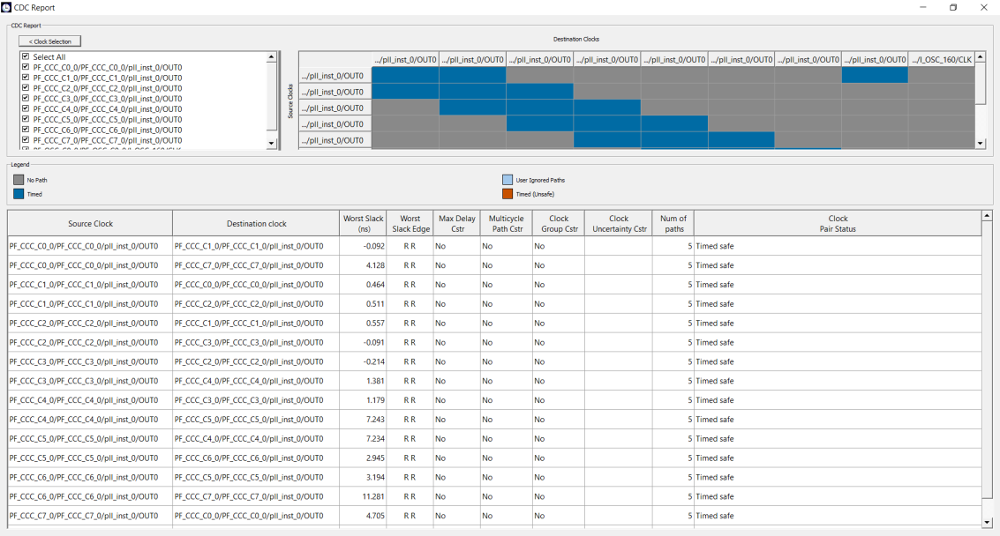

# SmartTime CDC Report Enhancements

The CDC Report from SmartTime has been enhanced in Libero SoC v.12.6 to display the following additional information for each source and destination clock group:

-   Source Clock
-   Destination clock
-   Worst Slack
-   Max Delay Cstr
-   Multicycle Path Cstr
-   Worst Slack Edge
-   Number of Paths
-   Clock Pair Status

**Parent topic:**[Software Features and Enhancements](GUID-0C8F8AEA-9445-4B14-83EE-0D7D82E81DB5.md)

