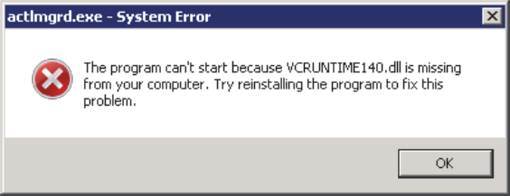

# License Installation

## How can more than one license be added to the environment variable LM\_LICENSE\_FILE?

For Windows: use a semicolon ";" to separate the licenses.

C:\\flexlm\\License.dat;1702@server

For Linux: use a colon ":" to separate the licenses.

1704@server1:1702@server2

## While running synthesis using a floating license, how can the "FlexNet licensing error: -8,234" be corrected?

The environment variable LM\_LICENSE\_FILE is wrongly set to a node locked license format. Set the environment variable for floating license in the format <port\_no\>@<hostname\>.

## While running synthesis, how can the "Microchip License Error \[-10,32\]. Feature has expired” error be corrected?

The environment variable LM\_LICENSE\_FILE has not been set. See the licensing installation guide for the steps to set the variable.

## While running synthesis, the following errors are displayed even when the environment variable is set correctly for the node locked license.

```
License checkout unsuccessful: synplifypro_actel
Checkout failed - synplifypro_actel Cannot find license file.
The license files (or license server system network addresses) attempted are listed as follows.
Use LM_LICENSE_FILE to use a different license file, or contact your software provider for a license file.
Feature: synplifypro_actel License path: G:\\Microsemi\\Libero\_SoC\_v11.8\\SynplifyPro\\license.txt;
FlexNet Licensing error: -1,234. System Error: 2 ""
```

Follow these steps:

1.  Copy the License.dat file, to the license path mentioned in the preceding error and give this path as a value to the environment variable LM\_LICENSE\_FILE.
2.  Using the preceding example, copy the License.dat file into G:\\Microsemi\\Libero\_SoC\_v11.8\\Synplify-Pro folder, and set LM\_LICENSE\_FILE to G:\\Microsemi\\Libero\_SoC\_v11.8\\Synplify-Pro\\License.dat.

**Note:** Verify whether the license is hosted on a virtual machine. If yes, Microchip does not support this option.

## What is the site ID for Synopsys?

Microchip does not provide site ID for logging into the Synopsys portal. If prompted to enter a site ID while installing the stand-alone Synplify pro, enter any three-digit number. See the [Knowledge Base Article](http://soc.microsemi.com/kb/article.aspx?id=KI9003) for more information.

## Is mixed language supported with Modelsim ME Pro for Silver license?

Yes, May 2020 onwards, Silver license is supporting the mixed language simulation with the ModelSim ME Pro tool integrated in Libero SoC v11.8 or later releases.

## The "Unable to find a valid Actel tool license \[-5, -5, -5, -5\]" error appears while opening Libero.

1.  Check if the environment variable LM\_LICENSE\_FILE is set properly.
2.  Check if the supported Libero version for this license is used.
3.  Download the latest Daemons version available on [Libero SoC Licensing](https://www.microsemi.com/product-directory/design-resources/1711-licensing).

## USB dongle license fails on Windows 10 machines. It shows that the drivers are not installed even when the drivers are installed.

1.  Click [Sentinel Downloads](https://cpl.thalesgroup.com/software-monetization/sentinel-drivers) to download HASP/LDK 7.32 command-line drivers.
2.  Extract the drivers and open the Command Prompt \(in Run as Administrator mode\) and browse to the haspdinst.exe file.
3.  Remove the existing drivers by executing haspdinst.exe -purge.
4.  Install the drivers again by executing haspdinst.exe -I.
5.  Ensure that the antivirus and firewall are disabled while installing the drivers. Then, install the dongle drivers from [Libero SoC Licensing](https://www.microsemi.com/product-directory/design-resources/1711-licensing).

**Note:** When the USB dongle is plugged in, the USB drivers appear under the USB controllers.

## When a Floating License Daemon is started on a server, an error message is reported in the debug log file.

The following error does not interfere with the Libero flow.

```
(snpslmd) Error: Incompatible vendor daemon found. The vendor daemon is not supported in version. 
Error: Please upgrade to the latest SCL version. Go to [http://www.synopsys.com/licensing%20for%20more%20information](http://www.synopsys.com/licensing%20for%20more%20information).
```

The reason for the error are as follows:

-   Synopsys tools \(SynplifyPro\) verifies all the license daemons in a license file.
-   SynplifyPro recognizes only the Synopsys license daemon snpslmd, and reports the other daemons as incompatible.
-   Since a Microchip license file consists of three license daemons \(actlmgrd, mgcld, and snpslmd\), Synopsys tools always gives out two incompatible error messages—one for actlmgrd and the other for mgcld. Therefore, these incompatible error messages can be safely ignored.

## How to fix the license checkout error message \[-8, 130\] that appears while opening Libero?

-   Check the license file for the word NULL and delete them all from the license file and re-host the license.
-   Contact the [Microsemi Technical Support](mailto:SoC_Tech@microsemi.com) to receive a newly generated license if the issue persists.

## How can the error “snpslmd exited with status 255\(\)” that appears in the debug log file while hosting a license on server be fixed?

This error happens because of a missing certificate for Synplify in Windows. To fix it, download the certificate from [Digicert website](https://www.websecurity.digicert.com/theme/roots).

## Which license is required to run Synplify Pro in batch mode?

Synplify Pro batch mode requires a floating license. This is a limitation implemented by Synopsys. All the floating licenses, whether paid or free, support batch flow.

## While hosting the latest license on a server with older daemons, the "Vendor daemon is down" appears in the license log file or Libero.

The possible solutions are listed as follows:

-   Update the licensing daemons to the latest ones available in the [Libero SoC Licensing](https://www.microsemi.com/product-directory/design-resources/1711-licensing) page.
-   Libero 12.0 and later versions license works only with the latest daemons.

## Does Libero license support remote desktop login?

Node-locked license and USB license do not support remote desktop login. Only floating license, supports remote desktop login.

## Where can I get a Libero license? Where can I get the details of the device support for different licenses?

To obtain a Libero license, see [Libero License Selector Guide](https://www.microsemi.com/document-portal/doc_download/137168-libero-license-selector-guide). See [Libero SoC Licensing](https://www.microsemi.com/product-directory/design-resources/1711-licensing) to find details of the device support for different licenses.

## Can a Libero license be hosted on a virtual machine?

Microchip does not support hosting licenses on a virtual machine. It is recommended to use a physical machine as the license server.

## How can a license be generated after purchasing one?

See [Libero Software Download and License Installation Quick Start Guide](https://www.microsemi.com/document-portal/doc_download/1244157-libero-software-download-and-license-installation-quick-start-guide) for more information.

## Where are the licensing daemons?

See [Libero SoC Licensing \(Downloads\)](https://www.microsemi.com/product-directory/design-resources/1711-licensing#downloads) to get the licensing daemons.

## The “license not available” error appears in the node-locked license. The environment variable points to the correct path.

Check for case sensitivity of the license file path and the one saved in environment variable LM\_LICENSE\_FILE. In addition, the environment variable LM\_LICENSE\_FILE should be set under user variables. See [Libero Software Download and License Installation Quick Start Guide](https://www.microsemi.com/document-portal/doc_download/1244157-libero-software-download-and-license-installation-quick-start-guide).

## Is there any restriction with the USB Dongle license?

USB Dongle licenses support was discontinued by Microchip. See [PDN21005](https://www.microsemi.com/document-portal/doc_download/1245617-pdn21005-product-discontinuation-of-libero-standalone-usb-dongle-licenses) and [PDN19017](https://www.microsemi.com/document-portal/doc_download/1244399-pdn19017-product-discontinuation-libero-usb-dongle-licenses#%3A~%3Atext%3DMicrosemi%20announces%20the%20discontinuation%20of,Archival%2C%20and%20Platinum%20Archival%20licenses.%26text%3DMentor%20Graphics%2C%20the%20vendor%20of,dongle%20license%20solution%20for%20Libero) for more details.

## Is there any license restriction with the SynplifyPro tools?

Libero SoC v12.2 and later does not have any restriction with the Synplify Pro tool. For Libero SoC v12.1 or earlier versions, Synopsys tools do not work beyond the distance of 50 miles or beyond the geographic locations. See [KB Article-KI8914](http://www.actel.com/kb/article.aspx?id=KI8914) for more information.

## How can the “Can’t find contact ID” error be fixed, that appears while trying to generate the license with software ID ?

This indicates that there is an an issue with your account. Contact technical support team by creating a case from the Microsemi [Customer Portal](http://soc.microsemi.com/Portal/DPortal.aspx).

## How can I change the disk ID of my license or how can I convert my node-locked license to a floating license?

You cannot convert a paid license from a node locked to a floating type. You must purchase a new floating license and vice versa. For Silver and Evaluation node locked license, you can generate a new floating license from the SoC portal webpage at [Microsemi SoC Licensing](http://soc.microsemi.com/Portal/DPortal.aspx?v24). For Libero paid license, contact the [FPGA Software Support Team](mailto:FPGASoftwareSupport@microchip.com) by indicating the old and the new disk ID and the software ID of your license.

## How can I merge multiple licenses? For example, I have three licenses and need to convert that into one floating license with three seats.

Contact the technical support team at [Customer Portal](http://soc.microsemi.com/Portal/DPortal.aspx).

## How can I change the mail ID in my account?

Contact the [FPGA Software Support Team](mailto:FPGASoftwareSupport@microchip.com) with the new and the old email address.

## How to get a paid license?

Users can purchase the paid Libero and IP licenses using [Microchip Direct](https://www.microchipdirect.com/).

## Does Microchip support USB dongle license for the Libero Design Suite?

Microchip announces the discontinuation of USB Dongle licenses. See [PDN21005](https://www.microsemi.com/document-portal/doc_download/1245617-pdn21005-product-discontinuation-of-libero-standalone-usb-dongle-licenses) for more details.

## How can the following error pop-up be fixed?



The license daemon “actlmgrd” is a 32-bit application. The latest “actlmgrd v11.16.1.0” version on Windows requires VC++ 2015 Redistributable 32-bit library vc\_redist.x86.exe. This program can be downloaded from the [Microsoft website](https://www.microsoft.com/en-us/download/details.aspx?id=48145). For Linux daemons version v11.16.1.0, 32-bit system packages redhat-lsb.i686 and glibc.i686 are required.

